# MIMO_TX_Top子模块学习索引

> 组织原则：`MIMO_TX_Top` 的每一种直接子模块分别使用一份Markdown学习文档。三个 `TX_BIT_Processor` 实例结构相同，因此共用一份模块文档。

## 顶层处理链

```text
3×TX_BIT_Processor
 → TX_BIT_FIFO_Exchange
 → FIFO_Manager/Aurora跨板交换
 → TX_MIMO_Processor
 → TX_RRH_FIFO_Exchange
 → TX_RRH_Processor
 → Over_Sample_Group
 → DAC/RF
```

其中 `FIFO_Manager/Aurora` 位于更高一级的工程连接中，不是 `MIMO_TX_Top` 内部直接例化的子模块，因此暂不单独列为本顶层子模块文档。

## 发射端全链路大图

这张图描述四片FPGA共同工作的全局数据流。每片FPGA都实例化一套`MIMO_TX_Top`，两次跨板数据交换由更高层的同一个`FIFO_Manager/Aurora`系统提供两类逻辑通道。

```mermaid
flowchart LR
    subgraph BIT["① BIT部分：每片FPGA产生本地3条Layer"]
        UDP["3路UDP字节"] --> BP["3×TX_BIT_Processor<br/>MAC成帧→信道编码→加扰调制<br/>PDCCH/PDSCH/RS资源映射→4096点变换"]
        BP -->|"每拍3条Layer<br/>3×32-bit复数"| BX["TX_BIT_FIFO_Exchange<br/>3层并行→一路32-bit<br/>按4位置×3层重排<br/>2×32→64 bit<br/>按RB选择目的MIMO FPGA"]
    end

    subgraph NET1["② 第一次跨板交换：按RB把12条Layer汇集到某片MIMO FPGA"]
        BX -->|"64 bit + 目的FPGA ID"| BFTX["FIFO_Manager发送侧<br/>按目的板分流<br/>本地loopback或Aurora"]
        BFTX --> BFRX["目的板FIFO_Manager接收侧<br/>4个来源FIFO：FPGA0～3<br/>每路64→128 bit"]
    end

    subgraph MIMO["③ MIMO部分：该片处理分配给自己的RB组"]
        BFRX -->|"按源FPGA各读3次<br/>12条Layer×4位置<br/>每拍128 bit"| PR["Payload Reader<br/>连续读12拍"]
        PR --> PD["TX_Precoding_Direct<br/>当前为固定直接映射<br/>12 Layer→32天线行"]
        PD --> SS["Submatrix_Splitter<br/>32天线拆前16/后16"]
        SS --> PK["2×MIMO_TX_Pack_Data<br/>128 bit重新打包成两路64 bit"]
    end

    subgraph NET2["④ 第二次跨板交换：按天线归属把MIMO结果送到4片RRH FPGA"]
        PK -->|"32天线×本片负责RB组<br/>两路64 bit+目的RRH ID"| MFTX["FIFO_Manager发送侧<br/>前后16天线再各分为8天线<br/>loopback/Aurora路由到4片板"]
        MFTX --> MFRX["目的RRH板FIFO_Manager接收侧<br/>4个来源FIFO<br/>分别保存4片MIMO FPGA产生的RB"]
    end

    subgraph RRH["⑤ RRH部分：每片FPGA收齐本地8根天线的全部4096位置"]
        MFRX --> RX["TX_RRH_FIFO_Exchange<br/>按RB顺序选4个来源FIFO<br/>再按天线对重排"]
        RX --> L1["本地FIFO1<br/>天线0/1<br/>4096×64 bit"]
        RX --> L2["本地FIFO2<br/>天线2/3<br/>4096×64 bit"]
        RX --> L3["本地FIFO3<br/>天线4/5<br/>4096×64 bit"]
        RX --> L4["本地FIFO4<br/>天线6/7<br/>4096×64 bit"]
        SY["RRH_SYNC_Control<br/>四片板全部到齐才放行"] -.-> L1 & L2 & L3 & L4
        L1 & L2 & L3 & L4 --> RP["TX_RRH_Processor<br/>同时读4096拍<br/>天线对局部转置→8天线并行<br/>CP 320/288→PSS选择"]
    end

    subgraph RF["⑥ 过采样与RF输出"]
        RP -->|"8路复数采样<br/>每路16-bit I+16-bit Q"| OS["Over_Sample_Group<br/>16个I/Q FIFO<br/>每4拍读1次→4倍插零<br/>16路FIR→32转16 bit"]
        OS --> DAC["本板8路DAC/RF<br/>四板合计32根天线"]
    end
```



### 两次Exchange到底交换什么

| 阶段 | 每片FPGA手里有什么 | 交换/处理以后变成什么 |
|---|---|---|
| BIT输出 | 本板产生的3条Layer，覆盖全部4096位置 | `TX_BIT_FIFO_Exchange`按RB目的板串行打包 |
| 第一次FIFO_Manager/Aurora交换后 | 某片MIMO FPGA拿到分配给自己的约1/4 RB组 | 对这些RB，已经汇齐4片板贡献的全部12条Layer |
| MIMO处理后 | 当前MIMO FPGA产生这些RB对应的全部32根天线数据 | 按目标RRH FPGA分成4份，每份8根天线 |
| 第二次FIFO_Manager/Aurora交换后 | 某片RRH FPGA从4个MIMO来源收到分散RB | 已拥有本板8根天线所需的全部RB数据，但仍按RB来源分散 |
| `TX_RRH_FIFO_Exchange`后 | 按RB来源组织的数据 | 4个本地天线对FIFO，每对覆盖全部4096位置 |
| `TX_RRH_Processor`后 | 4路天线对FIFO格式 | 8根天线逐拍并行的复数采样，已经加入CP/PSS |
| `Over_Sample_Group`后 | 8路16-bit I/Q基带流 | 4倍插值滤波后的8路DAC/RF数据 |

最核心的所有权变化可以压缩成：

```text
每片：3 Layer × 全部位置
  ──第一次交换──>
每片：12 Layer × 分配的约1/4 RB组
  ──MIMO固定映射──>
每片：32天线 × 分配的约1/4 RB组
  ──第二次交换──>
每片：本地8天线 × 全部4096位置
  ──RRH整理/CP/PSS/过采样──>
每片：本地8路RF输出；四片合计32路
```

需要特别区分名称和实际职责：

```text
TX_BIT_FIFO_Exchange
  负责第一次跨板交换前的数据重排、打包和目的板标记；真正跨板的是FIFO_Manager/Aurora。

TX_RRH_FIFO_Exchange
  位于第二次跨板传输之后，负责从4个来源FIFO恢复全局RB顺序并改成4个本地天线对FIFO；它本身也不是Aurora传输模块。
```

## BIT—Exchange—MIMO—RRH横向排序主线图

下面这张图有意省略模块内部控制、计数器和CP/PSS细节，只看数据排序如何沿发射端变化：

```mermaid
flowchart LR
    B["3×TX_BIT_Processor<br/><b>每片FPGA：3条Layer并行</b><br/>第k拍：L0(k),L1(k),L2(k)<br/>每个复数32 bit"]

    BX["TX_BIT_FIFO_Exchange<br/><b>重排①：位置优先→Layer优先</b><br/>L0(k0～k3)→L1(k0～k3)→L2(k0～k3)<br/>2个32-bit→1个64-bit<br/>按RB标记目标MIMO FPGA"]

    BF["FIFO_Manager / Aurora<br/><b>第一次跨板交换：BIT→MIMO</b><br/>目的板4个来源FIFO<br/>64→128 bit并汇集4片FPGA"]

    MI["TX_MIMO_Processor<br/><b>重排②：12 Layer→32天线</b><br/>输入：12 Layer×4位置<br/>Direct固定映射→32天线×4位置<br/>Splitter分前16/后16<br/>Pack重排并输出64 bit"]

    MF["FIFO_Manager / Aurora<br/><b>第二次跨板交换：MIMO→RRH</b><br/>每个MIMO板：32天线×约1/4 RB<br/>按8天线一份路由到4个RRH板"]

    RX["TX_RRH_FIFO_Exchange<br/><b>重排③：按RB来源→按天线对</b><br/>从4个MIMO来源FIFO恢复RB顺序<br/>输出4个本地FIFO：A0/1、A2/3、A4/5、A6/7<br/>每个覆盖全部4096位置"]

    RP["TX_RRH_Processor<br/><b>重排④：天线优先→位置优先</b><br/>A(k0,k1),A(k2,k3),B(k0,k1),B(k2,k3)<br/>→ [A(k0),B(k0)]…[A(k3),B(k3)]<br/>最终每拍8根天线并行"]

    O["Over_Sample_Group / DAC<br/>天线顺序不再变化<br/>插CP/PSS在RRH链完成<br/>随后4倍插值滤波"]

    B -->|"本板3 Layer×全部位置"| BX
    BX -->|"64-bit；按RB指定目的板"| BF
    BF -->|"目的MIMO板：12 Layer×约1/4 RB"| MI
    MI -->|"32天线×约1/4 RB；64-bit"| MF
    MF -->|"目的RRH板：本地8天线×分散RB"| RX
    RX -->|"4个天线对FIFO×全部4096位置"| RP
    RP -->|"每拍8个同位置复数采样"| O

    classDef bit fill:#e0f2fe,stroke:#0284c7,color:#111827;
    classDef exchange fill:#fef3c7,stroke:#d97706,color:#111827;
    classDef fifo fill:#f3e8ff,stroke:#9333ea,color:#111827;
    classDef mimo fill:#dcfce7,stroke:#16a34a,color:#111827;
    classDef rrh fill:#fee2e2,stroke:#dc2626,color:#111827;
    class B bit;
    class BX,RX exchange;
    class BF,MF fifo;
    class MI mimo;
    class RP,O rrh;
```



横向主线压缩成数据形状就是：

```text
[每板3 Layer并行 × 全部位置]
  → BIT Exchange：按4位置、按Layer串行并打包
  → 第一次跨板交换
[每板12 Layer × 约1/4 RB]
  → MIMO：Layer映射为天线并重新打包
[每板32天线 × 约1/4 RB]
  → 第二次跨板交换
[每板本地8天线 × 全部RB，但按来源分散]
  → RRH Exchange：恢复RB顺序并改成4个天线对FIFO
[每板4个天线对 × 全部4096位置]
  → RRH Processor：同一位置的8根天线并行
[每拍A0(k)～A7(k)]
```

## 发射端数据排序与重排总表

为了避免“交换”和“重排”混为一谈，把数据所有权的两次跨板交换与板内格式重排分开计数：

```text
2次跨板交换：BIT→MIMO、MIMO→RRH
5处主要板内重排/映射：BIT Exchange、Layer→天线、Splitter/Pack、RRH Exchange、TX_Unpack_Data
```

若把`Splitter`和`Pack`分别计算，则板内结构变化可细分为6处；这里按同一个MIMO输出整理阶段合并统计。

### 阶段0：三个TX_BIT_Processor并行输出

以本板三个本地Layer和连续频率位置`k0～k3`为例，每拍并行到达：

```text
k0拍：[L0(k0), L1(k0), L2(k0)]
k1拍：[L0(k1), L1(k1), L2(k1)]
k2拍：[L0(k2), L1(k2), L2(k2)]
k3拍：[L0(k3), L1(k3), L2(k3)]
```

组织方式是“位置优先、3层并行”。每个复数为32 bit。

### 重排1：TX_BIT_FIFO_Exchange

变为一条Layer优先的串行流：

```text
L0(k0), L0(k1), L0(k2), L0(k3),
L1(k0), L1(k1), L1(k2), L1(k3),
L2(k0), L2(k1), L2(k2), L2(k3)
```

相邻两个32-bit复数再打包成一个64-bit字。三个4位置小块组成12位置内部RB组，每个RB组附带目的MIMO FPGA编号。

### 跨板交换1：FIFO_Manager/Aurora，BIT→MIMO

四片源FPGA分别贡献3条Layer。负责当前RB组的MIMO FPGA从四个来源FIFO依次取数：

```text
源FPGA0：L0、L1、L2
源FPGA1：L3、L4、L5
源FPGA2：L6、L7、L8
源FPGA3：L9、L10、L11
```

FIFO完成64→128 bit宽度转换，每个128-bit字表示“一条Layer的4个连续复数”，因此Payload Reader看到：

```text
12拍 = 12条Layer × 每条4位置
```

数据所有权从“每板3层、全部位置”变为“每板12层、分配的约1/4 RB组”。

### 重排2：TX_Precoding_Direct，Layer→天线

输入小矩阵：

```text
12 Layer × 4位置
```

当前有效代码没有做权重矩阵乘法，而是把12行Layer序列固定重复/截取成32行：

```text
L0～L11，L0～L11，L0～L7
        ↓
A0～A31对应的32个128-bit行
```

结果形状变成`32天线 × 4位置`。

### 重排3：Submatrix_Splitter与MIMO_TX_Pack_Data

Splitter用双页RAM把32行拆成前后两组。共享读总线上的内部读取节拍类似：

```text
A0,A1 → A16,A17 → A2,A3 → A18,A19 → ……
```

但两个valid分别把它们归入：

```text
Pack0逻辑流：A0～A15
Pack1逻辑流：A16～A31
```

每个Pack每次接收相邻两个天线行，每行128 bit含4个位置，再输出4个64-bit字：

```text
A0(k0,k1), A0(k2,k3), A1(k0,k1), A1(k2,k3)
```

随后顶层再用计数把前16和后16各分成两半，得到4个目标RRH板，每板8根天线。

### 跨板交换2：FIFO_Manager/Aurora，MIMO→RRH

每个MIMO FPGA只处理约1/4 RB组，但产生这些RB的全部32天线数据；它按8天线一份发送到四个RRH FPGA。

交换后，每个RRH FPGA拥有本地8根天线的数据，但RB分别来自四个MIMO FPGA，因此暂时仍放在4个来源FIFO中：

```text
来源FIFO0：MIMO FPGA0处理的RB
来源FIFO1：MIMO FPGA1处理的RB
来源FIFO2：MIMO FPGA2处理的RB
来源FIFO3：MIMO FPGA3处理的RB
```

### 重排4：TX_RRH_FIFO_Exchange

先按全局RB顺序选择一个来源FIFO，每个完整12位置RB组读48个64-bit。再以4位置为小块，把每16个64-bit按`4+4+4+4`写入：

```text
本地FIFO1：天线0/1
本地FIFO2：天线2/3
本地FIFO3：天线4/5
本地FIFO4：天线6/7
```

全部处理后，每个本地FIFO都覆盖全部4096位置，数据所有权最终变成“本板8根天线 × 全部4096位置”。

### 重排5：TX_Unpack_Data

每个天线对FIFO内部仍是以天线为先的4字小组：

```text
A(k0,k1), A(k2,k3), B(k0,k1), B(k2,k3)
```

收集4个64-bit后转为按位置并行：

```text
[A(k0),B(k0)]
[A(k1),B(k1)]
[A(k2),B(k2)]
[A(k3),B(k3)]
```

四条`TX_RRH_Chain`并行后，每拍得到本板8根天线在同一个采样位置的8个复数。

### 后续：CP和4倍上采样不再改变天线顺序

`CP_Insertion`只在时间轴前复制符号末尾的320/288点；`Over_Sample_Group`只在相邻原始采样之间插入3个0并进行FIR插值。它们改变时间长度和采样率，但天线0～7的归属顺序保持不变。

## 模块文档

| 顺序 | MIMO_TX_Top直接子模块 | 顶层实例位置 | 学习文档 |
|---|---|---:|---|
| 1 | `TX_BIT_Processor`（3个实例） | 125、148、171 | [TX_BIT_Processor学习.md](./TX_BIT_Processor学习.md) |
| 2 | `TX_BIT_FIFO_Exchange` | 194 | [TX_BIT_FIFO_Exchange学习.md](./TX_BIT_FIFO_Exchange学习.md) |
| 3 | `TX_MIMO_Processor` | 221 | [TX_MIMO_Processor学习.md](./TX_MIMO_Processor学习.md) |
| 4 | `TX_RRH_FIFO_Exchange` | 263 | [TX_RRH_FIFO_Exchange学习.md](./TX_RRH_FIFO_Exchange学习.md) |
| 5 | `TX_RRH_Processor` | 352 | [TX_RRH_Processor学习.md](./TX_RRH_Processor学习.md) |
| 6 | `Over_Sample_Group` | 402 | [Over_Sample_Group学习.md](./Over_Sample_Group学习.md) |

## 学习顺序

```text
第一遍通读：
TX_BIT_Processor
 → TX_BIT_FIFO_Exchange
 → TX_MIMO_Processor
 → TX_RRH_FIFO_Exchange
 → TX_RRH_Processor
 → Over_Sample_Group

第二遍难点精读：
TTI/资源映射
 → Turbo/速率匹配
 → Gold加扰/调制
 → 12层到32天线的数据布局
 → RRH链/CP/上采样
```

## 待验证清单

- [ ] 恢复被乱码注释吞掉的 RTL 连接并通过语法检查；
- [ ] 用波形测量17443、17543和 `Trigger_Delay_10x` 的真实周期差；
- [ ] 核对 `Combine_Control_and_Data` 的3600有效子载波到4096点内部网格映射；
- [ ] 验证每子帧三次PDSCH transaction与9/13个PDSCH符号的完整闭合；
- [ ] 用波形验证 `TX_BIT_FIFO_Exchange` 的12拍调度、起始目标FPGA和64位数据格式；
- [x] 精读 `TX_RRH_Chain` 的数据转置、CP插入和PSS选择；当前链内未发现IFFT，时频域归属仍需继续核实；
- [x] 从模4读FIFO控制确认 `Over_Sample_Group` 为4倍零插值；FIR IP倍率和定点缩放仍需波形/配置核实。

*最后更新：2026-08-13*
