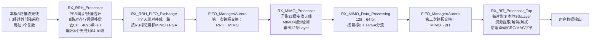

# MIMO_RX_Top子模块学习索引

## 接收端整体骨架

一句话：接收端把四片FPGA各自收到的8路天线时域采样，经过同步、频偏补偿、去CP和FFT后进行两次跨板汇聚，先恢复32天线的MIMO输入，再恢复各片FPGA负责的3条Layer和用户字节。



接收端与发射端的数据所有权变化大致相反：

```text
每片8根接收天线 × 全部时间/频率位置
  → 第一次跨板交换
每片32根接收天线 × 分配的约1/4 RB组
  → MIMO检测
每片12条Layer × 分配的约1/4 RB组
  → 第二次跨板交换
每片本地3条Layer × 全部RB
  → BIT恢复
每片3路用户数据
```

## MIMO_RX_Top直接处理模块

| 顺序 | 模块 | 一句话作用 | 学习文档 |
|---|---|---|---|
| 1 | `RX_RRH_Processor` | 同步、频偏补偿、去CP、FFT，将本板8天线整理成4个天线对流 | [RX_RRH_Processor学习.md](./RX_RRH_Processor学习.md) |
| 2 | `RX_RRH_FIFO_Exchange` | 把本板4个天线对数据串行化，按RB标记目标MIMO板 | [RX_RRH_FIFO_Exchange学习.md](./RX_RRH_FIFO_Exchange学习.md) |
| 3 | `RX_MIMO_Processor` | 汇集32天线，估计信道、计算MMSE权重并恢复12层 | [RX_MIMO_Processor学习.md](./RX_MIMO_Processor学习.md) |
| 4 | `RX_MIMO_Data_Processing` | 把MIMO的12层输出拆成64-bit，并按每板3层进行第二次跨板分发 | [RX_MIMO_Processor学习.md](./RX_MIMO_Processor学习.md#rx_mimo_data_processing) |
| 5 | `RX_BIT_Processor_Top` | 每片重排本地3层，完成资源解映射、软解调、Turbo译码、CRC和UDP输出 | [RX_BIT_Processor学习.md](./RX_BIT_Processor学习.md) |

`FIFO_Manager/Aurora`仍位于更高一级工程连接，不是`MIMO_RX_Top`内部实例，但承担两次真正的跨板传输。

## 三部分学习文档

### 1. RRH 与第一次跨板交换

- [RX_RRH_Processor学习.md](./RX_RRH_Processor学习.md)：时域采样来源、PSS同步、粗/精频偏、对齐、去CP、4096点FFT、频域打包。
- [RX_RRH_FIFO_Exchange学习.md](./RX_RRH_FIFO_Exchange学习.md)：4条天线对并串转换、一个RB的48个64-bit字、目标板 `1→3→0→2` 轮转。

### 2. MIMO 检测与第二次跨板交换

- [RX_MIMO_Processor学习.md](./RX_MIMO_Processor学习.md)：32天线顺序恢复、`H(32×12)` 信道估计、MMSE `W(12×32)`、四子载波并行均衡、12层分回4片板。

### 3. BIT 恢复

- [RX_BIT_Processor学习.md](./RX_BIT_Processor学习.md)：3层/4096点重排、3600有效子载波、PDCCH/PDSCH、LLR软解调、Gold软解扰、接收速度匹配、Turbo译码、CRC与UDP。

## 推荐学习顺序

```text
RX_RRH_Processor
→ RX_RRH_FIFO_Exchange
→ RX_MIMO_Processor（包括RX_MIMO_Data_Processing）
→ RX_BIT_Processor_Top
```

第一次只看每份文档开头的“一句话、输入、三到五步处理、输出和大图”；第二次再进入具体计数器、FIFO、定点位宽和状态机。

## 当前待验证项

- `MIMO_RX_Top`输入注释明确写“降采样后的数据”，降采样模块位于本顶层之外，后续要追踪实际接口来源；
- `Sync_Top`只使用接收天线4做PSS检测和精频偏估计，频率跟踪也只使用Chain2的天线4频域数据；
- 四条`RX_RRH_Chain`共享同一同步与频偏结果，顶层只取Chain2的`data_out_valid`作为公共有效；
- `Sync_Top`注释称`ready_for_input`每8拍一次，但当前3-bit循环寄存器代码实际表现为每3拍一次，应以波形确认；
- `FFT_All_Remain`确实例化4096点FFT IP；配置通道`tvalid`固定为0，设计依赖IP默认配置为FFT模式；
- `scale_factor`来自VIO调试核，不是正常用户配置端口。
- `Down_Sample_Group` 的第三路实部饱和判断疑似错误引用 `low_pass_imag1`，需要用仿真或原始设计版本确认后再修改 RTL。
- PDCCH 虽完成解码和 CRC，但当前 PDSCH 的 `modulation/TBS` 最终仍由本地 `MCS_control` 强制赋值；若要动态空口调度，需要恢复控制信息生效路径。
- `RX_Rate_Matcher_Circular_Buffer_Page` 当前未对重复位置的 LLR 做理想软合并，可能损失重复发送的增益。

*首次建立：2026-08-13*
