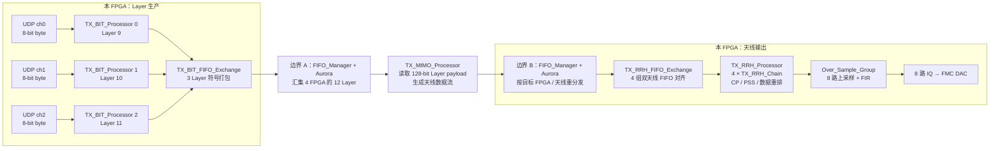
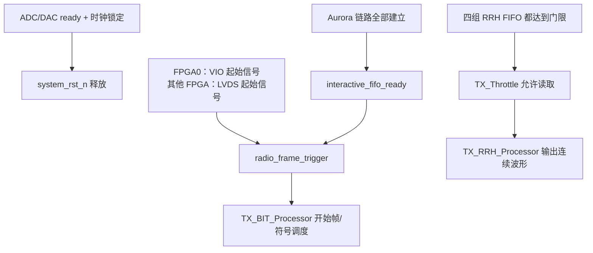

# MIMO_TX_Top：把发射机看成一座“四层数据工厂”

> 目标：读完本文后，应能回答四个问题：数据从哪来？为什么要经过两次 Aurora/FIFO 交换？什么时候允许输出？8 路 DAC 数据从哪里形成？

## 1. 一句话定义

[`MIMO_TX_Top.v`](../u7_chip2chip_base.srcs/sources_1/imports/new/MIMO_TX_Top.v) **不是一个单独的调制器，也不是直接驱动 DAC 的模块**。它是本 FPGA 的发射调度中心：

- 收本 FPGA 的 3 路 UDP 业务数据；
- 把它们编码成 3 个 Layer 的复符号；
- 经多 FPGA 网络汇集成完整 Layer 集合；
- 把完整 Layer 数据展开为各天线的数据；
- 再取回属于本 FPGA 的 8 根天线数据，做 CP/PSS、上采样和输出。

当前工程是 4 FPGA × 每 FPGA 3 Layer 的划分。因此当前 `FPGA_ID=3` 时，此模块负责 **Layer 9、10、11 的业务入口**，却负责 **本地 8 根天线的 DAC 输出**。Layer 和天线不是一一对应的，这正是两次数据交换的根本原因。

## 2. 先建立正确的心智模型

把整个系统想成 4 个工厂，每个工厂都同时做两件事：

```text
第一角色：Layer 工厂
  本地 3 路 UDP → 本地 3 个 Layer 的已编码符号

第二角色：天线工厂
  收齐 12 个 Layer → 计算/展开本地 8 根天线 → 本地 DAC
```

同一块 FPGA 先以“Layer 工厂”身份产出 3 个 Layer；经过跨板交换后，又以“天线工厂”身份取得完整 Layer 数据并产出自己的天线波形。

## 3. 总图：数据流与两个交换边界



## 4. 逐站说明：每一站“吃什么，吐什么，为何存在”

| 站点 | 输入数据 | 输出数据 | 这一站解决的问题 |
| --- | --- | --- | --- |
| `TX_BIT_Processor ×3` | 每路 UDP 的 8 位字节流 | 每 Layer 的 16 位 I/Q 频域符号 | 将业务 payload 变为 LTE 帧中的数据/控制资源 |
| `TX_BIT_FIFO_Exchange` | 3 组 Layer I/Q 符号 | 带目标 FPGA ID 的 64 位包 | 将三层本地结果装成可跨板运输的格式 |
| `FIFO_Manager`，边界 A | 4 块 FPGA 的 `bit2mimo` 包 | 给 MIMO 的 128 位 payload | 让每个 MIMO 处理器看到完整 Layer 集合 |
| `TX_MIMO_Processor` | 128 位 Layer payload | 两路 64 位天线数据流 | 以 RB 为节拍读取 Layer 数据、展开/打包天线数据 |
| `FIFO_Manager`，边界 B | 各 FPGA 产生的 `mimo2rrh` 数据 | 本 FPGA 的 4 组双天线 FIFO | 把全系统的天线输出按拥有者送回对应 FPGA |
| `TX_RRH_FIFO_Exchange` | 4 路 64 位双天线流 | 四路严格对齐的数据 | 等所有天线对数据充足，避免波形错帧 |
| `TX_RRH_Processor` | 4 路 64 位双天线流 | 8 路基带 IQ 样点 | 同步读取四路，调用 4 个 RRH chain |
| `Over_Sample_Group` | 8 路基带 IQ | 8 路 DAC 速率 IQ | 跨时钟、上采样、FIR 滤波 |

## 5. 为什么必须交换两次？

### 边界 A：按 Layer 汇集

本 FPGA 只有 Layer 9–11。MIMO 阶段要处理的是完整 Layer 组合，不能只看自己三层。因此：

```text
FPGA0：Layer 0–2 ┐
FPGA1：Layer 3–5 ├─→ FIFO_Manager/Aurora ─→ 每个 MIMO 处理器可读完整集合
FPGA2：Layer 6–8 ┤
FPGA3：Layer 9–11┘
```

在 `MIMO_TX_Top` 中，`src_mimo_from_bit_fifo_id` 用 0→1→2→3 的轮转选择源 FIFO；每个 FPGA 连续取 3 个 payload，对应它贡献的 3 个 Layer。

### 边界 B：按天线归属分发

经 MIMO 阶段后，数据的组织单位变成“天线输出”，而非“Layer 输入”。每个 FPGA 的 DAC 只需要自己的 8 根天线，所以必须再按目的 FPGA 分发一次：

```text
完整 Layer 集合
   → MIMO 处理
   → 32 根天线的数据
   → 按 FPGA 切成 4 份，每份 8 根天线
   → 当前 FPGA 取到其中自己的 8 根
```

这就是 `mimo2rrh_*` 信号和第二次 `FIFO_Manager` 路由的意义。

## 6. 一包 UDP 数据的“旅行路线”

以 `user_chn0_rx_tdata` 的一个字节为例：

1. 上位机通过千兆网将 UDP 字节送到 `ether_interface_top_new`。
2. 顶层把它连为 `layer0_input_data` / `layer0_input_valid`。
3. `TX_BIT_Processor0` 的 `Buffer_UDP_Data` 先写入异步 FIFO：写侧是 `clk_udp`，读侧是 `clk_baseband`。
4. 发射帧开始、PDSCH 需要 payload 时，`MAC_TX` 从该 FIFO 取字节。
5. 编码、调制、控制数据合帧后，形成 Layer 9 的 I/Q 符号。
6. `TX_BIT_FIFO_Exchange` 将 Layer 9、10、11 的同步符号装包，送到边界 A。
7. 当其余 FPGA 的 Layer 数据也齐备，`TX_MIMO_Processor` 才按 RB 读取完整 payload。
8. 预编码/展开结果经边界 B 回到本 FPGA 对应的天线对 FIFO。
9. 四路天线对均准备好后，`TX_RRH_Processor` 同步读出，生成 8 路波形。
10. `Over_Sample_Group` 上采样和 FIR 后，信号经 `data_upsampling_real/imag[0:7]` 送往 FMC DAC。

注意：**UDP 到达不是立即发射。** UDP 只填充输入 FIFO；发射还需等待帧触发、跨板链路和输出缓存门限。

## 7. 控制流：谁决定“何时开工”

数据流向右走，控制信号则从系统条件向左侧和下游发出许可：



两个必须分开的概念：

- `radio_frame_trigger`：让编码/资源调度知道“新的无线帧开始了”。
- `TX_Throttle` 的 `start_pulse`：只有四组 RRH 输出缓存足够，才让波形读取开始，防止 DAC 输出中途断粮。

## 8. 代码阅读路线：每次只回答一个问题

### A. 先只读 `MIMO_TX_Top.v`

只看这些实例，不要读底部 `always`：

1. `TX_BIT_Processor0/1/2`：三条业务输入在哪里进入？
2. `TX_BIT_FIFO_Exchange0`：本地三层何时、以什么形式送到 `FIFO_Manager`？
3. `TX_MIMO_Processor0`：从哪个 FIFO 读完整 Layer 数据？
4. `TX_RRH_FIFO_Exchange0`：为什么要等四路 FIFO？
5. `TX_RRH_Processor0`：四个链怎样对应 8 根天线？
6. `Over_Sample_for_RF`：时钟如何切换至 DAC 侧？

### B. 再只读 `TX_BIT_Processor.v`

按顺序看：`Buffer_UDP_Data` → `MAC_TX` → `PXSCH_TX_Bit_Processing_Top` → `Combine_Control_and_Data`。这是“字节怎样成为一个 Layer 符号”的线路。

### C. 然后只读 `TX_MIMO_Processor.v`

按顺序看：`MIMO_TX_Trigger` → `MIMO_Processor_Payload_Reader` → `TX_Precoding_Direct` → `Submatrix_Splitter` → `MIMO_TX_Pack_Data ×2`。这是“完整 Layer 数据怎样变成可路由的天线数据”的线路。

### D. 最后读 `TX_RRH_FIFO_Exchange.v` 和 `TX_RRH_Processor.v`

重点看门限、`RB_count`、四个 FIFO 与四个 `TX_RRH_Chain`。这是“为什么不会一边缺数据一边输出”的线路。

## 9. 读到这里时应当保持的三个警觉

这三点是从当前激活源码直接观察到的，不要只按模块名假设功能已经完整：

1. **`TX_Precoding_Direct` 当前未做矩阵乘法。** 它没有权重矩阵输入，也没有乘法器实例；代码是按 32 天线节拍选择不同延时的 `data_in`。它更接近时序展开/复制，而非通常意义的 MIMO 预编码。实际预编码权重是否在其他版本或外部流程中注入，需要单独确认。
2. **当前 TX 主路径未实例化 IFFT。** `TX_RRH_Chain` 直接对 `TX_Unpack_Data` 的输出插入 CP，并没有在该激活路径中调用 `Normalization_IFFT` 或 FFT IP。故应确认：输入是否已是时域样点、IFFT 是否在未列出的硬核/网表中，还是当前版本的功能尚未补齐。
3. **三层符号有效信号的对齐是隐含前提。** `TX_BIT_FIFO_Exchange` 的节拍来自 `symbol_valid0`，而 Layer 1/2 的 valid 未单独接入。该设计假定三个 `TX_BIT_Processor` 同步产出符号；若修改任一路时序，必须重新验证这一假设。

## 10. 最小验证点（用 ILA 时按这里放探针）

若要确认数据真的走完整条发射链，按顺序检查：

```text
UDP：layer0_input_valid
编码：symbol_valid0
跨板 A：bit2mimo_fifo_wr_valid
MIMO 取数：read_mimo_fifo_req + mimo_payload_fifo_used_number
跨板 B：mimo2rrh_fifo_wr_valid0/1
RRH 缓冲：total_exchange_fifo_number
波形输出：data_baseband_valid
DAC：data_upsampling_valid
```

某个点没有变化，就只向左回溯一个阶段；这样比在所有子模块中盲搜有效得多。
