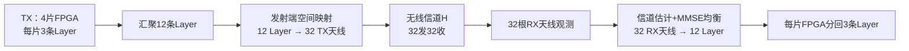
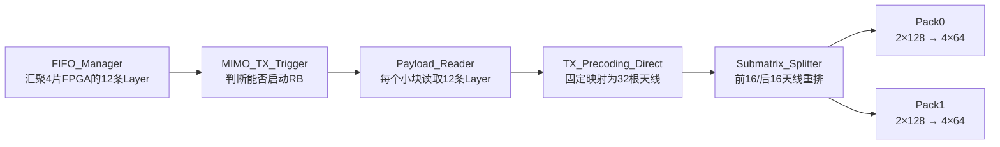
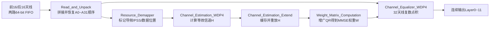
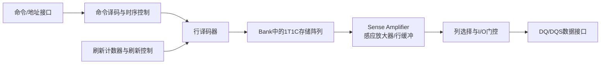

# MIMO收发端总结与项目面试问答

> 用途：紫光国芯ASIC前端、存储器数字设计、SoC数字设计岗位面试。  
> 工程范围：4片FPGA协同、12层独立数据流、32发32收MIMO-OFDM基带系统。  
> 阅读顺序：先背“面试一分钟版本”，再理解TX和RX主线，最后练项目追问。  
> 重要原则：以下内容区分“理论系统应该做什么”和“F0当前有效RTL实际做什么”。没有亲自从零完成的模块，不说“全部由我独立设计”。

## 一、面试时先用一分钟说清收发端MIMO

这套系统采用4片FPGA实现12层、32发32收MIMO-OFDM基带处理。发射端每片FPGA先产生本地3条Layer，通过片间交换让负责当前频率块的FPGA收齐12条Layer，再按照每次4个子载波的并行粒度，组织成32根发射天线的数据，随后分发到射频处理链。接收端方向相反，先把32根接收天线经过同步、FFT后得到的频域数据汇聚到负责当前频率块的FPGA，利用导频估计`32×12`信道矩阵，计算`12×32`的MMSE均衡权重，再通过32路复数点积恢复12条Layer，最后按每片3条Layer分回4片FPGA进行后续解调译码。

工程上的难点不只是MIMO公式，而是4片FPGA之间的数据汇聚和分发、天线与Layer维度的重排、定点位宽、FIFO流量控制，以及长流水线中数据、valid、RB和OFDM符号标签的严格对齐。

## 二、先记住整个收发端的对称关系



理论数学关系：

```text
发射预编码：t = P s
无线接收：  y = H t + n
接收均衡：  s_hat = W y
```

- `s`：12条Layer，`12×1`。
- `P`：发射预编码矩阵，理论上是`32×12`。
- `t`：32根发射天线符号，`32×1`。
- `H`：无线信道；若从32根发射天线描述到32根接收天线，物理信道可写成`32×32`。
- 当前接收端RTL直接估计的是“12条有效发送Layer到32根接收天线”的等效信道，因此使用`H_eff(32×12)`。
- `W`：接收MMSE均衡矩阵，`12×32`。
- `s_hat`：恢复出来的12条Layer，`12×1`。

面试时如果问“信道矩阵到底是32×32还是32×12”，回答：

> 物理天线域信道可以是32发到32收的`32×32`；把发射预编码并入信道后，接收端面对的是12条Layer到32根接收天线的等效信道`H_eff = H_phy P`，所以接收MIMO检测模块使用`32×12`。

## 三、发射端TX_MIMO_Processor总结

### 3.1 一句话功能

从4片FPGA汇聚同一个频率块的12条Layer数据，每次处理4个子载波，把数据组织成32根发射天线的频域数据，再拆成前16根和后16根两路64-bit FIFO流，送往RRH处理部分。

### 3.2 输入是什么

核心输入可以压缩成四类：

| 输入 | 含义 |
|---|---|
| `payload_data_in[127:0]` | 一条Layer在4个连续频域位置上的4个复数 |
| `payload_data_in_valid` | 当前输入数据/一组输入起点有效 |
| `payload_fifo_used_number` | 上游是否已经汇聚足够数据 |
| 输出FIFO容量、`mimo_enable` | 是否允许启动一个RB处理 |

一个128-bit输入字表示：

```text
Layer l的[k0,k1,k2,k3]
= 4个32-bit复数
= 128 bit
```

连续12条Layer组成一个四子载波小块：

```text
L0[k0..k3], L1[k0..k3], ... , L11[k0..k3]
```

一个RB有12个子载波，所以分成：

```text
[k0..k3] + [k4..k7] + [k8..k11]
= 3个四子载波小块
```

### 3.3 中间实际做哪几步



#### 第一步：MIMO_TX_Trigger决定何时处理一个RB

它检查：

- 上游是否已经有一个完整RB的数据；
- 两路输出FIFO是否有空间；
- 当前是否已经在处理其他RB。

条件满足后产生RB启动、RB索引、最后一个RB、OFDM符号起点等控制信号，并给当前RB分配固定调度窗口。

#### 第二步：Payload Reader读取12层

每个四子载波小块读取12拍：

```text
拍0：Layer0的4个复数
拍1：Layer1的4个复数
...
拍11：Layer11的4个复数
```

工程按44拍安排一个小块：前12拍读取，剩余32拍不发起下一组读取，让后级继续产生和重排32根天线数据。一个RB有3个小块，因此名义调度为：

```text
3 × 44 = 132拍
```

这是RTL内部调度，不表示一个RB在无线协议中有132个采样点。

#### 第三步：当前TX_Precoding_Direct固定映射成32根天线

这里必须区分理论和代码。

理论预编码应该计算：

```text
t = P s
```

即每根发射天线是12条Layer经过不同复数权重相乘求和的结果。

但当前`TX_MIMO_Processor`实际例化的是`TX_Precoding_Direct`，没有权重输入，也没有复数乘加。它按固定方式复制Layer：

```text
天线0～11  ← Layer0～11
天线12～23 ← Layer0～11
天线24～31 ← Layer0～7
```

所以当前有效RTL实现的是固定直连/重复映射，不是真正的信道相关预编码。工程中存在带`weight_in[599:0]`和点积结构的`TX_Precoding.v`，但没有接入当前顶层。

面试推荐说法：

> 系统架构预留了12层到32天线的预编码位置；当前验证版本顶层使用Direct固定映射来打通32天线链路，真实权重预编码模块在代码中存在，但没有接入当前有效顶层。因此我会把链路组织和完整预编码算法分开描述。

#### 第四步：Submatrix_Splitter按天线分成两组

Direct连续输出：

```text
A0, A1, A2, ... , A31
```

Splitter使用双页RAM缓存，再交错读成：

```text
A0,A1,A16,A17,A2,A3,A18,A19,...,A14,A15,A30,A31
```

同时用两个valid区分：

```text
valid0：天线0～15
valid1：天线16～31
```

这样两套Pack模块可以分别处理前、后16根天线。

#### 第五步：两个MIMO_TX_Pack_Data重新打包

每套Pack连续接收两根天线的两个128-bit字，拼成256 bit，再拆成4个64-bit字：

```text
A0[k0,k1]
A0[k2,k3]
A1[k0,k1]
A1[k2,k3]
```

两套Pack不是把数据算两遍，而是把32根天线拆成两路并行FIFO流，提高接口吞吐并匹配后级存储结构。

### 3.4 输出是什么

| 输出 | 含义 |
|---|---|
| `fifo_data_0[63:0]` | 前16根天线方向的64-bit打包数据 |
| `fifo_data_1[63:0]` | 后16根天线方向的64-bit打包数据 |
| 两路写使能 | 当前64-bit字有效 |

数量闭合：

```text
输入：12 Layer × 12子载波 = 144个复数 = 36个128-bit字
输出：32天线 × 12子载波 = 384个复数 = 192个64-bit字
两路各96个64-bit字
```

### 3.5 TX五个子模块一句话

| 子模块 | 一句话作用 |
|---|---|
| `MIMO_TX_Trigger` | 检查输入和输出条件，启动并计数一个RB |
| `MIMO_Processor_Payload_Reader` | 按固定节奏从FIFO读取12条Layer |
| `TX_Precoding_Direct` | 当前版本把12条Layer固定复制/映射为32根天线 |
| `Submatrix_Splitter` | 用双页RAM把32天线拆成前后16天线两条逻辑流 |
| `MIMO_TX_Pack_Data ×2` | 每路把128-bit天线行转换为64-bit FIFO字 |

### 3.6 TX最容易答错的地方

1. 不能说当前Direct做了`P×s`矩阵乘法。
2. 12拍表示遍历12条Layer，不是12个子载波逐拍输入。
3. 每拍128 bit已经并行包含4个子载波位置。
4. 32拍表示逐根产生32根天线的数据。
5. 44、132是内部调度拍数，不是无线资源长度。
6. 一个RB是12个子载波，不是12根天线，也不是12个时域采样点。

## 四、接收端RX_MIMO_Processor总结

### 4.1 一句话功能

把同一组4个子载波上32根接收天线的频域观测组成接收向量，通过导频估计`32×12`等效信道矩阵，计算`12×32`MMSE权重，最后把混合信号分离成12条Layer。

### 4.2 输入是什么

| 输入 | 含义 |
|---|---|
| `upper_FIFO_data[63:0]` | 前16根接收天线的频域数据流 |
| `lower_FIFO_data[63:0]` | 后16根接收天线的频域数据流 |
| 两路FIFO存量与valid | 判断能否启动并标记返回数据有效 |
| `sigma[14:0]` | MMSE正则化使用的噪声幅度参数，RTL为U1.14 |
| `antenna_indication[31:0]` | 32根天线使能掩码 |

一个64-bit字包含2个复数，两个64-bit字拼成：

```text
128 bit = 同一根接收天线在k0、k1、k2、k3上的4个复数
```

### 4.3 中间实际做哪几步



#### 第一步：Read_and_Unpack恢复32根天线自然顺序

两个`Unpack_RRH_Sample_Array`分别把前16和后16天线方向的两个64-bit字拼成一个128-bit天线行。

输入为了匹配双路链路呈交错顺序：

```text
A0,A1,A16,A17,A2,A3,A18,A19,...
```

`Submatrix_Combiner`利用RAM写入交错地址、顺序读出，恢复为：

```text
A0,A1,A2,...,A31
```

这一步非常关键，因为后面的矩阵每一行必须与正确的接收天线编号对应。

#### 第二步：Resource_Demapper给数据贴资源标签

它根据内部无线帧、OFDM符号、RB和小块计数，输出：

- 当前是否为预编码参考信号；
- 当前是否为非预编码参考信号；
- 当前是否为PSS；
- 当前是否为普通数据/控制资源；
- 当前RB和四子载波小块的边界。

它主要产生控制标签，不是在这里把所有数据搬到不同总线上。

#### 第三步：Channel_Estimation_WDP4由导频估计信道

已知本地导频`p`，接收导频为`r`。导频已经归一化时：

```text
H_est ≈ r × conj(p)
```

RTL同时处理4个子载波位置，使用4个复数乘法器，输出：

```text
4个复数 × (18-bit实部+18-bit虚部)
= 144 bit
```

经过Layer和接收天线维度组织后，形成：

```text
H_eff：32行接收天线 × 12列发送Layer
```

#### 第四步：Channel_Estimation_Extend缓存并复用H

导频只在特定OFDM符号出现，而后续数据符号仍需要使用信道估计。该模块把导频时刻计算出的H写入RAM，在后续数据RB到来时按RB/天线顺序读出。

“Extend”表示在时间上保持和重放已有估计，不是额外推导新的信道系数。

#### 第五步：Weight_Matrix_Computation计算MMSE权重

标准MMSE权重：

```text
W = (H^H H + sigma^2 I)^(-1) H^H
```

矩阵维度：

```text
H：32×12
H^H：12×32
H^H H：12×12
W：12×32
```

为什么不直接求逆：直接构造`H^H H`并求逆，硬件开销大且病态信道下数值敏感。工程构造增广矩阵：

```text
A = [H      ] 32行
    [sigma I] 12行

A的大小 = 44×12
```

对`A=QR`，将Q拆成：

```text
Q1：前32行
Q2：后12行
```

由增广矩阵关系可得到等价实现：

```text
W = Q2 × Q1^H / sigma
```

这避免在RTL中直接显式计算标准形式的矩阵逆。

权重按接收天线列输出，每拍600 bit：

```text
12个Layer权重 × 每个复数(25-bit实部+25-bit虚部)
= 12 × 50
= 600 bit
```

整个权重流水线约为2560拍量级，必须延迟对应的valid和资源标签进行对齐。

#### 第六步：Channel_Equalizer_WDP4恢复12条Layer

对Layer `l`和子载波位置`k`：

```text
s_hat_l(k)
= W[l,0]y0(k) + W[l,1]y1(k) + ... + W[l,31]y31(k)
```

这是一条长度32的复数点积。RTL同时处理4个子载波位置，因此内部有4套并行点积组；每套点积组又产生12条Layer的结果。

### 4.4 输出是什么

`equ_data[127:0]`每个有效拍表示：

```text
某一条Layer在k0、k1、k2、k3上的4个均衡复数
```

一个四子载波小块连续输出12拍：

```text
Layer0[k0..k3]
Layer1[k0..k3]
...
Layer11[k0..k3]
```

一个普通RB有3个小块：

```text
3 × 12 = 36个128-bit有效输出拍
```

后级`RX_MIMO_Data_Processing`再把每个128-bit字拆成两个64-bit字，并按每片FPGA负责3条Layer，把12层分回4片FPGA。

### 4.5 RX六个核心模块一句话

| 子模块 | 一句话作用 |
|---|---|
| `Read_and_Unpack` | 从两路FIFO取数，拼成128 bit并恢复天线0～31顺序 |
| `Resource_Demapper` | 根据帧位置标记导频、PSS和业务数据 |
| `Channel_Estimation_WDP4` | 用本地导频共轭乘接收导频，估计4个频域位置的信道 |
| `Channel_Estimation_Extend` | 缓存导频时刻的H，并为后续数据RB重放 |
| `Weight_Matrix_Computation` | 通过增广矩阵QR计算12×32 MMSE权重 |
| `Channel_Equalizer_WDP4` | 对32根接收天线做复数点积，连续输出12条Layer |

### 4.6 RX最容易答错的地方

1. 32拍输入代表遍历32根接收天线，不是32个子载波。
2. 每个128-bit输入已经包含同一天线的4个子载波位置。
3. 12拍输出代表12条Layer，不是一个RB的12个子载波。
4. `H`在接收模块里是32×12等效信道，不要只背物理32×32信道。
5. `sigma`从代码看更接近噪声标准差/正则化幅度，不能未经配置核实就说成噪声功率。
6. `Channel_Estimation_Extend`是存储和重放，不是插值产生新信息。
7. `Resource_Demapper`主要贴标签，不等于完成了所有资源数据搬运。

## 五、收发端数据排序变化

### 5.1 发射端

```text
阶段1：每片FPGA本地3条Layer
FPGA0：[L0,L1,L2]
FPGA1：[L3,L4,L5]
FPGA2：[L6,L7,L8]
FPGA3：[L9,L10,L11]

阶段2：BIT→MIMO交换
负责当前RB的FPGA收齐：
[L0,L1,...,L11]
每条Layer携带4个子载波位置

阶段3：TX MIMO
12条Layer → 32根发射天线
当前Direct为固定复制映射

阶段4：Splitter
[A0,A1,...,A31]
→ 前16/后16天线两条逻辑流

阶段5：Pack
每根天线4个复数
→ 两个64-bit字
```

### 5.2 接收端

```text
阶段1：RRH/FFT输出
各板持有部分接收天线、部分频率资源

阶段2：RRH→MIMO交换
负责当前RB的FPGA收齐32根接收天线

阶段3：Read_and_Unpack
链路交错顺序
[A0,A1,A16,A17,A2,A3,...]
→ 矩阵自然顺序
[A0,A1,A2,...,A31]

阶段4：RX MIMO
32根天线观测
→ [Layer0,Layer1,...,Layer11]

阶段5：MIMO→BIT交换
每片FPGA重新取得自己负责的3条Layer
```

### 5.3 收发端完整闭环

```mermaid
flowchart LR
    A["TX BIT\n编码/调制/资源映射\nWFRFT_TX中完成IFFT等效变换"] --> B["TX_BIT_FIFO_Exchange\n汇聚12 Layer"]
    B --> C["TX_MIMO_Processor\n12 Layer → 32 TX天线"]
    C --> D["TX_RRH_FIFO_Exchange\n按天线分回各板"]
    D --> E["TX RRH\nIFFT已旁路\n直通/CP/PSS/插值/射频"]
    E --> F["无线信道"]
    F --> G["RX RRH\n同步/频偏补偿/FFT"]
    G --> H["RX_RRH_FIFO_Exchange\n汇聚32 RX天线"]
    H --> I["RX_MIMO_Processor\n32 RX天线 → 12 Layer"]
    I --> J["RX_MIMO_Data_Processing/交换\n每板分回3 Layer"]
    J --> K["RX BIT\nDC恢复/WFRFT逆配对\n资源解映射/解调/译码"]
```



当前RTL中要把两类FFT区分开：发射OFDM IFFT等效分量位于 `Combine_Control_and_Data → WFRFT_TX`；接收OFDM FFT位于 `RX_RRH_Chain → FFT_All_Remain`。`TX_RRH_Chain` 已把原IFFT改成直通，只负责拆包、加CP和PSS选择。`RX_BIT_Processor → WFRFT_RX` 内部还有FFT IP，但用途是结合前级RRH FFT恢复WFRFT，不是另一遍天线时域转频域。

## 六、收发端关键数字总表

| 数字 | TX含义 | RX含义 |
|---|---|---|
| 4片FPGA | 每片先贡献3条Layer，再按RB承担MIMO计算 | 每片承担部分RB的MIMO检测，之后取回3条Layer |
| 12 | 输入Layer数；也恰好是RB子载波数，但维度不同 | 输出Layer数；也是H的列数 |
| 32 | 输出发射天线数 | 输入接收天线数；也是H的行数 |
| 4 | 每拍并行处理4个子载波位置 | 每拍并行处理4个子载波位置 |
| 3 | 一个RB分成3个四子载波小块 | 一个RB分成3个四子载波小块 |
| 44 | 一个TX四位置小块的固定调度槽 | 增广QR矩阵行数`32+12` |
| 132 | TX一个RB名义调度`3×44` | RX也按相同系统节奏组织一个RB |
| 128 bit | 一条Layer或一根天线的4个复数 | 一根天线或一条Layer的4个复数 |
| 600 bit | 当前Direct未使用；真实预编码权重接口可为12个复数 | 一根接收天线对应12条Layer的12个复数权重 |

注意：TX中的44拍调度与RX中QR增广矩阵44行数值相同，但语境不同，不要仅因数字相同就把两者说成同一个物理概念。

## 七、根据个人简历最可能出现的项目问题与回答

### 7.1 第一层：项目总体和个人贡献

#### Q1：请介绍一下你的MIMO无线通信收发系统项目

答：

> 项目是一套4片FPGA协同的12层、32发32收MIMO-OFDM基带系统，覆盖从以太网数据接入到射频发射，再从射频接收回到同步、FFT、MIMO检测和比特恢复的完整链路。采用多FPGA主要是为了解决单片器件的矩阵计算量、片上存储和I/O带宽不足。系统在频率维度分担RB计算，并通过高速链路交换每个MIMO节点所需的12层或32天线数据。我重点投入的是收发端MIMO数据通路，包括跨板重排、FIFO节奏、导频信道估计、MMSE均衡接口、定点和valid时序的分析、联调与验证。

#### Q2：你在项目里具体做了什么？

答：

> 我的核心工作不是笼统地说整套系统都由我完成，而是集中在收发端MIMO链路。我梳理并核对了4片FPGA之间Layer、RB和天线数据的汇聚与分发关系；分析了TX从12层到32天线、RX从32天线到12层的模块接口；重点跟踪了信道估计、MMSE权重、均衡点积以及长流水线valid对齐；同时使用Vivado仿真和ILA观察FIFO水位、RAM地址、RB/符号标签及关键复数数据，定位排序和时序问题。

如果你确实修改过具体RTL，随后补一句真实例子：

> 例如我在某模块中修改了……，问题表现为……，最终通过……验证修复。

不要用虚构案例补充。

#### Q3：为什么要用4片FPGA，单片不行吗？

答：

> 32天线、12层会产生大规模复数矩阵运算，同时还包含FFT、同步、缓存和高速I/O。瓶颈不仅是DSP数量，也包括BRAM容量、片内互联和外部带宽。4片协同可以分摊频率块上的计算和存储，但增加了片间带宽、数据重排、同步和背压控制复杂度。因此这个项目的关键工程问题是“怎样让每片板在正确时间拿到正确维度的数据”。

#### Q4：4片FPGA具体怎样分工？

答：

> 在BIT阶段，每片板负责3条Layer；到MIMO阶段则按照RB/频率资源轮转承担计算。负责某个RB的FPGA需要通过片间交换收齐12条Layer完成发射处理，或者收齐32根接收天线完成接收均衡。处理后再把32天线数据或12层数据按目标板分发回去。因此系统同时存在“按Layer分工”和“按频率RB分工”两种维度。

#### Q5：为什么选择按频率维度切分？

答：

> OFDM在完成同步、去CP和FFT后，各子载波可以相对独立处理，因此适合把不同RB交给不同FPGA并行计算。工程又把一个12子载波RB拆成三个4子载波小块，匹配128-bit数据接口和并行运算规模。代价是需要跨板汇聚完整Layer或天线向量。

### 7.2 第二层：发射端MIMO追问

#### Q6：发射端MIMO模块的输入和输出分别是什么？

答：

> 输入是同一个RB的12条Layer数据，每个128-bit输入字表示某一条Layer在4个子载波位置上的4个复数。输出是32根发射天线的数据，最终分为前16根和后16根两路64-bit FIFO流。一个RB有3个四子载波小块，因此输入共36个128-bit字，输出共192个64-bit字。

#### Q7：12层是怎样变成32根天线的？

答：

> 理论上应通过`32×12`复数预编码矩阵计算`t=P s`。但当前F0有效顶层使用`TX_Precoding_Direct`，没有权重输入，只把Layer0到11复制到天线0到11和12到23，再把Layer0到7复制到天线24到31，用于打通32天线数据链。代码中存在支持权重的预编码模块，但当前顶层没有例化。这个区别我会明确说明。

#### Q8：当前Direct不是真预编码，为什么简历还能写MIMO系统？

答：

> 系统整体具有12层、32天线的数据组织、跨板交换和接收MMSE检测结构；当前发射验证顶层为了链路联调使用固定映射替代了信道相关权重预编码。因此我不会把Direct说成完整波束赋形，而会说我重点完成或分析了MIMO数据通路和接口，系统预留了真实预编码模块。这也是我在代码复核中明确识别出的实现边界。

#### Q9：为什么一次处理4个子载波？

答：

> 每个复数使用32 bit，128-bit接口正好容纳4个复数，所以硬件以4个子载波为并行粒度。一个RB有12个子载波，因此正好拆成3组。这是硬件实现粒度，不是通信协议新增的资源单位。

#### Q10：12拍、32拍、44拍、132拍各是什么？

答：

> 12拍用于逐拍输入12条Layer；32拍用于逐拍产生32根天线行；工程给每个四子载波小块分配44拍调度槽，一个RB有3个小块，所以名义上是132拍。输入和输出存在流水重叠，不能简单理解成所有模块完全串行等待。

#### Q11：两个Pack模块为什么并行？

答：

> Pack0负责天线0到15，Pack1负责天线16到31。Splitter先用RAM按前后半区交错读出并给出不同valid，两套Pack再各自完成128到64 bit转换。这样可以匹配两路FIFO接口并提高吞吐，而不是对同一份天线数据重复计算。

### 7.3 第三层：接收端MIMO追问

#### Q12：接收端MIMO到底实现什么？

答：

> 它利用32根接收天线的频域观测，估计12条发送Layer到32根接收天线的等效信道`H(32×12)`，计算`W(12×32)`，再执行`s_hat=W y`，从32路混合观测恢复12条Layer。之后每片FPGA取回自己负责的3条Layer。

#### Q13：为什么接收端输入是两路FIFO？

答：

> 32根接收天线被拆成前16和后16两组，两路64-bit FIFO可以提高吞吐并匹配前级打包。Read_and_Unpack先把两个64-bit字拼成同一天线4个子载波的128-bit行，再用RAM把交错顺序恢复为天线0到31的自然矩阵行顺序。

#### Q14：信道估计怎样做？

答：

> 已知本地导频`p`，接收导频`r`满足`r≈Hp+n`。在导频正交、幅度归一化的条件下，可以用`r×conj(p)`得到对应信道估计。RTL同时处理4个子载波位置，复数乘法后再做定点截位和饱和，逐步形成32×12等效信道矩阵。

#### Q15：为什么选MMSE，不选ZF？

答：

> ZF强调消除层间干扰，但信道接近奇异时，逆矩阵系数会很大，严重放大噪声。MMSE通过`H^H H + sigma^2I`加入正则项，在串扰抑制和噪声放大之间折中。噪声很小时MMSE趋近ZF，噪声较大时更稳健。

#### Q16：MMSE权重在RTL里怎样算？

答：

> 工程没有直接构造`(H^H H+sigma^2I)^-1`，而是把32×12的H与12×12的`sigma I`上下拼成44×12增广矩阵，对它做QR分解。把Q分成前32行Q1和后12行Q2，最终通过`Q2 Q1^H / sigma`得到等价的12×32 MMSE权重。这样更适合固定结构流水化，但控制延迟很长。

#### Q17：为什么增广矩阵是44×12？

答：

> H有32行，对应32根接收天线；正则项`sigma I`有12行，对应12条Layer。上下拼接后是`(32+12)×12=44×12`。

#### Q18：均衡器怎样从32路恢复12层？

答：

> 对每一条Layer，使用该Layer对应的32个复数权重，与32根接收天线的观测做长度32的复数点积。项目一次并行处理4个子载波，所以有4套并行点积通路；完成一组天线累加后，连续12拍输出Layer0到Layer11。

#### Q19：为什么不是一个start脉冲就够了？

答：

> start只说明一个矩阵或小块开始，不能说明后面每拍数据是否有效。32根接收天线是32个不同数值，点积累加器必须用连续valid标记哪些拍参与计算。start负责边界，valid负责数据拍。

#### Q20：信道估计为什么还要Extend？

答：

> 导频只占部分OFDM符号，而普通数据符号仍需使用最近一次有效信道估计。Extend模块把导频时刻得到的H存入RAM，之后按RB和天线顺序重放。它做的是缓存和复用，不是凭空估计新的信道。

### 7.4 第四层：数字硬件实现追问

#### Q21：这个项目最难的地方是什么？

答：

> 最难的是多维数据和长流水线的对应关系。同样的12可能表示12条Layer或12个RB子载波；同一个128-bit字在不同阶段又可能代表一条Layer或一根天线的4个复数。只要排序或valid错一拍，最终结果仍可能非零，但矩阵意义已经错误。因此我先定义每个接口的数据单位，再沿FIFO、RAM地址、RB/符号标签和valid逐级验证。

#### Q22：长流水线怎样保证数据和控制对齐？

答：

> 先为乘法器、RAM、QR和点积模块建立延迟表；数据经过多少拍，`valid`、`RB_start`、`submatrix_start`、资源类型和RB索引就走相同长度的延迟链。对于MMSE约2560拍量级的流水线，还要用RAM缓存权重并按RB地址读回。验证时必须同时检查数据、valid和标签，不能只看最终数值。

#### Q23：定点位宽怎样确定？

答：

> 先根据输入范围和最坏累加长度确定整数位，再根据允许误差确定小数位。乘法结果位宽通常是两输入位宽之和；32项累加理论上需要约5个额外保护位。每级还要明确符号扩展、截断或舍入、饱和或回绕，并通过Matlab浮点参考和定点模型比较误差或EVM。

#### Q24：怎样防止复数乘加溢出？

答：

> 中间乘积和累加器使用更宽位数，累加器按最大项数增加保护位，最后统一缩放、舍入和饱和。Verilog中还必须显式处理`signed`、切片和拼接，否则即使位宽够也可能按无符号数计算。

#### Q25：FIFO深度怎样确定？

答：

> 根据生产者和消费者的最坏速率差、突发长度、启动门限和返回延迟计算。MIMO模块以完整RB作为启动单位，所以FIFO至少要缓存一个处理块，并留出跨板抖动和回压余量。还要分别验证满、空、同拍读写和尾块情况。

#### Q26：为什么最后一个RB需要特殊处理？

答：

> 有效频域资源不能完全被4片FPGA和每组4个子载波整除，尾部可能只剩一个四子载波小块，而普通RB包含三个小块。如果仍按普通门限等待，会等待不存在的数据；如果仍读三轮，会越界。因此读次数、FIFO门限和计数终点都要做特殊判断。

#### Q27：跨FPGA怎样保证数据对齐？

答：

> 高速链路只保证字节可靠传输还不够，应用层必须明确帧、OFDM符号、RB和小块边界。可以使用固定包长、起始标志、序号和FIFO门限，各板启动前通过握手确认准备完成。调试时同时抓链路valid、FIFO计数和本地RB计数，寻找第一次错位。

#### Q28：怎样验证接收MMSE模块？

答：

> 第一层用Matlab产生已知H、发送符号和噪声，计算浮点参考W与均衡结果；第二层用同一向量做RTL仿真，逐级比较H、权重和输出并考虑量化误差；第三层上板用回环或可控数据，通过ILA抓取输入、矩阵地址、valid和输出。除了随机信道，还要覆盖单位阵、对角阵、弱信道、近奇异信道、关闭天线和最大幅值。

#### Q29：如果把这套FPGA代码迁移到ASIC，需要做什么？

答：

> 首先替换或封装厂商专用FIFO、RAM、乘法器和ILA；然后完成lint、CDC/RDC、X传播检查、综合、等价验证和STA，明确时钟、I/O、多周期和异步路径约束；再根据PPA报告重新权衡并行度、流水线和存储宏；同时考虑时钟门控、复位树、DFT和可测试性。FPGA上能运行不代表已经达到ASIC可流片RTL质量。

### 7.5 第五层：简历中其他两条项目描述的追问

#### Q30：你简历写了PSS时频同步和AFC，整体思路是什么？

答：

> 接收端先从天线时域采样中抽取参考天线数据，通过本地PSS相关搜索粗定时峰值，得到无线帧或FFT窗口的粗起点；再使用相隔固定长度的样本估计精细载波频偏，并在后续链路中做频偏补偿。AFC/频偏跟踪利用后续参考符号持续修正残余频偏。我的描述会区分已核实的模块数据流和仍需进一步验证的常数来源，不会把PSS简单说成只用于调频。

#### Q31：为什么PSS相关可以找到定时位置？

答：

> PSS是接收端已知的确定序列。把接收信号与本地参考做滑动互相关，当两者时间对齐时，多个样本相干累加形成明显峰值；未对齐时相位和符号相互抵消，相关幅度较小。工程对相关复数结果计算模平方，再通过局部最大值和滑动能量门限检测峰值。

#### Q32：你的天线选择算法项目做了什么？

答：

> 项目针对32根候选发射天线中选择子集时组合空间过大的问题，在遗传算法前加入信道范数预选，先剔除明显较差的候选；同时根据种群收敛状态动态调整交叉率和变异率，在前期提高搜索效率、后期维持全局探索能力。目标是降低搜索复杂度和早熟收敛风险，并进一步考虑FPGA硬件化的数据通路和定点实现。

#### Q33：信道范数预选会不会错过最优组合？

答：

> 会存在这种风险。单天线信道范数只衡量每个候选自身能量，不能完整反映天线之间的相关性和组合后的矩阵条件数。因此预选阈值不能过强，需要保留足够候选，并通过仿真比较性能损失与搜索空间缩减比例。也可以在预选指标中加入相关性或容量近似项。

#### Q34：遗传算法怎样硬件化？

答：

> 把种群编码、适应度计算、选择、交叉和变异拆成流水或分时复用模块。硬件瓶颈通常是大量候选的适应度计算和排序，因此需要并行计算若干个体、用RAM保存种群、用LFSR产生伪随机数，并在资源和吞吐间选择并行度。浮点指标需要改成定点或近似比较，并用软件模型验证排序一致性。

#### Q35：这两个项目之间有什么联系？

答：

> MIMO基带平台提供真实信道、预编码和均衡链路；天线选择算法决定哪些天线参与发送或接收，能够减少后续矩阵规模或改善性能。前者让我理解完整硬件数据通路，后者让我从算法搜索和硬件复杂度角度优化MIMO系统，两者最终可以在同一FPGA平台上联调验证。

## 八、面试官继续深挖时的安全回答边界

### 8.1 能明确说的

- 4片FPGA、12层、32发32收的系统架构。
- 跨板汇聚和分发为什么需要数据重排。
- TX和RX每拍128 bit表示4个复数位置。
- RX信道估计、MMSE和均衡的数据维度及主线。
- 当前TX顶层使用Direct固定映射，而不是真实权重预编码。
- 自己实际完成的分析、修改、仿真和ILA工作。

### 8.2 没有证据不要说死的

- 不要说整套代码全部由自己从零编写。
- 不要说当前TX Direct完成了波束赋形或信道相关预编码。
- 不要未经仿真报告就给出误码率、吞吐率或资源利用率提升百分比。
- 不要把源码中的每个固定常数都解释成标准LTE/NR参数；工程存在自定义帧结构。
- 不要在没有完整定点标定时把`sigma`精确说成某种物理单位。
- 不要把FPGA综合通过等同于ASIC时序签核或流片经验。

### 8.3 不会时的回答模板

> 这部分我没有亲自完整实现，我先说我从当前RTL确认的事实。当前接口是……，数据维度是……，控制关系是……。至于这个参数是否来自协议配置还是流水补偿，我还需要结合仿真和上层配置核实。如果让我继续定位，我会先检查……，再用……验证。

## 九、面试前必须能画出的两张图

### 9.1 发射端

```text
每板3 Layer
    ↓ 片间交换
汇聚12 Layer
    ↓ 每拍4个子载波
12 Layer → 当前Direct固定映射 → 32 TX天线
    ↓ Splitter
前16天线 / 后16天线
    ↓ Pack
两路64-bit FIFO
```

### 9.2 接收端

```text
两路64-bit FIFO
    ↓ 拼接、天线重排
32 RX天线观测 y
    ↓ 导频估计
H(32×12)
    ↓ 增广QR
W(12×32)
    ↓ 32路复数点积
12 Layer
    ↓ 每板3 Layer
RX BIT处理
```

## 十、明天面试前的复习顺序

1. 背熟第一章一分钟版本。
2. 不看文档画出第九章两张图。
3. 答稳Q1～Q5：项目总体和个人贡献。
4. 答稳Q6～Q20：TX、RX核心原理。
5. 答稳Q21～Q29：RTL、FIFO、定点、验证和ASIC迁移。
6. 最后复习Q30～Q35：PSS/AFC和天线选择算法。

## 十一、对应工程文件

- `TX_MIMO_Processor学习.md`：发射端MIMO详细学习记录。
- `RX_MIMO_Processor学习.md`：接收端MIMO详细学习记录。
- `u7_chip2chip_base.srcs/sources_1/imports/new/TX_MIMO_Processor.v`：发射端MIMO有效顶层。
- `u7_chip2chip_base.srcs/sources_1/new/TX_Precoding_Direct.v`：当前固定映射模块。
- `u7_chip2chip_base.srcs/sources_1/imports/new/TX_Precoding.v`：未接入当前顶层的真实权重点积结构。
- `u7_chip2chip_base.srcs/sources_1/imports/new/RX_MIMO_Processor.v`：接收端MIMO顶层。
- `u7_chip2chip_base.srcs/sources_1/imports/new/Channel_Estimation_WDP4.v`：四位置并行信道估计。
- `u7_chip2chip_base.srcs/sources_1/imports/new/MMSE.v`：增广QR与MMSE权重顶层。
- `u7_chip2chip_base.srcs/sources_1/imports/new/Channel_Equalizer_WDP4.v`：32天线到12层均衡。

## 十二、紫光国芯DRAM专项准备

### 12.1 先了解公司为什么可能问DRAM

紫光国芯官方将自己定位为“以存储技术为核心的产品和服务提供商”，产品覆盖SDR、DDR、DDR2、DDR3、DDR4、LPDDR/LPDDR2/LPDDR4/LPDDR4x、ECC DRAM、PSRAM及多种内存模组，同时提供存储器和SoC全流程设计测试服务。

面试时可以这样回答“你对公司有什么了解”：

> 我了解到紫光国芯是新紫光集团存储板块的重要企业，业务不只是普通SoC设计，而是以存储技术为核心，覆盖DRAM芯片、模组、存储器开发测试和SoC设计服务。产品从SDR、DDR一直覆盖到DDR4和LPDDR4/x，也有ECC DRAM、RDIMM、UDIMM和SODIMM等方向。我的项目不是DRAM芯片设计，但在高吞吐数据流、FIFO/RAM组织、带宽计算、地址重排、跨时钟域和数据可靠性方面有较强关联，所以我希望把FPGA数据通路经验进一步迁移到存储数字前端设计。

公司官网显示DDR4产品支持最高3200 MT/s，并强调Bank Group、CRC、CA parity、DBI和温度补偿刷新；LPDDR4/x产品最高可到4266 Mb/s，重点面向低功耗、汽车电子、计算机和消费电子。因此面试至少要掌握DRAM基本架构、命令时序、带宽、刷新和可靠性。

### 12.2 DRAM一句话原理

DRAM用一个晶体管和一个电容保存一位数据：

```text
电容有电荷   → 逻辑1
电容无电荷   → 逻辑0
```

但电容会漏电，所以DRAM必须定期刷新。读操作会扰动甚至破坏原电荷，因此感应放大器读出后还要把数据重新写回，这叫破坏性读取后的恢复。

### 12.3 DRAM内部结构



必须分清这些层级：

| 概念 | 含义 |
|---|---|
| Cell | 最小存储单元，典型为1T1C |
| Row | 一次ACTIVATE打开的一整行 |
| Row Buffer | 感应放大器保存当前打开行的数据 |
| Bank | 可以相对独立激活行的一组存储阵列 |
| Bank Group | DDR4进一步组织Bank以提升并行度，但同组/跨组命令间隔可能不同 |
| Rank | 共享命令地址、共同组成数据位宽的一组DRAM颗粒 |
| Channel | 独立的存储控制器/PHY数据通道，可真正并行传输 |

### 12.4 最核心的访问过程

访问一个已经关闭的Bank时：

```text
ACTIVATE
    打开目标行，把整行送入感应放大器/行缓冲
        ↓ 等待tRCD
READ或WRITE
    选择行缓冲中的列并突发传输
        ↓
PRECHARGE
    关闭当前行，让位线恢复到下一次访问的初始状态
```

如果下一次访问仍命中当前打开行，可以直接READ/WRITE，称为row hit；如果目标是同一Bank的另一行，需要先PRECHARGE再ACTIVATE，称为row conflict，延迟更大。

### 12.5 常见命令

| 命令 | 作用 |
|---|---|
| ACT | 激活一行，将数据送入行缓冲 |
| READ | 从已打开行的指定列突发读取 |
| WRITE | 向已打开行的指定列突发写入 |
| PRE | 预充电，关闭当前打开行 |
| REF | 刷新存储阵列，保持电荷 |
| MRS/MRW | 配置模式寄存器，如突发长度、延迟和功能选项 |
| ZQ校准 | 校准输出驱动和终端阻抗，改善高速信号完整性 |
| Self Refresh | 低功耗状态下由DRAM内部维持刷新 |

### 12.6 必须认识的时序参数

| 参数 | 直白含义 |
|---|---|
| `tRCD` | ACT之后等多久才能READ/WRITE |
| `CL/tCL` | READ命令到第一笔读数据的延迟 |
| `CWL` | WRITE命令到写数据的延迟 |
| `tRP` | PRECHARGE到下一次ACT需要多久 |
| `tRAS` | 一行激活后至少要保持多久才能PRECHARGE |
| `tRC` | 同一Bank两次ACT的最小间隔，约为`tRAS+tRP` |
| `tRFC` | 执行一次刷新占用的时间 |
| `tREFI` | 平均多长时间需要发起一次刷新 |
| `tRRD` | 不同Bank之间连续ACT的最小间隔 |
| `tFAW` | 限制一个滑动窗口内最多激活多少行，控制瞬时电流 |
| `tCCD` | 连续列命令之间的最小间隔 |
| `tWTR` | 写切换到读所需间隔 |
| `tRTW` | 读切换到写所需间隔 |

面试官问“为什么DRAM控制器复杂”，可以回答：

> 因为控制器不仅把地址翻译成命令，还必须同时满足Bank状态、ACT/READ/WRITE/PRE/REF之间大量时序约束，并在吞吐、公平性、读写切换、刷新和低功耗之间调度。

### 12.7 SDR和DDR有什么区别

- SDR每个时钟周期通常传输一次数据。
- DDR在时钟上升沿和下降沿都传输数据，因此数据率是I/O时钟的两倍。
- 标称`DDR4-3200`中的3200通常表示3200 MT/s，不表示核心阵列以3.2 GHz运行。
- DRAM内部通过预取架构和并行阵列，让较低频率的存储核心支持更高I/O速率。

理论峰值带宽公式：

```text
Bandwidth = Data Rate(MT/s) × Bus Width(bit) ÷ 8
```

例如64-bit DDR4-3200：

```text
3200×10^6 × 64 ÷ 8
= 25.6 GB/s
```

例如32-bit LPDDR4x-4266：

```text
4266×10^6 × 32 ÷ 8
≈ 17.1 GB/s
```

实际有效带宽低于理论值，因为存在ACT、PRE、刷新、读写切换、总线空泡、Bank冲突和协议开销。

### 12.8 SRAM和DRAM对比

| 对比项 | SRAM | DRAM |
|---|---|---|
| 单元结构 | 常见6T双稳态单元 | 常见1T1C |
| 是否刷新 | 不需要 | 需要周期刷新 |
| 读取 | 非破坏性 | 典型为破坏性，需要恢复 |
| 延迟 | 低、较固定 | 较高且随行命中/冲突变化 |
| 密度 | 低 | 高 |
| 成本 | 高 | 低 |
| 典型用途 | Cache、FIFO、片上RAM | 主存、大容量帧缓存 |

### 12.9 DRAM控制器、PHY和DRAM颗粒的区别

```text
用户/AXI请求
    ↓
Memory Controller
地址映射、请求队列、Bank调度、刷新、时序检查
    ↓
DFI等接口
    ↓
DDR PHY
串并转换、DQS采样、训练、延迟校准、I/O电气时序
    ↓
DRAM Device
命令译码、Bank/行列控制、存储阵列、感放、内部刷新
```

面试时不要把三者混在一起：

- Controller解决“先服务哪个请求、发什么命令、是否满足时序”。
- PHY解决“高速信号怎样在正确采样窗口可靠传输”。
- DRAM颗粒内部解决“命令怎样控制Bank和1T1C阵列完成存储”。

如果应聘的是DRAM芯片数字设计，可能更关注颗粒内部的命令译码、Bank控制、模式寄存器、刷新、自检修复和外围数字逻辑；如果是SoC数字设计，则更可能关注外部Memory Controller、AXI、调度和PHY接口。

### 12.10 刷新为什么影响性能

刷新期间部分或全部Bank不能正常接受访问，因此会出现延迟尖峰和有效带宽下降。控制器要保证长期平均刷新要求，同时尽量把刷新安排在业务空闲期；高温下电容漏电更快，可能需要更频繁刷新。

项目关联回答：

> MIMO数据流是连续实时流，如果使用外部DRAM缓存，不能只按平均带宽设计，还要考虑刷新导致的短时间服务中断。前端FIFO深度必须能够覆盖`tRFC`以及最坏调度抖动，否则即使平均带宽足够也可能溢出。

### 12.11 ECC、CRC、CA Parity和DBI分别是什么

| 技术 | 主要保护对象 |
|---|---|
| ECC | 存储的数据内容；常见SECDED可纠正1 bit、检测2 bit错误 |
| Write CRC | 写数据传输过程的错误检测 |
| CA Parity | 命令/地址总线传输错误检测 |
| DBI | 数据总线反转，减少同时翻转位数或降低某种电平比例，改善功耗和信号完整性 |

DDR4官网明确提到了CRC、CA parity和DBI。不能把这些都统称为ECC：ECC可以纠错，CRC和Parity通常主要检测传输错误，DBI主要改善I/O翻转和信号特性。

### 12.12 MBIST和BISR可能怎么问

- MBIST：片上自动产生地址、数据和控制序列，对存储阵列执行测试。
- BISR：检测到坏单元后，使用冗余行或冗余列进行修复，并保存修复信息。
- 常见故障：stuck-at故障、transition故障、address decoder故障、coupling故障和retention故障。
- March算法通过按升序或降序遍历地址，并组合读0、写1、读1、写0等操作覆盖多类存储故障。

推荐回答：

> 普通功能仿真只能证明在给定激励下读写逻辑正确，不能充分覆盖存储阵列的物理故障。MBIST用规则的March测试高效覆盖stuck-at、transition和部分coupling故障；BISR再通过冗余行列修复，提高良率。DRAM还需要特别关注保持和刷新相关故障。

## 十三、DRAM和MIMO项目怎样建立联系

### 13.1 最核心的关联

你的项目与DRAM最强的联系不是无线算法，而是数据搬运：

```text
32天线高速连续数据
→ 多级FIFO/RAM缓存
→ 按RB、天线、Layer重排
→ 矩阵计算消费
```

对应到DRAM/存储数字设计：

```text
高吞吐请求
→ 请求队列和缓存
→ 地址映射与Bank调度
→ Burst传输
→ 满足时序和刷新约束
```

共同问题包括：

- 带宽是否足够；
- 突发长度如何选择；
- 数据怎样排布才能连续访问；
- 生产者和消费者速率不同时怎样缓存；
- 可变延迟和刷新期间怎样防止上游溢出；
- 多个请求源怎样仲裁；
- 跨时钟域如何安全传输；
- 数据完整性和错误检测怎样做。

### 13.2 面试官可能问：你的项目为什么主要用FIFO/BRAM，不直接用DRAM？

答：

> MIMO矩阵流水线需要每拍连续取数，片上FIFO/BRAM延迟固定、端口行为可控，适合保存当前RB、矩阵行列和短期重排数据。外部DRAM容量大，但访问延迟高且受行命中、刷新和仲裁影响，更适合无线帧、大批量历史数据或跨阶段的大容量缓存。如果把每拍细粒度随机访问直接放到DRAM，会浪费突发带宽并引入不可控空泡，所以合理架构是DRAM做大容量块缓存，片上SRAM/FIFO做工作集和速率整形。

### 13.3 面试官可能问：如果让你用DDR缓存32天线数据，怎样组织地址？

答：

> 先从消费者访问模式倒推布局。RX MIMO每次需要同一RB、同一4子载波小块上的32根天线，因此应尽量让这32根天线的数据在地址上连续，形成长Burst，而不是32次离散小访问。可以按`[OFDM符号][RB][四子载波小块][天线]`组织块内地址；写入侧如果按天线流到达，则先用片上RAM完成小块转置，再以连续Burst写入DRAM。不同RB或不同缓冲页映射到不同Bank，减少Bank冲突，并用乒乓缓冲让一页写入、一页供MIMO读取。

这里不必说唯一正确布局。核心是说明：

```text
根据读写访问模式选择地址维度顺序
→ 合并小访问为Burst
→ 减少ACT/PRE
→ 利用Bank并行
→ 用片上RAM完成必要转置
```

### 13.4 面试官可能问：怎样计算MIMO链路需要的DRAM带宽？

答：

先写通用公式：

```text
Raw Bandwidth
= 天线数 × 每天线采样率 × 每个复数位宽
```

如果每个复数是16-bit I加16-bit Q，即32 bit：

```text
32根天线的单向原始带宽
= 32 × Fs × 32 bit/s
```

如果数据既写入DRAM又从DRAM读出，控制器总流量至少要再乘2；再考虑协议效率：

```text
Required Peak Bandwidth
≈ (写带宽+读带宽) ÷ 有效利用率
```

不要在不知道实际`Fs`和存储层级时编造最终数值。面试时可以说：“我会从实际有效采样率、I/Q位宽、天线数、读写次数和利用率五项计算。”

### 13.5 面试官可能问：平均带宽够了为什么FIFO还可能溢出？

答：

> DRAM服务存在突发性：刷新、读写方向切换、行冲突或高优先级请求都会造成短时间停止。FIFO深度要按最坏服务间隙计算，而不是只看长期平均带宽。近似可以用`FIFO深度 ≥ 上游输入速率 × 最坏阻塞时间 + 安全余量`，然后通过压力仿真验证。

### 13.6 面试官可能问：如何提高MIMO访问DRAM的有效带宽？

答：

1. 把128-bit或更宽数据聚合成长Burst。
2. 地址布局优先保证关键读取维度连续。
3. 提高row hit，减少频繁ACT/PRE。
4. 将并行数据块映射到不同Bank/Bank Group。
5. 使用读写批处理，减少总线方向频繁切换。
6. 用片上FIFO吸收刷新和调度抖动。
7. 采用双缓冲，让数据搬运与MIMO计算重叠。
8. 控制未完成请求数量，避免队列被单一流占满。

### 13.7 面试官可能问：MIMO重排和DRAM地址映射有什么共同点？

答：

> 二者都不是改变数据内容，而是改变数据在时间和地址上的排列，以匹配后级访问模式。MIMO中把链路方便的交错顺序恢复为矩阵需要的天线顺序；DRAM控制器把线性地址映射到Channel、Rank、Bank、Row和Column，以获得Bank并行和row hit。两者的共同设计原则是先明确消费者需要的顺序，再设计缓存与地址映射。

### 13.8 面试官可能问：如果DRAM返回延迟不固定，MIMO流水线怎么办？

答：

> 不能让矩阵流水线直接假设DRAM固定延迟。应在DRAM控制器和MIMO核之间放请求/返回FIFO或DMA缓冲，以ready/valid或描述符表示块完成。只有当一个完整RB或小块已经进入片上buffer后，才启动固定节奏的MIMO计算。这样把DRAM可变延迟隔离在块搬运层，内部矩阵流水线仍保持确定时序。

### 13.9 面试官可能问：如何做双缓冲？

答：

```text
Page0：DRAM/DMA正在写下一块
Page1：MIMO正在读取当前块
处理完成后交换角色
```

需要解决：

- 页面所有权；
- 写完成与读启动握手；
- 跨时钟域同步；
- 处理速度不足时的回压；
- 帧尾和不完整尾块；
- 防止一页尚未消费就被覆盖。

### 13.10 面试官可能问：你的FIFO经验怎样迁移到DRAM控制器？

答：

> FIFO让我熟悉生产者/消费者解耦、满空门限、同拍读写、回压和延迟对齐。DRAM控制器是在此基础上增加多Bank状态、地址映射、命令时序、刷新和多个请求源仲裁。共同点是流量控制和数据完整性，区别是DRAM延迟可变、状态更多且有严格物理时序约束。

## 十四、DRAM高概率面试题与直接回答

### Q36：DRAM为什么需要刷新？

答：存储位由电容电荷表示，电荷会随时间泄漏，所以必须在数据失效前周期性读出并恢复。高温泄漏更快，刷新策略可能更严格。

### Q37：为什么DRAM读取是破坏性的？

答：读出时微小电容电荷与位线共享并由感应放大器放大，这个过程会扰动原单元电荷，因此感放确定0或1后必须恢复写回。

### Q38：什么是row hit、row miss和row conflict？

答：目标行已在行缓冲中是row hit，可直接列访问；Bank没有打开行时需要ACT，可称row miss；同一Bank打开了另一行时要PRE再ACT，是row conflict，代价最大。

### Q39：为什么DRAM喜欢Burst访问？

答：ACT打开整行的成本较高，一旦行已进入行缓冲，连续列访问的增量成本较低。Burst能摊薄命令和激活开销，提高DQ总线利用率。

### Q40：刷新时控制器需要做什么？

答：跟踪刷新截止要求，在允许范围内调度REF命令；刷新前确保相关Bank状态满足要求；刷新期间阻止冲突访问；用请求队列和FIFO吸收暂停，并防止刷新长期被业务请求饿死。

### Q41：DDR为什么需要DQS？

答：高速DQ相对系统时钟受走线、PVT和抖动影响大。DQS作为随数据传输的源同步选通信号，让接收端在与数据共同变化的时序参考下采样。PHY还需要训练和延迟校准，使采样点位于数据眼中心。

### Q42：什么是读写训练？

答：上电或工作条件变化后，控制器/PHY通过已知模式调整DQS、DQ、命令地址和采样延迟，寻找可靠采样窗口。常见概念包括write leveling、read gate training、读写眼训练和Vref训练。具体支持项取决于DDR代际。

### Q43：Bank多有什么好处？

答：当一个Bank等待`tRCD`、PRE或刷新相关时序时，控制器可以访问其他Bank，实现命令重叠和并行，提高吞吐。但Bank并行仍受`tRRD`、`tFAW`、总线共享和Bank Group时序约束。

### Q44：open-page和close-page策略区别？

答：open-page访问后保持行打开，适合局部性强、row hit高的流；close-page访问后主动PRE，适合随机流，减少下一次行冲突代价。控制器也可以根据队列动态选择。

### Q45：DRAM控制器仲裁应考虑什么？

答：时序合法性、row hit、请求年龄、读写方向、QoS、刷新截止和防止饥饿。只优先row hit可能让老请求长期得不到服务，因此常在吞吐和公平之间折中。

### Q46：ECC放在哪里？

答：可以在内存控制器侧为每个数据块生成和检查ECC，也可能有DRAM器件内部On-die ECC。二者保护范围不同：控制器侧ECC能覆盖控制器到存储的数据路径和外部存储内容；On-die ECC主要提升颗粒内部阵列可靠性，通常不能替代系统级ECC。

### Q47：如果让你设计一个简化DRAM控制器，怎样划分模块？

答：

```text
前端请求接口/AXI适配
→ 地址映射
→ 读写请求队列
→ Bank状态表
→ 命令调度器
→ 时序计数/约束检查
→ 刷新控制
→ 数据缓冲与返回重排
→ PHY/DFI接口
```

先实现单请求、固定时序和周期刷新，再逐步增加多Bank并行、row-hit优先、读写批处理和QoS。

### Q48：你的MIMO项目对DRAM岗位最大的帮助是什么？

答：

> 我已经在真实的大吞吐系统中处理过多级FIFO、RAM地址、数据重排、跨板流控和长流水线valid对齐。这些经验可以迁移到DRAM数字设计中的请求缓存、Bank状态控制、地址映射、突发数据组织和可变延迟隔离。我的不足是尚未亲自实现完整DDR控制器或DRAM芯片，需要继续补协议时序、PHY接口和MBIST/BISR，但我具备从数据流和时序入手快速理解复杂RTL的基础。

## 十五、DRAM面试前最低掌握清单

- [ ] 能解释1T1C、刷新、破坏性读取和感应放大器。
- [ ] 能画出ACT→tRCD→READ/WRITE→PRE流程。
- [ ] 能解释`tRCD、CL、tRP、tRAS、tRFC、tREFI`。
- [ ] 能区分Channel、Rank、Bank、Row和Column。
- [ ] 能解释row hit为什么快、row conflict为什么慢。
- [ ] 会用`数据率×总线位宽÷8`计算理论带宽。
- [ ] 能区分Controller、PHY和DRAM颗粒内部数字逻辑。
- [ ] 能解释SRAM与DRAM区别。
- [ ] 能解释ECC、CRC、CA parity、DBI的区别。
- [ ] 能说出MBIST/BISR和March测试的基本作用。
- [ ] 能回答如何用DRAM缓存32天线MIMO数据。
- [ ] 能回答为什么片上FIFO/BRAM仍不可替代。

## 十六、紫光国芯DRAM信息来源

- [紫光国芯公司官网](https://www.unisemicon.com/)：公司定位、DRAM芯片和模组产品范围。
- [公司简介](https://www.unisemicon.com/index.php?a=lists&c=index&catid=21&m=content)：以存储技术为核心的产品与服务体系。
- [存储器开发服务](https://www.unisemicon.com/index.php?a=lists&c=index&catid=41&m=content)：DRAM、NAND Flash、SRAM和RRAM的设计、测试及量产服务。
- [DDR4产品页](https://www.unisemicon.com/index.php?a=lists&c=index&catid=46&m=content)：DDR4-3200、Bank Group、CRC、CA parity、DBI及刷新相关特性。
- [LPDDR4x产品页](https://www.unisemicon.com/index.php?a=lists&c=index&catid=116&m=content)：最高4266 Mb/s及低功耗应用方向。
- [DFT设计服务](https://www.unisemicon.com/index.php?a=lists&c=index&catid=66&m=content)：SCAN、MBIST、LBIST和IP测试集成。
