# MIMO项目快速浏览与关键模块复现指南

> 用途：复现关键RTL模块前快速建立全局坐标，以及面试前在10～20分钟内复习项目。
>
> 工程边界：4片FPGA协同、12条Layer、32发32收、4096点OFDM、每拍并行处理4个频域位置。
>
> 重要原则：先确认“当前数据属于哪根天线、哪条Layer、哪个RB、哪4个子载波”，再看数值运算。

## 0. 十分钟怎么用这份资料

1. 看第1、2章，能从用户bit一路画到射频，再从接收采样画回用户bit。
2. 看第3章，记住`4、12、32、4、3、4096、3600、144、600`这些数字分别表示什么。
3. 明天做仿真时直接执行第4章，不要一开始把整个工程一起拉进Testbench。
4. 面试前练第6章；答案用自己的话说，不要背成长段。
5. 需要深入时跳转到本文最后的模块学习文档，不在本文件里重新钻所有细节。

## 1. 一句话讲清整个项目

这是一套由4片FPGA协同实现的12层、32发32收MIMO-OFDM基带系统：发射端把用户bit编码调制成12条Layer，跨板汇聚后组织成32根发射天线数据；接收端对32根天线采样完成同步、FFT、信道估计和MMSE均衡，恢复12条Layer，再解调译码成用户数据。

工程真正困难的地方不只是公式，而是：

- 4片FPGA之间按Layer、RB和天线三个维度交换数据；
- 每一级接口的数据单位和排序不断变化；
- 大量FIFO、RAM、IP核和复数乘加形成长流水线；
- 数据、`valid`、RB索引、符号索引必须严格对齐；
- 定点缩放、截位、舍入、饱和和符号扩展必须一致。

## 2. 整个项目的数据流程变化图

### 2.1 收发闭环总图

```mermaid
flowchart LR
    U0["UDP/MAC用户bit"] --> TB["TX BIT<br/>CRC、Turbo编码、速率匹配<br/>加扰、QAM、资源映射"]
    TB --> TL["4片FPGA<br/>每片3条Layer"]
    TL --> TXE1["BIT→MIMO交换<br/>当前RB处理板收齐12条Layer"]
    TXE1 --> TM["TX MIMO<br/>12 Layer → 32 TX天线<br/>当前有效RTL为Direct固定映射"]
    TM --> TXE2["MIMO→RRH交换<br/>32天线按归属分回4片板"]
    TXE2 --> TR["TX RRH<br/>4096点IFFT、加CP、上采样"]
    TR --> RF["DAC/射频/无线信道"]
    RF --> RR["RX RRH<br/>采样、同步、频偏补偿<br/>去CP、4096点FFT"]
    RR --> RXE1["RRH→MIMO交换<br/>当前RB处理板收齐32根RX天线"]
    RXE1 --> RM["RX MIMO<br/>导频估计H(32×12)<br/>MMSE得到W(12×32)<br/>x_hat=W y"]
    RM --> RXE2["MIMO→BIT交换<br/>12条Layer按每板3条分回"]
    RXE2 --> RB["RX BIT<br/>重排、资源解映射、软解调<br/>解扰、速率解匹配、Turbo译码、CRC"]
    RB --> U1["UDP/恢复用户bit"]
```



### 2.2 发射端数据形态变化

| 阶段 | 当前数据的含义 | 主要变化 |
|---|---|---|
| MAC/TX BIT输入 | 用户字节或用户bit | 添加CRC、Turbo编码、速率匹配、加扰、调制 |
| 每片FPGA的TX BIT输出 | 本地3条Layer的频域复数符号 | 每条Layer形成4096点频域符号，其中3600点为有效子载波区域 |
| `TX_BIT_FIFO_Exchange` | 4片板分别持有3条Layer | 当前RB的处理板收齐`L0～L11` |
| `TX_MIMO_Processor`输入 | 每拍一条Layer在4个子载波位置上的4个复数，128 bit | 12拍遍历12条Layer；一个RB有3个四子载波小块 |
| `TX_MIMO_Processor`输出 | 32根发射天线在4个子载波位置上的数据 | 当前有效顶层使用`TX_Precoding_Direct`固定复制映射，不是真实权重预编码 |
| `Submatrix_Splitter/Pack` | 32天线128-bit行 | 拆成前16/后16天线，并转换为两路64-bit FIFO字 |
| `TX_RRH_FIFO_Exchange` | 按RB处理板产生的32天线数据 | 按天线归属分给4片RRH板，每片最终负责8根天线 |
| `TX_RRH_Processor` | 每根天线4096点频域符号 | IFFT变为时域，添加CP，再送入上采样和射频接口 |

发射MIMO处最重要的数据单位：

```text
一个128-bit字
= 某一条Layer在4个连续频域位置上的4个复数

12条Layer × 3个四位置小块
= 一个RB的12 Layer × 12子载波数据
```

### 2.3 接收端数据形态变化

| 阶段 | 当前数据的含义 | 主要变化 |
|---|---|---|
| ADC/RX RRH输入 | 8根本地天线的并行时域IQ采样 | 降采样、同步、频偏补偿 |
| `RX_RRH_Chain` | 每根天线对齐后的时域符号 | 去CP，4096点FFT得到4096个频域子载波 |
| RX RRH打包 | 本地8根天线的频域数据 | 按天线对和频域位置打成64-bit FIFO字 |
| `RX_RRH_FIFO_Exchange` | 4片板分别持有本地天线数据 | 按RB路由，让当前MIMO处理板收齐32根接收天线 |
| `Read_and_Unpack` | 链路交错的64-bit数据 | 两个64-bit拼成128-bit；恢复为`A0,A1,...,A31`自然天线顺序 |
| `Resource_Demapper` | 32天线×4频域位置 | 给数据贴上RB、符号、导频、PSS、业务资源等标签 |
| `Channel_Estimation_WDP4` | 接收导频与本地已知导频 | 形成4个并行信道系数，144 bit，最终组成`H(32×12)` |
| `Channel_Estimation_Extend` | 导频时刻得到的H | 写RAM并在后续数据符号按RB/天线顺序重放 |
| `Weight_Matrix_Computation` | `H(32×12)`与`sigma` | 增广QR计算`W(12×32)`；每拍输出12个复权值，共600 bit |
| `Channel_Equalizer_WDP4` | 32根天线观测`y`与权矩阵W | 4个子载波并行计算`x_hat=W y`，恢复12条Layer |
| `RX_MIMO_Data_Processing` | 每拍4个均衡复数，128 bit | FIFO缓存并拆成每拍2个复数、64 bit |
| MIMO→BIT交换 | 12条Layer | 每片FPGA重新取得自己负责的3条Layer |
| `RX_Reordering` | RB优先的64-bit数据 | 通过不同的RAM读写地址改成每条Layer连续的4096点，输出32 bit/拍 |
| `RX_BIT_Processor_Top` | 3条Layer的复数符号 | 资源解映射、软解调、解扰、速率解匹配、Turbo译码和CRC |

### 2.4 到底经过了几次重排

“重排次数”不是协议规定的固定数字。按照本工程功能边界，可以记成11个关键排序或维度转换：

```text
TX：
1. 每板3 Layer → 当前RB板收齐12 Layer
2. 12 Layer → 32 TX天线
3. 32天线自然顺序 → 前16/后16并行流及64-bit打包
4. 当前RB板的32天线 → 按天线归属分给4片RRH板
5. RRH FIFO字 → 每根天线连续的IFFT输入

RX：
6. 每根天线FFT结果 → RRH链路FIFO字
7. 各板本地天线 → 当前RB板收齐32天线
8. 链路交错顺序 → A0～A31自然矩阵行顺序
9. 32天线观测 → 12 Layer
10. 当前RB板的12 Layer → 每板取回本地3 Layer
11. RB优先顺序 → 每条Layer连续的4096点OFDM顺序
```

面试时不必硬背“11次”。更好的回答是：

> 我把重排分为三类：跨板汇聚/分发、Layer与天线维度转换、接口位宽和连续存储顺序转换。每次都用接口数据单位、RAM地址和valid来验证，而不是只看最终数值。

## 3. 项目关键数字和公式

| 数字/公式 | 必须能立即说出的含义 |
|---|---|
| 4片FPGA | BIT阶段每片3条Layer；MIMO阶段按RB分担计算；RRH阶段每片8根天线 |
| 12 Layer | 空间复用的数据层数，也是等效信道矩阵H的列数 |
| 32天线 | 发射和接收天线数，也是接收等效信道H的行数 |
| 4个频域位置/拍 | 128-bit接口容纳4个32-bit复数 |
| 3个小块/RB | 一个RB有12个子载波，按4个一组拆成3组 |
| 4096 | IFFT/FFT长度，不等于RB数 |
| 3600 | 工程使用的有效子载波数量 |
| 144 bit | 4个信道估计复数，每个复数18-bit实部＋18-bit虚部 |
| 600 bit | 12个MMSE复权值，每个复数25-bit实部＋25-bit虚部 |
| `y=Hx+n` | 32根接收天线观测由12条Layer混合形成 |
| `W=(H^H H+sigma^2I)^-1H^H` | MMSE均衡权矩阵，维度`12×32` |
| `x_hat=W y` | 32根接收天线恢复12条Layer |

必须区分：物理32发32收信道可写成`H_phy(32×32)`；接收端RTL估计的是把发射映射包含进去的等效信道`H_eff(32×12)`。

## 4. 明天的关键模块复现计划

### 4.1 通用规则：每个Testbench先写接口卡片

在写激励前先记录：

```text
1. 一拍数据代表什么？
2. 一个处理块连续多少拍？
3. start和valid分别表示什么？
4. 输入到输出固定延迟多少拍？
5. 定点格式、符号位和小数位是什么？
6. 最终应输出多少个有效拍？
```

每个模块至少检查：

- `valid`拍数和起点；
- RB、天线、Layer、四子载波位置顺序；
- 正负数和I/Q次序；
- 是否出现`X/Z`；
- 最大幅值是否饱和或回绕；
- 首块、连续两块、有空隙、最后一块四种时序。

### 4.2 第一优先级：信道估计链

推荐拆成四步，不要先启动完整RX MIMO。

#### 步骤A：单测`Pilot_Generation_WDP4`

目标：确认本地导频到底是什么，而不是凭理论假设。

检查：

- 4个并行导频的数值和I/Q顺序；
- Layer、RB、子载波小块变化时导频怎样变化；
- 导频开始脉冲和输出valid的延迟；
- 是否使用共轭、符号翻转或归一化常数。

#### 步骤B：单测`Channel_Estimation_WDP4`

第一批激励使用容易人工判断的复信道：

```text
h0 = 1 + j0     检查直通和缩放
h1 = 0 + j1     检查实虚交换与符号
h2 = -1 + j0    检查负数和signed
h3 = 0 - j1     检查4条WDP4通路的顺序
```

用本地导频`p`构造接收导频：

```text
r = h × p
```

无噪声时，估计结果应回到对应的`h`，允许固定点量化误差。随后再加入：

- 四条通路使用不同幅相；
- 连续两个RB；
- valid中间插空；
- 最大正负幅值；
- 不同Layer或导频编号。

必须同时检查输出顺序是否真的是：

```text
当前接收天线 × 当前4个频域位置 × 当前Layer方向
```

#### 步骤C：单测`Channel_Estimation_Extend`

给不同RB写入明显不同的H，例如：

```text
RB0：0x010...
RB1：0x020...
RB2：0x030...
```

后续数据符号到来时检查：

- RAM读地址是否对应正确RB；
- 32根天线、3个四位置小块和12列顺序是否保持；
- 没有新导频时是否重放上一组有效H；
- 下一次导频到来后是否更新，而不是混用新旧矩阵。

#### 步骤D：将估计链接入`Resource_Demapper`

最后再加入资源标签，确认只有正确的参考符号触发信道估计，普通数据、PSS和非目标符号不会误写H RAM。

### 4.3 第二优先级：MMSE权矩阵和均衡闭环

先绕过信道估计，直接向`Weight_Matrix_Computation`送已知H。

推荐第一个完整矩阵：

```text
H = [ I12 ]   前12行是单位阵
    [  0  ]   后20行是零
```

它是满列秩矩阵，结果容易计算：

```text
W = 1/(1+sigma^2) × [I12, 0]
```

不要把“全1矩阵”当第一组测试，因为它只有秩1，容易把数值病态和RTL错误混在一起。

建议顺序：

1. `Identity_Matrix_Attachment`：检查96拍H是否变成132拍`[H;sigma I]`。
2. `Vector_Normailization`：检查输出模长接近1。
3. `Column_Projection`：检查输出与已知q近似正交。
4. `QR_Decomposition`：检查`Q^H Q≈I`。
5. `Calculate_Matrix_Inverse`：检查`Q2 Q1^H/sigma`。
6. `Channel_Equalizer_WDP4`：构造`y=Hx`，检查输出是否与软件参考`x_hat=W y`一致。

均衡器最小测试：

```text
选择已知12层符号x
用软件计算32路y=Hx
RTL输入y和W
比较12层输出x_hat
```

第一阶段比较数值误差，不要求与浮点逐bit相同；第二阶段再建立与RTL完全一致的定点模型。

### 4.4 第三优先级：Turbo编码及收发闭环

先单测发射端，再逐步接入接收端。

#### 阶段A：Turbo编码器本体

```text
固定输入bit序列
→ CRC_Add_and_CB_Segmentation
→ Turbo_Encoder_Top
→ 检查系统位、两路校验位和尾bit
```

测试至少包含：

- 全0、全1、`0101...`、伪随机序列；
- 一个最小支持块长和一个常用块长；
- 连续两个码块；
- 输入valid中间插空；
- 块尾、尾bit和输出长度。

#### 阶段B：加入`TX_Rate_Matcher`

检查：

- 三路Turbo输出怎样写入环形缓存；
- 哪些bit被选择、打孔或重复；
- 输出长度是否等于配置发送bit数；
- 接收端速率解匹配后，三路软信息位置是否恢复一致。

#### 阶段C：先做“理想软比特闭环”

不要一开始加入QAM和噪声。先确认工程采用的LLR正负约定，再将发射端编码bit直接映射成大幅度软信息。若采用常见的`L=log(P(0)/P(1))`定义，则：

```text
bit 0 → +大幅度LLR
bit 1 → -大幅度LLR
```

如果工程译码IP采用相反约定，就把正负对调；这一点必须先用全0短向量确认，不能只凭教科书习惯假设。

送入接收端速率解匹配和Turbo译码，要求：

- 输出原始bit正确；
- `TB_CRC_OK=1`；
- 输出bit数和TBS一致。

#### 阶段D：再加入完整物理链

```text
Turbo编码
→ 速率匹配
→ 加扰
→ QAM调制
→ 理想信道/可控噪声
→ LLR软解调
→ 解扰
→ 速率解匹配
→ Turbo译码
→ CRC
```

逐级保存中间文件，出错时寻找第一个与软件参考不同的边界。

### 4.5 其他模块的复现优先级

| 优先级 | 模块 | 原因 |
|---|---|---|
| P0 | `Channel_Estimation_WDP4` | 接收MIMO最核心、最适合用已知导频验证 |
| P0 | `Channel_Equalizer_WDP4` | 直接验证`x_hat=W y`，面试也高频 |
| P0 | `Turbo_Encoder_Top` | BIT部分核心算法，适合固定向量单测 |
| P1 | `RX_Reordering`、`Read_and_Unpack` | 项目最容易出现“数值正常但维度错”的位置 |
| P1 | `TX_Rate_Matcher`和接收解匹配 | 解释打孔、重复与软信息合并的关键 |
| P1 | 加扰/解扰和LLR Demapper | 容易形成完整收发闭环 |
| P2 | QR内部全部子模块 | 价值高但耗时，应在主链跑通后逐层深入 |
| P2 | PSS同步、精频偏和WFRFT | 各自独立成专题，不与明天信道估计单测混在一起 |

## 5. 推荐的仿真与定位方法

### 5.1 参考模型分三层

```text
第一层：浮点公式模型
确认算法和矩阵维度

第二层：定点软件模型
完全复现缩放、截位、舍入和饱和

第三层：RTL波形
比较数据、valid、地址和标签
```

### 5.2 不要只比较最终结果

建议自动导出这些边界：

```text
接收导频r
本地导频p
信道估计H
Extend读出的H
MMSE权重W
接收向量y
均衡输出x_hat
LLR
解扰后LLR
速率解匹配结果
Turbo译码bit和CRC
```

一旦最终结果错误，从前向后找到第一个不一致点。后级所有错误通常只是第一个错误的传播。

### 5.3 Testbench最好加入的自动检查

- 有效拍数不对立即报错；
- 输出出现`X/Z`立即报错；
- RAM地址超过范围立即报错；
- start出现但后续valid长度不足立即报错；
- 矩阵输出行列顺序与期望不一致立即报错；
- 数值误差超过定点容差立即报错；
- CRC状态在规定超时内没有产生立即报错。

## 6. 最容易被面试官问的项目问题

### Q1：请用一分钟介绍这个项目

> 这是一个4片FPGA协同的12层、32发32收MIMO-OFDM基带系统。发射端每片先生成3条Layer，通过片间交换让当前RB处理板收齐12层，再组织成32根发射天线数据；接收端汇聚32根天线的频域观测，通过导频估计32×12等效信道，计算12×32 MMSE权重并恢复12层，最后完成软解调和Turbo译码。我重点投入的是收发端MIMO数据通路、跨板重排、信道估计/MMSE接口、定点位宽和valid时序的分析与验证。

### Q2：为什么需要4片FPGA

> 32天线、12层带来大量FFT、复数矩阵运算、RAM和高速I/O需求，瓶颈不仅是DSP，还包括BRAM、片内互联和外部带宽。多FPGA可以按RB分摊计算，但代价是跨板交换、同步、缓存和背压控制明显变复杂。

### Q3：4片FPGA如何分工

> BIT阶段按Layer分工，每片负责3层；MIMO阶段按RB分工，当前RB处理板要收齐全部12层或32根接收天线；RRH阶段按天线分工，每片负责8根天线。处理完成后再把结果按下一阶段的归属分发。

### Q4：这个项目最难的地方是什么

> 最难的是多维数据排序和长流水线对齐。同一个128-bit字在不同位置可能表示某条Layer的4个子载波，也可能表示某根天线的4个子载波。排序或valid错一拍，输出仍可能非零，但矩阵意义已经错误。因此我先定义接口数据单位，再逐级检查FIFO、RAM地址、valid、RB和符号标签。

### Q5：信道矩阵为什么是32×12，不是32×32

> 物理32发32收信道可以写成32×32；接收端把发射映射包含进等效信道后，面对的是12条有效Layer到32根接收天线的映射，因此RTL使用`H_eff(32×12)`。

### Q6：信道估计怎么实现

> 接收导频满足`r≈Hp+n`。本地已知导频p，在导频正交和幅度归一化条件下，通过接收导频与本地导频共轭相乘或相关得到对应信道系数。RTL一次并行处理4个频域位置，再按天线、Layer和RB顺序形成32×12信道矩阵。

### Q7：为什么使用MMSE而不是ZF

> ZF在信道接近奇异时会产生很大的逆矩阵系数，严重放大噪声。MMSE加入`sigma^2I`正则项，在层间干扰抑制和噪声放大之间折中，数值上更稳健。

### Q8：MMSE在RTL中如何避免直接求逆

> 工程把`H(32×12)`与`sigma I(12×12)`上下拼成44×12增广矩阵，对它做QR分解。将Q拆成前32行Q1和后12行Q2，通过`W=Q2 Q1^H/sigma`得到等价的12×32权矩阵。

### Q9：均衡器如何恢复12层

> 对每条Layer，用其32个复数权重与32根接收天线观测做长度32的复数点积。项目同时处理4个子载波位置，因此有4套并行点积通路，最终得到12条Layer的均衡符号。

### Q10：发射端12层怎样变成32天线

> 理论上应计算`t=P s`。但当前F0有效顶层使用`TX_Precoding_Direct`，没有权重输入，而是固定复制Layer来打通32天线链路；真实权重预编码模块虽然存在，但没有接入当前顶层。面试时必须明确区分系统架构和当前验证RTL。

### Q11：Turbo编码和速率匹配分别解决什么问题

> Turbo编码增加结构化冗余，使接收端能通过迭代译码纠错；速率匹配根据实际可发送资源选择、打孔或重复编码bit，使编码输出长度匹配调制阶数和RE数量。接收端对未发送位置赋低可靠度，对重复位置合并LLR，再进行Turbo译码。

### Q12：为什么接收端使用软解调

> 硬判决只给0或1，丢掉了“有多可靠”的信息；软解调输出LLR，Turbo译码器可以利用可靠度提高纠错性能。噪声较大时软判决优势尤其明显。

### Q13：如何保证长流水线中的控制与数据对齐

> 为RAM、乘法器、除法器、QR和点积模块建立延迟表；数据延迟多少拍，valid、RB索引、符号索引和资源类型就延迟相同拍数。验证时数据和标签必须一起比较，不能只看最后数值。

### Q14：如何验证信道估计和MMSE均衡

> 先用Matlab/Python构造已知H、导频、发送符号和噪声，得到浮点参考；再做定点模型复现截位和饱和；RTL仿真逐级比较H、W和x_hat；上板后用ILA抓输入、RAM地址、valid和输出。测试覆盖单位结构、复相位、近奇异、弱信道和最大幅值。

### Q15：如果迁移到ASIC，需要补哪些工作

> 替换或封装厂商FIFO、RAM、乘法器和ILA，完成lint、CDC/RDC、X传播、综合、等价验证和STA；根据PPA重新选择并行度、流水级和存储宏；同时考虑复位、时钟门控、DFT和可测试性。FPGA能运行不等于RTL已经满足流片要求。

## 7. 面试表述的真实性边界

可以明确说：

- 深入梳理并验证了收发端MIMO数据通路；
- 重点分析了跨板重排、FIFO节奏、信道估计、MMSE权重和均衡；
- 使用仿真、参考模型和ILA定位数据顺序与valid问题；
- 正在把关键模块拆出做可重复的单模块验证。

不要说得过满：

- 如果不是从零原创整套工程，不说“整套系统全部由我设计”；
- 当前`TX_Precoding_Direct`不是完整权重预编码，不说它完成了波束赋形矩阵乘法；
- 没有完成的ASIC流片、STA、PPA结果不要虚构；
- 还没有复现通过的模块，可以说“正在建立独立Testbench验证”，不要说已完成闭环。

## 8. 明天开始时的最短行动清单

```text
1. 新建独立仿真目录，不修改原工程RTL
2. 先拉出Pilot_Generation_WDP4
3. 再拉出Channel_Estimation_WDP4及必需IP
4. 用h={1,j,-1,-j}构造第一组四通路激励
5. 建立输出valid、拍数、I/Q和定点误差自动检查
6. 单测Extend的RB地址与重放
7. 使用H=[I;0]验证MMSE和Equalizer
8. Turbo先测Encoder固定向量，再做理想LLR闭环
9. 每完成一个模块，把接口卡片和波形结论写回学习文档
```

## 9. 深入阅读入口

- [工程导读](./工程导读.md)
- [发射端BIT学习](./TX_BIT_Processor学习.md)
- [发射端MIMO学习](./TX_MIMO_Processor学习.md)
- [接收端RRH学习](./RX_RRH_Processor学习.md)
- [接收端MIMO学习](./RX_MIMO_Processor学习.md)
- [接收端BIT学习](./RX_BIT_Processor学习.md)
- [收发端总结与完整项目面试问答](./MIMO收发端总结与项目面试问答.md)
- [紫光国芯数字前端面试准备](./紫光国芯数字前端面试准备.md)
