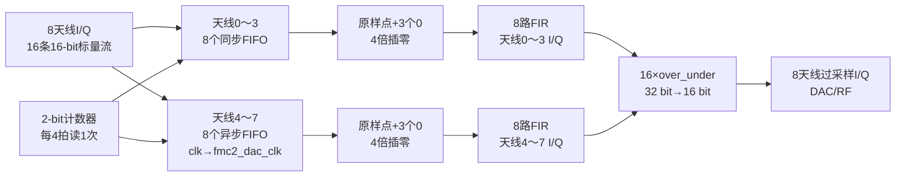

# Over_Sample_Group

> 所属层级：`MIMO_TX_Top` 直接子模块。
>
> 总索引：[MIMO_TX_Top子模块学习索引.md](./MIMO_TX_Top子模块学习索引.md)。
>
> 上一模块：[TX_RRH_Processor学习.md](./TX_RRH_Processor学习.md)。这是当前发射端顶层链路的最后一个直接处理模块。


## Over_Sample_Group 顶层

### 实现功能

一句话：把`TX_RRH_Processor`输出的8根天线复数基带采样分别缓存，做4倍插零和FIR插值滤波，并把滤波结果缩回16 bit送向DAC/RF接口。

### 实现原理解读

输入为公共`valid_in`以及8根天线各自的16-bit实部、16-bit虚部。每根天线实部、虚部分开处理，共16条标量通路：

```text
16-bit基带样点
 → FIFO缓存/跨时钟
 → 插零形成更高采样率序列
 → FIR_Filter_for_Upsampling
 → 32-bit滤波结果
 → over_under截位和溢出处理
 → 16-bit DAC样点
```

天线0..3使用同类同步FIFO，天线4..7使用带 `Asyn` 名称的FIFO，在 `clk` 与 `fmc2_dac_clk` 之间完成时钟适配。

上采样控制由2-bit计数器产生：计数器每拍加1，只在`counter==2`时读取一次FIFO。因此每4个滤波时钟只取一个新输入样点，另外3拍送0：

```text
原输入：x0       x1       x2
插零后：x0 0 0 0 x1 0 0 0 x2 0 0 0
```

这就是明确的4倍零插值。随后FIR低通插值滤波器填平零插值造成的频谱镜像，输出32-bit滤波结果，`over_under`再按`MSB=30、LSB=15`缩放/截位到16 bit。

模块还在有效无线帧之外向尚未接近满的FIFO持续写0，使滤波器在空闲区保持零输入，并用614400个`valid_in`样点标记一轮无线帧有效窗口。这个数字与前级CP结构严格闭合：

```text
一个slot = 1×(4096+320) + 6×(4096+288) = 30720点
一个无线帧 = 20个slot × 30720 = 614400点
```

### 子模块关系图



### 关键代码解读

模块包含：

```text
16个输入FIFO
16个FIR_Filter_for_Upsampling
16个over_under定点截位模块
```

`write_zero[15:0]` 在有效无线帧窗口之外且FIFO未接近满时持续写0，使滤波器输入在空闲区保持定义良好的零序列。

### 讨论问题

1. 从`counter/counter_asyn`的模4计数和每4拍一次FIFO读使能可确认零插值倍率为4；仍可用波形核对FIR IP配置是否与4倍插值匹配。
2. `over_under` 的 `MSB=30、LSB=15` 表明从32位滤波结果截取定点窗口；是否带饱和、舍入还是直接截断需精读该子模块。
3. 当前大量full/empty异常检查逻辑被注释，正式上板前应确认FIFO不会在跨时钟启动或停帧时溢出/读空。
4. 顶层没有使用`data_upsampling_valid_asyn`，并在`clk_baseband`域寄存天线4～7的异步时钟域输出；跨时钟采样是否安全需要结合外围DAC连接和时钟关系核实。
