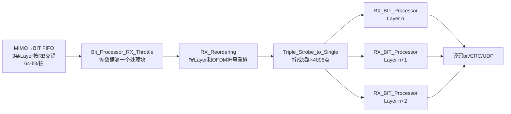
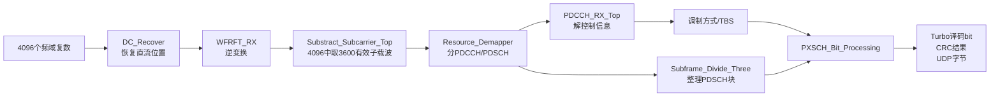
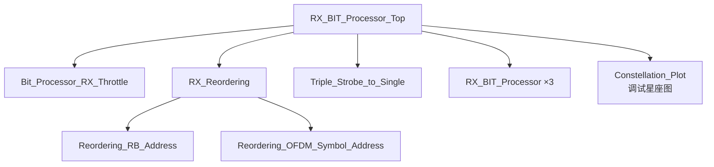
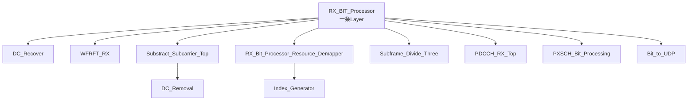

# RX_BIT_Processor 学习

> 本文对应接收端最后一段：从 MIMO 均衡后的复数星座点，恢复出发送端原始 bit，并通过 UDP 输出。本文把 `RX_BIT_Processor_Top`、三个同构的 `RX_BIT_Processor` 及其主要内部子模块连成一条完整数据流。

## 一、先用一句话说清楚

`RX_BIT_Processor_Top` 从跨板 FIFO 取回本片 FPGA 负责的 3 条 Layer，把按 RB 交错到达的数据重排成三路完整 OFDM 符号；每一路再依次完成频域恢复、资源分离、软解调、软解扰、接收速度匹配、Turbo 译码和 CRC 检查，最终输出原始业务 bit/字节。

它大体上是发射端 BIT 处理的逆过程：

```text
发射端：bit → CRC/Turbo → 速度匹配 → 加扰 → QAM调制 → 资源映射
接收端：资源解映射 → QAM软解调 → 软解扰 → 速度匹配恢复 → Turbo译码 → CRC → bit
```

## 二、总输入、总处理、总输出

### 2.1 输入是什么

| 输入 | 含义 |
|---|---|
| `FIFO_data[63:0]` | MIMO 均衡结果，每个字包含同一 Layer 的两个复数频域点 |
| `FIFO_data_valid` | 当前 FIFO 输出字有效 |
| `FIFO_number` | FIFO 中现有的 64-bit 字数 |
| `MCS_control` | 当前工程实际使用的本地 MCS 档位选择 |
| `alpha` | WFRFT/变换恢复使用的参数 |
| `clk_udp` | UDP 输出时钟域 |

本片 FPGA 负责的 3 条 Layer 由 `FPGA_ID` 决定：

```text
LAYER0 = 3 × FPGA_ID
LAYER1 = LAYER0 + 1
LAYER2 = LAYER0 + 2
```

所以：

| FPGA | 本地三条 Layer |
|---|---|
| FPGA0 | Layer0～2 |
| FPGA1 | Layer3～5 |
| FPGA2 | Layer6～8 |
| FPGA3 | Layer9～11 |

### 2.2 中间实际只做哪几步



每一路 `RX_BIT_Processor` 内部：



### 2.3 输出是什么

每条 Layer 都有一套输出：

- `bit_out`、`bit_out_valid`：Turbo 译码并去掉 CRC 后的串行信息 bit。
- `new_status_pulse`：一个传输块 CRC 判决完成。
- `TB_CRC_OK`：当前传输块 CRC 是否通过。
- `user_tx_data[7:0]`、`tvalid`、`tlast`：送往 UDP 的字节流和包边界。
- PDCCH/PDSCH CRC 正确、错误计数器：用于观察链路质量。

# RX_BIT_Processor_Top

## 实现功能

一句话：把一个 FIFO 中交错存放的 3 条 Layer 数据整理成三路各自连续的 4096 点 OFDM 符号，然后并行送给三个完全相同的 BIT 接收链。

## 子模块关系



`Constellation_Plot` 是观测/调试支路，不参与业务 bit 的恢复。

# Bit_Processor_RX_Throttle

## 实现功能

一句话：FIFO 数据够用时才启动读取，避免 BIT 链读到半个 RB 后断粮。

## 为什么普通 RB 门限是 18 个 64-bit 字

每片 FPGA 只接收 3 条 Layer。对一个 RB：

```text
3条Layer
× 12个子载波
÷ 每个64-bit字包含2个复数
= 18个64-bit字
```

所以 18 正好是“本板三条 Layer 的一个完整 RB”。特殊尾块只有 4 个频域位置，因此只需要：

```text
3条Layer × 4位置 ÷ 2复数/字 = 6个64-bit字
```

## 输出是什么

- `FIFO_read_enable`：实际读 FIFO 的长使能。
- `RB_start`：本次 RB 读取/处理开始的标志。

该 RTL 的脉冲转长使能写法比较绕，第一次阅读只需要确认两个事实：门限满足才启动，普通块读 18 字、特殊尾块读 6 字。

# RX_Reordering

## 实现功能

一句话：把“按 RB/四子载波块/Layer 到达”的数据，重排为“先完整输出 Layer0 的 4096 点，再 Layer1 的 4096 点，再 Layer2 的 4096 点”。

这是 BIT 部分最关键的一次重排。

## 输入数据原来是什么顺序

MIMO 均衡器对一个四子载波小块输出 12 条 Layer，跨板交换后，本板看到三条 Layer：

```text
Layer0：k0,k1 | k2,k3
Layer1：k0,k1 | k2,k3
Layer2：k0,k1 | k2,k3
然后进入下一个四子载波小块
```

也就是 64-bit 字顺序：

```text
L0字0, L0字1,
L1字0, L1字1,
L2字0, L2字1,
下一组四位置……
```

这样适合从 MIMO 模块边算边发送，却不适合三条 BIT 链各自执行 4096 点处理。

## 怎么重排

`Reordering_RB_Address` 给三条 Layer 分配不同 RAM 区域，典型写地址为：

```text
0, 1,       2048, 2049,       4096, 4097, ...
↑Layer0     ↑Layer1            ↑Layer2
```

原因是每条 Layer 一个 4096 点 OFDM 符号，对应：

```text
4096个复数 ÷ 每个64-bit字2个复数 = 2048个64-bit地址
```

因此单页 RAM 布局为：

```text
地址0~2047      ：Layer0，共4096个复数
地址2048~4095   ：Layer1，共4096个复数
地址4096~6143   ：Layer2，共4096个复数
```

写完整个 OFDM 符号后，`Reordering_OFDM_Symbol_Address` 从 0 到 6143 顺序读 RAM。每个 64-bit 字再分两拍输出低 32 bit、高 32 bit，得到：

```text
Layer0连续4096拍
→ Layer1连续4096拍
→ Layer2连续4096拍
```

## 为什么需要乒乓页

一页 RAM 正在按 Layer 连续读出时，下一 OFDM 符号仍可能继续写入。使用两页交替：

```text
页A写当前符号时，页B读上一符号
下一次交换：页B写，页A读
```

这样能让输入重排和后级处理流水并行，而不互相覆盖。

## 输出是什么

`data_out[31:0]` 每拍一个 C2.14 复数：

```text
[31:16] 虚部，[15:0] 实部
```

总输出窗口长度：

```text
3条Layer × 4096点 = 12288拍
```

# Triple_Strobe_to_Single

## 实现功能

一句话：识别连续 12288 拍数据中的三个 4096 拍区间，把它们分别变成三路独立 valid 和数据。

```text
输入第0~4095拍      → path1 → 本地Layer0
输入第4096~8191拍   → path2 → 本地Layer1
输入第8192~12287拍  → path3 → 本地Layer2
```

它不做数学运算，只是把一个时分复用数据流拆成三路。三个 `RX_BIT_Processor` 可以分别保持自己的帧计数、解调配置和 Turbo 译码状态。

# RX_BIT_Processor

## 实现功能

一句话：对一条 Layer 的完整 4096 点频域符号执行发射端 BIT 链的逆过程，最终恢复业务 bit。

## 子模块关系



# DC_Recover

## 实现功能

一句话：在 4096 点序列的直流位置重新插入 0，并把后半段位置移回去，使序列满足后级 4096 点变换的输入排列。

发射/RRH 频域链为避免直流位置或配合 FFT 排列，曾删除/移动一个位置。接收 BIT 链在进入 `WFRFT_RX` 前要做逆操作：

```text
位置0 ... 2047：原样
位置2048：插入复数0（DC）
位置2049以后：由相邻输入位置移回
```

这里的“DC”是零频率子载波，不是时域信号的直流电压测量。

# WFRFT_RX

## 实现功能

一句话：结合前级 `RX_RRH_Chain` 已完成的OFDM FFT，执行发射端 `WFRFT_TX` 的剩余逆变换，把当前Layer的4096个复数恢复到资源映射后的频域排列。

输入和输出都是每拍一个复数、连续4096拍。内部仍使用 `Normalization_FFT_wo_shift → FFT_4096`，并构造 `X0/X1/X2/X3`，但这不是第二次“天线时域转频域”的OFDM FFT；真正的OFDM FFT已经在 `RX_RRH_Chain → FFT_All_Remain` 完成，这里只负责WFRFT配对恢复。

当前生效的选择关系为：

| `WFRFT_RX.alpha` | 选中的分量 | 与前级RRH FFT合起来的作用 |
|---:|---|---|
| `30` | `X0`直通 | TX端选 `F³`，RRH端再做 `F`，已经有 `F·F³=F⁴=I` |
| `10` | `X2` | TX端和RRH端累计为 `F²`，再乘 `F²` 回到 `F⁴=I` |
| 其他 | `X3` | TX端直通，RRH端已有 `F`，再乘 `F³` 回到 `F⁴=I` |

因此普通 `alpha=30` 路径下，`WFRFT_RX` 本身选择直通并不是漏做IFFT，而是因为前级RRH FFT已经抵消了发射端的IFFT等效分量。

这部分要积累完整的4096点块并经过FFT类流水线，所以valid不只是一个开始脉冲，而是4096个真实复数的有效窗口。

# Substract_Subcarrier_Top

## 实现功能

一句话：从 4096 个频域位置中取出真正使用的 3600 个子载波，丢掉两侧保护带以及直流/空闲位置。

```text
4096个FFT频点
→ 删除未使用边缘频点和直流相关位置
→ 输出3600个有效频域复数
```

这解释了两个常见数字：

- `4096` 是 FFT 长度/每个 OFDM 符号的频域采样数。
- `3600` 是本工程实际占用的有效子载波数。

它们都不是 RB 数。3600 个子载波对应 300 个标准 12 子载波 RB 的带宽概念，但本工程后续还包含自定义资源结构和跨板尾块，不能只凭 300 反推所有 RTL 计数。

# RX_Bit_Processor_Resource_Demapper

## 实现功能

一句话：用四级位置计数判断每个复数属于 PDCCH、PDSCH 还是保留资源，再把数据送往正确的解码支路。

## Index_Generator 的计数层级

最内层到最外层：

```text
3600个子载波
→ 1个OFDM符号
14个OFDM符号
→ 1个子帧
10个子帧
→ 1个10 ms无线帧
```

因此位置可以写成：

```text
(subframe_index, symbol_index, subcarrier_index)
```

这也是为什么 RTL 看起来有大量条件判断：它实际是在用计数器描述二维时频资源栅格。

## 当前 RTL 的资源选择

- PDCCH：子帧 0、OFDM 符号 8。
- PDSCH：子帧 0 排除符号 0、2、3、7、8；其他子帧排除每个子帧的符号 0。
- 其余符号用于参考、同步或保留用途。

这里是本工程自己的帧安排，不应直接按 LTE/NR 教科书的 PDCCH 位置去纠正代码。

## 输出是什么

- `PDCCH_symbol_valid`：控制信道复数有效。
- `PDSCH_symbol_valid`：数据信道复数有效。
- `start_of_radio_frame`、`start_of_subframe`、`start_of_symbol`。
- 当前子帧和符号索引。
- 对齐后的复数数据。

# Subframe_Divide_Three

## 实现功能

一句话：把资源解映射后分散在多个 OFDM 符号中的 PDSCH 复数重新整理为译码器需要的连续传输块，并在每块开头产生配置脉冲。

代码中大量 `p3flag`、FIFO 读写和符号条件，是在做三件事：

1. 识别当前 PDSCH 属于哪个处理段。
2. 对不能立即连续输出的符号先写 FIFO。
3. 按 Turbo 解码链需要的顺序连续读出，并产生 `PDSCH_config_trigger`。

它不改变 QAM 星座点本身，只改变不同符号段进入 PDSCH 解调器的先后和连续性。

第一次阅读不用逐个追所有 `p3` 信号；先把它看成“PDSCH 数据块拼接器”。

# PDCCH_RX_Top

## 实现功能

一句话：对控制信道做 QPSK 软解调、解扰、接收速度匹配、Turbo 译码和 CRC 检查，理论上再从控制信息中提取 PDSCH 的调制方式与传输块大小。

## 数据流

```text
PDCCH复数
→ QPSK软解调
→ Gold序列软解扰
→ 软bit串行化
→ 接收速度匹配
→ Turbo译码
→ CRC检查
→ 14字节/112bit控制信息
→ PDSCH modulation、TBS
```

PDCCH 自身在当前 RTL 中固定使用 QPSK，资源数为一个 3600 子载波符号，传输块长度由控制信息长度宏决定。

## 当前代码中一个非常重要的现实

`U8data_to_PDSCH_config` 确实接收译码后的控制字节，也会在 CRC 通过时锁存控制字段；但最终把译码结果赋给 `modulation` 和 `TBS` 的逻辑已经被注释。

当前真正生效的是本地 `MCS_control`：

```text
MCS_control == 3 → modulation = 2（16QAM）
其他档位       → modulation = 1（QPSK）
```

TBS 当前固定映射为：

| MCS_control | TBS(bit) |
|---:|---:|
| 0 | 10296 |
| 1 | 15840 |
| 2 | 29296 |
| 3 | 30576 |

所以正确结论是：

> PDCCH 解码和 CRC 统计链存在，但当前版本 PDSCH 最终采用的调制方式/TBS 主要由本地 `MCS_control` 强制选择，并没有真正使用空口 PDCCH 解出的 MCS 配置。

这是以后联调时必须知道的，不然可能出现“PDCCH CRC 正确，但改控制信息后 PDSCH 配置仍不变化”的现象。

# PXSCH_Bit_Processing

## 实现功能

一句话：把 PDSCH/PXSCH 星座点变成软 bit，依次完成软解扰、速度匹配恢复、Turbo 译码和 CRC 检查。

## 子模块关系


# LLR_Demapper_Top

## 实现功能

一句话：不急着把每个星座点硬判成 0/1，而是输出每个候选 bit“更像 0 还是更像 1、把握有多大”的软信息 LLR。

### 硬判决和软判决的区别

假设 QPSK 某一维收到 `+0.02`：

```text
硬判决：只输出 0
软判决：输出“稍微偏向0，但可信度很低”
```

收到 `+0.95`：

```text
硬判决：仍然只输出 0
软判决：输出“强烈偏向0，可信度很高”
```

Turbo 译码器利用可信度能显著提高纠错性能，因此这里传的是有符号 8-bit LLR，而不是立即变成单 bit。

不同调制方式每个复数产生的软 bit 数不同：

| 调制 | 每个复数符号携带bit数 |
|---|---:|
| QPSK | 2 |
| 16QAM | 4 |
| 64QAM | 6 |

# PXSCH_Descrambler_Softbit

## 实现功能

一句话：接收端生成与发射端完全相同的 Gold 序列 `c(i)`，如果 `c(i)=1` 就翻转相应 LLR 的符号，从而撤销发射端 XOR 加扰。

发射端硬 bit 加扰：

```text
b_scr(i) = b(i) XOR c(i)
```

接收端如果拿到的是硬 bit，也可以再 XOR 一次：

```text
b(i) = b_scr(i) XOR c(i)
```

但接收端这里拿到的是 LLR。假设约定正值偏向 bit0、负值偏向 bit1，则：

```text
c(i)=0：LLR保持
c(i)=1：LLR取负
```

所以接收端也必须有 `c`。不是再次主动干扰信号，而是用同一伪随机序列撤销发送端的可逆比特翻转。

Gold 序列由两个线性反馈移位寄存器序列组合而成，初始状态由 `cell_ID`、`RNTI`、子帧号等参数确定。只要收发双方初始化完全一致，第 i 个 `c(i)` 就相同；错一拍或参数不一致，后续软 bit 符号会大面积翻错，CRC 通常无法通过。

# PXSCH_Softbit_Serializer

## 实现功能

一句话：把一个 QAM 符号并行产生的 2/4/6 个 8-bit LLR，变成 Turbo 解码核需要的单路 8-bit 连续软信息流。

例如 16QAM：

```text
一个复数星座点
→ [LLR0, LLR1, LLR2, LLR3]
→ 连续4拍输出四个8-bit LLR
```

内部 FIFO 用来吸收“前级每个符号一次产生多个 LLR”和“后级每拍消费一个 LLR”之间的速率差。

# Turbo_Decoder_PXSCH

## 实现功能

一句话：根据 TBS 和资源数恢复 Turbo 码块结构，撤销速度匹配，把软信息送进 Turbo IP 迭代译码，再检查 CB CRC 和 TB CRC。

它可以拆成四段：

```text
参数计算
→ RX_Rate_Matcher
→ Turbo Decoder输入缓存/格式转换
→ Turbo IP迭代译码
→ CRC检查与去CRC
```

# RX_Rate_Matcher

## 实现功能

一句话：发射端从 Turbo 编码后的环形缓冲区挑出能装进当前资源的 bit；接收端用相同地址规则把收到的 LLR 放回原来的系统位和校验位位置。

## 发射端为什么会去掉 bit

Turbo 编码产生的编码 bit 数量通常与本次可用 RE × 每符号 bit 数不完全相等，因此发射端速度匹配会：

- 编码 bit 太多：打孔，某些位置不发送。
- 编码 bit 太少：重复读取某些位置。

注意，“去掉”只是这一次没有通过空口发送，不是从原始信息中永久删除。

## 接收端没收到的 bit 怎么办

接收端生成和发射端相同的环形地址，把收到的 LLR 写回。被打孔的位置没有观测，补成：

```text
LLR = 0
```

它表示“这个 bit 完全未知，对 0 和 1 没有偏好”，不是断定它为 bit0。Turbo 译码器会结合系统位、其他校验位和迭代约束推断这些未知位置。

### 小例子

原编码位置：

```text
[0,1,2,3,4,5,6,7]
```

发射端只选择：

```text
[0,1,3,4,6,7]
```

接收端恢复软信息缓冲区：

```text
[L0,L1,0,L3,L4,0,L6,L7]
```

位置 2、5 的 `0` 是未知 LLR。

## 重复 bit 应该怎么处理

理论上，同一编码位置被重复发送并多次收到时，应将多次 LLR 相加，做软合并：

```text
LLR_combined = LLR_first + LLR_repeat + ...
```

但 `RX_Rate_Matcher_Circular_Buffer_Page` 的注释明确指出当前实现没有做等增益合并，重复地址更接近后写覆盖前写。因此功能上能恢复地址，但没有充分利用重复发送带来的信噪比增益。这是当前 RTL 的性能限制，不是 Turbo/速度匹配理论本身的要求。

# Turbo Decoder 输入缓存与 IP

## 实现功能

一句话：把速度匹配恢复的软信息重新整理成 Turbo IP 需要的系统位、校验1、校验2三路格式，再由 IP 迭代判决原始信息 bit。

Turbo 编码器的主要输出可理解为：

```text
systematic：原信息bit本身
parity1：第一个卷积编码器校验
parity2：交织后第二个卷积编码器校验
```

接收端利用三路软信息反复交换外信息，逐步修正低可信度 bit。当前 IP 配置/控制中可见的迭代次数较低，适合实时吞吐，但纠错性能与资源消耗之间存在折中。

# CRC Check

## 实现功能

一句话：验证 Turbo 译码结果是否可信，并从最终业务输出中去掉码块 CRC 和传输块 CRC。

两级 CRC 含义：

- `CB_CRC_OK`：各 Code Block 的 CRC；大传输块分段后，每段可单独检查。
- `TB_CRC_OK`：整个 Transport Block 的最终 CRC。

`new_status_pulse=1` 表示这次 CRC 判决已经产生，必须与同拍的 `TB_CRC_OK` 一起看：

```text
new_status_pulse=1 且 TB_CRC_OK=1 → 当前TB正确
new_status_pulse=1 且 TB_CRC_OK=0 → 当前TB错误
```

CRC 只能检测译码结果是否很可能正确，不能替代 Turbo 纠错。

# Bit_to_UDP

## 实现功能

一句话：把串行译码 bit 拼成 8-bit 字节，等待 CRC 结果，再跨到 UDP 时钟域并按包输出。

```text
串行bit
→ 每8 bit组成1字节
→ 暂存当前传输块
→ CRC通过后释放/标记有效
→ 异步FIFO跨时钟域
→ UDP tdata/tvalid/tlast
```

为什么不能边译码边直接发 UDP：CRC 结果通常在整个传输块尾部才知道。如果前面的字节已经发走，后来发现 CRC 错误就无法撤回。因此必须缓存或使用明确的错误包策略。

# 接收端 BIT 部分的数据排序总结

```text
输入FIFO：
按RB、四位置小块、Layer交错的64-bit数据
        ↓ RX_Reordering
按Layer连续：Layer0的4096点 → Layer1的4096点 → Layer2的4096点
        ↓ Triple_Strobe_to_Single
三路并行，每路一个完整Layer、每符号4096复数
        ↓ 有效子载波提取
每路每OFDM符号3600复数
        ↓ 资源解映射
PDCCH流 / PDSCH流
        ↓ QAM软解调
每个复数变成2/4/6个LLR
        ↓ Serializer
单路8-bit LLR序列
        ↓ 接收速度匹配
恢复Turbo系统位、校验位在环形缓冲区中的位置
        ↓ Turbo译码/CRC
串行原始信息bit
        ↓ Bit_to_UDP
8-bit字节和UDP包
```

从“数据形态”看，BIT 部分发生了五次关键变化：

1. 64-bit 中的两个复数 → 每拍一个 32-bit 复数。
2. 三条 Layer 交错 → 每条 Layer 连续 4096 点。
3. 4096 个 FFT 位置 → 3600 个有效资源位置。
4. 复数星座点 → 多个 8-bit LLR。
5. 编码软 bit → Turbo 译码后的原始 bit → UDP 字节。

# 与发射端逐项对应

| 发射端 | 接收端逆操作 |
|---|---|
| 添加 TB/CB CRC | 检查并去掉 TB/CB CRC |
| Turbo 编码 | Turbo 译码 |
| 速度匹配选择/重复编码 bit | 环形地址恢复，打孔位置置中性 LLR |
| Gold 序列 XOR 加扰 | 同一 Gold 序列翻转 LLR 符号 |
| QPSK/16QAM/64QAM 映射 | QAM LLR 软解调 |
| PDCCH/PDSCH 资源映射 | PDCCH/PDSCH 资源解映射 |
| 3600 有效资源放入 4096 点结构 | 从 4096 点结构取出 3600 有效资源 |
| WFRFT_TX | WFRFT_RX |

# 当前 RTL 中需要记住的风险和待验证项

## 1. PDCCH 配置没有真正接管 PDSCH

控制信道会被解码和做 CRC，但 `modulation/TBS` 的最终有效赋值来自本地 `MCS_control`。后续若要做真正空口动态调度，应恢复并验证译码配置锁存逻辑。

## 2. 重复 LLR 没有做理想软合并

接收速度匹配页当前更像覆盖重复地址，理论上应求和并做饱和。低码率大量重复时会损失性能。

## 3. 资源位置是工程自定义规则

PDCCH 位于子帧0符号8等条件是当前 RTL 的实际实现。修改帧结构时，发射端资源映射、接收端解映射、触发计数和文档必须一起改。

## 4. 定点缩放必须贯穿整链验证

均衡输出 C2.14、WFRFT、LLR 量化和 Turbo IP 的软输入范围彼此相关。即使星座图看着正确，LLR 过度饱和或幅度太小也会明显影响译码性能。

## 5. `RX_Reordering` 依赖整符号连续性

RAM 地址和三段 4096 点 valid 都假设输入计数没有丢字。任何跨板 FIFO 丢数都会使后续整帧 Layer 边界错位，通常要到下一次明确复位/重新同步才能恢复。

# 讨论问题

## 1. 加扰是不是每个 bit 都加扰？

是。所有进入加扰范围的编码 bit 都依次与一个 `c(i)` 进行 XOR；接收端对每一个对应 LLR 使用同一个 `c(i)` 做符号翻转。

## 2. 接收端为什么也有 `c`？

因为加扰是已知、可逆的序列变换。接收端必须重建同一序列才能撤销它。接收端的 `c` 不是从空口单独收到的，而是用相同参数本地产生。

## 3. 加扰和主动干扰信号有什么区别？

- 加扰：发送机有意、可逆、收发双方已知，在 bit 域改善统计特性和区分用户/小区。
- 主动干扰：额外叠加到无线信号上的未知或恶意能量，通常不可由简单 XOR 撤销，会降低 SINR。

## 4. 被速度匹配去掉的 bit 信息是不是丢了？

这次空口传输没有直接观测它，但 Turbo 码的冗余约束仍在其他系统位和校验位里。接收端把该位置设成中性 LLR=0，由迭代译码推断。码率过高、打孔太多时，纠错能力确实会下降。

## 5. 为什么要软解调，直接 0/1 不行吗？

能做硬译码，但会丢掉可靠度信息。Turbo 译码正是靠“哪些 bit 很确定、哪些 bit 模糊”来迭代纠错，软 LLR 通常明显优于硬 bit。

# 推荐阅读顺序

第一次：

1. `RX_Reordering`：弄清三条 Layer 怎样变成各自 4096 点。
2. `RX_Bit_Processor_Resource_Demapper`：弄清资源从哪里分成 PDCCH/PDSCH。
3. `PXSCH_Bit_Processing`：把软解调 → 解扰 → 译码这条线看通。
4. `RX_Rate_Matcher`：重点理解打孔位置为什么补 LLR=0。
5. `CRC Check`：明确何时才算一个 TB 接收成功。

第二次再精读 `Subframe_Divide_Three` 的 FIFO 调度、Turbo 参数计算、环形缓冲地址和所有定点位宽。这样不会一开始就被 LabVIEW 风格的自动生成状态逻辑淹没。
