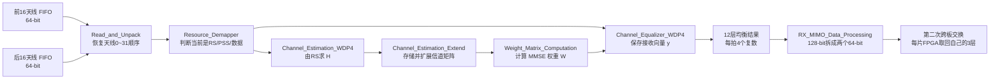
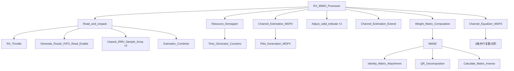
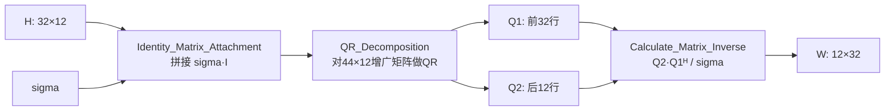
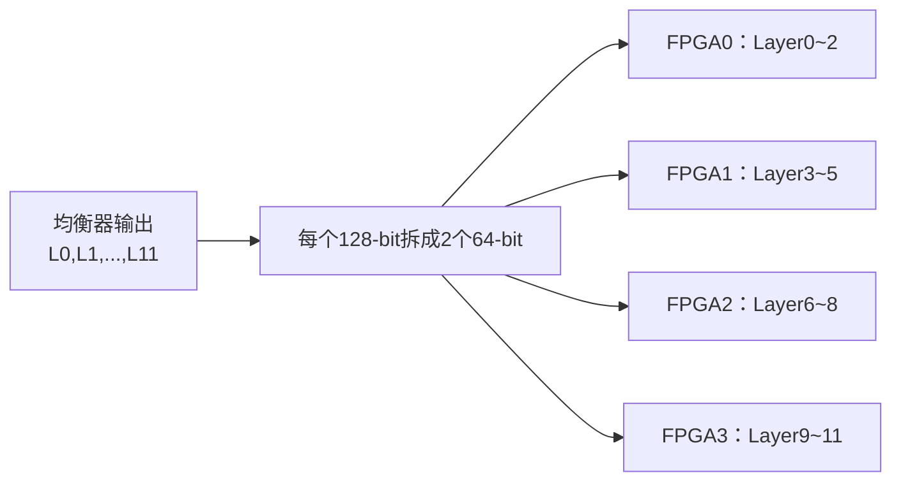

# RX_MIMO_Processor 学习

> 本文对应接收端从“32 根接收天线的频域数据”到“12 层均衡符号”的 MIMO 检测部分。阅读顺序固定为：输入是什么 → 数据怎样恢复顺序 → 怎样估计信道 → 怎样计算 MMSE 权重 → 怎样均衡 → 输出怎样重新分给 4 片 FPGA。

## 一、先用一句话说清楚

`RX_MIMO_Processor` 把同一组 4 个子载波上、32 根接收天线收到的信号组成接收向量，用参考信号估计 `32×12` 信道矩阵，再计算 `12×32` MMSE 权重，最后把 32 根天线的混合信号分离成 12 条 Layer 数据。

最核心的数学关系只有两步：

```text
接收：y = Hx + n
均衡：x_hat = Wy
```

- `x`：12 条发送 Layer 上的符号，大小 `12×1`。
- `H`：从 12 条 Layer 到 32 根接收天线的信道，大小 `32×12`。
- `y`：32 根接收天线实际收到的混合信号，大小 `32×1`。
- `W`：MMSE 均衡权重，大小 `12×32`。
- `x_hat`：恢复出来的 12 条 Layer，大小 `12×1`。

因此它不是“把 32 根天线合成 12 根天线”，而是利用 32 路观测，解出同时叠加在空中的 12 路独立数据。

## 二、RX_MIMO_Processor 的输入、处理和输出

### 2.1 输入是什么

模块有两路 64-bit FIFO 输入：

| 输入 | 含义 |
|---|---|
| `upper_half_fifo_data[63:0]` | 前 16 根接收天线的数据，即天线 0～15 |
| `lower_half_fifo_data[63:0]` | 后 16 根接收天线的数据，即天线 16～31 |
| 两路 FIFO 的 `used_number` | 当前已经缓存了多少个 64-bit 字 |
| 两路 FIFO 的 `data_valid` | 读请求发出后，本拍返回的数据是否有效 |
| `sigma` | MMSE 使用的噪声参数，代码中为 U1.14 定点数 |
| `antenna_indication` | 32 根天线的启用掩码，被关闭的天线不参与估计和均衡 |

一个 64-bit 字包含两个复数：

```text
64 bit = 复数0的 I/Q + 复数1的 I/Q
```

在 RRH 部分，一根天线连续 4 个子载波被打成两个 64-bit 字；MIMO 部分会重新把它们拼成一个 128-bit 数据：

```text
128 bit = 同一根天线在 k0、k1、k2、k3 四个位置上的 4 个复数
```

这里的 4 个位置是并行计算粒度，不是 4 根天线。

### 2.2 中间实际只做哪几步



主线可以压缩成五句话：

1. 从两个 FIFO 读出数据，恢复为天线 0、1、2……31 的自然顺序。
2. 根据无线帧位置判断当前 4 个子载波属于参考信号、PSS 还是数据。
3. 参考信号到来时估计信道矩阵 `H`。
4. 用 `H` 和噪声参数 `sigma` 算出 MMSE 权重 `W`。
5. 数据符号到来时计算 `x_hat = Wy`，输出 12 条 Layer。

### 2.3 输出是什么

`equ_data[127:0]` 每个有效周期输出：

```text
某一条 Layer 在 k0、k1、k2、k3 四个位置上的均衡复数
```

连续 12 拍分别对应 Layer0～Layer11：

```text
第 0 拍：Layer0 的 k0~k3
第 1 拍：Layer1 的 k0~k3
...
第11拍：Layer11 的 k0~k3
```

注意：这里的“12 拍”是 12 条 Layer，不是 12 个子载波。一个 RB 有 12 个子载波，工程把它拆成 3 个四子载波小块；每个小块都要输出 12 条 Layer。

所以一个普通 RB 的有效均衡输出为：

```text
3 个四子载波小块 × 12 条 Layer = 36 个 128-bit 有效拍
```

## 三、数据单位一定要分清

### 3.1 四种容易混淆的“12”

| 数字 | 在本工程里的含义 |
|---|---|
| 12 个子载波 | 一个 RB 在频域上的宽度 |
| 12 条 Layer | 同时发送的 12 路空间数据流 |
| 连续 12 拍读取 | MIMO 发射端从 4 片 FPGA 取齐 12 条 Layer 的一种时序 |
| 连续 12 拍均衡输出 | 接收端依次输出 Layer0～Layer11 |

这四件事数值相同，但维度不同，不能互相代替。

### 3.2 为什么以 4 个子载波为一组

RTL 内部主要数据口是 128 bit，恰好能并行装下 4 个 32-bit 复数。因此一个 RB 被拆成：

```text
RB的12个子载波
= [k0 k1 k2 k3]
 + [k4 k5 k6 k7]
 + [k8 k9 k10 k11]
```

代码把每一组称为一个 `submatrix`。它不是新的无线协议单位，只是硬件并行计算用的小矩阵。

### 3.3 一个四子载波小块的数据形状

进入 MIMO 检测器前：

```text
32 根天线 × 每根天线 4 个复数
= 32 个 128-bit 字
```

均衡后：

```text
12 条 Layer × 每条 Layer 4 个复数
= 12 个 128-bit 字
```

因此 `32 拍输入` 和 `12 拍输出` 才是接收端均衡的直接对应关系：前者遍历接收天线，后者遍历发送 Layer。

## 四、子模块关系



# Read_and_Unpack

## 实现功能

一句话：从“前 16 天线 FIFO”和“后 16 天线 FIFO”中读出一个 RB 的数据，把原先为了高速传输而交错的顺序恢复为天线 0～31 的自然顺序。

## 实现原理解读

### 输入是什么

- 两路 64-bit FIFO 数据。
- 两路 FIFO 当前存量。
- FIFO 返回有效信号。

### 中间做哪几步

1. `RX_Throttle` 判断 FIFO 中是否已经有完整处理块。
2. `Generate_Router_FIFO_Read_Enable` 产生两路 FIFO 的读使能。
3. 两个 `Unpack_RRH_Sample_Array` 各自把两个 64-bit 字拼成一个 128-bit 的“四位置向量”。
4. `Submatrix_Combiner` 用 RAM 把上下半区交错输入恢复成天线自然顺序。

### 输出是什么

连续 32 个有效拍：

```text
天线0的[k0 k1 k2 k3]
天线1的[k0 k1 k2 k3]
...
天线31的[k0 k1 k2 k3]
```

然后进入下一个四位置小块，再次输出天线 0～31。

## RX_Throttle

普通 RB 每一路 FIFO 需要准备 `96` 个 64-bit 字才允许启动：

```text
16 根天线
× 每根天线 12 个子载波
÷ 每个64-bit字包含2个复数
= 96 个64-bit字
```

两路合计：

```text
96 × 2 = 192 个64-bit字
= 32天线 × 12子载波 ÷ 2
```

因此 96 不是“96 个 RB”，而是半组天线处理一个 RB 所需的存储量。

工程最后一个不完整频域块只剩 4 个位置，所以 FPGA3 的特殊末块每路只要求 32 个 64-bit 字。

## Generate_Router_FIFO_Read_Enable

该模块控制上下两路 FIFO 的读节奏。下半区读使能相对上半区延后，使输入呈现近似下面的两两交错顺序：

```text
前半区两个天线 → 后半区两个天线
前半区两个天线 → 后半区两个天线
...
```

这样做不是无线协议要求，而是配合前级 FIFO 打包和本模块双路吞吐设计。

## Unpack_RRH_Sample_Array

一句话：把一根天线的两个 64-bit 字重新拼成 4 个连续频域复数。

```text
输入字0：A(k0), A(k1)
输入字1：A(k2), A(k3)
输出128-bit：A(k0), A(k1), A(k2), A(k3)
```

两路实例分别处理前 16 天线和后 16 天线。

## Submatrix_Combiner

交错输入大致为：

```text
A0, A1, A16, A17, A2, A3, A18, A19, ...
```

模块写 RAM 时使用地址：

```text
0, 1, 16, 17, 2, 3, 18, 19, ...
```

读 RAM 时则使用：

```text
0, 1, 2, 3, ... ,31
```

所以输出恢复为：

```text
A0, A1, A2, ... ,A31
```

这就是接收端 MIMO 部分的第一次关键重排：按传输方便形成的上下半区交错顺序，变回矩阵计算需要的“天线行顺序”。

# Resource_Demapper

## 实现功能

一句话：它主要产生资源类型和位置标志，并没有在这里真正删除数据。

名字叫 `Resource_Demapper` 容易让人以为它会把 PSS、RS、数据拆成不同数据线；实际上核心工作是计数，并给当前频域块贴标签：

- 当前是预编码参考信号 `RS_precoded`。
- 当前是非预编码参考信号 `RS_non_precode`。
- 当前是 PSS。
- 当前是否是普通数据和控制资源。
- 当前是哪个子矩阵、RB、OFDM 符号和无线帧位置。

## Time_Generator_Counters

计数关系是：

```text
32个有效拍 = 遍历32根接收天线 = 一个四子载波小块
3个四子载波小块 = 12个子载波 = 一个RB
本板负责的全部RB = 一个OFDM符号
140个OFDM符号 = 一个10 ms无线帧
```

因此这里的最内层计数单位是“天线行”，不是 4096 点时域采样。

已在 RTL 中使用的资源位置包括：

- 预编码参考符号：无线帧内 OFDM 符号 0、7、14、28、42……等配置位置。
- 非预编码参考符号：符号 3。
- PSS：符号 2。
- 其余允许位置作为数据/控制资源。

这些是本工程自定义帧结构的实际 RTL 规则，学习时应以代码和 `MIMO 1.1 Manual.pdf` 的对应表为准，不要直接套用商业 LTE/NR 的所有位置。

# Channel_Estimation_WDP4

## 实现功能

一句话：已知发送端参考信号 `p`，用接收到的参考信号 `r` 求每根接收天线、每条 Layer 的复数信道系数。

## 输入是什么

- 32 根天线收到的参考信号，一拍是一根天线的 4 个频域复数。
- `Pilot_Generation_WDP4` 产生的本地参考序列。
- 当前参考信号类型、行号、列组等位置标志。

## 怎么处理

当参考信号幅度已经归一化时，可用：

```text
H ≈ r × conj(p)
```

4 个子载波位置并行计算，所以每拍得到 4 个复数信道估计。经过 3 个四子载波小块，得到 12 个列方向的信道信息；经过 32 根天线，形成：

```text
H = 32行接收天线 × 12列发送Layer
```

## 输出是什么

`channel_estimate[143:0]` 包含 4 个并行复数信道估计，每个复数的实部和虚部使用 18 bit。

# Adjust_valid_Indicate

## 实现功能

一句话：补偿信道估计运算流水线延迟，让“数据有效”和“它属于哪个位置”的标签仍然对齐。

它不改变复数数据，只延迟和整理 valid/位置指示。此类模块看似只是延时，但如果少一拍，后面就可能把天线 5 的估计当成天线 6，属于必须保留的时序对齐逻辑。

# Channel_Estimation_Extend

## 实现功能

一句话：把参考符号时刻算出的信道矩阵存进 RAM，并在后续数据符号到来时连续重放，使每个数据 RB 都能拿到对应的 `H`。

## 处理过程

1. 参考信号到来时，将 3 组 × 32 行，共 96 个信道估计写入 RAM。
2. 普通数据资源到来时，按照 RB/天线顺序读出。
3. 被 `antenna_indication` 关闭的天线行强制置零。
4. 特殊末块按实际存在的子矩阵数处理。

“Extend”不是凭空增加新信道信息，而是把一次估计在时间上保持、复制给后续数据符号使用。

# Weight_Matrix_Computation

## 实现功能

一句话：根据 `H` 和噪声强度 `sigma` 计算 MMSE 均衡矩阵 `W`。

## 为什么需要 MMSE

如果直接对信道求逆，信道接近奇异时会严重放大噪声。MMSE 在“消除层间串扰”和“不要过度放大噪声”之间折中：

```text
W = (H^H H + sigma² I)^(-1) H^H
```

- `H^H` 是共轭转置。
- `I` 是 12×12 单位矩阵。
- `sigma² I` 是噪声正则项。

噪声越大，算法越不愿意做激进的零迫逆；噪声趋近 0 时，结果接近 ZF。

## 子模块关系



## Identity_Matrix_Attachment

构造增广矩阵：

```text
A = [ H       ]   32行
    [ sigma·I ]   12行

A 的大小 = 44×12
```

这就是宏 `ROW_PER_QR = 44` 的来源：

```text
32 根接收天线 + 12 条 Layer = 44 行
```

## QR_Decomposition

对 `A` 做：

```text
A = Q R
```

把 Q 分成：

```text
Q1：前32行
Q2：后12行
```

由增广矩阵关系可得到：

```text
Q1 = H R^(-1)
Q2 = sigma I R^(-1)
```

进而能在不直接构造并求逆 `H^H H + sigma²I` 的情况下得到 MMSE 权重。

## Calculate_Matrix_Inverse

代码最终计算等价于：

```text
W = Q2 × Q1^H / sigma
```

结果按“列”输出：每次对应一根接收天线，包含该天线通向 12 条输出 Layer 的 12 个复数权重。

`channel_inverse_column[599:0]` 的宽度来自：

```text
12个复数 × (25-bit实部 + 25-bit虚部)
= 12 × 50
= 600 bit
```

连续 32 列构成完整的 `12×32` 权重矩阵。

## 关键时序

MMSE 是本模块最重的运算，QR 分解和矩阵乘法都有很长流水线。代码用约两千多个周期的固定延迟将权重 valid 与数据资源对齐。这里不能只看某一个 always 块，要把“参考信号先估计 H → 经过长流水线生成 W → 后续数据符号使用 W”作为完整时序看。

# Channel_Equalizer_WDP4

## 实现功能

一句话：把 32 根天线的接收向量 `y` 与 `12×32` 权重矩阵 `W` 相乘，输出 12 条 Layer 的估计符号。

## 输入是什么

- 接收数据：每拍一根天线的 4 个并行复数。
- MMSE 权重：当前天线对应的 12 个复数权重。
- RB、天线行、资源类型和 valid。

## 怎么处理

对某条 Layer `l` 和某个子载波位置 `k`：

```text
x_hat_l(k)
= W[l,0]·y0(k)
 + W[l,1]·y1(k)
 + ...
 + W[l,31]·y31(k)
```

也就是在 32 根接收天线上做复数点积。硬件同时处理 k0～k3 四个位置，所以内部有 4 组并行乘加器。

### 小例子

先只想象 2 根接收天线、2 条 Layer：

```text
y0 = h00·x0 + h01·x1 + n0
y1 = h10·x0 + h11·x1 + n1
```

均衡器使用两根天线的观测：

```text
x_hat0 = w00·y0 + w01·y1
x_hat1 = w10·y0 + w11·y1
```

本工程只是把这个例子扩大成 32 根接收天线、12 条 Layer，并且一次并行算 4 个频域位置。

## 输出是什么

一个四子载波小块的输出时序：

```text
12拍：Layer0, Layer1, ... , Layer11
每拍：该Layer的4个复数
```

一个 RB 有 3 个四子载波小块，所以输出 36 个有效拍。

# RX_MIMO_Data_Processing

## 实现功能

一句话：把 MIMO 均衡输出的 12 条 Layer 重新打包并跨板发送，让每片 FPGA 取回自己负责做 BIT 解调的 3 条 Layer。

这个模块实例化在 `MIMO_RX_Top` 中，位置在 `RX_MIMO_Processor` 之后。虽然不在其 RTL 文件内部，但它属于 MIMO 到 BIT 的必要接口。

## 输入和拆分

输入一个 128-bit 字：

```text
Layer l 的 k0、k1、k2、k3
```

拆成两个 64-bit 字：

```text
字0：Layer l 的 k0、k1
字1：Layer l 的 k2、k3
```

因此一个四子载波小块：

```text
12条Layer × 2个64-bit字 = 24个64-bit字
```

每片 FPGA 负责 3 条 Layer，因此每个目标板收到：

```text
3条Layer × 2个64-bit字 = 6个64-bit字/四位置小块
```

一个普通 RB 有 3 个小块，所以每片 FPGA 收到 18 个 64-bit 字。

## 第二次跨板重排



发射端是每片 FPGA 产生 3 条 Layer，再把 12 条 Layer 汇集到负责某些 RB 的 MIMO FPGA；接收端方向相反：负责某些 RB 的 MIMO FPGA 解出 12 条 Layer，再把 Layer 分回 4 片 FPGA。

# 本板负责哪些 RB

4 片 FPGA 并不是各自只处理某一段连续频率，而是按固定轮转顺序分担全带宽 RB。结合交换模块的目标顺序，本工程使用的全局 RB 分配可概括为：

| FPGA | 负责的全局 RB 序列 |
|---|---|
| FPGA1 | 0、4、8、12…… |
| FPGA3 | 1、5、9、13…… |
| FPGA0 | 2、6、10、14…… |
| FPGA2 | 3、7、11、15…… |

所以一片 FPGA 内的 `RB_index` 是“本板本地第几个 RB”，不总等于整个带宽中的全局 RB 编号。

4096 点 FFT 去掉/处理直流位置后，频域按 4 个位置分组。总组数不能被 4 片 FPGA 完全平均，因此不同板的本地 RB 数为 85 或 86，最后还存在只有一个四位置小块的特殊末块。RTL 中 `FPGA_ID==3`、`RB_index==85` 的特殊判断就是为这个尾块服务。

# 接收端 MIMO 部分的数据排序总结

```text
RRH输出：
按天线对和64-bit字打包，适合FIFO/链路传输
        ↓
Read_and_Unpack：
恢复为 [天线0..31]，每拍同一天线4个频域位置
        ↓
信道估计/MMSE：
组成 H(32×12) 和 W(12×32)
        ↓
均衡器输出：
恢复为 [Layer0..11]，每拍同一Layer的4个位置
        ↓
RX_MIMO_Data_Processing：
每Layer拆成两个64-bit，并按3条Layer分发给4片FPGA
```

从排序角度看，MIMO 部分有两次关键变化：

1. 上下半区 FIFO/天线对交错顺序 → 32 根天线自然行顺序。
2. 32 根天线接收向量 → 12 条 Layer 输出顺序；随后再按每板 3 条 Layer 路由。

# 关键参数来源

| 参数 | 来源与含义 |
|---|---|
| `ANTENNA_NUM = 32` | 32 根接收天线共同参与 MIMO 检测 |
| `LAYER_NUM = 12` | 同时恢复 12 条空间 Layer |
| `COL_PER_SUBMATRIX = 4` | 一拍并行处理 4 个子载波位置 |
| `SUBMATRIX_PER_RB = 3` | 12 子载波/RB ÷ 4 = 3 |
| `ROW_PER_QR = 44` | 32 行 H + 12 行噪声单位阵 |
| `CLOCK_CYCLE_PER_RB = 132` | 调度槽：3 × 44 拍；其中数据有效窗口与内部计算流水重叠 |
| `U64_PER_RB = 192` | 32 天线 × 12 子载波 ÷ 每字2复数 |

`132` 是工程内部给一个 RB 安排的调度周期，不是协议规定一个 RB 有 132 个采样点。它来自每个四位置小块占 44 拍、一个 RB 有 3 个小块：

```text
3 × 44 = 132 拍
```

这里 44 又与 32 根接收天线和 12 条 Layer 的处理窗口有关，也与 QR 的 44 行增广矩阵数值相同；应根据具体子模块的 valid 信号判断有效数据在哪些拍，不能把 132 拍全部理解成 FIFO 连续读数据。

# 讨论问题与当前结论

## 1. 接收端为什么需要 32 拍输入，却只输出 12 拍？

32 拍用于收集 32 根天线的观测，12 拍用于依次输出 12 条 Layer。两个数字代表不同矩阵维度。

## 2. 一个脉冲能不能代替连续 valid？

不能。脉冲只能说“开始了”，不能携带 32 根天线各自不同的复数数据。矩阵乘法必须在连续有效拍中逐行收集/累加实际数值。

## 3. 这里是不是按 RB 做 MIMO？

调度和缓存以 RB 为大单位，但实际并行计算粒度是 4 个子载波。一个 RB 被分成 3 个四位置小块分别处理。

## 4. 参考信号也会作为业务数据输出吗？

`Resource_Demapper` 会标记资源类型；参考资源主要用于估计 H，数据 valid 决定是否进行有效业务均衡。部分流水线可能仍按固定节奏运行，但参考位置不应被后级当成 PDSCH/PDCCH 数据。

## 5. `sigma` 是噪声功率还是标准差？

从增广矩阵写入 `sigma·I`、公式出现 `sigma²I` 看，RTL 的 `sigma` 更接近噪声幅度/标准差形式。它的标定方式仍应结合上层配置与定点仿真继续核实。

# 阅读顺序建议

第一次阅读只抓以下主线：

1. `Read_and_Unpack`：32 根天线怎样排好。
2. `Channel_Estimation_WDP4`：怎样得到 H。
3. `Weight_Matrix_Computation`：为什么 H 变成 W。
4. `Channel_Equalizer_WDP4`：怎样做 `Wy` 得到 12 层。
5. `RX_MIMO_Data_Processing`：12 层怎样分回 4 片 FPGA。

第二次再看 QR 流水线、定点位宽、valid 延迟和末块特殊处理。不要第一次就陷进两千多拍延时链。
