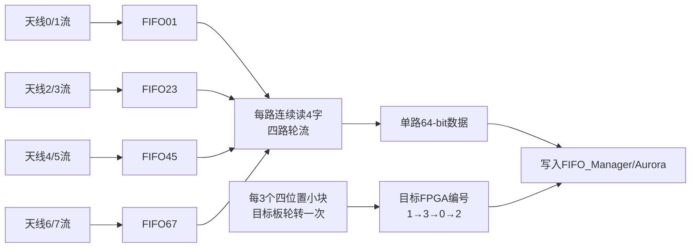
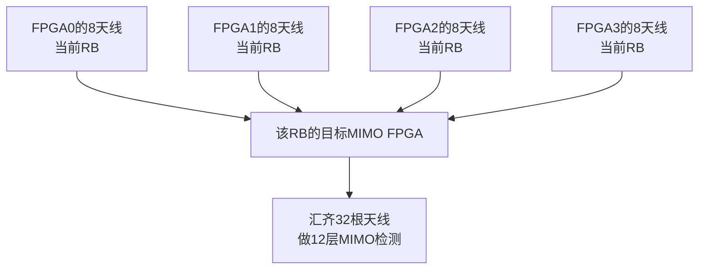

# RX_RRH_FIFO_Exchange 学习

## 一句话说明模块作用

`RX_RRH_FIFO_Exchange` 把本片 FPGA 上 4 条并行的“天线对数据流”串成一条 64-bit 流，并且每处理完一个 RB 就按 `FPGA1 → FPGA3 → FPGA0 → FPGA2` 的顺序修改目标板编号，从而把不同 RB 送给负责该 RB MIMO 检测的 FPGA。

它不做同步、FFT、信道估计或均衡，只做：

```text
4路并行 → 1路串行
+ 按RB添加目标FPGA编号
```

## 输入是什么

来自 `RX_RRH_Processor` 的四路并行 64-bit 数据：

| 输入 | 对应本板天线 |
|---|---|
| `antenna_data_01` | 天线0、1 |
| `antenna_data_23` | 天线2、3 |
| `antenna_data_45` | 天线4、5 |
| `antenna_data_67` | 天线6、7 |
| `antenna_data_valid` | 四条输入流共同的有效信号 |

每个 64-bit 字包含两个 32-bit 复数。对同一组 4 个子载波，某一天线对会产生 4 个 64-bit 字：

```text
字0：天线A的 k0、k1
字1：天线A的 k2、k3
字2：天线B的 k0、k1
字3：天线B的 k2、k3
```

所以 4 条天线对流在同一个四子载波小块上合计：

```text
4个天线对 × 每对4个64-bit字 = 16个64-bit字
```

## 中间实际只做哪几步



### 第一步：四路同时写各自小 FIFO

`antenna_data_valid=1` 时，四个 `FIFO_for_RX_RRH_Buffer` 同时写入：

```text
FIFO01 ← 天线0/1
FIFO23 ← 天线2/3
FIFO45 ← 天线4/5
FIFO67 ← 天线6/7
```

这里的 FIFO 是 `RX_RRH_FIFO_Exchange` 内部的 4 个小缓冲 FIFO，不是外层 `FIFO_Manager` 中负责跨板传输的大 FIFO。

内部 FIFO 的作用是把四路同时到来的数据临时排队，供后面逐路串行读出。

### 第二步：每路连续读 4 个字

4-bit 计数器 `cnt1` 从 0 数到 15：

```text
cnt1=0~3    ：读 FIFO01 的4个字
cnt1=4~7    ：读 FIFO23 的4个字
cnt1=8~11   ：读 FIFO45 的4个字
cnt1=12~15  ：读 FIFO67 的4个字
```

因此输出一个四子载波小块时的数据顺序是：

```text
天线0的4位置
→ 天线1的4位置
→ 天线2的4位置
→ ...
→ 天线7的4位置
```

更精确地按 64-bit 字看：

```text
A0(k0,k1), A0(k2,k3),
A1(k0,k1), A1(k2,k3),
...
A7(k0,k1), A7(k2,k3)
```

这 16 个 64-bit 字正好包含本板 8 根天线在 4 个连续频域位置上的全部数据。

### 第三步：连续三个四位置小块构成一个 RB

一个 RB 有 12 个子载波，工程每次处理 4 个，因此：

```text
3个四位置小块 × 4子载波 = 12子载波 = 1个RB
```

每个小块输出 16 个 64-bit 字，所以本板 8 根天线的一个 RB 为：

```text
3 × 16 = 48个64-bit字
```

RTL 的 `cnt2` 用来数这 3 轮。当三轮结束，`cnt3` 加一，目标 FPGA 切换到下一片。

### 第四步：给每个 RB 标记目标 MIMO FPGA

目标编号按下面顺序循环：

```text
cnt3=0 → FPGA1
cnt3=1 → FPGA3
cnt3=2 → FPGA0
cnt3=3 → FPGA2
然后重新循环
```

也就是全带宽 RB 的分配：

| 全局 RB 序号 | 目标 MIMO FPGA |
|---:|---:|
| 0 | FPGA1 |
| 1 | FPGA3 |
| 2 | FPGA0 |
| 3 | FPGA2 |
| 4 | FPGA1 |
| 5 | FPGA3 |
| … | 每4个RB循环 |

目标编号 `rx_des_rrh2mimo_fifo_idd2` 与输出数据、写有效经过延时对齐，一起交给外层 FIFO/Aurora 路由。

## 输出是什么

| 输出 | 含义 |
|---|---|
| `rx_rrh2mimo_fifo_wr_data[63:0]` | 串行化后的本板 8 天线频域数据 |
| `rx_rrh2mimo_fifo_wr_valid` | 当前输出字有效，可写外层 FIFO |
| `rx_des_rrh2mimo_fifo_idd2[1:0]` | 当前这个 RB 应发往哪片 MIMO FPGA |

## 整体实现了什么功能

四片 FPGA 各自只直接连接 8 根接收天线，但 MIMO 检测需要同一个 RB 上 32 根天线的接收向量。本模块让四片板都执行同样的 RB 路由：



例如全局 RB0 的目标是 FPGA1：

```text
FPGA0 把自己的8天线/RB0发给 FPGA1
FPGA1 保留/路由自己的8天线/RB0
FPGA2 把自己的8天线/RB0发给 FPGA1
FPGA3 把自己的8天线/RB0发给 FPGA1

最终 FPGA1 获得 RB0 的32天线数据
```

下一个 RB1 则由 FPGA3 汇集。这样每片板只负责约四分之一的频率 RB，却在自己负责的 RB 上拥有完整 32 天线观测。

## 为什么输出窗口是 16384 拍

看到代码：

```verilog
.N(16'd16384)
```

不能理解为“有 16384 个 RB”。它表示四路 FIFO 中各 4096 个 64-bit 字被全部串行输出：

```text
4条天线对流 × 每流4096个64-bit字
= 16384个64-bit输出字
```

每条输入流的 4096 深度与一个完整无线帧/当前处理窗口的频域字组织有关；4096 在这里是 FIFO 每路累计字数/输出轮次，不能直接说成“一个 RB 有 4096 个采样点”。

再次区分：

- 4096 点：FFT 长度，一个 OFDM 符号的完整频域位置数。
- 12 子载波：一个 RB 的频域宽度。
- 48 个 64-bit 字：本板 8 根天线的一个普通 RB。
- 192 个 64-bit 字：四片板 32 根天线的一个普通 RB。

## 为什么4路变1路不会堵住

如果4路数据永久连续输入而输出永远只有1路，那么总输入速率是`4×64 bit/拍`，输出速率只有`1×64 bit/拍`，任何有限深度FIFO最终都会写满。本工程能够这样转换，是因为输入不是永久连续流，而是每个OFDM符号只有4096拍的并行突发，之后存在足够长的空闲/FFT处理间隔。

当前`FIFO_for_RX_RRH_Buffer.xci`明确配置为每个FIFO`4096×64 bit`。一个符号期间：

```text
输入0～4095拍：
    4路各写1字/拍，共写入4×4096=16384字

串行输出约0～16383拍：
    1路读1字/拍，共读出16384字
```

读写是重叠的。输入突发进行的4096拍内，输出已经读走约4096个总字，即平均从每个FIFO读走约1024字。因此每个FIFO在输入结束附近的最大积压约为：

```text
写入4096 - 已读约1024 = 积压约3072字
```

再加少量启动流水延迟仍小于4096深度；输入停止后，输出继续约12288拍，平均再从每个FIFO读3072字，最终排空。相邻符号调度间隔约17530/17660个处理时钟，而串行化窗口为16384拍，正常调度下下一符号到来前还有余量。

```text
前4096拍：4路快速写入，同时1路开始读
后12288拍：不再写入，继续1路排空
最后余量：等待下一符号突发
```

所以它是“瞬时输入带宽大、平均输入带宽小于单路输出能力”的突发缓存和时分复用。必须注意：代码虽然观察了4个FIFO的`full`，却没有把`full`反馈给前级形成反压；如果输入变成长期连续、下一符号提前到来或输出调度中断，模块不会自动卡住等待，而可能直接FIFO溢出并丢数据。当前安全性依赖既定符号时序和FIFO深度，仿真/ILA应检查`full`始终不拉高。

## 为什么代码把四路数据做按位 OR

四个 FIFO 的输出先分别在 valid 时锁存，不有效的路写成 0：

```text
oo01 = v01 ? o01 : 0
oo23 = v23 ? o23 : 0
oo45 = v45 ? o45 : 0
oo67 = v67 ? o67 : 0
```

调度保证同一时刻只有一路 valid，于是：

```text
output = oo01 | oo23 | oo45 | oo67
```

按位 OR 在这里等价于四选一多路器。它可读性不如 `case` 直接选择，但不是把四根天线数值相加。

如果时序错误导致两路同时 valid，OR 会把两个数据位混在一起而不是报错，因此调试时应同时观察 `v01/v23/v45/v67` 是否严格 one-hot。

## 子模块与计数器关系

| 名称 | 作用 |
|---|---|
| 4×`FIFO_for_RX_RRH_Buffer` | 缓存四条并行天线对流 |
| `PULSE_TO_STROBE_U16` | 将输入开始边沿扩展成 16384 拍串行化窗口 |
| `cnt1` | 0～15，控制当前读哪条 FIFO、该路第几个字 |
| `cnt2` | 0～2，累计一个 RB 的三个四位置小块 |
| `cnt3` | 0～3，选择本 RB 的目标 MIMO FPGA |

## 数据重排总结

输入：四路并行，按天线对分开：

```text
流0：[天线0,天线1]的全部频域数据
流1：[天线2,天线3]的全部频域数据
流2：[天线4,天线5]的全部频域数据
流3：[天线6,天线7]的全部频域数据
```

输出：一路串行，按四位置小块内的天线顺序：

```text
RB0小块0：天线0→1→...→7
RB0小块1：天线0→1→...→7
RB0小块2：天线0→1→...→7
目标FPGA=1

RB1三个小块同样排列
目标FPGA=3
...
```

这是接收端第一次跨板重排的发送侧。到目标 FPGA 后，外层 FIFO Manager 会把来自四块板的数据送入 `RX_MIMO_Processor` 的前/后 16 天线 FIFO，后者再恢复完整的天线 0～31 自然顺序。

## 风险与待验证项

1. 内部四个 FIFO 的 `full` 只汇总用于调试，没有看到向前级反压的端口；必须保证系统设计上不会写满。
2. 输出采用 OR 多路复用，要求四路 valid 永远 one-hot；仿真中应加断言验证。
3. `PULSE_TO_STROBE_U16` 的 16384 拍由输入 valid 边沿触发，输入帧窗口和内部 FIFO 填充/读取必须严格同步。
4. 尾部不完整 RB 的具体处理需要与 4096 点频域末端、目标 FPGA3 的特殊阈值一起看，不能只凭本模块的 `cnt1/cnt2` 判断。

## 最直白的结论

```text
这个模块的输入：本板8根天线，分成4条并行天线对流。

它的处理：每条流每次拿4个64-bit字，四条流轮流输出；
          三轮组成一个RB；每个RB换一个目标FPGA。

它的输出：一条64-bit串行流 + 这个RB要发往哪片FPGA。

它实现的功能：让四片板按RB分工，把同一RB的32天线数据汇到一片板做MIMO。
```
