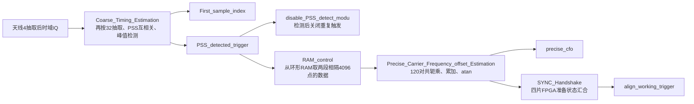
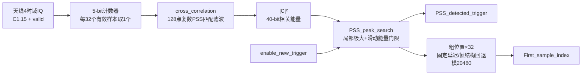
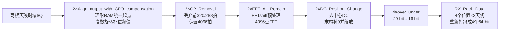

# RX_RRH_Processor学习

> 所属层级：`MIMO_RX_Top`第一个直接处理模块。
>
> 总索引：[MIMO_RX_Top子模块学习索引.md](./MIMO_RX_Top子模块学习索引.md)。

## RX_RRH_Processor顶层

### 实现功能

一句话：用本板天线4完成PSS同步和公共频偏估计，再让本板8根天线使用相同的帧起点及频偏参数，分别完成对齐、频偏补偿、去CP和4096点FFT，最后输出4路天线对64-bit频域数据。

### 输入是什么

```text
data_in_valid                     8根天线公共输入有效
data_in_real_rx0～7               8根天线各自16-bit实部
data_in_imag_rx0～7               8根天线各自16-bit虚部
use_sync_fre                      是否使用PSS得到的精频偏
use_tracking                      是否使用后续频率跟踪结果
WAIT_CYCLE                        四板同步握手等待参数
strobe_upstream/trigger_upstream  板间同步链输入
```

这些输入在`MIMO_RX_Top`中已被描述为“降采样后的数据”，所以本模块不负责最前面的ADC过采样率降采样。

### 中间实际做哪几步



```mermaid
flowchart LR
    IN["8根天线时域IQ<br/>rx0～rx7<br/>每路I/Q各16 bit，C1.15"]

    subgraph SYNC["同步控制支路：Sync_Top只使用天线4"]
        direction LR
        A4["天线4时域IQ"] --> CT["Coarse_Timing_Estimation<br/>PSS相关与峰值搜索<br/>得到First_sample_index"]
        A4 --> RC["RAM_control<br/>环形缓存参考采样"]
        CT -->|"PSS触发"| RC
        RC --> PCFO["Precise_Carrier_Frequency_offset_Estimation<br/>CP与对应正文共轭相关<br/>得到precise_cfo"]
        PCFO --> HS["SYNC_Handshake<br/>四片FPGA准备状态汇总<br/>产生align_working_trigger"]
    end

    subgraph CHAINS["主数据通路：4×RX_RRH_Chain并行处理0/1、2/3、4/5、6/7"]
        direction LR
        AL["每条Chain：2×Align_output_with_CFO_compensation<br/>共8块20480深度环形RAM<br/>统一帧起点＋频偏反向旋转<br/>输出仍为带CP时域IQ"]
        CP["每条Chain：2×CP_Removal<br/>符号0/7屏蔽320点<br/>其余符号屏蔽288点<br/>每根天线留下4096点时域正文"]
        FFT["每条Chain：2×FFT_All_Remain<br/>4096点FFT<br/>时域 → 频域<br/>每根天线输出4096个29-bit复数"]
        DC["每条Chain：2×DC_Position_Change<br/>去中心DC、后半段前移、末尾补0<br/>4×over_under：29 bit → 16 bit"]
        PACK["每条Chain：RX_Pack_Data<br/>两天线×4位置局部转置<br/>(A0,B0)…(A3,B3)<br/>→ A0A1、A2A3、B0B1、B2B3"]
        AL -->|"带CP时域IQ<br/>4416/4384点"| CP
        CP -->|"去CP时域IQ<br/>每符号4096点"| FFT
        FFT -->|"频域子载波<br/>每拍每根天线1个复数"| DC
        DC -->|"C9.7复数<br/>每个32 bit"| PACK
    end

    subgraph TRACK["残余频偏跟踪支路：复用天线4的FFT结果"]
        direction LR
        CUT["saturated_overflow<br/>天线4 FFT数据29 bit → 25 bit"] --> FTC["Frequency_Tracking_Control<br/>选择符号0/7参考数据<br/>控制写入、读出和去DC"]
        TC["timing_count<br/>根据FFT valid上升沿<br/>产生subframe/symbol计数"] --> FTC
        FTC --> FTT["Frequency_Tracking_Top<br/>比较参考符号相位变化<br/>输出frequency_track_result"]
    end

    OUT["RX_RRH_Processor输出<br/>4路并行64-bit<br/>FIFO_data1：天线0/1<br/>FIFO_data2：天线2/3<br/>FIFO_data3：天线4/5<br/>FIFO_data4：天线6/7"]
    EX["模块外：RX_RRH_FIFO_Exchange<br/>4路并行 → 1路64-bit<br/>每小块16个U64<br/>3小块=12子载波=1RB<br/>形成RB优先顺序"]
    FM["FIFO_Manager / 板间交换<br/>同一RB的4块FPGA数据<br/>汇到负责该RB的MIMO FPGA"]
    MIMO["RX_MIMO_Processor<br/>汇齐32天线<br/>进行MIMO检测"]

    IN --> AL
    IN -.->|"抽取天线4"| A4
    CT -.->|"First_sample_index"| AL
    PCFO -.->|"precise_cfo"| AL
    HS -.->|"align_working_trigger"| AL
    FFT -.->|"Chain2的天线4原始FFT数据"| CUT
    FFT -.->|"data_frequency_valid上升沿"| TC
    FTT -.->|"frequency_track_result<br/>use_tracking控制是否采用"| AL
    PACK --> OUT --> EX --> FM --> MIMO
```

读图时把它分成三条线：粗实线是8天线主数据；上方同步支路只用天线4产生统一起点、初始频偏和四板启动触发；下方跟踪支路再从天线4的FFT结果估计残余频偏，并反馈给全部8根天线的`Align_output_with_CFO_compensation`。`RX_RRH_Processor`本身输出4条天线对流，完整RB优先顺序要到紧接着的`RX_RRH_FIFO_Exchange`才形成。

### 图中`First_sample_index`、`precise_cfo`和`align_working_trigger`的关系

这三根线组成同一帧的“两个参数＋一个启动脉冲”，但不是同一拍计算出来：

| 信号 | 类型 | 产生时间 | 后级用途 |
|---|---|---|---|
| `First_sample_index` | 15-bit参数 | PSS峰值被确认时锁存 | 指明本帧第一个读取采样在20480深度环形RAM中的地址 |
| `precise_cfo` | 32-bit参数 | PSS触发精频偏取数和相关计算完成后锁存 | 作为DDS频偏补偿的初始归一化频率字 |
| `align_working_trigger` | 单拍控制脉冲 | 本板精频偏完成且四片FPGA握手完成后产生 | 通知四条`RX_RRH_Chain`同时锁存前两个参数并开始本帧读取 |

```text
t0：检测到PSS
    └─ First_sample_index锁存并保持

t1～t2：RAM_control取参考样本、精频偏模块计算
    └─ precise_cfo锁存并保持，precise_cfo_valid启动四板握手

t3：四板均准备好
    └─ align_working_trigger产生1拍
       ├─ First_sample_index_reg <= First_sample_index
       └─ 初始CFO寄存器 <= precise_cfo
```

所以答案分两层：它们的产生拍不对齐；但在`align_working_trigger=1`的有效时钟沿，`First_sample_index`和`precise_cfo`都已经稳定，并被`Align_output_with_CFO_compensation`作为同一帧参数同时采样。`First_sample_index`来自该次PSS峰值，精频偏取数也由同一次PSS触发，因此逻辑上对应同一帧。四片板共用统一启动时刻，但每片板使用自己检测和计算出的本地地址、频偏参数。

### 残余频偏反馈是不是一个循环

是一个有寄存器和整符号处理延迟的数字反馈环，不是组合逻辑闭环：

```text
precise_cfo补偿
→ 天线4的4096点FFT结果
→ 选取第0子帧的符号0/7参考数据
→ Frequency_Tracking计算残余频偏
→ frequency_track_result锁存
→ 与precise_cfo相加
→ 修正后续输出采样的频偏补偿
```

新无线帧开始时，`Compensation_CFO_Calculation`先只锁存和使用`precise_cfo`，并清除“使用跟踪值”标志；第0子帧完成后才允许把已锁存的`frequency_track_result`加到初始频偏上。因此环路使用前面已经处理的参考符号修正后续子帧，不能回头修改已经通过FFT输出的数据。FFT、跟踪计算、valid和结果锁存均引入时序间隔，所以不存在同一拍内输出立即反馈到自身输入的组合环路。

主数据路径为：

```text
8路时域复数采样
→ 环形RAM按统一First_sample_index对齐
→ 精频偏/跟踪频偏旋转补偿
→ 去掉320/288点CP
→ 每根天线4096点FFT
→ 去中间DC并把空位补到末尾、按scale_factor缩放
→ 每两根天线重新打包成一路64-bit流
```

### 输出是什么

```text
ready_for_input                 上游送样节拍许可
data_out_valid                  四个天线对输出的公共有效，实际取自Chain2
FIFO_data1[63:0]                天线0/1频域数据
FIFO_data2[63:0]                天线2/3频域数据
FIFO_data3[63:0]                天线4/5频域数据
FIFO_data4[63:0]                天线6/7频域数据
precise_cfo                     PSS精频偏估计
frequency_track_result          后续频率跟踪估计
strobe_for_downstream           板间同步级联状态
all_ready_trigger               四片板全部准备好后的统一对齐触发
```

每个64-bit输出每拍包含两个32-bit复数。`RX_Pack_Data`先在一个四子载波小块内部完成“两根天线×四个位置”的局部转置；随后`RX_RRH_FIFO_Exchange`把8根天线的三个四子载波小块合成一个完整RB，因此系统全局输出是RB优先，而不是纯天线优先。

## 输入时域采样从哪里来

`RX_RRH_Processor`看到的八路 `data_in_real/imag_rx0~7` 不是直接产生的测试数据，也不是FFT后的子载波，而是射频接收链输出并完成前置抽取后的复数基带时域采样。

```text
8根接收天线上的模拟射频信号
→ 射频前端下变频为I/Q
→ 两块FMC射频板的8路ADC复数通道
→ Down_Sample_Group：I/Q分别低通滤波、4倍抽取、饱和量化为1.15
→ 两个128-bit异步FIFO：FMC1承载天线0~3，FMC2承载天线4~7
→ 跨到clk_baseband时钟域
→ data_in_real/imag_rx0~7
```

在同一有效拍 `n`，第 `m` 根天线的数据可写成 `r_m[n]=I_m[n]+jQ_m[n]`。这是某个时间点的波形采样，其中叠加了全部占用子载波、全部发射Layer经无线信道后的结果；只有经过4096点FFT后才会展开为各个频域子载波。

射频接口映射为：FMC1四个ADC复通道对应天线0~3，FMC2四个ADC复通道对应天线4~7。两组数据分别进入异步FIFO，控制逻辑只在两个FIFO都非空且接收机允许输入时同时读取。顶层的 `data_in_valid` 取自FMC1 FIFO的valid，FMC2 valid未接出，因此设计依赖两只FIFO始终同步读取。

代码核查发现 `Down_Sample_Group.v` 中天线2实部截位器的输入写成了 `low_pass_imag1`，而不是按命名应有的 `low_pass_real2`；这是高度疑似的拷贝错误，需用仿真或ILA确认并修正。

## 为什么只用天线4同步

PSS、无线帧起点和收发本振频差对于同一块板上的八路接收通道基本是公共量，所以没有必要复制八套PSS相关器和频偏估计器。工程固定选择天线4作为参考通道，得到一份 `First_sample_index` 和 `precise_cfo`，再共享给四条 `RX_RRH_Chain` 的八根天线，可明显节省FIR相关器、复乘、RAM、累加器和反正切IP资源。

RTL只证明“天线4被硬连为参考”，没有注释或选择逻辑证明天线4在算法上天然优于其他天线。它同时是FMC2的第一个ADC复通道、Chain2的第一根天线，也是残余频偏跟踪所使用的通道。理论上天线0~7任一信噪比良好的通道都可作为参考；若天线4衰落、断路或饱和，即使其他天线仍能收到PSS，全板同步也可能失败。更稳健的实现可按功率/SNR选择参考天线，或多天线并行相关后合并峰值，但本工程没有实现。

## Sync_Top

### 一句话功能

`Sync_Top`从参考天线4的连续时域IQ中找到PSS，反推出无线帧第一采样点在环形RAM中的地址；随后利用CP和符号末尾相隔4096点的重复样本估计初始频偏，最后等待四片FPGA均准备好，产生统一的 `align_working_trigger`。

### 完整数据流



### Coarse_Timing_Estimation

一句话：它在天线4的时域IQ中低成本搜索本地PSS，找到峰值后输出一次检测脉冲，并把粗峰位置换算成后级对齐RAM使用的无线帧起点地址。

| 端口 | 方向/位宽 | 实际含义 |
|---|---|---|
| `clk`、`rst_n` | 输入 | 基带时钟和低有效复位 |
| `data_in_real/imag[15:0]` | 输入 | 参考天线4的C1.15时域复数采样 |
| `data_in_valid` | 输入 | 本拍IQ是否是一个新样本 |
| `enable_new_trigger` | 输入 | 是否允许当前检测结果产生新的PSS触发；不停止相关运算，只封锁最终触发 |
| `PSS_detected_trigger` | 输出 | 检测成功后产生的单时钟脉冲 |
| `First_sample_index[14:0]` | 输出 | 根据粗峰回退得到的帧第一采样点环形地址，检测间隙保持上一次结果 |



输入是天线4的 `I/Q + data_in_valid`。实际RTL用5-bit计数器在每32个有效样本中保留1个样本，再送入 `cross_correlation`。这一级抽取只为降低PSS搜索运算量，不会替代主数据链；八路原始抽取后数据仍会写入后续对齐RAM。

5-bit计数器只在`data_in_valid=1`时加一并自然从31回到0；`counter==0`时产生`valid_dec32`。IQ本身先延迟1拍与该valid对齐。这里没有抗混叠低通FIR：它不是重建业务波形，而是用与32倍稀疏采样相匹配的128点本地PSS做低复杂度粗搜索，因此时间分辨率也只有32个原输入样本；精确输出地址依赖后面的固定回退修正。

32倍抽取不会把整段PSS跳过。PSS有效时域部分约有4096个原采样，而抽取间隔只有32，所以无论PSS从全局序列的哪个采样开始，PSS区间内都会留下约`4096/32=128`个抽取点。真正变化的是“抽取相位”：若抽取器固定选择全局`x0,x32,x64...`，而PSS从`x13`开始，则落入PSS的抽取点为全局`x32,x64,x96...`，相对于PSS自身是`PSS[19],PSS[51],PSS[83]...`，而本地参考可能按`PSS[0],PSS[32],PSS[64]...`生成。它们仍是同一PSS，只相差0~31个原采样的起始相位；结果是不会漏掉整个PSS，但粗定时只能分辨到32点，并可能因相位不一致降低相关峰。严重频偏、多径、低SNR或直接抽取引入的混叠会进一步降低检测裕量；更稳健方案是减小抽取倍数、并行搜索多个抽取相位或多天线合并相关能量。

`cross_correlation`内部有两只带本地PSS系数的FIR IP，组合得到复相关结果：

```text
C[k] = Σ r[k+n] · pss*[n]
magnitude[k] = Re{C[k]}² + Im{C[k]}²
```

当接收窗口与本地PSS对齐时，各项相位一致叠加，`magnitude`出现明显峰值；未对齐时正负相互抵消。代码随后量化相关实虚部、分别平方并相加，输出40-bit非负相关能量。

两只FIR的输入完全相同是有意设计：输入32-bit总线为`{Q,I}`，每只FIR配置`Number_Paths=2`，会用自己的一套系数同时滤波I、Q两条path；`R_part`装PSS实部系数，`Q_part`装PSS虚部系数。令`A=ΣI·P_R`、`B=ΣQ·P_R`、`C=ΣI·P_I`、`D=ΣQ·P_I`，则大致有`R_lower=A`、`R_upper=B`、`Q_lower=C`、`Q_upper=D`。代码组合为`corr_real=A+D`、`corr_imag=C-B`；标准`r·p*`虚部为`B-C`，所以当前虚部整体差一个负号，但`(C-B)^2=(B-C)^2`，最终模平方不受影响。如果以后要使用相关相位而不只是峰值，这个符号必须重新确认。

`uncliped_magnitude`并不是对原始IQ直接求功率，而是24-bit量化相关分量的48-bit模平方：`uncliped_magnitude=clip(C_R)^2+clip(C_I)^2`。它表示“当前128点接收窗口与本地PSS的匹配能量”；未匹配时接近背景，对齐时形成峰值。名称中的`uncliped`只表示尚未经过最后一次`round_half_up #(48,8)`去掉8个低位，最终输出`magnitude_out[39:0]`是它舍入后的40-bit版本。

`MUL_I24_I24`没有valid或CE端口，配置为4级流水线，因此每个时钟都接受当拍A/B，并在4拍后从P输出乘积；无效期间也会计算，只是结果不应使用。模块用FIR的`Q_part_out_valid`作为起点，按实际数据路径手工对齐：1拍组合/寄存相关实虚部、1拍`round_half_up`、4拍乘法器、1拍平方和寄存、1拍最终舍入，共8拍，所以`delay_1 #(8)`产生`magnitude_out_valid`。若FIR valid在第n拍有效，则相关寄存在n+1、24-bit分量在n+2、平方在n+6、`uncliped_magnitude`在n+7、最终`magnitude_out`及其valid在n+8。若重新生成乘法IP改变流水级数，8拍valid延迟也必须同步修改，否则数值与valid会错位。

相关运算中存在负数：输入I/Q与PSS实虚部系数均为二进制补码。两个FIR IP明确配置为16-bit `Signed`数据、16-bit `Signed`系数、128 taps、37-bit `Full_Precision`输出；相关实部和虚部都可能为负。后级 `MUL_I24_I24`也明确配置为24×24 bit `Signed`、48-bit全宽输出，因此负相关分量与自身相乘可正确得到正数。

位宽保护不是全链饱和保护。FIR内部乘加由Full Precision输出保留增长位；37-bit相关分量经`round_half_up #(37,13)`舍去13个低位，得到24-bit分量，这一步是舍入而非饱和。单个24×24有符号乘法用48 bit能完整容纳；但两个48-bit平方结果仍只写入48-bit `uncliped_magnitude`，从纯位宽最坏情况看，加法本应可能需要第49位。当前实现依靠归一化系数和C1.15输入范围避免该进位：XCI中两组128个系数的绝对值和约为0.322和0.279，故相关实/虚分量的保守幅度约小于0.601，二者平方和约小于0.723。若输入范围、系数或缩放改变，现有加法会回绕而不会自动饱和，仿真应检查最高位和溢出断言。

FIR按流方式工作，不等待凑齐一组后才一次性卷积。每当AXI-Stream输入样本被接受（严格条件为`s_axis_data_tvalid && s_axis_data_tready`），内部128级样本历史窗口前移一格，并为这个新窗口启动一次128项点积；填满最初128个有效样本后，随后每接受一个新样本就对应产生一个新相关结果。无效时钟只是没有新样本，不是向FIR输入数值0。IP经过固定流水线延迟后用`m_axis_data_tvalid`指出哪一拍结果有效；本模块取`Q_part_out_valid`作为两路FIR共同有效，再延迟8拍形成`magnitude_out_valid`。代码未使用输入`tready`，依赖当前稀疏valid和IP配置保证它始终能接收；更稳健的设计应检查`tready`或加入断言。

本模块只有两个直接子模块：`cross_correlation`负责把每个候选位置变成相关能量，`PSS_peak_search`负责从连续相关能量中确认峰值并计算地址。前者内部包含两只128-tap FIR、两次舍入、两只24×24乘法器和平方和；后者内部包含`delay_en`历史队列和模640的`Mod_N_Indexer`。

### PSS_peak_search

一句话：它把连续到来的40-bit PSS相关能量排成一个近似以候选点为中心的滑动窗口，在线判断候选点是否既是局部最大值又显著高于背景；成功后输出单拍触发，并把粗相关位置换算成后级环形RAM使用的帧起点地址。

| 端口 | 方向/位宽 | 含义 |
|---|---|---|
| `magnitude_in[39:0]` | 输入 | `cross_correlation`输出的非负相关模平方 |
| `magnitude_valid` | 输入 | 本拍是否有一个新的相关能量；历史队列和位置计数只在它为1时前进 |
| `enable_new_trigger` | 输入 | 是否允许当前候选峰形成新的检测触发 |
| `PSS_detected_trigger` | 输出 | 检测成功后的单时钟脉冲 |
| `First_sample_index[14:0]` | 输出 | 从粗峰位置回退得到的0~20479环形起点地址，未检测时保持上次值 |

```text
magnitude流
  → 历史延时跨度两端共255个点，滑动和实际包含254个点
  → 取中心左右邻点做局部极大判断
  → 滑动总能量做自适应背景门限
  → enable_new_trigger门控
  → PSS_detected_trigger
  → 粗位置×32并做固定回退/模20480
  → First_sample_index
```

它不是简单判断“相关值大于固定常数”，而是保存一段相关能量历史：中心值需不小于左右相邻值，并满足 `center_value × 8 > sum_energy`。按延时级数精确展开，稳定后的滑动和实际含254个能量点，因此条件为中心峰值大于这254点平均值的 `254/8=31.75` 倍；源码注释将其近似写成 `256/8=32` 倍。再与 `enable_new_trigger`相与形成单拍 `PSS_detected_trigger`。

这些历史点由 `delay_en` 的宽移位寄存器保存，不是提前读取未来数据。每个相关值宽40 bit；当 `magnitude_valid=1` 时，新值从低端装入，原有值整体移动一个40-bit位置；无效周期整条队列保持不动。完整链从`magnitude_in`到`oldest_value`共有255级40-bit寄存器，约 `255×40=10200 bit`；相对于`newest_value`，`oldest_value`落后254个有效点。在最新值为 `M[t]` 的判断时刻：

```text
newest_value    = M[t]
value_delay_126 = M[t-126]   中心点右侧/时间较新的相邻点
center_value    = M[t-127]   当前判断的候选峰
value_delay_128 = M[t-128]   中心点左侧/时间较旧的相邻点
oldest_value    = M[t-254]
```

因此必须等 `M[t-126]` 到达以后，才能回头判断 `M[t-127]` 是否同时大于左右邻点。更新式 `sum_energy = sum_energy + M[t] - M[t-254]` 会在稳定后保留 `M[t-253]` 到 `M[t]`，即254个点；`M[t-254]`只是被减掉的离窗点，不在更新后的总和中。相对于中心`M[t-127]`，总和包含126个更早点、中心本身和127个更晚点。局部最大判断仍然只使用`M[t-128]、M[t-127]、M[t-126]`三个点，两者用途不同。Vivado最终可能根据综合设置用触发器或级联SRL实现历史队列，实际资源类型应查看综合报告。

模块用0~639计数记录当前32倍抽取后的相关位置，再乘32还原成原采样地址，并结合固定回退量和 `FFT_advance_timing=24`，按20480深度取模得到 `First_sample_index`。这里的32来自5-bit抽取计数器：相邻两个相关窗口的起点相隔一个抽取点，即32个原始有效采样；但每个相关值本身使用128个抽取点，覆盖约`128×32=4096`个原始采样，不能理解成“一个相关值只计算32个点”。20480来自同步对齐链共同采用的环形IQ RAM地址周期：`PSS_peak_search`定义`RAM_DEPTH=20480`，`Align_output_with_CFO_compensation`也使用`MAX_RAM_ADDR=20479`并在下一点回到0。于是同一环形周期在粗相关域有`20480/32=640`个位置，`data_in_index`按0~639循环。20480数值上等于`5×4096`，但它不是一个RB、OFDM符号、子帧或无线帧的长度；源码没有可靠注释完整说明为何最终选择5个FFT长度作为缓存深度，且旧注释残留30720说法，因此应把它视为当前RAM实现参数，并用仿真核实缓存余量。

地址公式最直观的理解是“环形指针向前回退”：令`A=data_in_index×32`为检测时的粗原采样地址，则目标地址为`A-17280-24`；如果结果小于0，就加一圈20480。`CONST2=3200`只是把回绕写得省资源，因为`20480-17280=3200`，不是另一段信号长度。例如`A=18000`时输出`696`；`A=1000`时先得到负数，绕一圈后输出`4176`。`17280`很可能代表从帧起点到PSS相关参考点的固定帧内距离，它恰好等于`4416+4384+4384+4096`：符号0长度`4096+320`、符号1和2各`4096+288`，再加符号3中的4096点PSS主体；`24`则让后级FFT读取点比名义边界提前24个采样。但峰值搜索还引入约127个粗相关点的历史延迟，旧注释也存在不一致，因此这个分解只能说明设计意图，尚不能证明所有相关器/valid/RAM延迟均已正确补偿，仍需用已知PSS位置仿真核实最终起点。

### disable_PSS_detect_modu

一句话：它不搜索PSS，只在一次PSS已经找到以后启动两个独立定时器——短定时器暂时关闭新的PSS触发，长定时器标记当前处于接收时间段。

#### 输入、处理和输出

| 信号 | 方向 | 直接含义 |
|---|---|---|
| `clk` | 输入 | 两个计数器工作的时钟 |
| `rst_n` | 输入 | 低有效同步复位 |
| `PSS_trigger` | 输入 | 上游 `PSS_peak_search` 找到PSS后给出的触发脉冲 |
| `enable_PSS_detect` | 输出 | 1允许产生新的PSS检测结果，0暂时禁止 |
| `RX_no_receiving` | 输出 | 1表示当前不在接收窗口，0表示当前处于接收窗口；它不是“接收有效”信号 |

模块内部实际只有两条互不影响的计数路径：

```text
PSS_trigger
   ├─→ state + disable_cnt ─→ enable_PSS_detect = !state
   │      找到PSS后关闭重复触发一段时间
   │
   └─→ RX_state + RX_cnt ──→ RX_no_receiving = !(RX_state || PSS_trigger)
          找到PSS后把系统标成“正在接收”一段更长时间
```

第一条路径中，空闲时 `state=0`，所以 `enable_PSS_detect=1`。采到一次 `PSS_trigger` 后，`state`置1、`disable_cnt`从0开始增加，此时 `enable_PSS_detect=0`。计数结束后 `state`回到0，重新允许 `PSS_peak_search` 上报新的峰值。参数为：

```verilog
disable_length = 245760 - 10000 = 235760;
```

第二条路径中，未开始接收时 `RX_state=0`，所以 `RX_no_receiving=1`。`PSS_trigger`到来后，`RX_state`置1、`RX_cnt`开始计数，此时 `RX_no_receiving=0`；长计数结束才重新变成1。参数为：

```verilog
RX_timing = 2457600 - 60000 = 2397600;
```

`RX_no_receiving`的组合逻辑中特意加入了 `PSS_trigger`：

```verilog
assign RX_no_receiving = !(RX_state || PSS_trigger);
```

因此在PSS脉冲出现的当拍，它就能立刻拉低，不必再等 `RX_state` 寄存一拍。相反，`enable_PSS_detect`只由寄存器 `state`反相得到，是检测结果反馈回峰值搜索器的“防重复触发门”。当前 `Sync_Top`把外部禁止输入 `disable_PSS_outside`固定为0，所以 `enable_new_trigger`主要受这条反馈控制；相关器本身仍持续运算，本模块只是阻止峰值再次变成有效PSS触发，并不关闭前面的FIR、乘法器或相关运算。

#### 直观时序

```text
时刻                 检测前     PSS到来       短禁止期结束        长接收期结束
PSS_trigger             0          1                0                  0
enable_PSS_detect       1       →  0  ───────────→  1                  1
RX_no_receiving         1       →  0  ─────────────────────────────→  1
含义                  搜索PSS     已找到       可再次搜索PSS       接收窗口结束
```

`MIMO_RX_Top`把`clk_baseband`接入本模块，工程`Clk_Div4.xci`配置确认其输入为245.76 MHz、四分频输出为61.44 MHz。因此`245760 = 61440×4`表示一个1 ms子帧对应245760个处理时钟，`2457600=10×245760`表示一个10 ms无线帧；部分子模块端口名仍写`clk_192M`，属于旧命名，不能据此把当前处理时钟解释为192 MHz。

#### 关键代码风险和待验证项

1. 两个结束条件都写成 `counter > length`，不是 `>=`。触发当拍计数器又被置0，因此从触发采样到状态释放，短路径实际约为 `235762`个时钟，长路径约为 `2397602`个时钟，比参数字面值多2拍。如果系统要求精确边界，应通过仿真确认作者是否有意补偿其他流水线延迟。
2. 注释写的是 `245760*number_of_subframe-10000`，实际代码却只有 `245760-10000`。也就是说，禁止重复检测的时间接近一个子帧，而不是完整无线帧；这是有意提前重新打开搜索，还是漏乘子帧数，源码本身无法证明，属于待验证项。
3. `RX_no_receiving`是低有效的“正在接收”表示：0才是接收窗口内，信号名很容易被反着理解。
4. 常数把帧长和时钟比例写死了；时钟频率、采样率或帧结构改变时，这两个定时器必须同步修改。
5. 模块假设 `PSS_trigger`通常是单拍脉冲，没有单独做上升沿检测。如果输入长时间保持1，定时器释放后可能再次被启动。

### RAM_control与Read_RAM_for_PCFO

`RAM_control`把输入IQ延迟85拍，与粗同步检测延时对齐，然后连续写入深度 `2×4096+320=8512` 的环形RAM。PSS触发到来时锁存当前写地址并暂停覆盖，`Read_RAM_for_PCFO`产生240个交错读地址：

#### 一句话作用

它像一台只保留最近8512个有效IQ样本的循环录像机：平时持续写，检测到PSS后锁住时间基准并停止覆盖，再回放CP中间和有效符号尾部两段相隔4096点的数据，供精频偏估计使用。

#### 输入与输出

| 端口 | 含义 |
|---|---|
| `data_in_real/imag[15:0]` | C1.15时域复数采样；写RAM时打包为`{imag,real}`共32 bit |
| `data_in_valid` | 本拍是否有一个新的有效IQ样本；环形地址只在它有效时前进 |
| `PSS_detected_trigger` | 粗定时找到PSS后的单拍触发 |
| `data_out_real/imag[15:0]` | 从同步小RAM回读的精频偏估计样本 |
| `data_out_valid` | 回读数据有效；实际连续240拍 |

#### 实际数据流

```text
输入IQ+valid
    │
    ├─延迟85个基带时钟──> 写端口A：连续写8512深度环形RAM
    │
PSS_detected_trigger
    ├─锁存basic_index
    ├─置位disable_store_data，暂时关闭写使能
    └─延迟1拍触发Read_RAM_for_PCFO
                              │
                              ├─生成240个交错地址
                              ▼
                    读端口B：early0,late0,...,early119,late119
                              │
                              └─最后一个读数到达后清除禁止写入，恢复存储
```

`MAX_ADDR=FFT_LENGTH×2+CP_LENGTH1=4096×2+320=8512`。这块RAM保存两个4096点有效符号再加一个长CP的历史跨度。`Mod_N_Indexer`的范围是0～8511，只有`data_in_valid_delay=1`才加一，因此这里的地址单位是“有效复数采样点”，不是基带时钟拍。

PSS触发期间只关闭 `w_addr_valid`，没有停止 `mod_index`。也就是说RAM暂停覆盖，但时间地址仍随有效输入继续前进；读完恢复写入时，新数据仍写到与真实连续时间对应的位置，不会把暂停期间的时间轴压缩掉。精频偏读取使用的是触发时锁存的 `basic_index`，所以不受随后继续前进的 `mod_index`影响。

#### Read_RAM_for_PCFO如何产生240拍

`PULSE_TO_STROBE_U16`把单拍`trigger`变成长度为240拍的`working`，同时给出`add_index=0～239`。`add_index[0]`区分一对数据中的前后两个样本，`add_index[14:1]`等于对号`n=0～119`：

```text
add_index=2n   ：addr = basic_index + n + 151
add_index=2n+1 ：addr = basic_index + n + 4247
```

因此输出顺序为：

```text
第0拍：第一段样本0
第1拍：第二段样本0 = 第一段地址 + 4096
第2拍：第一段样本1
第3拍：第二段样本1 = 第一段地址 + 4096
...
共120对、240拍
```

这两段分别取自CP中的一段和OFDM有效符号末尾的对应一段。由于CP复制自符号尾部，在没有频偏时两段应相同；存在频偏时，两段之间会多出固定相位旋转。

常数151和4247不是两个随意选取的RAM位置，而是负偏移在8512深度环形地址中的正数写法：

```text
151  = (31 - 8192 - 200) mod 8512
4247 = (31 - 4096 - 200) mod 8512
4247 - 151 = 4096
```

其中31用于补偿粗PSS索引关系，200把取数点提前到CP内部；两式相差4096才是算法核心。按源码注释，起点约在CP结束前220点，连续取120点后，得到长CP中较靠中间的一段，从而避开CP两端附近的定时误差和多径边缘影响。

`addr_pcfo`可能大于8511，但最大不会跨越两个完整RAM深度，所以`RAM_control`中的`r_addr_mod`只需减一次8512即可完成取模。地址生成1拍、`r_addr_mod`寄存1拍、RAM读延迟1拍，总读通路按3拍对齐，因此代码用`delay_1 #(3)`生成`data_out_valid`，并把`last_pcfo`同样延迟3拍后作为`finish`，保证最后一个读数输出后再恢复写RAM。

#### 关键设计假设与风险

1. `basic_index`没有显式复位，但正常流程中先由PSS触发锁存，再在下一拍启动地址生成，因此第一次有效读取前会得到确定值。
2. `dina`没有显式复位，但复位期间`w_addr_valid=0`，不会把未知值写入RAM。
3. 工作期间若再次出现PSS触发，`basic_index`可能被改写；设计依赖`disable_PSS_detect_modu`保证精频偏读取期间不会再触发。
4. `w_addr_mod`对`mod_index>=8512`的判断正常不会成立，因为`Mod_N_Indexer`本身已经在0～8511回绕；这是无害的冗余保护。
5. RAM端口B始终使能，所以无效阶段也会输出某个地址的数据；只有`data_out_valid=1`时的输出才允许后级使用。

### Precise_Carrier_Frequency_offset_Estimation

#### 一句话作用

模块把上一模块输出的240拍交错IQ配成120对，对每对执行“前段样本×后段样本的共轭”，把120个复数结果累加后求相位，再换算成后级频移模块可直接使用的32-bit有符号归一化频偏/补偿步进。

#### 输入、输出与主数据流

| 端口 | 含义 |
|---|---|
| `valid_in` | 输入数据有效；当前RTL实际连续240拍 |
| `data_in_real/imag[15:0]` | C1.15复数输入，顺序为`early0,late0,...,early119,late119` |
| `precise_CFO_finish` | 最终结果有效的单拍脉冲 |
| `precise_Carrier_Frequency_offset[31:0]` | 有符号归一化频偏；由于复乘顺序，它更准确地说是后级使用的频偏补偿方向 |

```text
240拍交错IQ
early0,late0,early1,late1,...
        │
        ├─1拍错位+奇偶计数
        ▼
120对：early[n] 与 conj(late[n])
        │
        ├─复数乘法，6拍流水
        ▼
120个复数相位差结果
        │
        ├─实部、虚部分别累加，4拍流水
        ▼
Z = Σ early[n]·conj(late[n])
        │
        ├─饱和裁剪、CORDIC atan2
        ▼
phase/π
        │
        └─按2×4096=8192换算、四舍五入、符号扩展
        ▼
precise_Carrier_Frequency_offset + finish
```

#### 240拍如何配成120对

`start_work`跟随`valid_in`，1-bit `counter`只在工作期间翻转。输入先被寄存，`data_in_fin`再把普通输入延迟1拍；另一支把当前输入的虚部取反形成共轭。只在`counter=1`的每隔一拍向复数乘法器送一次有效：

```text
输入拍：       early0 late0 early1 late1 early2 late2 ...
延迟普通支路：   -    early0 late0 early1 late1 early2 ...
当前共轭支路： conj(e0) conj(l0) conj(e1) conj(l1) ...
乘法有效：          ↑          ↑          ↑
实际运算：     early0·conj(late0)
                              early1·conj(late1)
                                          early2·conj(late2)
```

所以240拍输入、每2拍一次复乘，实际完成120次复乘。源文件中“120个数据只进行60次乘法”的注释是旧参数残留。

虚部取反时对`16'h8000`单独处理：C1.15的最小负数`-1.0`直接二补码取负仍会溢回自身，因此代码将其饱和为`16'h7fff`，避免共轭操作产生符号错误。

#### 为什么共轭相乘能得到频偏

设后段相对前段跨过`N=4096`个采样，物理频偏为`Δf`、采样率为`Fs`：

```text
late[n] ≈ early[n] · exp(j·2π·Δf·N/Fs)
```

代码计算的顺序是：

```text
early[n] · conj(late[n])
≈ |early[n]|² · exp(-j·2π·Δf·N/Fs)
```

幅度和原始调制数据被消去，留下公共相位差。因为这里是`early×conj(late)`，正物理频偏得到负相位，所以模块输出天然带有补偿方向；若把乘法顺序交换，符号会相反。

模块把上述交错流两两配对，对每一对执行复数共轭相乘，并累计120对：

```text
Z = Σ r_early[n] · conj(r_late[n])
phase = atan2(Im{Z}, Re{Z})
precise_cfo = 按4096点间隔换算后的归一化频偏
```

累加120对而不是只用一对，是为了让同方向的公共相位相干叠加、随机噪声部分互相抵消。复数乘法器输出实虚部各33 bit，实部和虚部分别进入40-bit累加器；乘法器无有效输出时给累加器送0，因为该累加器没有单独输入有效口。

#### 相位为什么除以8192

CORDIC配置为`Scaled Radians`，输出不是普通弧度，而是：

```text
CORDIC输出p = phase/π
```

由前面的公式：

```text
p = -2·Δf·4096/Fs
```

因此：

```text
p / (2×4096) = p/8192 = -Δf/Fs
```

这就是后级NCO/频移模块需要的“每个采样应补偿多少周”的归一化相位步进。代码没有实例化除法器，而是利用定点格式变换完成2的幂除法：CORDIC有效输出视为3.26格式，最终要解释为32-bit小数；`round_half_up`丢弃7个原始低位并四舍五入，结合小数点从26位移动到32位，等效净除以`2^(7+6)=2^13=8192`。

#### 控制与位宽主线

1. `valid_in`上升沿启动一次计算，并在复数乘法器数据到达前清零两只累加器。
2. 复数乘法器IP延迟6拍，只有其`mul_out_valid=1`时才把33-bit实虚部结果送入累加器，否则送0。
3. 两只累加器IP延迟4拍，输出40-bit实部和虚部累加值。
4. `saturated_overflow`把累加结果饱和到39 bit，再各补1个符号位，组成CORDIC需要的两个40-bit有符号输入，避免简单截高位造成符号翻转。
5. `valid_in`下降沿经过补偿延迟后启动一次`atan2`；CORDIC输出有效再延迟2拍，对齐四舍五入和最终输出寄存器，形成`precise_CFO_finish`。

`use_sync_fre`不在本模块内，而在`Sync_Top`输出锁存处使用：`use_sync_fre=0`不会关闭PSS时间同步或本模块运算，只是在结果完成时把锁存的`precise_cfo`强制写为0。

代码实际输入精频偏模块的是240拍并完成120次复乘；部分注释仍写“valid持续120拍”或旧的2048点间隔，属于旧参数残留，应以 `Read_RAM_for_PCFO.N=240` 和两地址相差4096的RTL为准。

#### 第一遍需要记住的风险点

1. 输出符号取决于复乘顺序。当前是`early×conj(late)`，得到的是物理频偏的负方向，更像补偿步进；不能脱离后级`carrier_frequency_shift`约定单独解释正负。
2. 当前地址间隔和缩放都按4096点FFT配置，但源文件头仍有2048点、30.72 MHz等旧注释；修改FFT长度时必须同时修改取数地址差和`8192`缩放关系。
3. 模块依赖`valid_in`是单段连续且长度为偶数；若中间出现空洞或只输入奇数个样本，一拍配对关系会被破坏。

#### 讨论：它是否利用CP精确确定帧开始和结束

不是。当前工程把“时间位置”和“频率偏差”分成两条并行支路：

```text
PSS相关峰
├─时间支路：峰位置×32－固定帧结构偏移－FFT提前量
│            → First_sample_index
│            → Align_output从该地址开始读RAM
│            → symbol_start_generator按4096+320/288计数符号和帧边界
│
└─频率支路：PSS_trigger锁存RAM基准
             → 读取CP与4096点后的符号尾部
             → Precise_CFO只计算相位旋转/频偏补偿值
```

PSS本身不在无线帧第一个采样点，代码利用PSS在帧中的已知位置和固定延迟常数，把相关峰换算成`First_sample_index`。源码注释明确说明当前项目删除了单独的精定时同步，因此所谓`Precise_Carrier_Frequency_offset_Estimation`中的`Precise`指精频偏，不是精确定时。

CP取数也不是依赖“已知参考符号内容”。任意正常OFDM符号的CP都是该符号尾部的复制，本模块只利用这一重复关系估计相位差；它没有输出新的采样地址、符号起点或帧终点。帧结束也不是再次从接收波形中检测出来，而是`symbol_start_generator`从统一启动触发开始，按长符号`4096+320=4416`、普通符号`4096+288=4384`以及一帧140个符号的结构计数得到。

#### 讨论：为什么共轭相乘、累加后再求反切

接收机无法直接观察一个独立的“频偏相位”。单个接收样本可写成：

```text
r[n] = A[n]·exp(j(φdata[n]+φchannel[n]+φ0+ωn)) + noise
```

直接对`r[n]`求角度，会同时得到调制数据相位、信道相位、初始相位和频偏累积相位，无法知道其中哪一部分来自频偏。CP样本与4096点后的符号尾部样本源自同一个发送数据，在信道在这一小段时间内基本不变且CP长于信道冲激响应的条件下，两者的数据相位和信道相位近似相同：

```text
early[n] = A[n]·H[n]·exp(jφ0)
late[n]  = A[n]·H[n]·exp(j(φ0+Δφ))
```

当前代码计算：

```text
early[n]·conj(late[n])
= |A[n]·H[n]|²·exp(-jΔφ)
```

于是未知的数据相位、信道公共相位和初始相位全部抵消，只留下幅度权重和频偏相位的负数。负号不是算法必须，而是复乘顺序造成的：`late×conj(early)`会得到`+Δφ`；当前顺序直接产生接收补偿所需的反向旋转，后级无需再额外取负。

分别计算`angle(early)`和`angle(late)`再相减，在数学上与共轭乘积求角等价，但硬件上需要两次反正切，还必须处理`+π/-π`跨界。先做一次复乘把相位差变成一个复向量，只需最后调用一次CORDIC，资源更少且不存在单独两角相减的环绕问题。

每一对复乘都含噪声，若对120个角度分别求反切再做普通算术平均，会受到相位环绕影响。当前做法先把120个复向量相干累加：

```text
Z = Σ early[n]·conj(late[n])
Δφ_est = atan2(Im{Z},Re{Z})
```

公共频偏相位同方向叠加，随机噪声部分互相抵消；幅度较大的可靠样本还会自然获得更高权重。最后一次`atan2`取出累加向量的公共相位，稳定性明显高于只用一对数据。

频偏属于广义同步中的“载波频率同步”，但不等于帧/符号的“时间同步”。主要来源是收发本振频率不一致、晶振误差和漂移，以及移动场景中的多普勒；静态多径信道通常造成幅相和频率选择性失真，本身不会产生统一的载波频移。频偏在时域表现为`exp(jωn)`的持续相位旋转，在OFDM频域会造成公共相位误差和子载波间干扰，所以即使`First_sample_index`完全正确，频偏不补偿仍可能无法正确解调。

### SYNC_Handshake

#### 一句话作用

它不处理IQ，也不执行PSS或频偏算法；它把四片FPGA各自的“精频偏估计完成”汇总起来，确认四片都在允许时间差内准备好后，由FPGA0发出统一启动通知，使四片板的接收链从各自的`First_sample_index`同时开始对齐读RAM。

#### 输入与输出

| 端口 | 含义 |
|---|---|
| `PSS_deteced_trigger_self` | 名字仍叫PSS，但`Sync_Top`实际接入的是本板`precise_cfo_valid`，表示本板定时地址和精频偏结果已经准备好 |
| `WAIT_CYCLE[11:0]` | 把本地单拍完成脉冲拉长的周期数，也是允许四板完成时刻存在的容差窗口 |
| `strobe_upstream` | 前级板传来的“截至前级所有板都准备好”窗口 |
| `trigger_upstream` | FPGA0产生并逐级返回的统一启动通知 |
| `strobe_for_downstream` | 本板本地ready与前级累计ready相与后的结果，继续送往下一板 |
| `align_working_trigger` | 本板接收链真正开始RAM对齐读取和频偏补偿的单拍触发 |
| `all_ready_trigger` | FPGA0输出4拍启动通知；其他板把收到的通知继续传给下一板 |

#### 为什么要握手

四片FPGA分别处理各自的8根接收天线，各片完成PSS检测和精频偏估计的时刻可能相差若干拍。如果每片完成后立即启动，则各板输出的同一拍可能属于不同的OFDM采样或符号，后续32天线MIMO检测无法把它们组成同一个接收向量。因此必须等待四片全部准备好，再统一启动。

每片把本地完成单拍拉长为`WAIT_CYCLE`拍：

```text
FPGA1 local_ready：   ─────████████████─────
FPGA2 local_ready：      ─────████████████─────
FPGA3 local_ready：        ─────████████████─────
FPGA0 local_ready：          ─────████████████─────
四者相与：                   ──███──────────────
                                 ↑
                          出现重叠说明四板都已准备好
```

若最晚完成与最早完成之差小于`WAIT_CYCLE`，四个窗口就会重叠；若相差超过该窗口，本轮不会产生统一启动。`WAIT_CYCLE`也不能无限增大，因为最早完成的板仍在环形RAM中保存所需帧数据，等待过久可能导致数据被覆盖；源码注释给出的上限依据是RAM回绕余量`20480-17280=3200`拍。

这里必须区分两类环形RAM。前面`RAM_control`中的8512深度小RAM只服务于参考天线的精频偏取数，PSS触发后会用`disable_store_data`短暂停止写入，读完240拍后恢复；它不是`WAIT_CYCLE`限制所指的缓存。每根天线的`Align_output_with_CFO_compensation`内部还有一块20480深度主环形RAM，用于保存等待对齐和后续频偏补偿所需的连续时域IQ。该RAM的写使能直接连接`input_valid`，写地址只要`input_valid=1`就持续递增并回绕，不受握手状态控制：

```text
8512小同步RAM：PSS触发后短暂停写，只为读取120对精频偏样本
20480主对齐RAM：等待四板握手时仍持续写入，保存每根天线的连续时域IQ
```

主RAM不能在等待时简单停写，因为ADC/上游仍在产生新的空口采样；停写只会丢失等待期间的数据，使RAM地址不再对应连续时间。握手必须在写指针绕回并覆盖`First_sample_index`所指帧起点之前完成，因此`WAIT_CYCLE`受剩余缓存距离约束。

#### 第一趟：逐级汇总四片ready

`PULSE_TO_STROBE_U16`先把本板`precise_cfo_valid`拉长：

```text
本地单拍完成 → PSS_deteced_strobe_self，持续WAIT_CYCLE拍
```

按代码中的FPGA编号，ready汇总链从FPGA1开始：

```text
FPGA1：strobe_for_downstream = ready1
FPGA2：strobe_for_downstream = ready1 & ready2
FPGA3：strobe_for_downstream = ready1 & ready2 & ready3
FPGA0：内部再与ready0
       = ready0 & ready1 & ready2 & ready3
```

FPGA0对最终相与结果做上升沿检测。这个上升沿既成为FPGA0自己的`align_working_trigger`，也说明四板ready窗口已经重叠。

#### 第二趟：FPGA0把统一启动通知传回其他板

FPGA0把最终上升沿拉长4拍形成`all_ready_trigger`，便于板间信号可靠捕获。其余FPGA收到`trigger_upstream`后先经过寄存器同步并提取上升沿：

```text
FPGA0：最终ready上升沿 → 自己启动 + 发出4拍通知
                                 ↓
其他FPGA：trigger_upstream → 两级寄存/上升沿检测
                                 ↓
                         align_working_trigger
```

非0号板还把收到的多拍通知从`all_ready_trigger`继续透传给下一板，形成统一启动通知的级联传播。

#### align_working_trigger最终启动什么

在`RX_RRH_Processor`中，该信号同时送到四个`RX_RRH_Chain`，端口虽然仍命名为`precise_cfo_valid`，实际语义已经是“四板统一允许开工”。每条链在该触发下锁存本板的`First_sample_index`和`precise_cfo`，然后从各自环形RAM对应帧起点开始读数，依次进行频偏补偿、去CP和FFT。

#### 代码风险与命名问题

1. `PSS_deteced_trigger_self`名称容易误解，`Sync_Top`实际连接的是`precise_cfo_valid`，所以它表示精频偏结果已准备好，不是原始PSS峰触发。
2. `all_ready_trigger`在FPGA0上是4拍窗口而非严格单拍；真正给本地处理链的是经过上升沿提取后的`align_working_trigger`。
3. 多个跨板输入只用寄存器同步和脉冲拉长，没有完整请求/应答协议；设计依赖`WAIT_CYCLE`和4拍通知保证不会漏采。
4. 部分内部寄存器没有显式复位，RTL仿真初期可能出现X；正常工作依赖输入窗口最终回到0后建立确定状态。

#### 讨论：align_working_trigger与First_sample_index能否保证同一拍

需要区分“同一物理时钟沿”和“同一无线帧采样序号”。在单片FPGA内部，四个`RX_RRH_Chain`共用同一个`align_working_trigger`和同一个`First_sample_index`，并且各天线环形RAM使用同样的写地址节拍，因此设计意图是让本板8根天线从同一个逻辑帧采样开始读取。

`Align_output_with_CFO_compensation`在`trigger`到来时先锁存：

```text
First_sample_index_reg <= First_sample_index
```

同时将`trigger`延迟1拍后才启动`symbol_start_generator`。随后本地第`k`个有效读样本使用：

```text
read_address = (First_sample_index_reg + k) mod 20480
```

所以单链内部的顺序是“先锁存帧起点，再从起点产生第0、1、2……个读地址”，不会在同一拍竞争旧索引。

跨四片FPGA时，`First_sample_index_i`是各板在各自环形RAM地址空间中计算的本地地址，数值不一定必须相等；只要都指向空口中同一个无线帧采样，`First_sample_index_i+k`就表示同一个逻辑采样`k`。`align_working_trigger`只统一“现在允许开始”，不会比较或校正四片板的索引内容。板间触发还经过级联、同步寄存器和上升沿检测，因此不能仅凭这两个信号断言四片板在绝对相同的245.76 MHz时钟沿产生第一个输出；后级FIFO可以吸收固定到达时延，但不能修复某片板把帧起点算错若干采样的问题。

因此结论是：

```text
同一本地触发事件与本地First_sample_index配对：可以保证
四板输出代表同一逻辑帧采样序号：设计目标，依赖各板PSS定时正确和采样时钟一致
四板在绝对同一个物理时钟沿输出：代码本身不保证
某板First_sample_index计算错误后自动纠正：不能，握手只检查ready而不比较索引
```

### ready_for_input说明

当前代码的3-bit循环寄存器顺序为 `001→100→010→001`，所以 `ready_for_input`实际每3个基带时钟出现1拍，而文件头“每8个时钟”是旧注释。它用于节流上游异步FIFO读取，与PSS检测结果无关。

### 实现功能

一句话：只观察天线4，检测PSS，确定无线帧第一采样点在环形RAM中的位置，估计精频偏，并与另外三片FPGA握手后统一启动8路对齐处理。

### 子模块关系

```text
Coarse_Timing_Estimation
  32倍抽取→与本地PSS互相关→峰值检测
  输出PSS_detected_trigger和First_sample_index

disable_PSS_detect_modu
  检测成功后一段时间禁止重复PSS触发

RAM_control
  PSS检测后从小RAM交错取出240拍数据，组成120对相隔4096点的采样

Precise_Carrier_Frequency_offset_Estimation
  根据上述数据估计precise_cfo

SYNC_Handshake
  四片FPGA通过LVDS级联确认都完成同步
  最后产生统一align_working_trigger
```

`use_sync_fre=0`时，模块仍可完成PSS定时检测，但锁存的精频偏被强制为0。

当前`ready_for_input`由3-bit循环寄存器`001→100→010→001`产生，因此代码表现为每3拍一个脉冲，与源文件“每8拍”注释不一致。

## timing_count

一句话：每检测到一个FFT输出符号起点，就统计`symbol_index=0～13`和`subframe_index=0～9`。

复位初值设为子帧9、符号13，因此第一次符号起点到来后正好变成：

```text
subframe=0，symbol=0
```

该计数只用于频率跟踪控制，不直接改变4路主数据。

## Frequency_Tracking_Control与Frequency_Tracking_Top

### 实现功能

一句话：利用第0子帧中符号0和符号7的相位差，继续估计残余频偏，并把结果反馈给四条接收链。

控制过程：

```text
subframe0/symbol0：去DC后将频域参考数据写入FIFO
subframe0/symbol7：读取FIFO，与当前同位置参考数据比较
→ 共轭相乘、累加、反正切
→ frequency_tracking_estimate
```

设计依据是符号0和7使用相同参考数据；理想信道项基本相同，两者相位差主要反映经过0.5 ms积累的残余频偏。

`use_tracking=0`时，顶层传给四条Chain的跟踪结果被强制为0。

## 4×RX_RRH_Chain

四条结构完全相同，每条处理两根天线：

```text
Chain0：天线0/1
Chain1：天线2/3
Chain2：天线4/5，同时把天线4 FFT结果提供给频率跟踪
Chain3：天线6/7
```

顶层同步和频偏参数由天线4估计后共享给全部8根天线。只有Chain2的`data_out_valid`连接到顶层，设计假定四条链严格同拍。

### RX_RRH_Chain顶层直读

一句话：每个`RX_RRH_Chain`接收两根天线的连续16-bit时域IQ，共享同一帧起点和频偏参数，经过对齐、频偏补偿、去CP、4096点FFT、DC位置调整和位宽裁剪后，把“2天线×4连续子载波”重排为4个64-bit字输出。

主要输入分为三类：

| 类别 | 信号 | 含义 |
|---|---|---|
| 两天线数据 | `data_in_real/imag0/1`、`data_in_valid` | 两根天线同步到达的C1.15连续时域IQ |
| 初始同步参数 | `precise_cfo_valid`、`First_sample_index`、`precise_cfo` | 这里的`precise_cfo_valid`实际连接四板握手后的`align_working_trigger`，用于锁存帧起点和初始频偏并启动处理 |
| 后续频率控制 | `frequency_tracking_estimate_valid`、`frequency_tracking_estimate`、`scale_factor` | 更新残余频偏补偿并调节FFT输出缩放 |

主要输出：

| 信号 | 含义 |
|---|---|
| `data_out[63:0]`、`data_out_valid` | 面向后级FIFO的两天线频域打包数据 |
| `data_frequency_real0/imag0[28:0]`、`data_frequency_valid` | 天线0未经DC重排和16-bit裁剪的原始FFT流，Chain2中的天线4通过该口送频率跟踪模块 |

两条天线通路从对齐到`over_under`完全并行，并共享第一条通路产生的`data_valid_align`、`symbol_start`、`data_without_cp_valid`和`data_frequency_valid`作为公共控制。第二条通路的valid端口多数悬空，设计建立在两个同构实例延迟严格一致的假设上；任何一条IP配置或流水延迟不同都会破坏两天线配对。

两根天线直到`RX_Pack_Data`才合并。每拍进入两个32-bit复数`A(k)`和`B(k)`，先收集4个连续频率位置：

```text
输入4拍： [A(k0),B(k0)] [A(k1),B(k1)] [A(k2),B(k2)] [A(k3),B(k3)]
输出4拍： [A(k0),A(k1)] [A(k2),A(k3)] [B(k0),B(k1)] [B(k2),B(k3)]
```

每个64-bit输出含两个32-bit复数采样。这只是四子载波小块内部的局部转置：把“两天线在同一位置并行”改成“每根天线连续两个位置”。后面的`RX_RRH_FIFO_Exchange`再把四条天线对流按小块轮流读出，并用三个小块组成一个RB，所以全局层级应称为RB优先。

### Chain内部大图



## Align_output_with_CFO_compensation

一句话：将连续接收采样写进环形RAM；同步完成后从`First_sample_index`开始按符号节拍读出，并根据精频偏和跟踪频偏对每个复数采样做反向旋转。

```text
连续输入采样 → 环形RAM
PSS检测得到First_sample_index
四板握手完成 → 从统一位置开始读
读出样点 × exp(-j·估计频偏对应相位)
→ 对齐且频偏补偿后的符号流
```

两根天线使用两个独立实例，但共享相同起点和频偏，因此保持阵列通道对齐。

### Align顶层输入输出

| 端口 | 含义 |
|---|---|
| `IQ_sample_in_real/imag`、`input_valid` | 某一根天线连续到达的C1.15时域IQ |
| `trigger` | 顶层实际接`align_working_trigger`；四板握手后锁存同步参数并启动帧处理 |
| `First_sample_index` | 当前无线帧采样0在本地20480深度环形RAM中的地址 |
| `precise_Carrier_Frequency_offset` | 由CP估计得到的初始有符号归一化频偏补偿步进 |
| `frequency_tracking_estimate[_valid]` | 第0子帧后更新的残余频偏跟踪结果 |
| `output_valid`、`data_out_real/imag` | 对齐并完成频偏补偿后的时域IQ符号流 |
| `output_valid_rising` | 每个输出符号有效窗口的上升沿，作为后级`CP_Removal`的符号开始 |

### 主数据流

```text
连续输入IQ
   │ input_valid时写入
   ▼
20480深度Simple Dual Port环形RAM
   │ trigger时锁存First_sample_index
   │ symbol_start_generator产生4416/4384拍突发读窗口
   ▼
read_addr = (First_sample_index_reg + additional_index) mod 20480
   │
   ▼
RAM读出IQ
   │ valid延迟对齐
   ▼
carrier_frequency_shift
   │ × exp(j·相位累积)，PINC=初始频偏+跟踪频偏
   ▼
C1.15对齐时域IQ + output_valid
```

### 主环形RAM：连续写、突发读

RAM是32-bit×20480的简单双口RAM，端口A写、端口B读。写端在`input_valid=1`时把`{imag,real}`写入`write_ram_addr`，地址从0～20479循环；握手、读出和频偏补偿都不会暂停写入。

这块RAM不是保存完整614400点无线帧，而是弹性/速率转换缓存。输入样本按上游有效节拍持续写入；读端从`First_sample_index`起，每个OFDM符号连续高速读出：

```text
长CP符号：连续读4416拍 = 320 CP + 4096正文
普通符号：连续读4384拍 = 288 CP + 4096正文
相邻读突发之间留有空闲时间
```

后面的`CP_Removal`把突发开头的CP屏蔽，Burst FFT因而能得到连续4096拍正文。主RAM同时承担了时间对齐和把稀疏/较慢输入转换成连续符号突发的作用。

### 触发与读地址

`trigger`到来这一拍先锁存`First_sample_index_reg`，触发延迟1拍后才启动`symbol_start_generator`，确保先保存帧起点再开始读。`additional_index`只在`symbol_valid_out=1`的读突发中递增并在20479回绕：

```text
本帧第k个输出样本地址
= (First_sample_index_reg + k) mod 20480
```

代码先用16-bit `total_index`保留加法进位，再根据是否大于等于20480选择原值或减20480。源码中相关注释仍写30720，属于旧RAM深度残留，实际XCI和RTL常量都是20480。

`additional_index`只在全局复位时清0，没有在新`trigger`到来时清0。正常完整输出一帧时，`614400=30×20480`，它恰好绕回0；若一帧中途异常重触发或提前终止，下一帧可能不再从偏移0开始，这是当前实现的设计假设和风险。

### symbol_start_generator：什么时候读、读多久

触发到来后，内部锁存`enable`并连续安排140个OFDM符号。`feedback_en_7_U16`每7个符号循环一次，因此每个slot中的符号0使用长CP，其余6个使用普通CP；一个子帧含两个slot，表现为符号0和7为长CP。

它同时生成两组长度：

```text
符号启动间隔：长17660拍、普通17530拍（基带处理时钟域固定调度值）
RAM连续读长度：长4416点、普通4384点（实际OFDM采样数）
```

这两个启动间隔在`symbol_start_generator.v`中直接硬编码为`value_0=17660`和`value_1=17530`，并不是运行时计算出来的。它们的设计尺度来自245.76 MHz处理时钟与61.44 MHz时域采样率的4倍关系：

```text
长CP符号：   (4096 + 320) × 4 = 4416 × 4 = 17664个处理时钟
普通CP符号： (4096 + 288) × 4 = 4384 × 4 = 17536个处理时钟

RTL实际值：
17660 = 17664 - 4
17530 = 17536 - 6
```

因此17660/17530可以理解为按理想4倍符号时长得到17664/17536后，源码又做了少量固定拍数调整。现有RTL和注释没有说明为何分别减4拍和6拍；可能用于补偿调度/流水边界或留固定裕量，但不能在没有仿真的情况下把这个原因当作已证实结论。应以源码常量作为实际调度值，并用`symbol_trigger`波形核实相邻启动沿确实相隔17660或17530拍。

这也解释了“启动间隔”和“RAM读长度”为什么不同。模块在每个符号开始后只连续高速读4416/4384拍，读完后暂停，直到下一个17660/17530拍边界：

```text
长符号：   读4416拍 + 空闲13244拍 = 启动间隔17660拍
普通符号： 读4384拍 + 空闲13146拍 = 启动间隔17530拍
```

前者决定下一次读突发什么时候开始，后者决定本次连续读多少个RAM样点。读窗口中`symbol_valid_out=1`，它既使`additional_index`逐点增加，也是后续频偏补偿数据valid的时间基准。

另一个计数器只在读有效时累计0～61439，因为：

```text
2×4416 + 12×4384 = 61440点/子帧
```

每累计61440点产生一次`subframe_finished`，再统计第0子帧是否已经结束。

### 初始频偏和跟踪频偏如何合并

`Compensation_CFO_Calculation`在帧启动`trigger`时锁存`precise_Carrier_Frequency_offset`。每次`frequency_tracking_estimate_valid`到来时更新跟踪值。第0子帧期间只使用初始精频偏；第0子帧结束后打开`use_frequency_tracking`，总补偿步进为有符号二补码相加：

```text
sum_frequency = precise_CFO + enabled_tracking_CFO
```

新无线帧启动时先关闭上一帧的跟踪补偿，避免旧跟踪值污染新帧第0子帧。

### carrier_frequency_shift如何逐点补偿

频移模块用DDS生成`cosθ+j·sinθ`，再计算：

```text
(I+jQ) × (cosθ+j·sinθ)
```

`PINC=sum_frequency`是DDS每个有效采样的相位增量。输入无效时代码把`PINC_r`置0，因此DDS相位在符号突发间隙不前进；相位只按照实际读出的连续采样序号累积，不会把处理时钟空闲间隔误算为空口采样时间。

DDS/PINC对齐约9拍，复数乘法器约6拍，最终饱和裁回C1.15再延迟1拍，总频移通路约16拍。父模块继续把数据和valid各延迟1拍作为最终输出，并从`output_valid`上升沿产生`output_valid_rising`。

### 第一遍必须记住

```text
20480主RAM：连续写，不保存整帧，只作为时间对齐和速率转换缓存
trigger：先锁存First_sample_index和初始频偏，再启动140个符号的读调度
读地址：First_sample_index + 本帧已输出样本数，模20480
读窗口：4416/4384点，仍含CP；CP由下一个模块删除
频偏补偿：第0子帧用precise_cfo，之后可叠加frequency_tracking_estimate
输出：已对齐、已补频偏，但仍包含CP的时域IQ
```

## CP_Removal

一句话：不改动样点数值，只修改有效窗口，屏蔽每个OFDM符号开头的CP，留下连续4096个正文采样。

### 输入是什么

| 输入 | 含义 |
|---|---|
| `data_in_real/imag` | 已完成帧对齐和频偏补偿、但仍带CP的16-bit时域复数采样 |
| `input_valid` | 当前输入采样有效；每个符号连续有效4416或4384拍 |
| `symbol_start_in` | 每个含CP符号有效窗口的第一拍脉冲 |

长CP符号输入为`CP[0:319] + DATA[0:4095]`，共4416点；普通符号输入为`CP[0:287] + DATA[0:4095]`，共4384点。

### 中间实际只做三步

1. `symbol_start_in`每来一次，`counter`在1～7间循环，判断当前是一个slot的第一个符号还是其余符号。
2. slot第一个符号选择320拍延迟链，其余6个符号选择288拍延迟链。延迟的是`input_valid`和`symbol_start_in`，不是整组IQ数据。
3. IQ数据本身只固定延迟2拍；只有“当前输入仍有效”且“距符号起点已经过去CP长度”时，`output_valid`才为1。

```text
一个slot：符号0    符号1    符号2 ... 符号6
CP长度：    320      288      288        288

长CP输入：  C0 C1 ... C319 | D0 D1 ........ D4095
output_valid: 0  0 ...   0  |  1  1 ........     1
有效输出：                   D0 D1 ........ D4095
```

所以“去CP”不是把CP从RAM里删除，而是告诉后级FFT：前320/288拍不要收，从正文`D0`开始连续接收4096拍。

### 输出是什么

| 输出 | 含义 |
|---|---|
| `data_out_real/imag` | 与输入数值相同、只增加2拍流水延迟的时域IQ |
| `output_valid` | 每个符号仅连续拉高4096拍，对应去CP后的正文 |
| `symbol_start_out` | 与第一个正文采样`D0`对齐的单拍脉冲 |

这4096个有效点随后直接进入`FFT_All_Remain`，形成一个完整4096点FFT输入块。

### 关键代码怎么读

`counter`按每个slot的7个符号循环。复位后第一次`symbol_start_in`令其进入1，因此`counter==1`选择长CP 320；`counter==2~7`选择普通CP 288：

```verilog
counter <= (counter == `OFDM_SYMBOL_PER_SLOT) ? 3'd1
                                                : counter + 1'b1;

case(counter)
    3'd0   : state <= WAIT_DATA;
    3'd1   : state <= OUT_LENGTH_2; // 320
    default: state <= OUT_LENGTH_1; // 288
endcase
```

两组长移位寄存器只用于制造“CP时间已过去”的标志：

```verilog
SR1 <= {SR1[286:0], input_valid_delay2}; // 延迟288拍
SR2 <= {SR2[318:0], input_valid_delay2}; // 延迟320拍
```

真正决定FFT是否接收当前IQ的是：

```verilog
output_valid = input_valid_delay2 & input_valid_delay;
```

前一项表示“当前数据仍处于本符号有效窗口”，后一项表示“符号开始已经过去一个CP长度”。二者相与后，4416点窗口变成`4416-320=4096`拍，4384点窗口变成`4384-288=4096`拍。

### 为什么还要统一延迟2拍

状态切换和输入寄存各需要流水对齐。代码把IQ、`input_valid`和`symbol_start_in`都先延迟2拍，再把valid/起点脉冲送入288/320拍延迟链，因此延迟链到点时，`data_out`恰好位于第一个正文采样，而不是CP末点或正文第二点。这一点从代码时序可推得，但最好在仿真中给每个输入样点编号，确认不存在边界偏一拍。

### 第一遍必须记住

```text
CP_Removal不计算、不搬运、不重排IQ
它只数当前是slot内第几个符号，并延迟valid门控
320/288是CP长度，4096是保留下来的FFT正文长度
输出数值仍是时域IQ，下一模块才做FFT
```

源文件部分注释仍残留160/144或2048点等旧参数，应以当前RTL常量320/288和宏`FFT_LENGTH=4096`为准。状态名`OUT_LENGTH_1/2`也容易误导：它表示当前选择哪一种CP长度，并不是在输出288/320点数据。

## FFT_All_Remain

一句话：对去CP后的4096个时域复数进行FFT，得到4096个频域复数。

```text
W_FFTshift预处理
→ FFT_4096 IP
→ 输出29-bit实部和29-bit虚部
```

这一模块明确证明接收端确实执行4096点FFT。FFT IP的配置通道`s_axis_config_tvalid`固定为0，数据通道`s_axis_data_tvalid`仍由`valid_shift`驱动；代码依赖IP的静态默认配置执行FFT而不是运行时发送配置字，后续可用仿真输出方向再次确认。

### 讨论：FFT是否收满4096点才计算和输出

当前`FFT_4096.xci`配置为固定4096点、`radix_4_burst_io`、自然顺序输出、非缩放定点FFT，不是`pipelined_streaming_io`连续流水架构。因此第一遍可以按三个阶段理解：

```text
Load：累计接收4096个被AXI握手接受的时域复数
Compute：IP内部执行Radix-4蝶形运算
Unload：m_axis_data_tvalid拉高，依次输出4096个自然顺序频域复数
```

它必须获得完整4096点帧后才能形成正确的全帧频谱，第一帧的频域结果不会随着第一个时域样本立即输出；4096点缓存和蝶形计算存储位于FFT IP内部，`FFT_All_Remain`外层没有再显式写一块4096深度RAM。严格来说IP按`s_axis_data_tvalid && s_axis_data_tready`计数“已接受样本”，不是简单数4096个时钟；输入valid若有空拍，装载阶段就相应延长。

当前RTL将FFT的`s_axis_data_tready`悬空、`m_axis_data_tready`固定为1，并且没有使用`tlast`，依赖固定变换长度由IP自行每4096个接受样本划分一帧，也假设输入有效到来时IP始终ready。若IP在下一符号装载期间拉低ready，外层不会停止数据，存在丢样风险；该假设应通过仿真或ILA检查`tready`后再最终确认。

## DC_Position_Change

一句话：从FFT输出中删除位于中心的DC位置，把后半段数据前移，并在4096点输出窗口末尾补0，同时按调试`scale_factor`做左移缩放。

其内部`DC_Removal`删除4096点中的第2049个位置，即零基索引2048；随后模块仍产生4096拍有效，并把最后一拍强制为0，因此完成：

```text
[前2048点, DC, 后2047点]
→ [前2048点, 后2047点, 0]
```

## RX_Pack_Data

一句话：把两根天线逐拍并行的4个连续频率位置做成4个64-bit字；这是形成RB优先数据流之前的一次局部`2天线×4位置`转置，正好与发射端`TX_Unpack_Data`相反。

### 输入是什么

每条`RX_RRH_Chain`处理两根天线。FFT和DC调整之后，每个有效拍同时送来这两根天线在同一个频率位置上的复数：

| 输入 | 内容 |
|---|---|
| `data_in_0[31:0]` | 天线A当前子载波，`{imag[15:0], real[15:0]}` |
| `data_in_1[31:0]` | 天线B同一子载波，`{imag[15:0], real[15:0]}` |
| `data_in_valid` | 两个32-bit复数同时有效 |

连续4个有效输入拍为：

```text
时钟拍       data_in_0       data_in_1
  0            A(k0)           B(k0)
  1            A(k1)           B(k1)
  2            A(k2)           B(k2)
  3            A(k3)           B(k3)
```

这里的`k0～k3`是4个连续FFT频率位置，不是4根天线，也不是一个完整RB；一个RB有12个子载波，因此可拆成3组这样的四子载波小块。

### 中间实际做哪几步

```text
两根天线×连续4拍
        ↓ 各自4级移位寄存器
A组128 bit = {A3,A2,A1,A0}
B组128 bit = {B3,B2,B1,B0}
        ↓ Pack_Subcarrier
256 bit = {B组,A组}
        ↓ 每次切出64 bit，连续输出4拍
```

1. 两套4级寄存器分别收集A、B天线的4个连续复数。寄存器只在`data_in_valid=1`时移位，所以中间即使有无效空拍，也不会把无效数据混入四点小块。
2. `Mod_N_Indexer(N=4)`只数有效输入，每收到第4个复数位置产生一次`four_subcarrier_valid_ahead`。
3. `four_subcarrier_0/1`分别形成两条128-bit天线数据；`Pack_Subcarrier`只增加1拍寄存，把它们拼成`{B组,A组}`共256 bit。
4. `PULSE_TO_STROBE_U16(N=4)`把“一组256-bit已经准备好”的单拍脉冲展开成4拍，并用`index=0～3`依次选择4个64-bit切片。

### 输出是什么

逻辑输出顺序为：

```text
输出拍0：data_out[31:0]=A(k0)，data_out[63:32]=A(k1)
输出拍1：data_out[31:0]=A(k2)，data_out[63:32]=A(k3)
输出拍2：data_out[31:0]=B(k0)，data_out[63:32]=B(k1)
输出拍3：data_out[31:0]=B(k2)，data_out[63:32]=B(k3)
```

每个复数32 bit，每拍输出两个复数，因此`data_out`为64 bit；`data_out_valid`连续拉高4拍。输入4拍共收到`2天线×4位置=8`个复数，输出4拍也发出8个复数，吞吐量没有改变。

### 为什么需要这次重排

FFT天然按频率位置逐拍输出，因此两根并行天线的数据顺序是：

```text
位置优先：(A0,B0) → (A1,B1) → (A2,B2) → (A3,B3)
```

`RX_Pack_Data`局部输出改成：

```text
小块内部：(A0,A1) → (A2,A3) → (B0,B1) → (B2,B3)
```

这还不能单独称为“天线优先”，因为模块没有RB计数器，只认识每4个有效频率位置。真正的全局顺序由后面的`RX_RRH_FIFO_Exchange`形成：

```text
RB0小块0(k0~k3)：天线0 → 1 → ... → 7，共16个U64
RB0小块1(k4~k7)：天线0 → 1 → ... → 7，共16个U64
RB0小块2(k8~k11)：天线0 → 1 → ... → 7，共16个U64
                         ↓
              RB0完成，共48个U64
                         ↓
                     再处理RB1
```

因此准确结论是：`RX_Pack_Data`做小块内的天线/位置转置，`RX_RRH_FIFO_Exchange`完成RB优先组织。模块确实把两条32-bit天线流复用成一条64-bit流，但输入总宽也是`2×32=64 bit/拍`，输入输出平均带宽相同。连续工作时，每4拍收一组，同时每4拍发一组；经过最初约8拍流水延迟后可以无缝持续输出。

### 关键代码怎么读

四级移位寄存器收集连续位置：

```verilog
data_in_0_latch1 <= data_in_0;
data_in_0_latch2 <= data_in_0_latch1;
data_in_0_latch3 <= data_in_0_latch2;
data_in_0_latch4 <= data_in_0_latch3;
```

收齐后，`A(k0)`位于128-bit字的最低32位，`A(k3)`位于最高32位：

```verilog
four_subcarrier_0 <= {
    data_in_0_latch1, // A(k3)
    data_in_0_latch2, // A(k2)
    data_in_0_latch3, // A(k1)
    data_in_0_latch4  // A(k0)
};
```

子模块`Pack_Subcarrier`没有复杂算法，只做一次拼接寄存：

```verilog
packed_subcarriers <= {subcarrier_stream1, subcarrier_stream0};
```

最后从低位开始依次切片，所以先输出A，再输出B：

```verilog
index=0: pack_out_latch[ 63:  0] // A0,A1
index=1: pack_out_latch[127: 64] // A2,A3
index=2: pack_out_latch[191:128] // B0,B1
index=3: pack_out_latch[255:192] // B2,B3
```

### 第一遍必须记住

```text
输入：每拍两根天线的同一个子载波
积累：连续4个子载波位置
输出：先天线A的4点，再天线B的4点
局部本质：两天线同位置并行 → 四位置小块内按天线成对输出
全局本质：三个四位置小块组成一个完整RB，RB0完成后才进入RB1
带宽：输入64 bit/拍，输出64 bit/拍，没有增加吞吐量
```

四条`RX_RRH_Chain`并行，最终形成天线0/1、2/3、4/5、6/7四路相同格式的数据。内部数据寄存器没有显式复位，复位后的内容可能为未知值，但正常设计依靠`data_out_valid=0`屏蔽首组形成前的数据；仍建议仿真检查首组valid和8拍延迟边界。

## 风险与待验证项

## RX_RRH_Processor完整子模块清单与补充说明

### 模块层次

```text
RX_RRH_Processor
├── Sync_Top                         参考天线4完成PSS定时、初始频偏和四板握手
│   ├── Coarse_Timing_Estimation
│   │   ├── cross_correlation
│   │   └── PSS_peak_search
│   ├── disable_PSS_detect_modu
│   ├── RAM_control
│   │   └── Read_RAM_for_PCFO
│   ├── Precise_Carrier_Frequency_offset_Estimation
│   └── SYNC_Handshake
├── timing_count                     按FFT符号窗口统计子帧0~9、符号0~13
├── Frequency_Tracking_Control       选择天线4的符号0和符号7频域参考数据
├── Frequency_Tracking_Top
│   ├── DC_Removal
│   └── Frequency_Tracking
├── 4×RX_RRH_Chain                   分别处理天线0/1、2/3、4/5、6/7
│   ├── 2×Align_output_with_CFO_compensation
│   │   ├── RAM_for_SYNC_CFO_calculation
│   │   ├── symbol_start_generator
│   │   ├── Compensation_CFO_Calculation
│   │   └── carrier_frequency_shift
│   ├── 2×CP_Removal
│   ├── 2×FFT_All_Remain
│   │   ├── W_FFTshift
│   │   └── FFT_4096
│   ├── 2×DC_Position_Change
│   │   └── DC_Removal
│   ├── 4×over_under
│   └── RX_Pack_Data
│       └── Pack_Subcarrier
└── vio_scale                        仅调试缩放，不属于接收算法主线
```

### Frequency_Tracking_Control：选择哪两个符号

初始`precise_cfo`只能校正同步时刻测到的频偏。接收过程中本振漂移和残余误差仍会积累，因此代码继续使用参考天线4的FFT输出进行频率跟踪。

`timing_count`在每次`data_frequency_valid`上升沿把符号计数加一。控制模块在第0子帧中选择符号0和符号7：符号0数据写入跟踪FIFO，符号7到来时读取符号0同位置数据。两个符号相隔约0.5 ms，使用相同参考内容时，信道项基本相同，剩余相位差主要来自残余频偏。

### Frequency_Tracking：相位差如何变成频偏

设同一频率位置在两个参考符号上的接收值为：

```text
Y0[k] = H[k]·X[k]·exp(jφ0)
Y7[k] = H[k]·X[k]·exp(jφ7)
```

代码对两者共轭相乘并跨有效频率位置累加：

```text
Z = Σ Y0[k]·conj(Y7[k])
  ≈ Σ |H[k]X[k]|² · exp(j(φ0-φ7))
```

随后用反正切求`angle(Z)`，根据0.5 ms间隔换算成归一化残余频偏。使用大量频率位置累加可以降低噪声影响。结果只在`use_tracking=1`时反馈给八根天线的频偏补偿链。

### Align_output_with_CFO_compensation的四步

1. 每根天线的输入时域IQ持续写入20480深度环形RAM。
2. 四板握手完成后，锁存`First_sample_index`并由`symbol_start_generator`产生完整无线帧的140个符号读取窗口。
3. `Compensation_CFO_Calculation`在帧开始锁存`precise_cfo`，第0子帧完成后允许叠加最新`frequency_tracking_estimate`。
4. `carrier_frequency_shift`用DDS生成补偿正余弦，再与IQ复乘，相当于对每个采样执行`r[n]·exp(-j2πf̂n)`。

### CP_Removal的关键点

它没有删除RAM中的数据，而是缩短valid窗口：每个时隙的第一个符号丢320点，其余6个符号丢288点，然后连续输出4096个有效样本。两个天线实例共享同一个符号起点，因此去CP后的4096点严格对齐。

### FFT_All_Remain与DC_Position_Change

`FFT_All_Remain`先通过`W_FFTshift`整理FFT输入顺序，再调用4096点FFT IP，把一个OFDM符号的时域波形变成4096个频域位置。`DC_Position_Change`去掉中心DC位置，把后半段向前移动并在末尾补0，使数据长度仍为4096；这个末尾0会在BIT端由`DC_Recover`反向处理。

### RX_Pack_Data的具体排序

每条Chain同时输入两根天线同一频率位置的数据。先收集4个连续位置：

```text
输入拍0：[A(k0), B(k0)]
输入拍1：[A(k1), B(k1)]
输入拍2：[A(k2), B(k2)]
输入拍3：[A(k3), B(k3)]
```

再输出4个64-bit字：

```text
A(k0),A(k1) → A(k2),A(k3) → B(k0),B(k1) → B(k2),B(k3)
```

四条Chain并行，因此一个4子载波小块最终产生`8根天线×2个U64=16个U64`，交给`RX_RRH_FIFO_Exchange`跨板重排。

1. 同步和频率估计只使用天线4；若该天线信噪比差或失效，会影响全部8路公共同步结果。
2. `data_out_valid`只接Chain2，默认四条链内部延时完全一致。
3. `ready_for_input`注释与代码周期不一致。
4. FFT模式依赖IP默认配置，需核对XCI或仿真。
5. `scale_factor`由VIO调试核控制，默认值和上板配置需要确认。
6. `Align_output_with_CFO_compensation`中RAM深度代码为20480，但部分注释仍写30720，属于旧参数残留，应按有效常量和实际地址范围核对。
