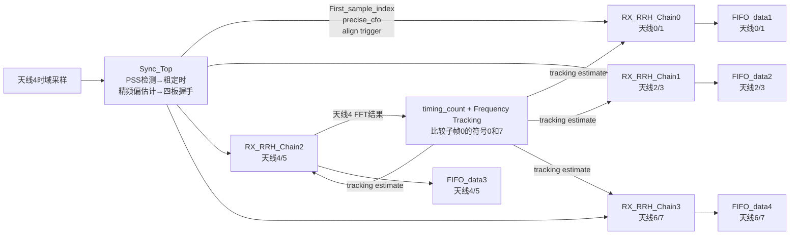
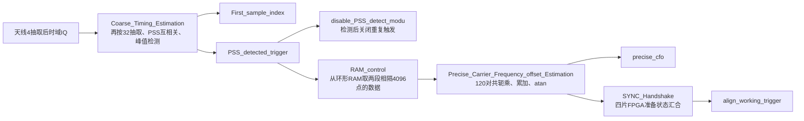
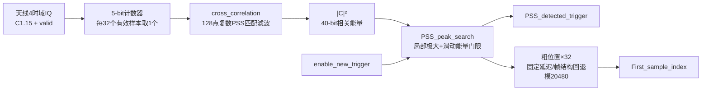
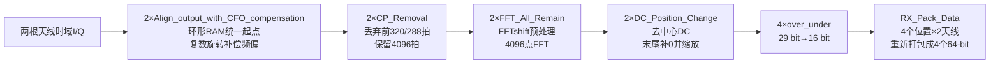

# RX_RRH_Processor学习

> 所属层级：`MIMO_RX_Top`第一个直接处理模块。
>
> 总索引：[MIMO_RX_Top子模块学习索引.md](./MIMO_RX_Top子模块学习索引.md)。

## RX_RRH_Processor顶层

### 实现功能

一句话：用本板天线4完成PSS同步和公共频偏估计，再让本板8根天线使用相同的帧起点及频偏参数，分别完成对齐、频偏补偿、去CP和4096点FFT，最后输出4路天线对64-bit频域数据。

### 输入是什么

```text
data_in_valid                     8根天线公共输入有效
data_in_real_rx0～7               8根天线各自16-bit实部
data_in_imag_rx0～7               8根天线各自16-bit虚部
use_sync_fre                      是否使用PSS得到的精频偏
use_tracking                      是否使用后续频率跟踪结果
WAIT_CYCLE                        四板同步握手等待参数
strobe_upstream/trigger_upstream  板间同步链输入
```

这些输入在`MIMO_RX_Top`中已被描述为“降采样后的数据”，所以本模块不负责最前面的ADC过采样率降采样。

### 中间实际做哪几步



主数据路径为：

```text
8路时域复数采样
→ 环形RAM按统一First_sample_index对齐
→ 精频偏/跟踪频偏旋转补偿
→ 去掉320/288点CP
→ 每根天线4096点FFT
→ 去中间DC并把空位补到末尾、按scale_factor缩放
→ 每两根天线重新打包成一路64-bit流
```

### 输出是什么

```text
ready_for_input                 上游送样节拍许可
data_out_valid                  四个天线对输出的公共有效，实际取自Chain2
FIFO_data1[63:0]                天线0/1频域数据
FIFO_data2[63:0]                天线2/3频域数据
FIFO_data3[63:0]                天线4/5频域数据
FIFO_data4[63:0]                天线6/7频域数据
precise_cfo                     PSS精频偏估计
frequency_track_result          后续频率跟踪估计
strobe_for_downstream           板间同步级联状态
all_ready_trigger               四片板全部准备好后的统一对齐触发
```

每个64-bit输出每拍包含两个32-bit复数，但`RX_Pack_Data`会把“同一位置两个天线并行”的FFT输出改回发射端MIMO/RRH接口习惯的天线优先小块顺序。

## 输入时域采样从哪里来

`RX_RRH_Processor`看到的八路 `data_in_real/imag_rx0~7` 不是直接产生的测试数据，也不是FFT后的子载波，而是射频接收链输出并完成前置抽取后的复数基带时域采样。

```text
8根接收天线上的模拟射频信号
→ 射频前端下变频为I/Q
→ 两块FMC射频板的8路ADC复数通道
→ Down_Sample_Group：I/Q分别低通滤波、4倍抽取、饱和量化为1.15
→ 两个128-bit异步FIFO：FMC1承载天线0~3，FMC2承载天线4~7
→ 跨到clk_baseband时钟域
→ data_in_real/imag_rx0~7
```

在同一有效拍 `n`，第 `m` 根天线的数据可写成 `r_m[n]=I_m[n]+jQ_m[n]`。这是某个时间点的波形采样，其中叠加了全部占用子载波、全部发射Layer经无线信道后的结果；只有经过4096点FFT后才会展开为各个频域子载波。

射频接口映射为：FMC1四个ADC复通道对应天线0~3，FMC2四个ADC复通道对应天线4~7。两组数据分别进入异步FIFO，控制逻辑只在两个FIFO都非空且接收机允许输入时同时读取。顶层的 `data_in_valid` 取自FMC1 FIFO的valid，FMC2 valid未接出，因此设计依赖两只FIFO始终同步读取。

代码核查发现 `Down_Sample_Group.v` 中天线2实部截位器的输入写成了 `low_pass_imag1`，而不是按命名应有的 `low_pass_real2`；这是高度疑似的拷贝错误，需用仿真或ILA确认并修正。

## 为什么只用天线4同步

PSS、无线帧起点和收发本振频差对于同一块板上的八路接收通道基本是公共量，所以没有必要复制八套PSS相关器和频偏估计器。工程固定选择天线4作为参考通道，得到一份 `First_sample_index` 和 `precise_cfo`，再共享给四条 `RX_RRH_Chain` 的八根天线，可明显节省FIR相关器、复乘、RAM、累加器和反正切IP资源。

RTL只证明“天线4被硬连为参考”，没有注释或选择逻辑证明天线4在算法上天然优于其他天线。它同时是FMC2的第一个ADC复通道、Chain2的第一根天线，也是残余频偏跟踪所使用的通道。理论上天线0~7任一信噪比良好的通道都可作为参考；若天线4衰落、断路或饱和，即使其他天线仍能收到PSS，全板同步也可能失败。更稳健的实现可按功率/SNR选择参考天线，或多天线并行相关后合并峰值，但本工程没有实现。

## Sync_Top

### 一句话功能

`Sync_Top`从参考天线4的连续时域IQ中找到PSS，反推出无线帧第一采样点在环形RAM中的地址；随后利用CP和符号末尾相隔4096点的重复样本估计初始频偏，最后等待四片FPGA均准备好，产生统一的 `align_working_trigger`。

### 完整数据流



### Coarse_Timing_Estimation

一句话：它在天线4的时域IQ中低成本搜索本地PSS，找到峰值后输出一次检测脉冲，并把粗峰位置换算成后级对齐RAM使用的无线帧起点地址。

| 端口 | 方向/位宽 | 实际含义 |
|---|---|---|
| `clk`、`rst_n` | 输入 | 基带时钟和低有效复位 |
| `data_in_real/imag[15:0]` | 输入 | 参考天线4的C1.15时域复数采样 |
| `data_in_valid` | 输入 | 本拍IQ是否是一个新样本 |
| `enable_new_trigger` | 输入 | 是否允许当前检测结果产生新的PSS触发；不停止相关运算，只封锁最终触发 |
| `PSS_detected_trigger` | 输出 | 检测成功后产生的单时钟脉冲 |
| `First_sample_index[14:0]` | 输出 | 根据粗峰回退得到的帧第一采样点环形地址，检测间隙保持上一次结果 |



输入是天线4的 `I/Q + data_in_valid`。实际RTL用5-bit计数器在每32个有效样本中保留1个样本，再送入 `cross_correlation`。这一级抽取只为降低PSS搜索运算量，不会替代主数据链；八路原始抽取后数据仍会写入后续对齐RAM。

5-bit计数器只在`data_in_valid=1`时加一并自然从31回到0；`counter==0`时产生`valid_dec32`。IQ本身先延迟1拍与该valid对齐。这里没有抗混叠低通FIR：它不是重建业务波形，而是用与32倍稀疏采样相匹配的128点本地PSS做低复杂度粗搜索，因此时间分辨率也只有32个原输入样本；精确输出地址依赖后面的固定回退修正。

32倍抽取不会把整段PSS跳过。PSS有效时域部分约有4096个原采样，而抽取间隔只有32，所以无论PSS从全局序列的哪个采样开始，PSS区间内都会留下约`4096/32=128`个抽取点。真正变化的是“抽取相位”：若抽取器固定选择全局`x0,x32,x64...`，而PSS从`x13`开始，则落入PSS的抽取点为全局`x32,x64,x96...`，相对于PSS自身是`PSS[19],PSS[51],PSS[83]...`，而本地参考可能按`PSS[0],PSS[32],PSS[64]...`生成。它们仍是同一PSS，只相差0~31个原采样的起始相位；结果是不会漏掉整个PSS，但粗定时只能分辨到32点，并可能因相位不一致降低相关峰。严重频偏、多径、低SNR或直接抽取引入的混叠会进一步降低检测裕量；更稳健方案是减小抽取倍数、并行搜索多个抽取相位或多天线合并相关能量。

`cross_correlation`内部有两只带本地PSS系数的FIR IP，组合得到复相关结果：

```text
C[k] = Σ r[k+n] · pss*[n]
magnitude[k] = Re{C[k]}² + Im{C[k]}²
```

当接收窗口与本地PSS对齐时，各项相位一致叠加，`magnitude`出现明显峰值；未对齐时正负相互抵消。代码随后量化相关实虚部、分别平方并相加，输出40-bit非负相关能量。

两只FIR的输入完全相同是有意设计：输入32-bit总线为`{Q,I}`，每只FIR配置`Number_Paths=2`，会用自己的一套系数同时滤波I、Q两条path；`R_part`装PSS实部系数，`Q_part`装PSS虚部系数。令`A=ΣI·P_R`、`B=ΣQ·P_R`、`C=ΣI·P_I`、`D=ΣQ·P_I`，则大致有`R_lower=A`、`R_upper=B`、`Q_lower=C`、`Q_upper=D`。代码组合为`corr_real=A+D`、`corr_imag=C-B`；标准`r·p*`虚部为`B-C`，所以当前虚部整体差一个负号，但`(C-B)^2=(B-C)^2`，最终模平方不受影响。如果以后要使用相关相位而不只是峰值，这个符号必须重新确认。

`uncliped_magnitude`并不是对原始IQ直接求功率，而是24-bit量化相关分量的48-bit模平方：`uncliped_magnitude=clip(C_R)^2+clip(C_I)^2`。它表示“当前128点接收窗口与本地PSS的匹配能量”；未匹配时接近背景，对齐时形成峰值。名称中的`uncliped`只表示尚未经过最后一次`round_half_up #(48,8)`去掉8个低位，最终输出`magnitude_out[39:0]`是它舍入后的40-bit版本。

`MUL_I24_I24`没有valid或CE端口，配置为4级流水线，因此每个时钟都接受当拍A/B，并在4拍后从P输出乘积；无效期间也会计算，只是结果不应使用。模块用FIR的`Q_part_out_valid`作为起点，按实际数据路径手工对齐：1拍组合/寄存相关实虚部、1拍`round_half_up`、4拍乘法器、1拍平方和寄存、1拍最终舍入，共8拍，所以`delay_1 #(8)`产生`magnitude_out_valid`。若FIR valid在第n拍有效，则相关寄存在n+1、24-bit分量在n+2、平方在n+6、`uncliped_magnitude`在n+7、最终`magnitude_out`及其valid在n+8。若重新生成乘法IP改变流水级数，8拍valid延迟也必须同步修改，否则数值与valid会错位。

相关运算中存在负数：输入I/Q与PSS实虚部系数均为二进制补码。两个FIR IP明确配置为16-bit `Signed`数据、16-bit `Signed`系数、128 taps、37-bit `Full_Precision`输出；相关实部和虚部都可能为负。后级 `MUL_I24_I24`也明确配置为24×24 bit `Signed`、48-bit全宽输出，因此负相关分量与自身相乘可正确得到正数。

位宽保护不是全链饱和保护。FIR内部乘加由Full Precision输出保留增长位；37-bit相关分量经`round_half_up #(37,13)`舍去13个低位，得到24-bit分量，这一步是舍入而非饱和。单个24×24有符号乘法用48 bit能完整容纳；但两个48-bit平方结果仍只写入48-bit `uncliped_magnitude`，从纯位宽最坏情况看，加法本应可能需要第49位。当前实现依靠归一化系数和C1.15输入范围避免该进位：XCI中两组128个系数的绝对值和约为0.322和0.279，故相关实/虚分量的保守幅度约小于0.601，二者平方和约小于0.723。若输入范围、系数或缩放改变，现有加法会回绕而不会自动饱和，仿真应检查最高位和溢出断言。

FIR按流方式工作，不等待凑齐一组后才一次性卷积。每当AXI-Stream输入样本被接受（严格条件为`s_axis_data_tvalid && s_axis_data_tready`），内部128级样本历史窗口前移一格，并为这个新窗口启动一次128项点积；填满最初128个有效样本后，随后每接受一个新样本就对应产生一个新相关结果。无效时钟只是没有新样本，不是向FIR输入数值0。IP经过固定流水线延迟后用`m_axis_data_tvalid`指出哪一拍结果有效；本模块取`Q_part_out_valid`作为两路FIR共同有效，再延迟8拍形成`magnitude_out_valid`。代码未使用输入`tready`，依赖当前稀疏valid和IP配置保证它始终能接收；更稳健的设计应检查`tready`或加入断言。

本模块只有两个直接子模块：`cross_correlation`负责把每个候选位置变成相关能量，`PSS_peak_search`负责从连续相关能量中确认峰值并计算地址。前者内部包含两只128-tap FIR、两次舍入、两只24×24乘法器和平方和；后者内部包含`delay_en`历史队列和模640的`Mod_N_Indexer`。

### PSS_peak_search

一句话：它把连续到来的40-bit PSS相关能量排成一个近似以候选点为中心的滑动窗口，在线判断候选点是否既是局部最大值又显著高于背景；成功后输出单拍触发，并把粗相关位置换算成后级环形RAM使用的帧起点地址。

| 端口 | 方向/位宽 | 含义 |
|---|---|---|
| `magnitude_in[39:0]` | 输入 | `cross_correlation`输出的非负相关模平方 |
| `magnitude_valid` | 输入 | 本拍是否有一个新的相关能量；历史队列和位置计数只在它为1时前进 |
| `enable_new_trigger` | 输入 | 是否允许当前候选峰形成新的检测触发 |
| `PSS_detected_trigger` | 输出 | 检测成功后的单时钟脉冲 |
| `First_sample_index[14:0]` | 输出 | 从粗峰位置回退得到的0~20479环形起点地址，未检测时保持上次值 |

```text
magnitude流
  → 历史延时跨度两端共255个点，滑动和实际包含254个点
  → 取中心左右邻点做局部极大判断
  → 滑动总能量做自适应背景门限
  → enable_new_trigger门控
  → PSS_detected_trigger
  → 粗位置×32并做固定回退/模20480
  → First_sample_index
```

它不是简单判断“相关值大于固定常数”，而是保存一段相关能量历史：中心值需不小于左右相邻值，并满足 `center_value × 8 > sum_energy`。按延时级数精确展开，稳定后的滑动和实际含254个能量点，因此条件为中心峰值大于这254点平均值的 `254/8=31.75` 倍；源码注释将其近似写成 `256/8=32` 倍。再与 `enable_new_trigger`相与形成单拍 `PSS_detected_trigger`。

这些历史点由 `delay_en` 的宽移位寄存器保存，不是提前读取未来数据。每个相关值宽40 bit；当 `magnitude_valid=1` 时，新值从低端装入，原有值整体移动一个40-bit位置；无效周期整条队列保持不动。完整链从`magnitude_in`到`oldest_value`共有255级40-bit寄存器，约 `255×40=10200 bit`；相对于`newest_value`，`oldest_value`落后254个有效点。在最新值为 `M[t]` 的判断时刻：

```text
newest_value    = M[t]
value_delay_126 = M[t-126]   中心点右侧/时间较新的相邻点
center_value    = M[t-127]   当前判断的候选峰
value_delay_128 = M[t-128]   中心点左侧/时间较旧的相邻点
oldest_value    = M[t-254]
```

因此必须等 `M[t-126]` 到达以后，才能回头判断 `M[t-127]` 是否同时大于左右邻点。更新式 `sum_energy = sum_energy + M[t] - M[t-254]` 会在稳定后保留 `M[t-253]` 到 `M[t]`，即254个点；`M[t-254]`只是被减掉的离窗点，不在更新后的总和中。相对于中心`M[t-127]`，总和包含126个更早点、中心本身和127个更晚点。局部最大判断仍然只使用`M[t-128]、M[t-127]、M[t-126]`三个点，两者用途不同。Vivado最终可能根据综合设置用触发器或级联SRL实现历史队列，实际资源类型应查看综合报告。

模块用0~639计数记录当前32倍抽取后的相关位置，再乘32还原成原采样地址，并结合固定回退量和 `FFT_advance_timing=24`，按20480深度取模得到 `First_sample_index`。这里的32来自5-bit抽取计数器：相邻两个相关窗口的起点相隔一个抽取点，即32个原始有效采样；但每个相关值本身使用128个抽取点，覆盖约`128×32=4096`个原始采样，不能理解成“一个相关值只计算32个点”。20480来自同步对齐链共同采用的环形IQ RAM地址周期：`PSS_peak_search`定义`RAM_DEPTH=20480`，`Align_output_with_CFO_compensation`也使用`MAX_RAM_ADDR=20479`并在下一点回到0。于是同一环形周期在粗相关域有`20480/32=640`个位置，`data_in_index`按0~639循环。20480数值上等于`5×4096`，但它不是一个RB、OFDM符号、子帧或无线帧的长度；源码没有可靠注释完整说明为何最终选择5个FFT长度作为缓存深度，且旧注释残留30720说法，因此应把它视为当前RAM实现参数，并用仿真核实缓存余量。

地址公式最直观的理解是“环形指针向前回退”：令`A=data_in_index×32`为检测时的粗原采样地址，则目标地址为`A-17280-24`；如果结果小于0，就加一圈20480。`CONST2=3200`只是把回绕写得省资源，因为`20480-17280=3200`，不是另一段信号长度。例如`A=18000`时输出`696`；`A=1000`时先得到负数，绕一圈后输出`4176`。`17280`很可能代表从帧起点到PSS相关参考点的固定帧内距离，它恰好等于`4416+4384+4384+4096`：符号0长度`4096+320`、符号1和2各`4096+288`，再加符号3中的4096点PSS主体；`24`则让后级FFT读取点比名义边界提前24个采样。但峰值搜索还引入约127个粗相关点的历史延迟，旧注释也存在不一致，因此这个分解只能说明设计意图，尚不能证明所有相关器/valid/RAM延迟均已正确补偿，仍需用已知PSS位置仿真核实最终起点。

### disable_PSS_detect_modu

一句话：它不搜索PSS，只在一次PSS已经找到以后启动两个独立定时器——短定时器暂时关闭新的PSS触发，长定时器标记当前处于接收时间段。

#### 输入、处理和输出

| 信号 | 方向 | 直接含义 |
|---|---|---|
| `clk` | 输入 | 两个计数器工作的时钟 |
| `rst_n` | 输入 | 低有效同步复位 |
| `PSS_trigger` | 输入 | 上游 `PSS_peak_search` 找到PSS后给出的触发脉冲 |
| `enable_PSS_detect` | 输出 | 1允许产生新的PSS检测结果，0暂时禁止 |
| `RX_no_receiving` | 输出 | 1表示当前不在接收窗口，0表示当前处于接收窗口；它不是“接收有效”信号 |

模块内部实际只有两条互不影响的计数路径：

```text
PSS_trigger
   ├─→ state + disable_cnt ─→ enable_PSS_detect = !state
   │      找到PSS后关闭重复触发一段时间
   │
   └─→ RX_state + RX_cnt ──→ RX_no_receiving = !(RX_state || PSS_trigger)
          找到PSS后把系统标成“正在接收”一段更长时间
```

第一条路径中，空闲时 `state=0`，所以 `enable_PSS_detect=1`。采到一次 `PSS_trigger` 后，`state`置1、`disable_cnt`从0开始增加，此时 `enable_PSS_detect=0`。计数结束后 `state`回到0，重新允许 `PSS_peak_search` 上报新的峰值。参数为：

```verilog
disable_length = 245760 - 10000 = 235760;
```

第二条路径中，未开始接收时 `RX_state=0`，所以 `RX_no_receiving=1`。`PSS_trigger`到来后，`RX_state`置1、`RX_cnt`开始计数，此时 `RX_no_receiving=0`；长计数结束才重新变成1。参数为：

```verilog
RX_timing = 2457600 - 60000 = 2397600;
```

`RX_no_receiving`的组合逻辑中特意加入了 `PSS_trigger`：

```verilog
assign RX_no_receiving = !(RX_state || PSS_trigger);
```

因此在PSS脉冲出现的当拍，它就能立刻拉低，不必再等 `RX_state` 寄存一拍。相反，`enable_PSS_detect`只由寄存器 `state`反相得到，是检测结果反馈回峰值搜索器的“防重复触发门”。当前 `Sync_Top`把外部禁止输入 `disable_PSS_outside`固定为0，所以 `enable_new_trigger`主要受这条反馈控制；相关器本身仍持续运算，本模块只是阻止峰值再次变成有效PSS触发，并不关闭前面的FIR、乘法器或相关运算。

#### 直观时序

```text
时刻                 检测前     PSS到来       短禁止期结束        长接收期结束
PSS_trigger             0          1                0                  0
enable_PSS_detect       1       →  0  ───────────→  1                  1
RX_no_receiving         1       →  0  ─────────────────────────────→  1
含义                  搜索PSS     已找到       可再次搜索PSS       接收窗口结束
```

按照源码注释的设计尺度，`245760 = 61440×4`表示一个子帧对应的时钟数，`2457600=10×245760`表示十个子帧。若本模块 `clk`确为245.76 MHz，则它们名义上分别对应1 ms和10 ms；但实际工程时钟必须再沿顶层约束核实，不能只凭常数换算。

#### 关键代码风险和待验证项

1. 两个结束条件都写成 `counter > length`，不是 `>=`。触发当拍计数器又被置0，因此从触发采样到状态释放，短路径实际约为 `235762`个时钟，长路径约为 `2397602`个时钟，比参数字面值多2拍。如果系统要求精确边界，应通过仿真确认作者是否有意补偿其他流水线延迟。
2. 注释写的是 `245760*number_of_subframe-10000`，实际代码却只有 `245760-10000`。也就是说，禁止重复检测的时间接近一个子帧，而不是完整无线帧；这是有意提前重新打开搜索，还是漏乘子帧数，源码本身无法证明，属于待验证项。
3. `RX_no_receiving`是低有效的“正在接收”表示：0才是接收窗口内，信号名很容易被反着理解。
4. 常数把帧长和时钟比例写死了；时钟频率、采样率或帧结构改变时，这两个定时器必须同步修改。
5. 模块假设 `PSS_trigger`通常是单拍脉冲，没有单独做上升沿检测。如果输入长时间保持1，定时器释放后可能再次被启动。

### RAM_control与Read_RAM_for_PCFO

`RAM_control`把输入IQ延迟85拍，与粗同步检测延时对齐，然后连续写入深度 `2×4096+320=8512` 的环形RAM。PSS触发到来时锁存当前写地址并暂停覆盖，`Read_RAM_for_PCFO`产生240个交错读地址：

#### 一句话作用

它像一台只保留最近8512个有效IQ样本的循环录像机：平时持续写，检测到PSS后锁住时间基准并停止覆盖，再回放CP中间和有效符号尾部两段相隔4096点的数据，供精频偏估计使用。

#### 输入与输出

| 端口 | 含义 |
|---|---|
| `data_in_real/imag[15:0]` | C1.15时域复数采样；写RAM时打包为`{imag,real}`共32 bit |
| `data_in_valid` | 本拍是否有一个新的有效IQ样本；环形地址只在它有效时前进 |
| `PSS_detected_trigger` | 粗定时找到PSS后的单拍触发 |
| `data_out_real/imag[15:0]` | 从同步小RAM回读的精频偏估计样本 |
| `data_out_valid` | 回读数据有效；实际连续240拍 |

#### 实际数据流

```text
输入IQ+valid
    │
    ├─延迟85个基带时钟──> 写端口A：连续写8512深度环形RAM
    │
PSS_detected_trigger
    ├─锁存basic_index
    ├─置位disable_store_data，暂时关闭写使能
    └─延迟1拍触发Read_RAM_for_PCFO
                              │
                              ├─生成240个交错地址
                              ▼
                    读端口B：early0,late0,...,early119,late119
                              │
                              └─最后一个读数到达后清除禁止写入，恢复存储
```

`MAX_ADDR=FFT_LENGTH×2+CP_LENGTH1=4096×2+320=8512`。这块RAM保存两个4096点有效符号再加一个长CP的历史跨度。`Mod_N_Indexer`的范围是0～8511，只有`data_in_valid_delay=1`才加一，因此这里的地址单位是“有效复数采样点”，不是基带时钟拍。

PSS触发期间只关闭 `w_addr_valid`，没有停止 `mod_index`。也就是说RAM暂停覆盖，但时间地址仍随有效输入继续前进；读完恢复写入时，新数据仍写到与真实连续时间对应的位置，不会把暂停期间的时间轴压缩掉。精频偏读取使用的是触发时锁存的 `basic_index`，所以不受随后继续前进的 `mod_index`影响。

#### Read_RAM_for_PCFO如何产生240拍

`PULSE_TO_STROBE_U16`把单拍`trigger`变成长度为240拍的`working`，同时给出`add_index=0～239`。`add_index[0]`区分一对数据中的前后两个样本，`add_index[14:1]`等于对号`n=0～119`：

```text
add_index=2n   ：addr = basic_index + n + 151
add_index=2n+1 ：addr = basic_index + n + 4247
```

因此输出顺序为：

```text
第0拍：第一段样本0
第1拍：第二段样本0 = 第一段地址 + 4096
第2拍：第一段样本1
第3拍：第二段样本1 = 第一段地址 + 4096
...
共120对、240拍
```

这两段分别取自CP中的一段和OFDM有效符号末尾的对应一段。由于CP复制自符号尾部，在没有频偏时两段应相同；存在频偏时，两段之间会多出固定相位旋转。

常数151和4247不是两个随意选取的RAM位置，而是负偏移在8512深度环形地址中的正数写法：

```text
151  = (31 - 8192 - 200) mod 8512
4247 = (31 - 4096 - 200) mod 8512
4247 - 151 = 4096
```

其中31用于补偿粗PSS索引关系，200把取数点提前到CP内部；两式相差4096才是算法核心。按源码注释，起点约在CP结束前220点，连续取120点后，得到长CP中较靠中间的一段，从而避开CP两端附近的定时误差和多径边缘影响。

`addr_pcfo`可能大于8511，但最大不会跨越两个完整RAM深度，所以`RAM_control`中的`r_addr_mod`只需减一次8512即可完成取模。地址生成1拍、`r_addr_mod`寄存1拍、RAM读延迟1拍，总读通路按3拍对齐，因此代码用`delay_1 #(3)`生成`data_out_valid`，并把`last_pcfo`同样延迟3拍后作为`finish`，保证最后一个读数输出后再恢复写RAM。

#### 关键设计假设与风险

1. `basic_index`没有显式复位，但正常流程中先由PSS触发锁存，再在下一拍启动地址生成，因此第一次有效读取前会得到确定值。
2. `dina`没有显式复位，但复位期间`w_addr_valid=0`，不会把未知值写入RAM。
3. 工作期间若再次出现PSS触发，`basic_index`可能被改写；设计依赖`disable_PSS_detect_modu`保证精频偏读取期间不会再触发。
4. `w_addr_mod`对`mod_index>=8512`的判断正常不会成立，因为`Mod_N_Indexer`本身已经在0～8511回绕；这是无害的冗余保护。
5. RAM端口B始终使能，所以无效阶段也会输出某个地址的数据；只有`data_out_valid=1`时的输出才允许后级使用。

### Precise_Carrier_Frequency_offset_Estimation

模块把上述交错流两两配对，对每一对执行复数共轭相乘，并累计120对：

```text
Z = Σ r_early[n] · conj(r_late[n])
phase = atan2(Im{Z}, Re{Z})
precise_cfo = 按4096点间隔换算后的归一化频偏
```

累加120对而不是只用一对，是为了让噪声大致相互抵消。`use_sync_fre=0`不会关闭PSS时间同步，只是在估计完成后把锁存的 `precise_cfo`强制写为0。

代码实际输入精频偏模块的是240拍并完成120次复乘；部分注释仍写“valid持续120拍”或旧的2048点间隔，属于旧参数残留，应以 `Read_RAM_for_PCFO.N=240` 和两地址相差4096的RTL为准。

### SYNC_Handshake

每片FPGA完成本地PSS检测和精频偏估计后，把单拍完成信号拉长为 `WAIT_CYCLE` 拍。多片板的ready窗口沿LVDS级联相与；只有这些窗口发生重叠，才说明四片FPGA都在允许误差范围内完成了同步。最终FPGA0检测汇总ready的上升沿，并把统一触发返回其他板：FPGA0从汇总strobe启动，其余板从返回trigger启动，从而让四片板的八路本地接收链在统一时刻读取各自环形RAM。

### ready_for_input说明

当前代码的3-bit循环寄存器顺序为 `001→100→010→001`，所以 `ready_for_input`实际每3个基带时钟出现1拍，而文件头“每8个时钟”是旧注释。它用于节流上游异步FIFO读取，与PSS检测结果无关。

### 实现功能

一句话：只观察天线4，检测PSS，确定无线帧第一采样点在环形RAM中的位置，估计精频偏，并与另外三片FPGA握手后统一启动8路对齐处理。

### 子模块关系

```text
Coarse_Timing_Estimation
  32倍抽取→与本地PSS互相关→峰值检测
  输出PSS_detected_trigger和First_sample_index

disable_PSS_detect_modu
  检测成功后一段时间禁止重复PSS触发

RAM_control
  PSS检测后从小RAM交错取出240拍数据，组成120对相隔4096点的采样

Precise_Carrier_Frequency_offset_Estimation
  根据上述数据估计precise_cfo

SYNC_Handshake
  四片FPGA通过LVDS级联确认都完成同步
  最后产生统一align_working_trigger
```

`use_sync_fre=0`时，模块仍可完成PSS定时检测，但锁存的精频偏被强制为0。

当前`ready_for_input`由3-bit循环寄存器`001→100→010→001`产生，因此代码表现为每3拍一个脉冲，与源文件“每8拍”注释不一致。

## timing_count

一句话：每检测到一个FFT输出符号起点，就统计`symbol_index=0～13`和`subframe_index=0～9`。

复位初值设为子帧9、符号13，因此第一次符号起点到来后正好变成：

```text
subframe=0，symbol=0
```

该计数只用于频率跟踪控制，不直接改变4路主数据。

## Frequency_Tracking_Control与Frequency_Tracking_Top

### 实现功能

一句话：利用第0子帧中符号0和符号7的相位差，继续估计残余频偏，并把结果反馈给四条接收链。

控制过程：

```text
subframe0/symbol0：去DC后将频域参考数据写入FIFO
subframe0/symbol7：读取FIFO，与当前同位置参考数据比较
→ 共轭相乘、累加、反正切
→ frequency_tracking_estimate
```

设计依据是符号0和7使用相同参考数据；理想信道项基本相同，两者相位差主要反映经过0.5 ms积累的残余频偏。

`use_tracking=0`时，顶层传给四条Chain的跟踪结果被强制为0。

## 4×RX_RRH_Chain

四条结构完全相同，每条处理两根天线：

```text
Chain0：天线0/1
Chain1：天线2/3
Chain2：天线4/5，同时把天线4 FFT结果提供给频率跟踪
Chain3：天线6/7
```

顶层同步和频偏参数由天线4估计后共享给全部8根天线。只有Chain2的`data_out_valid`连接到顶层，设计假定四条链严格同拍。

### Chain内部大图



## Align_output_with_CFO_compensation

一句话：将连续接收采样写进环形RAM；同步完成后从`First_sample_index`开始按符号节拍读出，并根据精频偏和跟踪频偏对每个复数采样做反向旋转。

```text
连续输入采样 → 环形RAM
PSS检测得到First_sample_index
四板握手完成 → 从统一位置开始读
读出样点 × exp(-j·估计频偏对应相位)
→ 对齐且频偏补偿后的符号流
```

两根天线使用两个独立实例，但共享相同起点和频偏，因此保持阵列通道对齐。

## CP_Removal

一句话：不改动样点数值，只修改有效窗口，屏蔽每个OFDM符号开头的CP，留下连续4096个正文采样。

```text
slot内符号0：丢弃320点CP
slot内符号1～6：丢弃288点CP
```

模块使用320/288位移位寄存器延迟valid和symbol_start；数据本身只延迟2拍。源文件部分注释仍残留160/144或2048点旧参数，应以当前RTL常量320/288和宏`FFT_LENGTH=4096`为准。

## FFT_All_Remain

一句话：对去CP后的4096个时域复数进行FFT，得到4096个频域复数。

```text
W_FFTshift预处理
→ FFT_4096 IP
→ 输出29-bit实部和29-bit虚部
```

这一模块明确证明接收端确实执行4096点FFT。FFT IP配置`tvalid`固定为0，代码注释认为IP默认执行FFT而不是IFFT；后续需要核对XCI默认配置或仿真输出方向。

## DC_Position_Change

一句话：从FFT输出中删除位于中心的DC位置，把后半段数据前移，并在4096点输出窗口末尾补0，同时按调试`scale_factor`做左移缩放。

其内部`DC_Removal`删除4096点中的第2049个位置，即零基索引2048；随后模块仍产生4096拍有效，并把最后一拍强制为0，因此完成：

```text
[前2048点, DC, 后2047点]
→ [前2048点, 后2047点, 0]
```

## RX_Pack_Data

一句话：把两根天线逐拍并行的4个连续频率位置，重新变成天线优先的4个64-bit字，正好与发射端`TX_Unpack_Data`相反。

输入顺序：

```text
拍0：[A(k0), B(k0)]
拍1：[A(k1), B(k1)]
拍2：[A(k2), B(k2)]
拍3：[A(k3), B(k3)]
```

输出顺序：

```text
拍0：A(k0), A(k1)
拍1：A(k2), A(k3)
拍2：B(k0), B(k1)
拍3：B(k2), B(k3)
```

每个复数为32 bit，所以每拍输出64 bit。四条Chain并行，最终得到天线01、23、45、67四路相同格式的数据。

## 风险与待验证项

## RX_RRH_Processor完整子模块清单与补充说明

### 模块层次

```text
RX_RRH_Processor
├── Sync_Top                         参考天线4完成PSS定时、初始频偏和四板握手
│   ├── Coarse_Timing_Estimation
│   │   ├── cross_correlation
│   │   └── PSS_peak_search
│   ├── disable_PSS_detect_modu
│   ├── RAM_control
│   │   └── Read_RAM_for_PCFO
│   ├── Precise_Carrier_Frequency_offset_Estimation
│   └── SYNC_Handshake
├── timing_count                     按FFT符号窗口统计子帧0~9、符号0~13
├── Frequency_Tracking_Control       选择天线4的符号0和符号7频域参考数据
├── Frequency_Tracking_Top
│   ├── DC_Removal
│   └── Frequency_Tracking
├── 4×RX_RRH_Chain                   分别处理天线0/1、2/3、4/5、6/7
│   ├── 2×Align_output_with_CFO_compensation
│   │   ├── RAM_for_SYNC_CFO_calculation
│   │   ├── symbol_start_generator
│   │   ├── Compensation_CFO_Calculation
│   │   └── carrier_frequency_shift
│   ├── 2×CP_Removal
│   ├── 2×FFT_All_Remain
│   │   ├── W_FFTshift
│   │   └── FFT_4096
│   ├── 2×DC_Position_Change
│   │   └── DC_Removal
│   ├── 4×over_under
│   └── RX_Pack_Data
│       └── Pack_Subcarrier
└── vio_scale                        仅调试缩放，不属于接收算法主线
```

### Frequency_Tracking_Control：选择哪两个符号

初始`precise_cfo`只能校正同步时刻测到的频偏。接收过程中本振漂移和残余误差仍会积累，因此代码继续使用参考天线4的FFT输出进行频率跟踪。

`timing_count`在每次`data_frequency_valid`上升沿把符号计数加一。控制模块在第0子帧中选择符号0和符号7：符号0数据写入跟踪FIFO，符号7到来时读取符号0同位置数据。两个符号相隔约0.5 ms，使用相同参考内容时，信道项基本相同，剩余相位差主要来自残余频偏。

### Frequency_Tracking：相位差如何变成频偏

设同一频率位置在两个参考符号上的接收值为：

```text
Y0[k] = H[k]·X[k]·exp(jφ0)
Y7[k] = H[k]·X[k]·exp(jφ7)
```

代码对两者共轭相乘并跨有效频率位置累加：

```text
Z = Σ Y0[k]·conj(Y7[k])
  ≈ Σ |H[k]X[k]|² · exp(j(φ0-φ7))
```

随后用反正切求`angle(Z)`，根据0.5 ms间隔换算成归一化残余频偏。使用大量频率位置累加可以降低噪声影响。结果只在`use_tracking=1`时反馈给八根天线的频偏补偿链。

### Align_output_with_CFO_compensation的四步

1. 每根天线的输入时域IQ持续写入20480深度环形RAM。
2. 四板握手完成后，锁存`First_sample_index`并由`symbol_start_generator`产生完整无线帧的140个符号读取窗口。
3. `Compensation_CFO_Calculation`在帧开始锁存`precise_cfo`，第0子帧完成后允许叠加最新`frequency_tracking_estimate`。
4. `carrier_frequency_shift`用DDS生成补偿正余弦，再与IQ复乘，相当于对每个采样执行`r[n]·exp(-j2πf̂n)`。

### CP_Removal的关键点

它没有删除RAM中的数据，而是缩短valid窗口：每个时隙的第一个符号丢320点，其余6个符号丢288点，然后连续输出4096个有效样本。两个天线实例共享同一个符号起点，因此去CP后的4096点严格对齐。

### FFT_All_Remain与DC_Position_Change

`FFT_All_Remain`先通过`W_FFTshift`整理FFT输入顺序，再调用4096点FFT IP，把一个OFDM符号的时域波形变成4096个频域位置。`DC_Position_Change`去掉中心DC位置，把后半段向前移动并在末尾补0，使数据长度仍为4096；这个末尾0会在BIT端由`DC_Recover`反向处理。

### RX_Pack_Data的具体排序

每条Chain同时输入两根天线同一频率位置的数据。先收集4个连续位置：

```text
输入拍0：[A(k0), B(k0)]
输入拍1：[A(k1), B(k1)]
输入拍2：[A(k2), B(k2)]
输入拍3：[A(k3), B(k3)]
```

再输出4个64-bit字：

```text
A(k0),A(k1) → A(k2),A(k3) → B(k0),B(k1) → B(k2),B(k3)
```

四条Chain并行，因此一个4子载波小块最终产生`8根天线×2个U64=16个U64`，交给`RX_RRH_FIFO_Exchange`跨板重排。

1. 同步和频率估计只使用天线4；若该天线信噪比差或失效，会影响全部8路公共同步结果。
2. `data_out_valid`只接Chain2，默认四条链内部延时完全一致。
3. `ready_for_input`注释与代码周期不一致。
4. FFT模式依赖IP默认配置，需核对XCI或仿真。
5. `scale_factor`由VIO调试核控制，默认值和上板配置需要确认。
6. `Align_output_with_CFO_compensation`中RAM深度代码为20480，但部分注释仍写30720，属于旧参数残留，应按有效常量和实际地址范围核对。
