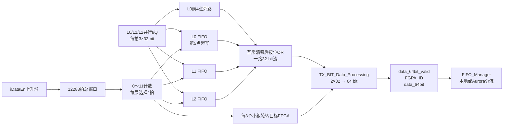

# TX_BIT_FIFO_Exchange

> 所属层级：`MIMO_TX_Top` 直接子模块。
>
> 总索引：[MIMO_TX_Top子模块学习索引.md](./MIMO_TX_Top子模块学习索引.md)。
>
> 上一模块：[TX_BIT_Processor学习.md](./TX_BIT_Processor学习.md)。下一模块：[TX_MIMO_Processor学习.md](./TX_MIMO_Processor学习.md)。

## 先说结论：它就是“整理并分发三层数据”

`TX_BIT_FIFO_Exchange` 不做Turbo编码、不做调制，也不做MIMO矩阵计算。它只完成三件事：

```text
3条layer并行输入
→ 改成1条有固定顺序的串行数据
→ 按RB决定送往哪块FPGA
→ 两个32 bit复数拼成一个64 bit输出
```

### 输入

```text
iCLK、iRSTn：时钟和低有效复位
iDataEn：当前三条layer输入同时有效

Layer0：iL0R[15:0]、iL0I[15:0]
Layer1：iL1R[15:0]、iL1I[15:0]
Layer2：iL2R[15:0]、iL2I[15:0]
```

每条layer的实部和虚部合成一个32 bit复数。因此 `iDataEn=1` 时，每拍同时输入3个32 bit复数，共96 bit。

### 处理

1. 三条layer的数据分别缓存到FIFO；因为输出只有一路，所以必须先保存暂时还不能输出的数据。
2. 把三路数据按 `4个L0 → 4个L1 → 4个L2` 的顺序送到同一条32 bit数据线上，然后继续处理下一组4个频率位置。
3. 连续三组覆盖12个频率位置，即一个RB。模块每处理完一个RB，就按照内部ID表切换目标FPGA，让不同FPGA分别接收自己负责的RB数据。
4. 最后把相邻两个32 bit复数拼成一个64 bit字，以适配后面的 `FIFO_Manager/Aurora` 接口。

Layer0最前4个数据走旁路，只是为了解决“输出一开始就需要Layer0，但FIFO读出有延迟”的时序问题，不是另一种数据算法。

### 输出

```text
data_64bit[63:0]：两个连续的32 bit复数
data_64bit_valid：当前64 bit数据有效
FGPA_ID[1:0]：这批数据的目标FPGA编号；FGPA只是源码拼写错误
```

因此，这个模块的工程功能是：**把本FPGA产生的3层频域复数数据按RB重新排列，并送到负责相应RB的FPGA，为后面的12层汇聚和MIMO处理准备数据。**

### 为什么代码带有明显的LabVIEW风格

从当前仓库能确认的不是“这个Verilog由LabVIEW编译器直接生成”，而是：**哈尔滨工业大学通信技术研究所的开发者以NI LabVIEW Communications中的LTE/MIMO实现为参考，手工把算法和时序改写成Verilog，后来又移植进当前Vivado工程。**

判断依据：

- 多个源码注释直接写着“与LabVIEW中相同”“为了和LabVIEW时序保持一致”；
- `sync_latch.v` 明确说它对应LabVIEW里的 `Synchronous Latch`；
- `PULSE_TO_STROBE_U16`、`Mod_N_Indexer`、大量 `delay_1` 的组织方式很像把LabVIEW FPGA框图中的功能块逐个翻译成RTL；
- `PXSCH_TX_Bit_Processing_Top.v` 等源码头注明哈尔滨工业大学通信技术研究所、开发者张传斌，早期目标器件为 `xc7z100`；
- 当前仓库没有 `.vi`、`.lvproj` 等LabVIEW工程文件，当前Vivado工程目标器件已经是 `xcvu37p`，说明这里保存的是移植后的Verilog工程；
- 模块名称和数据流——TTI Handling、MAC TX、PDSCH Bit Processing、PDCCH/PDSCH FIFO、Index Generator、资源映射和IFFT——与NI官方LTE Application Framework描述高度对应。

因此更准确的来源判断是：

```text
NI LabVIEW Communications System Design Suite
  └─ LTE Application Framework / MIMO Application Framework参考设计
       ↓ 人工按功能和拍级时序翻译
哈尔滨工业大学的Zynq-7100 Verilog版本
       ↓ 再次工程移植
当前Xilinx Virtex UltraScale+ Vivado工程
```

NI官方资料说明，MIMO Application Framework本身就是基于LTE、支持最多12个UE天线的FPGA实时参考设计，并依赖LabVIEW Communications System Design Suite：<https://www.ni.com/en/support/downloads/software-products/download.labview-communications-mimo-application-framework.html>。


## TX_BIT_FIFO_Exchange 顶层

### 实现功能

`TX_BIT_FIFO_Exchange` 位于三个本地 `TX_BIT_Processor` 之后、`FIFO_Manager/Aurora` 之前。它把本FPGA同时产生的3条layer复数流从“每拍3个32-bit并行字”改造成“一路32-bit串行字”，按4个频率位置和12子载波RB重新排序，再把相邻两个32-bit字打包成64 bit，并给出这批数据的目标FPGA编号。

它不是跨时钟FIFO，也不负责MIMO矩阵运算；它负责的是：

```text
三层并行复数流
→ 缓存和并串转换
→ 按4位置×3层重排
→ 按RB轮转目标FPGA
→ 32 bit两两打包成64 bit
→ 交给FIFO_Manager分流到本地回环或Aurora链路
```

在 `MIMO_TX_Top` 中，三个 `TX_BIT_Processor` 分别提供 `symbol_real0/1/2`、`symbol_imag0/1/2`。模块只使用 `symbol_valid0` 作为公共 `iDataEn`，因此默认三条layer严格同步。

### 实现原理解读

#### 1. 输入和输出

每条layer每拍输入一个32-bit复数样点：

```text
L0 = {iL0I[15:0], iL0R[15:0]}
L1 = {iL1I[15:0], iL1R[15:0]}
L2 = {iL2I[15:0], iL2R[15:0]}
```

`iDataEn` 有效时，三条layer同时各产生一个复数样点，相当于每拍进入96 bit。输出接口为：

```text
data_64bit_valid：64-bit输出有效
FGPA_ID：目标FPGA编号；源码端口名把FPGA拼成了FGPA
data_64bit：两个连续32-bit复数样点组成的64-bit字
```

输出进入 `MIMO_Project_Top` 中的 `FIFO_Manager`。`FIFO_Manager` 用目标ID把数据写入四条BIT2MIMO分支：本地loopback或三条Aurora链路。

#### 2. 检测一段4096点输入的开始

```verilog
delay_1 #(1) d0(iCLK,iDataEn,iDataEnd1);
enp <= iDataEn & (~iDataEnd1);
```

`iDataEnd1` 实际是 `iDataEn` 延迟1拍，`enp` 因而是输入有效上升沿脉冲；名字中的 `End` 容易误导，它检测的是开始而不是结束。

`enp` 启动：

```verilog
PULSE_TO_STROBE_U16_delay1 pulse2strobe_4(
    .start_pulse(enp),
    .N(16'd12288),
    .strobe(long_t4)
);
```

一个OFDM变换块每条layer有4096个复数点，三条layer合计：

```text
4096 × 3 = 12288个32-bit复数字
```

所以 `long_t4` 标记整个并串转换输出区。它延迟5拍形成 `oEn`，用于与读取、旁路和 `oData` 寄存器对齐。

#### 3. 为什么Layer0前4个样点走旁路

Layer1、Layer2从第一个有效样点开始全部写FIFO：

```verilog
FIFO1.wr_en = iDataEn;
FIFO2.wr_en = iDataEn;
```

Layer0被拆成两部分：

```verilog
wrL0   = iDataEn & iDataEnd4;     // 第5个有效拍起写FIFO
nrwrL0 = iDataEn & ~iDataEnd4;    // 最前4个有效拍
```

前4个L0样点不写FIFO，而是：

```text
{iL0I,iL0R}
→ oDD3
→ 延迟5拍
→ oD3旁路
```

后续L0样点写入 `FIFO_for_TX_BIT_Buffer0`。第一次 `long_t0` 读取窗口由 `long_t4d6` 屏蔽，不读L0 FIFO，输出来自旁路；后续L0窗口才读FIFO。这样既补偿FIFO读取延迟，也避免最前4个L0样点重复或丢失。

三个 `FIFO_for_TX_BIT_Buffer` 都是32 bit × 4096的同钟Block RAM标准FIFO。它们承担的核心任务是：输入端每拍同时到来3个字，但输出端每拍只能消费1个字，因此必须保存尚未轮到输出的layer数据。

#### 4. 12拍调度：每次输出4个L0、4个L1、4个L2

`cnt0` 在 `long_t4` 期间按0～11循环：

```verilog
flag1 <= (cnt==0) & long_t4;
flag2 <= (cnt==4) & long_t4;
flag3 <= (cnt==8) & long_t4;
```

三个flag进一步变成3个4拍读取窗口：

```text
long_t0：4拍，选择Layer0
long_t1：4拍，选择Layer1
long_t2：4拍，选择Layer2
```

逻辑输出顺序是：

```text
第0～3个位置：  L0[0] L0[1] L0[2] L0[3]
                  L1[0] L1[1] L1[2] L1[3]
                  L2[0] L2[1] L2[2] L2[3]

第4～7个位置：  L0[4]...L0[7]
                  L1[4]...L1[7]
                  L2[4]...L2[7]

第8～11个位置： L0[8]...L0[11]
                  L1[8]...L1[11]
                  L2[8]...L2[11]
```

每4个位置产生12个32-bit字；连续3组覆盖12个子载波，也就是一个RB在本地3条layer上的数据：

```text
12子载波 × 3层 = 36个32-bit字 = 18个64-bit字
```

这里不是“每连续12个任意输入数据就是一个RB”。模块没有输入 `RB_index` 或 `subcarrier_index`，它完全依靠上游数据顺序，假设三条layer每拍同时给出同一个连续位置：

```text
输入第0拍：L0[0]、L1[0]、L2[0]
输入第1拍：L0[1]、L1[1]、L2[1]
...
输入第11拍：L0[11]、L1[11]、L2[11]
```

因此“按RB拆开”的真实含义是：先在每条layer上取连续12个位置，再把三条layer在这12个位置上的数据合在同一个目标块中：

```text
本地RB0：
L0[0..11] + L1[0..11] + L2[0..11]
= 12个位置 × 3层
= 36个复数

本地RB1：
L0[12..23] + L1[12..23] + L2[12..23]
= 36个复数
```

代码为了适配后面的128-bit四复数数据结构，又把一个RB拆成三个4位置小块：

```text
小块A，位置0～3：
L0[0..3] → L1[0..3] → L2[0..3]，共12个复数

小块B，位置4～7：
L0[4..7] → L1[4..7] → L2[4..7]，共12个复数

小块C，位置8～11：
L0[8..11] → L1[8..11] → L2[8..11]，共12个复数

A+B+C才是本FPGA对一个完整RB的贡献，共36个复数。
```

所以 `cnt0=0..11` 的一次循环只输出一个4位置小块；连续三次 `cnt0` 循环才覆盖一个12位置RB，目标FPGA编号在这三个小块期间保持为同一个目的地，然后才切换到下一个RB的目标FPGA。

4096不能被12整除，因此整个块包含341个完整12位置分组，末尾还剩4个位置；代码依靠固定 `long_t4=12288` 精确结束，而不是假设整块一定包含整数个RB。

#### 5. 四路数据为什么能按位OR

```verilog
oD0 = oDD0 & {32{v0}};
oD1 = oDD1 & {32{v1}};
oD2 = oDD2 & {32{v2}};
oData <= oD0 | oD1 | oD2 | oD3;
```

`oD0/oD1/oD2` 只有对应FIFO输出 `valid` 时非零，`oD3` 只在最前4个L0旁路样点时非零。正常调度下四路互斥，所以按位OR等价于四选一MUX。若读取窗口错位导致两路同时非零，OR会破坏数据。

#### 6. 目标FPGA如何轮转

`cntt1` 在稳定运行时按1、2、3循环，用来统计三个“4位置小组”；每完成三组，`cntt2` 加1。也就是目标ID按12个频率位置的数据块轮转。

代码中的ID查找表为：

```text
cntt2=0 → fpga=2
cntt2=1 → fpga=1
cntt2=2 → fpga=3
cntt2=3 → fpga=0
```

随后循环。对当前编译参数 `FPGA_ID=3`，`FIFO_Manager` 将ID解释为：

```text
ID=3：本地loopback
ID=0：Aurora0
ID=1：Aurora1
ID=2：Aurora2
```

上面的表是 `cntt2` 寄存器状态到ID的原始case表，不能直接把状态0当成全局RB0。状态0还承担启动对齐；进入完整RB轮转后，有效的系统级顺序是：

```text
全局数据块RB0 → FPGA1
全局数据块RB1 → FPGA3
全局数据块RB2 → FPGA0
全局数据块RB3 → FPGA2
随后每4个RB重复
```

也就是：

```text
RB mod 4 = 0 → FPGA1
RB mod 4 = 1 → FPGA3
RB mod 4 = 2 → FPGA0
RB mod 4 = 3 → FPGA2
```

这个有效分配同时得到两处系统逻辑的交叉验证：`MIMO_Parameter.vh` 注明FPGA0、2各处理85个块，FPGA1、3各处理86个块；4096个位置一共形成342个12位置块，最后一个全局块RB341只剩4个位置，而 `MIMO_Processor_Payload_Reader` 正好只对 `FPGA_ID=3` 的本地最后一块启用12字特殊读取。因此功能级RB归属已经可以确定；第一个64-bit字在具体哪个时钟切换ID，仍可用波形做拍级确认。

#### 7. TX_BIT_Data_Processing如何打包64 bit

该子模块用1-bit计数器把相邻两个有效32-bit字组成一个64-bit字：

```verilog
data_64bit <= counter ? {data_32bit,data_32bit_delay1} : 64'd0;
```

所以：

```text
data_64bit[31:0]  = 前一个32-bit复数样点
data_64bit[63:32] = 当前32-bit复数样点
```

输出有效每两个32-bit有效拍出现一次。由于12288、每个目标块36和末尾12都是偶数，正常情况下不会把一对64-bit数据拆到两个目标FPGA。

总数量闭合：

```text
输入：4096拍 × 3个32-bit字/拍 = 12288个32-bit字
输出：12288 / 2 = 6144个64-bit字
```

### 子模块关系图



### 关键代码解读

最应该先观察的信号分为四组：

```text
输入块开始：iDataEn、iDataEnd1、enp、long_t4、oEn
层调度：cnt、imp0/1/2、long_t0/1/2、rdL0/1/2
数据：oD3、oD0/1/2、oData
路由打包：cntt1、cntt2、fpga、oFpga、data_64bit_valid、FGPA_ID、data_64bit
```

一个最小仿真可以让L0、L1、L2输入明显不同的递增序列，例如：

```text
L0[n] = 0x0...n
L1[n] = 0x1...n
L2[n] = 0x2...n
```

然后验证32-bit `oData` 是否按 `L0[0..3]、L1[0..3]、L2[0..3]、L0[4..7]...` 输出，64-bit是否低半字在前、高半字在后，目标ID是否只在36个32-bit字/18个64-bit字的边界切换。

### 讨论问题

1. **为什么不能直接把三层拼成96 bit？** 下游 `FIFO_Manager/Aurora` 接口按64 bit和目标FPGA分流，MIMO端又按RB汇聚12层，因此这里先完成三层并串重排和路由。
2. **为什么每层一次读4个？** 4个频率位置 × 3条本地layer = 12个32-bit字；连续3组覆盖一个RB的12个子载波，便于后续按RB汇聚和MIMO处理。
3. **为什么L0特殊，L1/L2不旁路？** 输出顺序以L0开始，但FIFO有读取延迟；前4个L0直接延迟输出可以立即启动串行流，其他数据在这段时间已写入FIFO。
4. **这个模块是否跨时钟？** 否。输入、三个内部FIFO、调度器和64-bit打包都使用 `iCLK`；真正跨板/链路处理在后级 `FIFO_Manager/Aurora`。
5. **目标FPGA顺序是否已经完全确认？** case表为2、1、3、0并循环，稳定切换周期为一个12子载波块；第一个外部有效字受多级流水影响，仍应通过仿真确认起始相位。
6. **FIFO安全吗？** 三个FIFO的 `full/empty` 都没有参与控制，输出总valid也不检查三路数据是否确实齐备，依赖固定4096点输入和既定调度；异常断流可能导致零值、层错位或跨RB错位。
7. **代码中是否有无效逻辑？** `long_t3 → sync_latch → out` 的结果未被后续使用，`Fpga1`、`long_t4d4` 等声明也未形成有效数据路径；`flag0` 仅进入case默认分支。这些遗留信号增加了阅读难度。
8. **`FGPA_ID`是什么意思？** 只是源码拼写错误，语义仍是目标 `FPGA_ID`。
