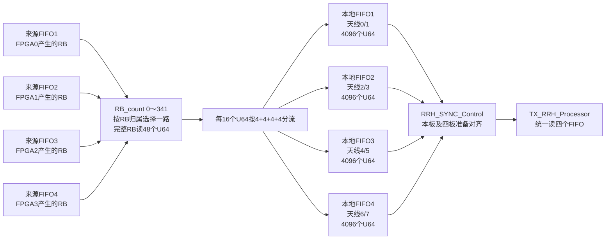

# TX_RRH_FIFO_Exchange

> 所属层级：`MIMO_TX_Top` 直接子模块。
>
> 总索引：[MIMO_TX_Top子模块学习索引.md](./MIMO_TX_Top子模块学习索引.md)。
>
> 上一模块：[TX_MIMO_Processor学习.md](./TX_MIMO_Processor学习.md)。下一模块：[TX_RRH_Processor学习.md](./TX_RRH_Processor学习.md)。


## TX_RRH_FIFO_Exchange 顶层

### 实现功能

一句话：它把四个来源FPGA送来的、按“RB归属”分散存放的数据，按照全局RB顺序取回来，再重新写成四个“本地天线对”FIFO：天线01、23、45、67。

```text
交换前：按哪个MIMO处理器产生这个RB来存放
交换后：按本地哪一对天线来存放
```

它不做调制、预编码、滤波或数值运算，只做FIFO选择、读取节拍、数据重排和整帧同步。

### 实现原理解读

#### 输入是什么

四路外部MIMO→RRH FIFO分别对应数据的来源FPGA：

```text
MIMO_FIFO_count1～4  四路FIFO各有多少个U64可读
FIFO1～4_valid       当前选中FIFO返回的数据是否有效
FIFO1～4_data[63:0]  当前返回的U64数据
```

同一个本地FPGA最终只负责8根天线。对于一个完整12位置内部RB块，该FPGA需要接收：

```text
8根天线 × 12个位置
= 96个复数

每个U64装2个复数：
96 ÷ 2 = 48个U64
```

所以每个完整RB从某一路来源FIFO连续读取48拍；最后只有4个位置的不完整块读取：

```text
8根天线 × 4个位置 ÷ 每个U64的2个复数
= 16个U64
```

另外还有：

```text
read_FIFO_req
```

它来自后面的 `TX_RRH_Processor`，用于同时读取重排完成后的四个本地天线对FIFO。

#### 中间实际只做哪几步

##### 第一步：按照全局RB编号选择来源FIFO

四块FPGA不是都处理同一个RB，而是各自负责不同RB。模块用 `RB_count=0～341`恢复全局RB顺序：

| 全局内部RB | 负责产生它的FPGA | 本模块读取的来源FIFO |
|---|---|---|
| `RB mod 4 = 0` | FPGA1 | FIFO2 |
| `RB mod 4 = 1` | FPGA3 | FIFO4 |
| `RB mod 4 = 2` | FPGA0 | FIFO1 |
| `RB mod 4 = 3` | FPGA2 | FIFO3 |

例如：

```text
RB0  从FIFO2读48个U64
RB1  从FIFO4读48个U64
RB2  从FIFO1读48个U64
RB3  从FIFO3读48个U64
RB4  再从FIFO2读48个U64
```

模块只在目标FIFO至少有48个U64时启动读取；全局最后的RB341只要求FIFO4有16个U64。内部0～49计数器每50拍安排一次是否可以启动下一段读取的判决，数据不足时 `RB_count`停在当前RB等待。

##### 第二步：选中四路返回数据中的一路

四路valid按设计不会同时有效。代码根据谁的valid为1，将对应64-bit数据送入统一的 `write_data`：

```text
FIFO1_valid → FIFO1_data
FIFO2_valid → FIFO2_data
FIFO3_valid → FIFO3_data
FIFO4_valid → FIFO4_data
```

##### 第三步：每16个U64完成一次四位置子矩阵重排

一个四位置子矩阵在本地8根天线上的数据量为：

```text
8根天线 × 4个位置 ÷ 每个U64装2个复数
= 16个U64
```

这16个输入字按天线顺序到达，模块每4个字切换一个输出FIFO：

```text
输入第0～3个U64   → 本地FIFO1，天线0/1
输入第4～7个U64   → 本地FIFO2，天线2/3
输入第8～11个U64  → 本地FIFO3，天线4/5
输入第12～15个U64 → 本地FIFO4，天线6/7
```

随后 `counter_valid`自然回到0，对位置4～7和位置8～11重复同样分配。因此一个完整RB的48个U64被写成：

```text
本地FIFO1：天线0/1，共12个U64
本地FIFO2：天线2/3，共12个U64
本地FIFO3：天线4/5，共12个U64
本地FIFO4：天线6/7，共12个U64
```

##### 第四步：等四个本地天线对FIFO和四片FPGA都准备好

每个本地输出FIFO达到4096个U64时，说明一个4096位置块对应的这对天线数据已经收齐：

```text
341个完整块 × 每块12个U64 + 最后块4个U64
= 4096个U64
```

四个本地FIFO都达到4096后，`RRH_SYNC_Control`再结合板间充足信号，确认四块FPGA都准备完成。只有全系统对齐后：

```text
total_number = 16384 = 4 × 4096
```

后级 `TX_RRH_Processor`看到数据充足，产生统一的 `read_FIFO_req`，四个本地FIFO同时读出，保证8根天线同步。

### 子模块关系图



### 输出是什么

读上游四个来源FIFO：

```text
read_FIFO1～4
```

其中每次只有与当前 `RB_count`对应的一路有效。

交给后级RRH处理的数据：

```text
FIFO1_data_out → 天线0/1的数据流
FIFO2_data_out → 天线2/3的数据流
FIFO3_data_out → 天线4/5的数据流
FIFO4_data_out → 天线6/7的数据流
```

容量与跨板同步输出：

```text
total_number                       全系统就绪时为16384，否则为0
rrh_stage_sufficient                本板及上游阶段是否充足
rrh_all_sufficient_for_exchange     用于板间继续传播充足状态
```

### 整体实现了什么功能

```text
输入布局：
FIFO1～4按“哪个FPGA产生哪些RB”分散存储

TX_RRH_FIFO_Exchange：
按RB0、RB1、RB2……RB341顺序读取
并在每个RB内部按本地天线对拆分

输出布局：
FIFO1只存天线0/1的全部4096位置
FIFO2只存天线2/3的全部4096位置
FIFO3只存天线4/5的全部4096位置
FIFO4只存天线6/7的全部4096位置
```

所以它的本质是一个二维数据布局转置：

```text
按RB来源组织 → 按天线对组织
```

### 关键代码解读

RB与输入FIFO的当前对应关系：

```text
RB mod4 = 2 → 读FIFO1
RB mod4 = 0 → 读FIFO2
RB mod4 = 3 → 读FIFO3
RB mod4 = 1 → 读FIFO4
```

```verilog
N_input <= (last_partial_RB ? 16 : 48);
RB_count <= falling_edge ? ((RB_count==341) ? 0 : RB_count+1) : RB_count;
```

只有同步控制确认四路以及上游阶段数据充足时，才向后级报告可读总量16384。

### 讨论问题

1. 这是“存储布局转置”模块，不进行调制、预编码或滤波。
2. 342个RB是整个分布式交换网格的内部组织数量，不应直接当作LTE空口带宽RB数；它与四块FPGA、子矩阵和本工程自定义布局有关。
3. 四个输出FIFO的full端口未使用，安全性依赖固定生产/消费节拍和充足握手，需要波形验证。
4. 输入调度依赖四路valid不会同时有效；若同时有效，`case`将进入default并写0。
5. 本节将四个FIFO IP只视作64-bit缓存，不分析ILA、FIFO IP内部结构或调试逻辑。

#### “这里的FIFO”到底在哪里

这里要区分两层FIFO，不能把它们当成同一组：

```text
FIFO_Manager内部的4个MIMO→RRH来源FIFO
        │ FIFO1～4_data / valid / count
        ▼
TX_RRH_FIFO_Exchange
        │ 按RB来源读取，再按本板天线对重新分流
        ▼
TX_RRH_FIFO_Exchange内部的4个本地重排FIFO
        │ 天线0/1、2/3、4/5、6/7
        ▼
TX_RRH_Processor
```

输入侧的`FIFO1～4`确实来自`FIFO_Manager`。`FIFO_Manager`中对应的是四个MIMO到RRH的接收FIFO，它们通过顶层连接到本模块的`MIMO_FIFO_count1～4`、`FIFO1～4_valid`和`FIFO1～4_data`；本模块输出的`read_FIFO1～4`再返回去作为这四个来源FIFO的读请求。

本模块内部又实例化了四个`FIFO_for_TX_RRH_Buffer`。它们不是`FIFO_Manager`里的那四个FIFO，而是重排后的本地缓存，分别存储天线0/1、2/3、4/5、6/7的数据，最后由`TX_RRH_Processor`通过统一的`read_FIFO_req`同时读取。

#### RRH_SYNC_Control是干什么的

一句话：`RRH_SYNC_Control`是四片FPGA进入RRH发送阶段前的“集合哨”，只同步就绪状态，不搬运数据。

它先检查本板四个重排FIFO是否都达到4096个64-bit字：

```text
self_sufficient = sufficient1 & sufficient2 & sufficient3 & sufficient4
```

然后把本板就绪状态与相邻FPGA传来的`upstream_sufficient`串接，逐级确认四片FPGA是否都已准备好。最后一级确认全局就绪后，再通过`all_sufficient_from_upstream`方向把结果传回相关FPGA。

当全局就绪结果回到本板后，本模块才向后级报告：

```text
total_number = 4 × 4096 = 16384
```

于是`TX_RRH_Processor`才能开始统一读取四个本地FIFO。这样可以避免某片FPGA先发、另一片还没准备好，导致32根天线之间的同一采样位置或OFDM符号发生错位。

它的三个关键控制量含义为：

```text
rrh_stage_sufficient
  本板及此前串接阶段是否已经全部准备好，继续传给下一片FPGA

rrh_all_sufficient_for_exchange
  四片FPGA全部准备好的返回/传播信号

all_sufficient_for_rrh_fifo（模块内部）
  本板是否可以向TX_RRH_Processor宣布数据已经全部就绪
```

这里的`upstream`指同步链中的前一级FPGA，不是payload数据的上游FIFO。该模块的作用类似多板系统的屏障同步：所有参与者都到齐，才一起进入下一阶段。

#### 4096表示4096个RB吗

不是。`4096`表示本轮需要覆盖的4096个频域位置，与4096点OFDM/IFFT数据网格对应；一个完整的代码内部分组仍然按12个子载波位置组织。RTL中的`RB_count`从0数到341，其中前341组完整、每组12个位置，最后一组只有4个位置：

```text
341 × 12 + 4 = 4096个频域位置
```

因此这里的`RB_count`更准确地理解为“4096点网格上的12位置分组计数”，不能直接理解成空口上存在342个有效物理RB，更不能理解成一个RB具有4096个子载波。

每个内部输出FIFO负责两个天线。对于一个完整的12位置分组：

```text
2个天线 × 12个复数 = 24个复数
每个64-bit字打包2个复数
24 ÷ 2 = 12个64-bit字
```

前341个完整分组给每个内部FIFO写入`341 × 12 = 4092`个64-bit字，最后4位置分组再写入4个64-bit字，所以：

```text
4092 + 4 = 4096个64-bit字
```

`data_number >= 4096`表示该天线对在整张4096点频域网格上的数据已经收齐，而不是FIFO物理上一定已经写满，也不是收到了4096个RB。

从布局角度看，本模块完成的是：

```text
输入：每个来源FIFO保存某一部分RB/频域分组的数据
汇总：依次从四个FIFO取回全部频域分组
归类：把本板负责的1/4天线（8根）按两个天线一组重新排列；数据在进入本模块时已经是发往本板的天线数据，本模块本身没有进行数值筛选或丢弃
输出：4个天线对FIFO，各自覆盖全部4096个频域位置
```

所以“从`FIFO_Manager`拿到1/4个天线在所有RB上的子载波”更准确的说法是：本模块从`FIFO_Manager`的四个按RB来源分散的FIFO中，汇总并重排本板负责的1/4天线在全部4096个频域位置上的数据。
