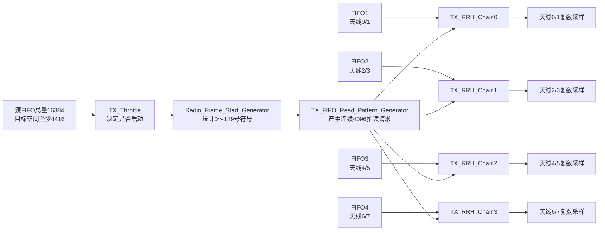
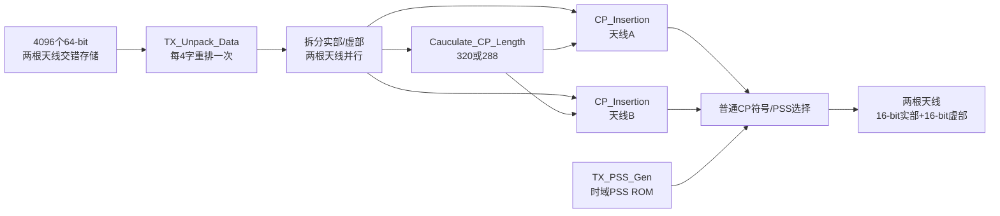
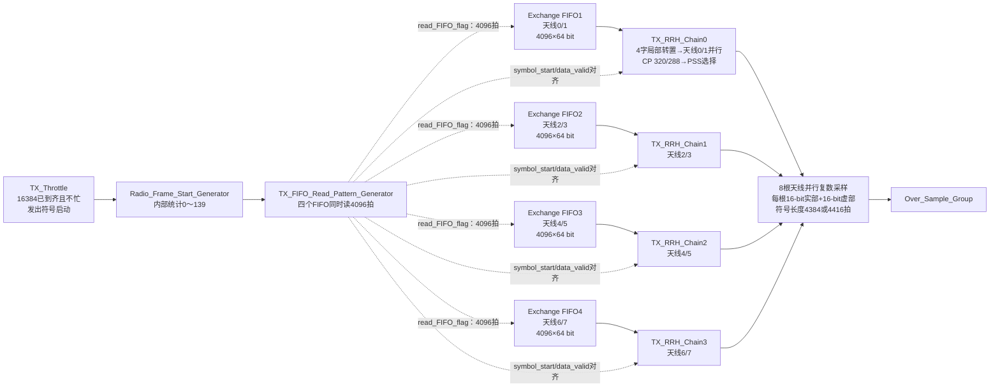

# TX_RRH_Processor

> 所属层级：`MIMO_TX_Top` 直接子模块。
>
> 总索引：[MIMO_TX_Top子模块学习索引.md](./MIMO_TX_Top子模块学习索引.md)。
>
> 上一模块：[TX_RRH_FIFO_Exchange学习.md](./TX_RRH_FIFO_Exchange学习.md)。下一模块：[Over_Sample_Group学习.md](./Over_Sample_Group学习.md)。


## TX_RRH_Processor 顶层

### 实现功能

一句话：从 `TX_RRH_FIFO_Exchange` 的四个天线对FIFO中同时读出一个4096点符号的数据，经过格式重排、CP插入和PSS处理，输出本 FPGA 负责的8根天线复数基带采样。

顶层输入分成三类：

```text
启动条件：source_FIFO_element_available、traget_FIFO_free_elements
有效数据：FIFO1_data～FIFO4_data，每路64 bit
时钟复位：clk、rst_n
```

其中四路FIFO的天线对应关系为：

```text
FIFO1_data → 天线0、1
FIFO2_data → 天线2、3
FIFO3_data → 天线4、5
FIFO4_data → 天线6、7
```

顶层输出为统一读请求 `read_FIFO_flag`、公共有效信号 `data_out_valid`，以及8根天线各自16-bit实部和16-bit虚部。

### 实现原理解读

中间主线实际只做四步：

1. `TX_Throttle`检查四个源FIFO是否合计达到16384个64-bit字、目标侧是否至少能容纳4416拍，并防止上一个符号还未处理完时重复启动。
2. `Radio_Frame_Start_Generator`把每次启动登记为一个OFDM符号，内部按0～139统计一个无线帧的140个符号。
3. `TX_FIFO_Read_Pattern_Generator`把单周期启动脉冲扩展成连续4096拍的`read_FIFO_flag`，四个天线对FIFO同时读取。
4. 四条`TX_RRH_Chain`并行工作，每条处理两根天线，完成存储格式重排、实虚部分离、CP长度选择与插入，并在指定符号位置选择PSS数据。

```text
四个天线对FIFO
  × 每个FIFO 4096个64-bit字
= source_FIFO_element_available 需要达到16384

一个符号最多需要保存
4096个有效采样 + 320个CP采样
= 4416拍目标空间
```

### 子模块关系图



每条`TX_RRH_Chain`内部的主要关系为：

```text
TX_Unpack_Data
  → 两根天线按同一位置并行排列
  → 实部/虚部分离
  → Calculate_CP_Length
  → 2×CP_Insertion
  → TX_PSS_Gen与普通数据选择
  → 两根天线输出
```

### 关键代码解读

```verilog
TX_Throttle #(17543)
```

注意这里的17543与前级 `FEEDBACK_1/2=17443` 不同，二者相差100拍，不能混为同一个常量。

FIFO读请求设计为2拍延时：

```text
read_FIFO_flag
 → 延迟2拍得到data_in_valid
 → 与FIFO_data一起进入TX_RRH_Chain
```

四条链使用完全相同的`symbol_start`和`data_in_valid`，因此理论上8根天线逐拍对齐。顶层只采用Chain0产生的`data_valid`作为公共`data_out_valid`。

### 讨论问题

1. 当前`TX_RRH_Chain`没有实例化IFFT或WFRFT；`TX_Unpack_Data`只改变数据排列，后面直接拆分实虚部并插入CP。现已沿主层级向上核实：时频变换在 `TX_BIT_Processor → Combine_Control_and_Data → WFRFT_TX` 中提前完成；普通IFFT分支由 `alpha=30` 选择 `X3=F^3x≈IFFT(x)`。因此本模块接收的是待加CP的时域/变换域采样，当前版本并非缺少IFFT，而是明确把RRH内原IFFT改成了直通。
2. 17443与17543的100拍差值应结合链内延时解释，不能先验地称为CP或保护间隔。
3. 只有Chain0的 `data_valid` 被接到顶层输出，设计默认四条链严格同步；需要仿真确认其他三链不会偏拍。
4. 顶层把`traget_FIFO_free_elements`固定接为4600，而启动阈值是4416；因此当前集成中目标空间检查总是满足，真正的启动条件主要来自源端16384数据是否就绪以及节流窗口是否结束。

## TX_Throttle

### 实现功能

一句话：检查“输入数据够不够、输出空间够不够、上一轮是否结束”，满足时只发出一个新的符号启动脉冲。

### 实现原理解读

输入为四个来源FIFO的可读总量`source_FIFO_element_available`和目标FIFO空闲量`traget_FIFO_free_elements`。判断条件为：

```text
source_FIFO_element_available >= 16384
AND traget_FIFO_free_elements >= 4416
AND processing_strobe == 0
```

前两个数字分别来自：

```text
16384 = 4个天线对FIFO × 每个4096个64-bit字
4416  = 4096个符号采样 + 最长320个CP采样
```

满足后，`start_pulse_temp`产生启动脉冲；一路延迟1拍成为模块输出`start_pulse`，另一路启动`PULSE_TO_STROBE_U16`，产生长度为参数`symbol_processing_ticks`的内部忙信号`processing_strobe`。忙信号有效期间，即使下一符号的数据已经到齐，也不会再次启动。

在`TX_RRH_Processor`中的参数为：

```verilog
TX_Throttle #(17543)
```

因此该实例一次启动后会封锁后续启动约17543拍。代码能确定它是“最小启动间隔/忙窗口”，但仅凭此模块不能证明17543的物理推导；尤其工程其他位置还出现17443，两者不能混用，需结合完整链路时钟和波形继续核实。

当前顶层把目标空闲量固定为4600，始终大于4416，所以集成后最主要的动态条件是：源端是否报告16384，以及17543拍忙窗口是否已经结束。

### 子模块关系图

```text
源数据>=16384 ─┐
目标空间>=4416 ├─ AND ─→ start_pulse_temp ─→ 延迟1拍 ─→ start_pulse
当前不忙 ──────┘              │
                              └─→ 展宽17543拍 ─→ processing_strobe
                                                     │
                                                     └─阻止重复启动
```

## Radio_Frame_Start_Generator

### 实现功能

一句话：每收到一次符号启动，就给这个OFDM符号编号0～139，并在编号0时标记一次无线帧开始。

### 实现原理解读

它把一个无线帧组织成：

```text
10个子帧 × 每子帧14个OFDM符号 = 140个OFDM符号
编号：0、1、2……139，然后回到0
```

输入`symbol_trigger_in`每出现一个单周期脉冲，计数器才加1；它不是每个时钟周期自动计数。输出为：

```text
symbol_trigger_out：输入启动脉冲寄存1拍后的版本
radio_frame_start：输入脉冲到来且当前counter==0时，输出1拍
symbol_index_in_radio_frame：在counter更新前锁存当前编号，并保持到下次符号
```

以复位后的前三次启动为例：

```text
第1次触发：输出符号编号0，radio_frame_start=1，内部counter随后变1
第2次触发：输出符号编号1，radio_frame_start=0，内部counter随后变2
第3次触发：输出符号编号2，radio_frame_start=0，内部counter随后变3
……
第140次触发：输出符号编号139，内部counter随后回0
第141次触发：重新输出编号0和radio_frame_start=1
```

### 在当前顶层中的实际作用

`TX_RRH_Processor`只连接并使用了`symbol_trigger_out`，而`radio_frame_start`和`symbol_index_in_radio_frame`悬空。因此当前版本中，该模块对后级实际产生的作用主要是把启动脉冲寄存、延迟1拍；无线帧起点和符号编号虽然在模块内正常生成，却没有从这里传给后级。

这不代表整个工程完全不用符号编号：`TX_RRH_Chain`内部又独立使用CP后有效信号的上升沿统计0～139号符号，用于PSS位置控制。也就是说当前代码存在两套各自计数的符号编号逻辑，需要依赖两条链始终同步。

## TX_FIFO_Read_Pattern_Generator

### 实现功能

一句话：把“新OFDM符号开始”的单周期脉冲，转换成一个单周期符号起点和连续4096拍的FIFO读使能。

### 输入是什么

```text
clk         工作时钟
rst_n       低电平复位
start_pulse 新符号启动脉冲，来自Radio_Frame_Start_Generator.symbol_trigger_out
```

### 中间实际只做哪几步

第一条支路使用`delay_1 #(1)`，把`start_pulse`延迟1拍，形成`symbol_start`。

第二条支路将参数中的FFT长度作为读长度：

```verilog
localparam SYMBOL_LENGTH = `FFT_LENGTH;   // 4096
```

然后使用`PULSE_TO_STROBE_U16_delay1`将单周期`start_pulse`展开为连续4096拍的`FIFO_read_enable`。由于使用的是`delay1`版本，长读使能与延迟1拍后的`symbol_start`从同一读窗口起点开始对齐。

### 输出是什么

```text
symbol_start     只高1拍，标记一个4096点符号读窗口的开始
FIFO_read_enable 连续高4096拍，命令四个天线对FIFO每拍各读一个64-bit字
```

```text
start_pulse：      ___|‾|________________________
symbol_start：     ____|‾|_______________________
FIFO_read_enable：____|‾‾‾‾ 4096拍 ‾‾‾‾|_______
```

这里的4096不是4096个RB，而是每个天线对FIFO为一个完整符号准备的4096个64-bit字。四个FIFO共用同一个读使能，因此一个读窗口总共取出：

```text
每个FIFO 4096个64-bit字 × 4个FIFO = 16384个64-bit字
```

### 它为什么同时输出两个控制信号

`FIFO_read_enable`表示一段持续的数据读取过程；`symbol_start`只标记这段数据的第一个位置。后级既需要知道哪些拍有输入，也需要知道4096点符号从哪里开始，不能只用其中一个信号完全代替另一个。

顶层认为FIFO读数据延迟为2拍，因此又把两个信号分别延迟2拍后送进`TX_RRH_Chain`：

```text
symbol_start ──延迟2拍──→ symbol_start_in
FIFO_read_enable ─延迟2拍→ data_in_valid
FIFO_data ──FIFO自身延迟──→ data_in
```

这样`TX_RRH_Chain`看到的符号起点、数据有效和实际FIFO输出数据能够对齐。

## TX_RRH_Chain

### 实现功能

一句话：一条`TX_RRH_Chain`处理一个天线对，把FIFO的交错数据重排成两根天线同位置并行的复数采样，插入CP，并在指定OFDM符号期间用PSS波形替换普通数据。

顶层共实例化四条完全相同的链：

```text
Chain0：FIFO1 → 天线0/1
Chain1：FIFO2 → 天线2/3
Chain2：FIFO3 → 天线4/5
Chain3：FIFO4 → 天线6/7
```

### 输入是什么

```text
symbol_start_in  一个4096点符号的单周期起点
data_in_valid    连续4096拍有效
data_in[63:0]    当前天线对FIFO读出的一个64-bit字
```

一个FIFO包含两根天线各4096个复数，共8192个复数；每个64-bit字打包两个32-bit复数，因此总数是4096个64-bit字。

### 中间数据流



当前代码中没有IFFT或WFRFT实例。数据经过重排后直接进入CP插入，因此此处应把输入理解为上游 `WFRFT_TX` 已经形成的待加CP采样流。`TX_RRH_Chain.v` 的有效逻辑和注释都表明原RRH内IFFT已改成直通；接口和部分旧注释仍使用“FFT/子载波”历史名称，不能据此把本模块误认为频域IFFT位置。

### 输出是什么

```text
data_valid       两根天线公共输出有效
data_real_tx0    本链第一根天线实部
data_imag_tx0    本链第一根天线虚部
data_real_tx1    本链第二根天线实部
data_imag_tx1    本链第二根天线虚部
```

每个实部、虚部都是16 bit。

## TX_Unpack_Data与Unpack_Subcarrier

### 实现功能

一句话：把FIFO中“先连续放天线A、再连续放天线B”的4个64-bit字，转换成“同一个采样位置的A、B两根天线并排”的4个64-bit字。

### 输入小例子

连续四拍输入为：

```text
拍0：A(k0), A(k1)
拍1：A(k2), A(k3)
拍2：B(k0), B(k1)
拍3：B(k2), B(k3)
```

其中每个`A(k)`或`B(k)`是一个32-bit复数，即16-bit实部和16-bit虚部。

`Unpack_Subcarrier`先用256-bit移位寄存器收集这4个64-bit字；每收满4字产生一次`packed_data_valid`。`TX_Unpack_Data`锁存这256 bit，再连续4拍选择对应的32-bit片段，输出：

```text
拍0：A(k0), B(k0)
拍1：A(k1), B(k1)
拍2：A(k2), B(k2)
拍3：A(k3), B(k3)
```

所以它没有解调、运算或丢数据，只完成一个4×局部数据转置。连续4096拍输入最终仍得到连续4096拍输出，只是每拍的64 bit变为：

```text
[31:0]  = 天线A当前复数
[63:32] = 天线B当前复数
```

随后`TX_RRH_Chain`按位拆分：

```verilog
A.real = double_antanna_data[15:0];
A.imag = double_antanna_data[31:16];
B.real = double_antanna_data[47:32];
B.imag = double_antanna_data[63:48];
```

`TX_Unpack_Data`还把`symbol_start_in`固定延迟7拍，使符号起点与重排后的第一拍数据对齐。

## Cauculate_CP_Length

### 实现功能

一句话：每来一个新OFDM符号，就按照7符号周期选择本符号的CP长度，并保持到下一个符号。

工程当前参数为：

```text
CP_LENGTH1 = 320
CP_LENGTH2 = 288
```

内部`feedback_en_7_U16`按以下模式循环：

```text
符号在slot内编号：0    1    2    3    4    5    6
CP长度：          320  288  288  288  288  288  288
```

然后下一个7符号slot重新从320开始。代码注释里的160/144是较早参数的旧说明，当前宏值已经是320/288。

输入`new_symbol`来自重排后数据有效信号的上升沿；输出`CP_Length`经过约2拍流水后更新，并在整个符号期间保持不变。

## CP_Insertion

### 实现功能

一句话：复制4096点时域符号末尾的320点或288点，放到整个符号前面。

数学上的输出次序是：

```text
CP=320：x[3776]…x[4095] + x[0]…x[4095]
CP=288：x[3808]…x[4095] + x[0]…x[4095]
```

对应输出长度：

```text
长CP符号：320 + 4096 = 4416拍
短CP符号：288 + 4096 = 4384拍
```

实现方法不是把完整符号写入显式RAM再倒读，而是使用两条延迟路径：

1. 当前输入流延迟1拍，在前`4096-CP_Length`拍被屏蔽，只让符号最后`CP_Length`拍先输出，形成CP。
2. 同一输入流再整体延迟4096拍，随后把原来的全部4096点完整输出。

```text
输入：    x0 x1 ........ x(4096-CP) ........ x4095
CP输出：                              x(4096-CP)...x4095
正文输出：                                             x0...x4095
最终：   [末尾CP_Length点] + [完整4096点]
```

`CP_Insertion.v`头部仍写着2048点、160/144等旧注释，但实例中的``FFT_LENGTH``宏当前为4096，实际延迟和减法也使用4096，应以参数化代码为准。

每条链实例化两个`CP_Insertion`，分别处理两根天线；两者共用CP长度和有效信号，保证天线对严格对齐。

## TX_PSS_Gen与最终选择

### 实现功能

一句话：在指定OFDM符号期间，从`ROM_for_PSS_Time`连续读出预存的PSS时域波形，替换普通的加CP数据。

`TX_RRH_Chain`使用CP后输出有效的上升沿，将内部计数器从0计到139；当计数器在有效输出窗口内为3时拉高`PSS_enable`。需要注意，这个计数器是在CP输出上升沿之后才递增，而且没有使用顶层`Radio_Frame_Start_Generator`的符号编号，因此它究竟对应外部无线帧的哪个符号必须按复位后实际波形对齐，不能仅凭`counter==3`直接称为外部零基编号3。

`TX_PSS_Gen`在`enable`期间地址从0递增，从`ROM_for_PSS_Time`读取32-bit复数PSS：

```text
[15:0]  PSS实部
[31:16] PSS虚部
```

ROM约有2拍读取延迟，模块总标注延迟3拍。最终选择逻辑为：

```text
PSS_valid=1 → 两根天线都输出同一个PSS复数样点
PSS_valid=0 → 输出各自正常的加CP数据
```

所以PSS期间，一条链负责的两根天线被替换成相同PSS序列；四条链控制相同，当前本板8根天线理论上同时输出相同PSS波形。

需要注意，`TX_PSS_Gen.v`注释写“在频域生成PSS”，但它调用的ROM名是`ROM_for_PSS_Time`，且位置处在CP插入之后。从实际连接关系判断，这里选择的是预存时域PSS波形，注释与实现命名存在冲突，应以ROM内容或仿真波形最终确认。

进一步核对`ROM_for_PSS_Time.xci`可知ROM配置为32 bit × 4384深度，而：

```text
4384 = 4096 + 288
```

因此这里能够确认：ROM保存的是一整个带短CP的时域PSS符号。当前实现中的“加入PSS”不是把PSS与普通业务符号做加法，而是整符号选择替换：

```text
内部符号条件不满足：输出普通数据经过CP_Insertion后的结果
内部符号条件满足：TX_PSS_Gen从地址0开始读4384个时域PSS复数，并通过PSS_valid覆盖普通数据
```

PSS机制与符号位置要分开看：PSS如何生成、如何替换已经由ROM深度和最终MUX闭合；但它属于外部无线帧的准确哪个符号仍未闭合。原因是本链没有使用`Radio_Frame_Start_Generator.symbol_index_in_radio_frame`，而是根据CP输出上升沿独立计数并判断`counter==3`。计数器更新与`PSS_enable`都采用非阻塞赋值，复位后首个符号的编号对应关系存在一拍/一符号边界风险，应通过波形把外部符号起点、内部counter、PSS_enable和PSS_valid同时对齐。旧模块`RRH_Insert_PSS.v`曾直接判断外部`symbol_index_in_radio_frame==3`，也说明当前改写版值得重点检查。

PSS是主同步信号，不是专门用来“调节频偏”的参考信号。接收端用已知PSS做相关检测，主要获得粗符号/帧时序和同步序列身份；其相关峰相位变化等信息也能辅助估计并校正粗载波频偏。但真正持续的频偏跟踪、信道估计和相位跟踪通常还要依赖其他参考信号与后续环路，所以不能把PSS简单等同于频偏参考信号。

## TX_RRH_Processor结束总结大图



本模块完成的数据组织变化是：

```text
输入：4路天线对FIFO，每路仍是两个天线分时交错的64-bit字
输出：8根天线每拍并行输出各自的复数采样
```

### “8根天线并行复数采样”是什么意思

一个复数采样由同一根天线在同一采样时刻的实部和虚部组成：

```text
x_a[k] = I_a[k] + jQ_a[k]
I：16-bit real
Q：16-bit imag
```

“8根天线并行”表示同一个有效时钟拍同时存在8个这样的复数，而不是一根天线一次输出8个样点：

```text
第k拍：A0(k), A1(k), A2(k), A3(k), A4(k), A5(k), A6(k), A7(k)
第k+1拍：A0(k+1), A1(k+1), ... , A7(k+1)
```

四条链每条贡献两个并行天线：

```text
Chain0 → A0(k)、A1(k)
Chain1 → A2(k)、A3(k)
Chain2 → A4(k)、A5(k)
Chain3 → A6(k)、A7(k)
```

RTL中因此没有一根256-bit总线，而是16根同时有效的16-bit输出线：8个`data_real_tx*`和8个`data_imag_tx*`，共256 bit/有效拍。公共`data_out_valid`表示这16路在当前拍一起有效。按照CP插入和后级过采样的用途，这些接口被当作时域复数基带采样使用。
