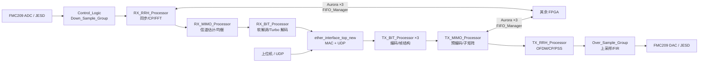

# F0 工程导读：从哪里开始，怎样读懂

## 0. 先建立全局认识

这是一个部署在 `xcvu37p-fsvh2892-2-e` 上的多 FPGA MIMO 基带工程。它并不是“一个模块做一件事”的小工程，而是把下列四类功能接在一起：

1. **硬件接口与时钟复位**：板载差分时钟、两块 FMC209 射频板、SPI、LVDS 触发/同步。
2. **网络数据入口/出口**：千兆以太网将 UDP 四个逻辑通道变为内部流接口。
3. **基带处理**：发射侧编码、资源映射、MIMO 预编码、OFDM/RRH；接收侧同步、FFT、信道估计/均衡、软解调和 Turbo 解码。
4. **多 FPGA 数据交换**：三个四通道 Aurora 链路和大量 FIFO，将不同 FPGA 上的 bit、MIMO、RRH 数据分发/汇集。

配置头文件 [`MIMO_Parameter.vh`](../u7_chip2chip_base.srcs/sources_1/imports/new/MIMO_Parameter.vh) 表明该设计按 **32 天线、12 层、4 块 FPGA、每 FPGA 3 层** 的系统来组织；当前工程中 `FPGA_ID=3`。这是阅读“为什么存在 Aurora 与大量跨板 FIFO”的关键背景。

## 1. 先忽略哪些目录

不要从文件数量最多的目录开始读。对理解功能而言，它们的优先级很低：

| 路径 | 是什么 | 阅读建议 |
| --- | --- | --- |
| `.Xil/`、`*.cache/`、`*.hw/`、`*.ip_user_files/` | Vivado 生成的中间文件 | 忽略 |
| `u7_chip2chip_base.runs/` | 综合/实现结果、报告、bit 文件 | 仅在看时序、资源、下载文件时使用 |
| `sources_1/ip/` | Xilinx IP 的配置与生成 HDL | 把它视为 FIFO/FFT/ILA/JESD/Aurora 等组件；只有要改 IP 参数时才进入 |
| `sources_1/edf/` | 已综合的 EDIF 网表 | 只能看端口，不能像 RTL 那样深入；如 `fmc209_rf_top`、`udp_stack_top` |
| `sources_1/imports/new/test_*.v` | 历史测试文件 | 不作为系统主链路入口 |

真正优先阅读的是 `sources_1/imports/new/` 中以 `MIMO_`、`TX_`、`RX_`、`FIFO_Manager` 命名的 RTL，以及 `sources_1/new/` 中的板级粘合逻辑。

## 2. 总体连接图



图中的 `FIFO_Manager` 是跨板数据的“交换机”，而不是普通小 FIFO；它连接了发射和接收两条链路的多个阶段。

## 3. 推荐的实际阅读顺序

一次只打开一个模块，先看 **module 端口、实例化的子模块、valid/ready/trigger/FIFO 信号**，不要从 `always` 的每一行开始。

### 第一步：系统顶层（先花 30 分钟）

1. [`MIMO_Project_Config.v`](../u7_chip2chip_base.srcs/sources_1/imports/new/MIMO_Project_Config.v)
   - 这是 Vivado 设置的综合顶层。
   - 先看 180 行附近的时钟：由板载 `gp_clk_p/n` 产生 100 MHz、125 MHz、10 MHz、12.5 MHz、UDP 时钟及基带/链路时钟。
- 看 226 行附近的 MAC、IP、UDP 端口常量；地址基值在 [`Program_Const.vh`](../u7_chip2chip_base.srcs/sources_1/imports/new/Program_Const.vh)。
   - 重点只跟踪它实例化的五个块：`Control_Logic`、`MIMO_Project_Top`、两组 `FIFO_TX_RX_Asyn`、`ether_interface_top_new`、`u7d_690t_test_interface`。

2. [`Control_Logic.v`](../u7_chip2chip_base.srcs/sources_1/new/Control_Logic.v)
   - 这是上电/复位/帧触发和 ADC 下采样控制中心。
   - `system_rst_n` 要同时满足射频 ADC/DAC ready、时钟锁定和手动复位。
   - `interactive_fifo_ready` 与发射触发满足后，计数产生 `radio_frame_trigger`。
   - `Down_Sample_Group` 将两块 FMC 的 8 路 IQ ADC 数据降采样，再通过异步 FIFO 送进基带时钟域。

3. [`u7d_690t_test_interface.v`](../u7_chip2chip_base.srcs/sources_1/new/u7d_690t_test_interface.v)
   - 这是 FMC209/JESD、SPI、PPS、触发等硬件适配层。
   - 它调用的 `fmc209_rf_top*` 是 EDIF 网表，先把它当作“8 路 ADC/DAC IQ 数据源/汇”即可，不要先钻网表。

### 第二步：核心调度层（最重要）

4. [`MIMO_Project_Top.v`](../u7_chip2chip_base.srcs/sources_1/imports/new/MIMO_Project_Top.v)
   - 这是基带算法的总装配层，只有三个核心实例：`MIMO_TX_Top`、`MIMO_RX_Top` 和 `FIFO_Manager`。
   - 先沿实例端口认清四类跨阶段数据：`bit2mimo`、`mimo2rrh`、`rrh2mimo`、`mimo2bit`。
   - 名称即方向，例如 `tx_bit2mimo` 表示发射侧从比特处理阶段进入 MIMO 阶段的数据。

5. [`FIFO_Manager.v`](../u7_chip2chip_base.srcs/sources_1/new/FIFO_Manager.v)
   - 先读四类 FIFO 的接口，不必立刻读 2000 多行内部仲裁：
     - `BIT2MIMO`：发射编码输出汇入 MIMO；
     - `MIMO2RRH`：预编码输出送至射频处理；
     - `RRH2MIMO`：接收射频处理输出汇入 MIMO；
     - `MIMO2BIT`：接收均衡结果送解码。
   - 文件前半部分是三条 Aurora 实例和跨时钟 FIFO，后半部分是按 FPGA ID/阶段进行路由与缓存。
   - Aurora 链路未建立时，`interactive_fifo_ready` 会阻止系统开始发射。

### 第三步：先读发射链（推荐先从 TX 开始）

发射数据路径是：**UDP 输入 → 3 个 layer 的编码 → 跨 FPGA 汇集 → 预编码 → OFDM/RRH → 上采样 → DAC**。

6. [`MIMO_TX_Top.v`](../u7_chip2chip_base.srcs/sources_1/imports/new/MIMO_TX_Top.v)
   - 只需先认识七个串接块：
     `TX_BIT_Processor ×3` → `TX_BIT_FIFO_Exchange` → `TX_MIMO_Processor` → `TX_RRH_FIFO_Exchange` → `TX_RRH_Processor` → `Over_Sample_Group`。

7. [`TX_BIT_Processor.v`](../u7_chip2chip_base.srcs/sources_1/imports/new/TX_BIT_Processor.v)
   - 单层发射 bit 处理：触发/TTI 配置、UDP 缓冲、MAC 数据产生、PDSCH 编码、PDCCH 编码、控制与数据合帧。
   - 这是理解“上位机一包数据如何变成 LTE 资源”的最佳起点。

8. [`TX_MIMO_Processor.v`](../u7_chip2chip_base.srcs/sources_1/imports/new/TX_MIMO_Processor.v)
   - 读取远端/本地 payload，`TX_Precoding_Direct` 做预编码，随后按子矩阵打包输出。

9. [`TX_RRH_Processor.v`](../u7_chip2chip_base.srcs/sources_1/imports/new/TX_RRH_Processor.v) 与 [`TX_RRH_Chain.v`](../u7_chip2chip_base.srcs/sources_1/imports/new/TX_RRH_Chain.v)
   - 从数据拆包到 CP 插入、PSS 生成等 OFDM 时域链路；一共四个 `TX_RRH_Chain` 并行实例。

10. [`Over_Sample_Group.v`](../u7_chip2chip_base.srcs/sources_1/imports/new/Over_Sample_Group.v)
    - 8 路 I/Q 数据经 FIFO 跨时钟与上采样 FIR 后送往 DAC。这是基带时钟到 DAC 时钟边界。

### 第四步：再读接收链

接收数据路径是：**ADC → 下采样 → 同步/FFT → 跨 FPGA 汇集 → 信道估计/均衡 → 软比特/Turbo 解码 → UDP 输出**。

11. [`MIMO_RX_Top.v`](../u7_chip2chip_base.srcs/sources_1/imports/new/MIMO_RX_Top.v)
    - 总顺序：`RX_RRH_Processor` → `RX_RRH_FIFO_Exchange` → `RX_MIMO_Processor` → `RX_MIMO_Data_Processing` → `RX_BIT_Processor_Top`。

12. [`RX_RRH_Processor.v`](../u7_chip2chip_base.srcs/sources_1/imports/new/RX_RRH_Processor.v)、[`Sync_Top.v`](../u7_chip2chip_base.srcs/sources_1/imports/new/Sync_Top.v)、[`RX_RRH_Chain.v`](../u7_chip2chip_base.srcs/sources_1/imports/new/RX_RRH_Chain.v)
    - `Sync_Top` 完成粗定时、精确载波频偏估计和同步握手。
    - `RX_RRH_Chain` 完成 CFO 对齐、CP 去除、FFT、直流子载波位置调整、数据打包；四路链并行。

13. [`RX_MIMO_Processor.v`](../u7_chip2chip_base.srcs/sources_1/imports/new/RX_MIMO_Processor.v)
    - 这是接收算法核心：解包/资源解映射 → 信道估计 → 信道矩阵扩展 → 权重矩阵计算 → 均衡。

14. [`RX_BIT_Processor.v`](../u7_chip2chip_base.srcs/sources_1/imports/new/RX_BIT_Processor.v) 与 [`PXSCH_Bit_Processing.v`](../u7_chip2chip_base.srcs/sources_1/imports/new/PXSCH_Bit_Processing.v)
    - 恢复直流子载波、资源解映射、子帧划分、LLR 解调、解扰、软比特串行化、Turbo 解码与 CRC。
    - 最终结果由 `MIMO_RX_Top` 送回 UDP 的各个 TX 通道。

## 4. 读代码时的四条规则

1. **先看端口和实例，后看时序逻辑。** 每个模块先回答：输入来自哪、输出到哪、在哪个时钟域、何时有效。
2. **把 `valid`、`ready`、`full`、`empty`、`sufficient`、`trigger` 当作主线。** 数据总线本身常有 64/128 位，握手信号才说明数据何时被消费。
3. **碰到 FIFO 先标出写时钟和读时钟。** 这是定位跨时钟和数据停顿问题最快的方法。
4. **不要把 ILA/VIO 当业务逻辑。** `ila_*` 只观察，`vio_*` 只调试/人工控制；阅读时可跳过其实例细节。

## 5. 常见信号命名速查

| 信号片段 | 大致含义 |
| --- | --- |
| `real` / `imag` | IQ 的同相 / 正交分量 |
| `RRH` | 射频头/OFDM 侧处理阶段；本工程中靠近时域、CP、FFT |
| `RB` | Resource Block，资源块 |
| `PDSCH` / `PDCCH` | LTE 下行共享信道 / 控制信道 |
| `MCS` | 调制编码方案 |
| `CFO` | 载波频偏 |
| `PSS` | 主同步信号 |
| `*_Asyn` / `cross` | 异步/跨时钟处理，优先检查复位与握手 |
| `*_self` | 当前 FPGA 的本地回环/本地分支，常与远端 FPGA 分支并列 |

## 6. 当前工程的阅读限制与注意事项

- 多个旧源码文件的中文注释已出现编码损坏；模块名、端口名和实例关系仍可正常作为主要依据。
- 一部分关键硬件与网络模块是 EDIF 网表，不能从 RTL 追溯其内部实现；应通过顶层端口、IP 配置和 ILA 观察验证行为。
- 当前 `impl_1` 已生成 bitstream，但最终时序未收敛（WNS -3.201 ns）；理解功能时可先忽略，修改或重新实现前必须回头处理时序。

## 7. 建议的学习节奏

1. 第一天只读第 3 节的“顶层 + 调度层”，并手画上述数据流。
2. 第二天只走一遍 TX：从 `layer0_input_data` 开始，跟到 `data_upsampling_real0/imag0`。
3. 第三天只走一遍 RX：从 `data_in_real_rx0/imag0` 开始，跟到 `user0_tx_data`。
4. 最后再选择一个具体功能（如 PDSCH 编码、同步、预编码或 Aurora）深入；每次只沿一条数据链追踪，避免横向展开。

## 8. 发射端重点：`MIMO_TX_Top`

[`MIMO_TX_Top.v`](../u7_chip2chip_base.srcs/sources_1/imports/new/MIMO_TX_Top.v) 的职责是把本 FPGA 的 3 路 UDP 业务数据，连同其他 FPGA 交换来的 Layer 数据，形成 8 路送往本地 DAC 的 IQ 样点。它本身主要做调度、打包、读写请求和输出选通；编码、预编码、OFDM 与 FIR 分别在子模块中完成。

### 模块内部的七段数据路径

```text
UDP 0/1/2
  → TX_BIT_Processor ×3
  → TX_BIT_FIFO_Exchange
  → [边界 A：FIFO_Manager / Aurora，汇集 4 块 FPGA 的 Layer 数据]
  → TX_MIMO_Processor
  → [边界 B：FIFO_Manager / Aurora，按本地 8 天线重分发]
  → TX_RRH_FIFO_Exchange
  → TX_RRH_Processor
  → Over_Sample_Group
  → 8 路 DAC IQ 输出
```

1. **本地三层编码。** `TX_BIT_Processor0/1/2` 消费 3 路 UDP 字节流，当前 `FPGA_ID=3` 时分别对应 Layer 9、10、11。它们将业务比特编码、调制并组织为频域复符号。
2. **边界 A：Layer 汇集。** `TX_BIT_FIFO_Exchange` 将 3 路符号打成 64 位数据，并给出目的 FPGA ID；`FIFO_Manager` 把四块 FPGA 的数据送入四个 `bit2mimo` FIFO。MIMO 预编码需要完整的多 Layer 数据，因而这一步不能跳过。
3. **预编码。** `TX_MIMO_Processor` 从上述四个 FIFO 轮流读取 128 位 payload。顶层以 `src_mimo_from_bit_fifo_id` 连续 3 次选择同一个 FPGA，再依次选择 0、1、2、3；这对应每 FPGA 三个 Layer。`TX_Precoding_Direct` 完成预编码，之后按天线子矩阵拆分并打包为两路 64 位数据。
4. **边界 B：天线数据重分发。** 两路 `mimo2rrh` 写数据回到 `FIFO_Manager`。它们会被整理成当前 FPGA 的 4 组双天线数据（共 8 天线）。
5. **四组双天线对齐。** `TX_RRH_FIFO_Exchange` 将四个输入 FIFO 分别对应天线对 0–1、2–3、4–5、6–7。只有四组缓存均达到阈值、且链路握手允许时，才对外宣布数据充足。
6. **OFDM/RRH。** `TX_RRH_Processor` 同时驱动四个 `TX_RRH_Chain`；每个链完成数据拆包、CP 插入和 PSS 等时域处理，输出两根天线的 IQ 数据。
7. **DAC 输出。** `Over_Sample_Group` 对 8 路 IQ 上采样并 FIR 滤波。`antenna_indication[7:0]` 最后逐路选通；某位为 0 时该天线的 I/Q 被强制为 0。

### 先重点跟踪的信号

| 信号组 | 意义 |
| --- | --- |
| `layer*_input_data/valid` | UDP 写入的本地业务字节 |
| `symbol_real/imag*` 与 `symbol_valid0` | 三层编码/调制后的频域符号；打包模块以 `symbol_valid0` 为节拍，隐含三个 Layer 同步的假设 |
| `bit2mimo_*` | 发往跨 FPGA Layer 汇集 FIFO 的 64 位数据 |
| `mimo_payload_*`、`read_mimo_fifo_req`、`src_mimo_from_bit_fifo_id` | MIMO 预编码器从 4 个源 FIFO 取数据的接口 |
| `mimo2rrh_*` | 预编码后、送往本地 8 天线 RRH 的数据 |
| `rrh_stage_sufficient` / `rrh_all_sufficient_for_exchange` | 四组 RRH FIFO 和跨 FPGA 链路的发射准备握手 |
| `data_upsampling_*` | 最终给 DAC 的 8 路 I/Q 样点 |

### 阅读时可先忽略的调试/固定配置

- `ila_TX_Top` 只观察信号，不参与功能。
- `mimo_enable` 在本模块中固定为 1。
- `number_element_fifo1/2` 固定为 200；`TX_Throttle` 的目标 FIFO 空闲容量在该连接中固定传入 4600。理解功能时先当作启动门限，之后做吞吐或时序分析再核实这些常量是否合理。
