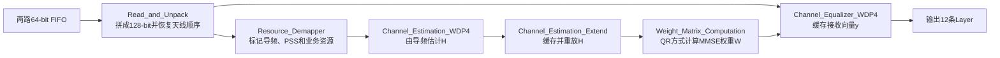

# 紫光国芯数字前端岗位面试准备

> 面试方向：BU3 ASIC前端工程师（第一志愿），兼顾存储器数字设计、SoC数字设计。  
> 项目主线：4片FPGA协同的12层、32发32收MIMO-OFDM基带系统。  
> 使用原则：下面答案必须用自己的话说。没有亲自完成的工作不要说“独立原创”，可以准确表述为“重点负责、参与实现、接手分析、接口适配、联调和验证”。

## 一、今晚和明天上午的优先级

### 必须答稳

1. 60秒自我介绍。
2. 三分钟说清MIMO项目：为什么做、系统怎样分块、自己做了什么、最难的问题、怎样验证。
3. 发射端MIMO：12层如何汇聚、32天线如何预编码、为什么跨4片FPGA重排。
4. 接收端MIMO：32天线数据如何变成12层数据，信道估计、MMSE和均衡分别干什么。
5. Verilog基础：阻塞/非阻塞、锁存器、复位、FIFO、CDC、建立保持时间、流水线、状态机。
6. 至少能手写：边沿检测、同步FIFO、序列检测器。

### 有时间再看

1. MMSE增广矩阵QR推导细节。
2. AXI/AHB/APB基本区别。
3. FPGA迁移ASIC时的综合、STA、CDC、DFT、PPA问题。
4. SRAM/DRAM、ECC和存储控制基本概念。

DRAM专项内容已经单独补充在[MIMO收发端总结与项目面试问答.md](./MIMO收发端总结与项目面试问答.md)第十二至第十五章。对紫光国芯面试来说，至少要能解释1T1C、刷新、ACT/READ/PRE、常见时序、理论带宽、Controller/PHY/颗粒的区别，以及如何用DRAM缓存32天线MIMO数据。

### 建议学习顺序

```text
90分钟：接收端MIMO主线和六个关键数字
60分钟：项目问答，自己大声回答
90分钟：数字前端基础
60分钟：手写三道RTL并检查边界条件
30分钟：自我介绍、为什么紫光国芯、反问
```

## 二、自我介绍

### 60秒版本

面试官您好，我叫刘少寒，目前是哈尔滨工业大学电子信息专业硕士研究生，本科就读于湖南大学通信工程专业，主要研究方向是MIMO通信系统和FPGA开发。

研究生阶段我重点参与了一套4片FPGA协同的12层、32发32收MIMO-OFDM基带系统。我的核心工作集中在收发端MIMO数据通路，包括跨FPGA数据重排、导频信道估计、MMSE均衡链路，以及相关接口和时序的分析、联调与验证。在这个过程中，我比较关注的不只是算法公式，还包括定点位宽、流水线延迟、valid对齐、FIFO缓存和边界RB处理等硬件问题。

我熟悉Verilog、Vivado仿真和ILA调试，也使用Matlab做过算法验证。我的优势是能够把复杂系统拆成明确的数据流和时序关系，并持续定位、验证问题。我希望应聘ASIC前端岗位，把已有的FPGA RTL经验进一步延伸到规范设计、综合、STA、CDC和PPA优化等完整数字前端流程。

### 两分钟版本

面试官您好，我叫刘少寒，目前是哈尔滨工业大学电子信息专业硕士研究生，本科毕业于湖南大学通信工程专业。我的研究方向主要是MIMO通信系统和FPGA数字基带开发。

我最核心的项目是一套基于4片FPGA的12层、32发32收MIMO-OFDM基带系统。系统覆盖发射端比特处理、跨板交换、MIMO预编码、射频链路处理，以及接收端同步、FFT、信道估计、MMSE均衡和比特恢复。采用4片FPGA，主要是因为单片器件难以同时满足矩阵运算量、片内存储和高速I/O带宽，所以工程按频率资源分担计算，同时通过高速链路交换每片板需要的Layer或天线数据。

我重点投入的是收发端MIMO部分。发射端要把4片板各自产生的3层数据汇聚成12层，并对每组4个子载波完成12层到32天线的预编码；接收端方向相反，要先把32根接收天线的频域数据恢复成矩阵行顺序，通过导频得到32乘12信道矩阵，再计算12乘32的MMSE权重，最后完成32路接收向量到12层符号的均衡。实际RTL中，我重点关注过数据重排、FIFO读写节奏、定点复数乘加、长流水线valid对齐和特殊尾块处理，并通过仿真与ILA观察关键数据、地址和有效信号来闭环定位问题。

这段经历让我认识到，通信算法落到硬件并不是把公式直接翻译成代码，而是要在吞吐率、资源、位宽、时序和验证之间做取舍。我希望从FPGA开发继续走向ASIC前端，在模块微架构、RTL质量、CDC、综合和时序约束方面建立更完整的能力。

### 不能说得太满的地方

- 如果原始工程不是从零由自己编写，不要说“整套系统都是我设计的”。
- 可以说：“我把收发端MIMO作为重点负责和深入掌握的部分，完成了模块分析、接口适配、问题定位、验证和部分RTL修改。”
- 如果没有ASIC流片经历，直接说“目前主要是FPGA经历，正在系统补充ASIC前端流程”，不要虚构综合或流片结果。
- 简历中的“设计”被追问时，要能立刻落到一个具体模块、一个具体接口、一条具体时序或一次具体调试。

## 三、三分钟讲清MIMO项目

### 推荐回答结构

#### 1. 项目目标

项目要实现一套12层空间复用、32发32收的MIMO-OFDM基带链路，从以太网输入一直覆盖到射频收发和接收端数据恢复。

#### 2. 为什么需要4片FPGA

32天线、12层会产生很大的复数矩阵运算量，同时还有大量FIFO、FFT、片上RAM和高速I/O。单片FPGA在DSP、BRAM和外部带宽上压力较大，因此采用4片FPGA协同。每片板既处理本地数据，又通过高速互联交换其他板的数据。

#### 3. 发射端主线

```text
4片FPGA各自产生3层数据
→ 跨板交换，负责某组RB的FPGA收齐12层
→ 12层乘32天线预编码矩阵
→ 得到32天线频域符号
→ 再按天线分回各板
→ IFFT、加CP、插值，送往射频
```

#### 4. 接收端主线

```text
32根天线时域采样
→ 同步、频偏补偿、去CP、FFT
→ 跨板汇聚同一频率块的32天线数据
→ 导频信道估计得到H(32×12)
→ MMSE计算W(12×32)
→ x_hat = Wy恢复12层
→ 12层再按每板3层分回4片FPGA
```

#### 5. 自己的核心工作

重点围绕收发端MIMO数据通路：理解并核对跨板数据排序；分析信道估计、MMSE权重和均衡的接口；处理FIFO读写节奏、定点位宽和长流水线valid对齐；通过仿真和ILA验证地址、数据、帧位置与有效信号是否一致。

#### 6. 最难的问题

最难的不是单个乘法器，而是“数据是什么”和“这一拍属于谁”。同样的数字12可能表示12个子载波、12条Layer或12拍输出；如果天线、Layer、RB和子载波维度混淆，矩阵数值即使不为零也会完全错误。因此我先统一数据单位，再沿着FIFO、RAM地址和valid逐级验证。

#### 7. 验证方法

先用Matlab或已知向量给出参考结果；RTL仿真检查每级valid、地址和定点数据；上板后使用ILA分阶段抓取输入、信道矩阵、权重矩阵和均衡输出；发现问题后回到第一个与参考不一致的边界，而不是只看最终误码。

## 四、接收端RX_MIMO_Processor速学

### 一句话

`RX_MIMO_Processor`利用32根接收天线的频域观测，估计12层到32天线的信道，再用MMSE权重把混合信号分离成12条Layer。

### 数学主线

```text
y = Hx + n
x_hat = Wy
```

- `x`：12×1，12条发送Layer。
- `H`：32×12，12条Layer到32根接收天线的信道。
- `y`：32×1，32根接收天线的观测。
- `W`：12×32，MMSE均衡权重。
- `x_hat`：12×1，恢复出的12条Layer。

它不是“32根天线变成12根天线”，而是利用32路观测解出空间中叠加的12路数据。

### 输入是什么

顶层有两路64-bit FIFO数据：

```text
upper FIFO：前16根接收天线
lower FIFO：后16根接收天线
```

每个64-bit字包含两个32-bit复数。两个64-bit字重新拼成一个128-bit字：

```text
128 bit = 同一根天线在k0、k1、k2、k3四个频域位置上的4个复数
```

此外还有：

- `sigma[14:0]`：MMSE噪声参数，RTL标记为U1.14。
- `antenna_indication[31:0]`：32根天线启用掩码。
- 两路FIFO当前存量和返回有效信号。

### 中间实际做哪几步



#### 1. Read_and_Unpack

先把两个64-bit字拼成同一天线的四个复数，再利用RAM把为了吞吐形成的上下半区交错顺序恢复为：

```text
A0, A1, A2, ... , A31
```

一个4子载波小块需要输入32个128-bit有效拍，每拍对应一根接收天线的4个复数。

#### 2. Resource_Demapper

它主要不是移动数据，而是给当前数据贴标签：当前属于哪个RB、哪个4子载波小块、哪个OFDM符号，以及是预编码导频、非预编码导频、PSS还是数据资源。

#### 3. Channel_Estimation_WDP4

已知本地产生的导频`p`和接收到的导频`r`，导频归一化时可写为：

```text
H_est ≈ r × conj(p)
```

硬件一次并行处理4个频域位置，输出144 bit：

```text
4个复数 × (18-bit实部 + 18-bit虚部) = 144 bit
```

逐个遍历32根接收天线和12条Layer方向后，形成`H(32×12)`。

#### 4. Channel_Estimation_Extend

导频只在指定OFDM符号出现，但后续多个数据符号都要使用信道估计。因此该模块把导频时刻得到的H写入RAM，在数据资源到来时按RB和天线顺序重放。这里的“Extend”是时间上的保持和复用，不是凭空产生新的信道信息。

#### 5. Weight_Matrix_Computation

理论MMSE权重为：

```text
W = (H^H H + sigma^2 I)^(-1) H^H
```

直接求逆硬件代价高、数值稳定性也较差。工程构造44×12增广矩阵：

```text
A = [ H       ]   32行
    [ sigma I ]   12行
```

对`A=QR`，把Q分成前32行`Q1`和后12行`Q2`，可以得到：

```text
W = Q2 × Q1^H / sigma
```

这与标准MMSE公式等价。RTL中权重按接收天线列输出：每拍600 bit，包含该天线到12条Layer的12个复数权重：

```text
12 × (25-bit实部 + 25-bit虚部) = 600 bit
```

#### 6. Channel_Equalizer_WDP4

对某个Layer `l`和频域位置`k`：

```text
x_hat_l(k) = Σ W[l,a] × y_a(k),  a=0...31
```

也就是在32根接收天线上做复数点积。硬件同时处理k0至k3四个位置，因此有4组并行点积通路。

### 输出是什么

一个有效输出拍为128 bit：

```text
某一条Layer在k0、k1、k2、k3上的4个均衡复数
```

一个4子载波小块连续输出12拍：

```text
第0拍：Layer0的k0~k3
第1拍：Layer1的k0~k3
...
第11拍：Layer11的k0~k3
```

一个RB有12个子载波，被拆成3个4子载波小块，因此一个普通RB输出：

```text
3个小块 × 12条Layer = 36个128-bit有效拍
```

### 六个必须记住的数字

| 数字 | 含义 |
|---|---|
| 32 | 接收天线数，也是`H`的行数和均衡点积长度 |
| 12 | Layer数，也是`H`的列数 |
| 4 | 每拍并行处理的子载波位置数 |
| 3 | 一个12子载波RB包含的4子载波小块数 |
| 44 | MMSE增广矩阵行数，32根天线+12个正则化行 |
| 600 | 一列权重的位宽，12个复数×50 bit |

### 132拍怎样回答

宏定义给一个RB安排`132`个时钟：

```text
3个4子载波小块 × 44拍/小块 = 132拍
```

这里的44与“32根天线输入处理窗口 + 12条Layer输出/内部调度窗口”有关，也与增广QR矩阵44行数值相同，但不能说132拍全部都在连续读取FIFO。顶层注释有些地方写133拍一个周期，说明边界处可能还有1拍间隔；面试时应说“名义调度132拍，实际valid边界以仿真波形为准”，不要把注释中的132和133强行说成完全一致。

### RX_MIMO与TX_MIMO的对称关系

```text
发射端：12条Layer → 预编码矩阵 → 32根发射天线
接收端：32根接收天线 → MMSE均衡矩阵 → 12条Layer
```

发射端是空间映射，接收端是空间解混。二者都以4个频域位置为并行处理粒度，并围绕32和12两个矩阵维度组织数据。

## 五、项目深挖重点题

### Q1：为什么不能用一片FPGA完成？

答：瓶颈不只是乘法数量，还包括DSP、BRAM、片内互联、外部I/O和持续吞吐。32天线、12层意味着大规模复数矩阵乘加；同时每根天线还有FFT、同步和缓存。4片协同让计算和存储分摊，但代价是增加跨板带宽、数据重排和同步复杂度。

### Q2：4片FPGA怎样分工？

答：BIT阶段每片板产生或处理本地3条Layer；MIMO阶段按照频率RB轮转分担，每个负责某些RB的板需要汇聚全部12层或32根天线数据。处理完成后，再把32天线结果或12层结果分发到对应板。项目采用的是计算维度分担加跨板交换，不是4片板完全独立。

### Q3：为什么按频率RB切分？

答：OFDM在理想同步和CP足够时，各子载波可相对独立处理。以RB或4子载波小块分担，能让不同FPGA并行完成相同结构的矩阵运算；同时局部数据块大小固定，适合FIFO和高速链路打包。代价是每片板都可能需要其他板的Layer或天线数据，所以必须跨板汇聚和重排。

### Q4：整个系统最关键的数据重排是什么？

答：发射端先把每板3层汇聚成12层，再把预编码后的32天线按目标板拆分；接收端先把各板天线数据汇聚并恢复为天线0到31的矩阵行顺序，均衡得到Layer0到11后，再按每板3层分回。重排本质是在“适合链路传输的顺序”和“适合矩阵计算的顺序”之间转换。

### Q5：为什么一次处理4个子载波？

答：接口位宽是128 bit，刚好容纳4个32-bit复数。一个RB有12个子载波，因此拆成3个4子载波小块。它是硬件并行粒度，不是无线协议新定义的资源单位。

### Q6：信道矩阵为什么是32×12？

答：每一行对应一根接收天线，每一列对应一条发送Layer。`H[a,l]`表示第`l`条Layer到第`a`根接收天线的复数信道系数。

### Q7：导频怎样估计信道？

答：接收导频满足`r=Hp+n`。如果不同Layer导频正交、且导频幅度已经归一化，可以通过接收导频乘本地导频共轭得到相应信道估计。RTL里本地产生导频，计算四路复数乘法，再做位宽截取和饱和。

### Q8：为什么使用MMSE，不直接ZF？

答：ZF只强调消除层间干扰，在信道接近奇异时会产生很大的逆矩阵系数，从而放大噪声。MMSE加入`sigma^2I`正则项，在干扰抑制与噪声放大之间折中。噪声很小时MMSE趋近ZF，噪声较大时会更保守。

### Q9：`sigma`到底是什么？

答：从增广矩阵写入`sigma·I`、最终公式形成`sigma^2I`看，RTL中的`sigma`更接近噪声标准差或正则化幅度，而不是直接的噪声功率。它的标定仍需结合系统配置和定点仿真确认，面试时不要把代码没证明的单位说死。

### Q10：为什么用QR，不直接算`H^H H`再求逆？

答：直接形成Gram矩阵再求逆会带来较长组合路径、大量乘加和数值条件恶化。增广QR可以利用正交变换逐步流水化，避免显式构造逆矩阵过程中的部分数值风险，也适合复用固定结构的旋转和点积单元。代价是流水线很长、控制和valid对齐复杂。

### Q11：接收端均衡具体算什么？

答：对每条Layer，用该Layer对应的32个权重与32根接收天线观测做复数点积。项目一次并行处理4个子载波，因此同时进行4组长度32的复数点积，之后连续输出12条Layer。

### Q12：为什么valid必须连续32拍，不能只给一个开始脉冲？

答：开始脉冲只能说明一个矩阵或向量开始了，不能说明后续每拍数据是否有效。32拍分别承载32根天线的不同复数数据，点积累加器必须知道哪32拍参与计算。start负责边界，valid负责每个数据拍。

### Q13：长流水线怎样保证数据和控制对齐？

答：先为每个IP核和寄存器级建立延迟表，再把RB_start、submatrix_start、资源类型和valid走相同长度的延迟链。顶层对MMSE权重使用约2560拍量级的固定延迟对齐。验证时不能只看数值，要同时比较数据、地址、Layer/RB标签和valid。

### Q14：定点位宽怎样选择？

答：先由输入幅度和最坏累加长度估算整数位，再由误差指标确定小数位。乘法结果位宽是两输入位宽之和；32项复数累加理论上还需约`ceil(log2 32)=5`个保护位。每级截位前要明确舍入还是截断，溢出时采用饱和还是回绕，并用浮点参考和定点模型比较EVM或误差。

### Q15：怎样避免乘加溢出？

答：中间结果保留更宽位数，累加器增加保护位，最终统一缩放、舍入和饱和。不能只依赖Verilog自动位宽；有符号扩展、拼接后的signed属性和常量位宽都要明确。项目中信道估计和均衡输出都有专门的位宽截取/饱和逻辑。

### Q16：FIFO为什么重要？

答：FIFO同时承担速率解耦、突发缓存和固定处理块聚合。MIMO模块要等上下两路FIFO都有完整RB数据才启动，否则会让32根天线矩阵缺行。设计时要计算最坏生产消费速率、深度、满空阈值和回压，并处理同时读写。

### Q17：跨板数据怎样保证对齐？

答：链路层保证字传输可靠还不够，应用层还要有帧/RB/小块边界。通常通过固定包长、序号、起始标志和FIFO水位对齐；各板启动前还需握手确认准备完成。ILA调试时要同时抓链路valid、FIFO计数和本地RB计数，确认没有整包错位。

### Q18：特殊最后一个RB为什么单独处理？

答：有效子载波总数不能完全按“4子载波小块×4片FPGA”平均切分，尾部可能只剩一个小块。普通RB需要3个小块，尾块只需要1个，因此FIFO启动门限、循环次数和写出数量都要单独处理，否则会等待不存在的数据或越界读写。

### Q19：怎样验证MMSE模块正确？

答：分三级。第一，Matlab生成H、x、噪声和理论W；第二，RTL逐级比较H、Q或W和均衡输出，同时考虑定点量化；第三，上板ILA使用可控信道或回环数据，检查矩阵顺序、valid和误差。随机测试之外还要覆盖单位阵、对角阵、弱信道、近奇异信道、天线关闭和最大幅度。

### Q20：项目里最典型的一次问题定位怎么说？

答：可以选择自己真正处理过的案例，按以下模板回答：

```text
现象：最终均衡数据非零但星座错误。
排查：先确认导频数值，再检查H矩阵行列顺序，发现FIFO交错顺序与矩阵天线行顺序不一致。
定位：比较RAM写地址、读地址和天线编号，找到第一次错位。
修复：调整重排地址/valid延迟，并增加边界断言。
验证：仿真逐拍对比，随后ILA抓取一个RB，输出与参考一致。
```

不要背一个没有亲自经历的bug；把模板替换成自己的真实案例。

### Q21：如果迁移到ASIC，你会关注什么？

答：首先清理FPGA专用IP，替换为可综合、可约束的RAM、FIFO和乘法器接口；其次完成lint、CDC/RDC、综合和STA，明确多周期路径与异步路径；再针对长矩阵流水线做PPA取舍、时钟门控和存储宏规划；同时加入DFT可测性、复位策略和形式验证。FPGA上能跑不等于ASIC前端质量合格。

### Q22：你的个人贡献是什么？

答：核心不是说“整个项目都是我写的”，而是具体说明：我重点负责或深入完成了收发端MIMO数据流梳理、模块接口与时序分析、跨板重排核对、信道估计/MMSE/均衡链路的验证，以及仿真和ILA问题定位。然后立刻举一个具体模块和具体bug作为证据。

## 六、数字前端基础重点题

### 1. 阻塞赋值和非阻塞赋值有什么区别？

答：阻塞赋值`=`立即更新左值，适合组合逻辑的过程描述；非阻塞赋值`<=`在当前时间步结束统一更新，适合时序逻辑。时钟触发always块用非阻塞可以正确描述多个寄存器在同一边沿同时采样旧值，避免仿真顺序竞争。

### 2. 怎样产生锁存器？怎样避免？

答：组合always块中某些输入条件下没有给输出赋值，综合器为了保持旧值会推导锁存器。避免方法是先给默认值，再在分支中覆盖；`if/else`和`case`必须覆盖所有路径。时序always中寄存器保持旧值是正常触发器行为，不是锁存器。

### 3. 同步复位和异步复位怎样选择？

答：同步复位只在时钟边沿生效，时序分析和复位释放较简单，但要求时钟存在；异步复位可以立即进入安全状态，但解除复位必须满足recovery/removal，通常采用异步置位、同步释放。大规模设计还要考虑复位树扇出和复位域交叉RDC。

### 4. 什么是建立时间和保持时间？

答：建立时间要求数据在采样时钟边沿之前稳定足够久；保持时间要求边沿之后继续稳定一段时间。建立违例通常通过降低频率、减少组合延迟或加流水线解决；保持违例不能靠降频解决，通常在数据路径增加延迟或由后端插入buffer。

### 5. 什么是亚稳态？两级同步器解决了什么？

答：异步信号在触发器采样窗口附近变化时，输出可能暂时停在不确定电平。两级同步器不能消灭第一级亚稳态，但给它一个周期恢复，使亚稳态传播到功能逻辑的概率显著降低。它适合单比特慢变化电平，不适合直接同步多比特数据或任意窄脉冲。

### 6. 单比特、脉冲和多比特CDC分别怎样做？

答：单比特电平用两级同步；脉冲可用拉宽、toggle同步或握手；多比特数据用握手保持、异步FIFO或Gray编码指针。不能把多位总线每一位各自两级同步，因为各位到达周期可能不同，形成错误组合。

### 7. 异步FIFO为什么用Gray码指针？

答：二进制指针递增时可能多位同时翻转，跨时钟域采样可能得到混合值；Gray码相邻状态只变化一位，降低跨域采样歧义。写指针同步到读域判断空，读指针同步到写域判断满；同步器会带来保守延迟，但不会导致溢出或欠读。

### 8. 同步FIFO满空怎样判断？

答：可以使用计数器：`count==0`为空，`count==DEPTH`为满；也可以使用扩展位读写指针，相同地址且圈数相同为空，地址相同但圈数不同为满。必须处理同拍读写，count应保持不变。

### 9. latency和throughput有什么区别？

答：latency是一个输入到对应输出经历多少拍；throughput是稳定工作后单位时间能处理多少数据。增加流水线可能提高latency，但如果每拍都能接收新数据，throughput反而提高。MIMO QR就是长延迟、高吞吐流水结构。

### 10. ready/valid接口什么时候传输成功？

答：只有同一拍`ready && valid`为1时完成一次传输。发送方在未握手前必须保持valid和data稳定，接收方通过ready施加回压。不能让valid组合依赖ready、ready又组合依赖valid形成环路。

### 11. Moore和Mealy状态机区别？

答：Moore输出只依赖当前状态，通常更稳定但可能多一拍；Mealy输出依赖状态和输入，响应快但组合路径更长、容易有毛刺。工程中常用时序状态寄存器、组合次态逻辑、组合或寄存输出的三段式写法。

### 12. `case`、`casez`、`casex`有什么风险？

答：普通`case`严格比较0、1、X、Z；`casez`把Z和问号当不关心；`casex`连X也忽略，容易在仿真中掩盖未初始化和竞争问题。可综合RTL优先使用`case`或谨慎使用`casez`，避免`casex`。

### 13. 有符号运算最容易错在哪里？

答：声明、拼接、切片和常量可能改变signed属性；不同位宽运算会先扩展，扩展方式取决于符号属性。解决方法是明确声明`signed`，使用带位宽常量和`$signed()`转换，并为乘加结果显式定义足够位宽。

### 14. 组合逻辑为什么要避免过长？

答：组合路径过长会降低最高频率并增加功耗和毛刺。可以插入流水线、并行化、使用树形加法器、提前计算或资源复制。代价是延迟、寄存器面积和控制对齐复杂度增加。

### 15. 什么是时钟门控？为什么不能直接`clk & enable`？

答：直接与门可能在高电平期间因enable变化产生窄脉冲和毛刺。ASIC应使用集成时钟门控单元，内部在安全相位锁存enable；FPGA通常使用寄存器时钟使能而不是自行生成门控时钟。

### 16. 什么是组合逻辑环路？

答：组合输出通过纯组合路径反馈到自身，会导致无法确定的稳定状态、振荡或STA无法分析。例如ready组合依赖valid，同时valid又组合依赖ready。应插入寄存器或重新定义握手方向。

### 17. 什么是静态时序分析？

答：STA不依赖输入向量，而是在约束下遍历寄存器到寄存器、输入到寄存器、寄存器到输出等路径，检查setup、hold、recovery、removal等时序。前提是时钟、I/O延迟、生成时钟、时钟不确定度和时序例外约束正确。

### 18. false path和multicycle path区别？

答：false path在功能上永远不需要满足同步采样关系，可以从STA中排除；multicycle path仍然是有效同步路径，只是允许多个周期完成。不能为了消除违例随意加false path；multicycle setup约束通常还需配套调整hold约束。

### 19. ASIC数字前端基本流程是什么？

答：需求和规格→微架构→RTL→lint/CDC/RDC→模块和系统仿真/形式验证→综合→等价检查→STA→DFT配合→后端实现与时序收敛→signoff。前端设计不仅是写Verilog，还要让设计可验证、可综合、可约束、可测试并满足PPA。

### 20. FPGA RTL和ASIC RTL有什么主要区别？

答：FPGA依赖LUT、触发器、BRAM、DSP和厂商IP，时钟网络和初始化方式也有特定支持；ASIC使用标准单元和存储宏，需要更严格考虑DFT、时钟门控、复位、X传播、CDC、功耗和PPA。FPGA中使用的专用IP迁移ASIC时必须替换或封装。

### 21. 怎样优化PPA？

答：性能方面加流水线、缩短扇出和关键路径；面积方面资源复用、减小位宽和存储容量；功耗方面减少无效翻转、时钟门控和数据门控。三者相互制约，优化必须基于综合和功耗报告，而不是凭感觉改代码。

### 22. APB、AHB和AXI怎样快速区分？

答：APB结构简单、无流水，适合低速寄存器外设；AHB支持流水和单主/多主系统，复杂度中等；AXI读写通道分离、支持突发、多 outstanding 和乱序能力，适合高性能SoC互联。面试若继续追问AXI，要重点回答五通道和ready/valid握手。

### 23. SRAM和DRAM区别？

答：SRAM用双稳态单元保存数据，不需刷新、速度快、面积大；DRAM用电容存储电荷，需要周期刷新、密度高。片上小容量高速缓存通常用SRAM，主存等大容量场景用DRAM。

### 24. ECC解决什么问题？

答：ECC通过冗余校验位检测或纠正存储位翻转。常见SECDED可纠正单比特错误、检测双比特错误。写入时生成校验位，读取时计算综合症定位错误；还要处理校验位本身错误、部分写和后台scrub。

## 七、手撕RTL重点

### 动笔前先说五句话

1. 先确认时钟、复位、接口方向和有效电平。
2. 明确是否允许背压、同拍读写和输入连续到来。
3. 画状态或计数范围，再写代码。
4. 时序逻辑统一非阻塞，组合逻辑给默认值。
5. 最后检查复位、边界、位宽、满空和off-by-one。

### 题1：上升沿检测

```verilog
module edge_detect (
    input  wire clk,
    input  wire rst_n,
    input  wire din,
    output wire rise
);
    reg din_d;

    always @(posedge clk or negedge rst_n) begin
        if (!rst_n)
            din_d <= 1'b0;
        else
            din_d <= din;
    end

    assign rise = din & ~din_d;
endmodule
```

追问：如果`din`异步，必须先两级同步再检测边沿，否则可能亚稳；很窄的异步脉冲还可能被漏采。

### 题2：可同时读写的同步FIFO

```verilog
module sync_fifo #(
    parameter DATA_W = 8,
    parameter DEPTH  = 16,
    parameter PTR_W  = 4
)(
    input  wire              clk,
    input  wire              rst_n,
    input  wire              wr_en,
    input  wire [DATA_W-1:0] wr_data,
    input  wire              rd_en,
    output reg  [DATA_W-1:0] rd_data,
    output wire              full,
    output wire              empty
);
    reg [DATA_W-1:0] mem [0:DEPTH-1];
    reg [PTR_W-1:0] wptr;
    reg [PTR_W-1:0] rptr;
    reg [PTR_W:0]   count;

    wire do_write = wr_en && !full;
    wire do_read  = rd_en && !empty;

    assign full  = (count == DEPTH);
    assign empty = (count == 0);

    always @(posedge clk or negedge rst_n) begin
        if (!rst_n) begin
            wptr    <= {PTR_W{1'b0}};
            rptr    <= {PTR_W{1'b0}};
            count   <= {(PTR_W+1){1'b0}};
            rd_data <= {DATA_W{1'b0}};
        end else begin
            if (do_write) begin
                mem[wptr] <= wr_data;
                wptr <= (wptr == DEPTH-1) ? {PTR_W{1'b0}} : wptr + 1'b1;
            end

            if (do_read) begin
                rd_data <= mem[rptr];
                rptr <= (rptr == DEPTH-1) ? {PTR_W{1'b0}} : rptr + 1'b1;
            end

            case ({do_write, do_read})
                2'b10: count <= count + 1'b1;
                2'b01: count <= count - 1'b1;
                default: count <= count;
            endcase
        end
    end
endmodule
```

追问重点：

- 同拍读写时count不变。
- 这个版本在满时不接受写，即使同拍也读；若要求满状态同拍读写仍接收写，需要重新定义`do_write`。
- `PTR_W`必须覆盖`DEPTH`，实际工程可用`$clog2`并处理非2次幂深度。
- RAM同步读有一拍延迟，接口必须说明。

### 题3：可重叠检测1011序列

```verilog
module seq_1011 (
    input  wire clk,
    input  wire rst_n,
    input  wire din,
    output reg  hit
);
    localparam S0   = 2'd0;
    localparam S1   = 2'd1; // 已看到1
    localparam S10  = 2'd2; // 已看到10
    localparam S101 = 2'd3; // 已看到101

    reg [1:0] state, next_state;

    always @(*) begin
        next_state = state;
        hit = 1'b0;
        case (state)
            S0:   next_state = din ? S1   : S0;
            S1:   next_state = din ? S1   : S10;
            S10:  next_state = din ? S101 : S0;
            S101: begin
                if (din) begin
                    next_state = S1;
                    hit = 1'b1;
                end else begin
                    next_state = S10;
                end
            end
            default: next_state = S0;
        endcase
    end

    always @(posedge clk or negedge rst_n) begin
        if (!rst_n)
            state <= S0;
        else
            state <= next_state;
    end
endmodule
```

追问：这是Mealy输出；`1011011`能检测两次，因为命中后的最后一个1也可以作为下一次序列的开头。

### 题4：异步脉冲用toggle同步

```verilog
module pulse_cdc (
    input  wire src_clk,
    input  wire src_rst_n,
    input  wire src_pulse,
    input  wire dst_clk,
    input  wire dst_rst_n,
    output wire dst_pulse
);
    reg src_toggle;
    reg sync1, sync2, sync2_d;

    always @(posedge src_clk or negedge src_rst_n) begin
        if (!src_rst_n)
            src_toggle <= 1'b0;
        else if (src_pulse)
            src_toggle <= ~src_toggle;
    end

    always @(posedge dst_clk or negedge dst_rst_n) begin
        if (!dst_rst_n) begin
            sync1   <= 1'b0;
            sync2   <= 1'b0;
            sync2_d <= 1'b0;
        end else begin
            sync1   <= src_toggle;
            sync2   <= sync1;
            sync2_d <= sync2;
        end
    end

    assign dst_pulse = sync2 ^ sync2_d;
endmodule
```

追问：源脉冲间隔必须足够大，保证目标域能观察到每次toggle变化；如果事件可能连续很快发生，应使用握手或异步FIFO。

### 题5：32项流式点积控制思路

面试不一定要求写完整复数乘法器，可以先说明控制：

```verilog
if (start) begin
    acc   <= product;
    count <= 1;
end else if (valid) begin
    acc <= acc + product;
    if (count == 31) begin
        result_valid <= 1;
        result <= acc + product;
        count <= 0;
    end else begin
        count <= count + 1;
    end
end
```

必须说明：第一项是清空后装入，最后一项输出要使用`acc + product`，不能直接输出旧`acc`；乘法器有流水线时，start和valid也必须延迟相同拍数。

## 八、行为和岗位匹配问题

### Q1：为什么从通信/FPGA转ASIC前端？

答：FPGA项目让我积累了RTL、流水线、FIFO、定点运算和上板调试经验，但也让我意识到高质量数字设计还需要lint、CDC、综合、STA、PPA和DFT等完整方法。我希望把算法硬件化和系统联调能力继续延伸到可流片的RTL设计，而不是离开原来的技术积累重新开始。

### Q2：为什么选择紫光国芯？

答：我关注到公司的业务既包括存储产品，也提供从规格、RTL、验证、综合到后端和测试的全流程SoC设计服务。这个环境和我希望从FPGA系统开发走向完整ASIC前端流程的方向一致。我目前的优势是复杂数据通路和FPGA验证经验，希望继续补齐前端规范、时序和PPA能力，并参与真正面向流片的项目。

### Q3：你最大的不足是什么？

答：目前主要经历集中在FPGA，还没有完整流片经验，对ASIC签核工具链的实践不足。我没有回避这一点，正在按lint、CDC、综合、STA和常用总线的顺序补齐；同时我的RTL、时序分析和系统调试基础可以直接迁移，能够较快进入具体模块。

### Q4：为什么第一志愿ASIC前端，第二志愿存储器数字设计，第三志愿SoC？

答：三个方向的共同核心都是数字RTL和系统实现。ASIC前端最符合我现有的Verilog与数据通路经验；存储器数字设计与我在FIFO、RAM组织和高吞吐缓存上的经验相关；SoC数字设计则能继续扩展总线、IP集成和系统验证能力。排序体现的是匹配度，不是对后两者没有兴趣。

### Q5：遇到不会的问题怎么办？

答题模板：

```text
这部分我没有亲自实现过，我先说我确定的原理和我会怎样验证。
已知的是……
不确定的是……
如果在工程中处理，我会先查规格/约束，再通过……验证。
```

比编一个确定答案更可靠。

## 九、可以反问面试官的问题

优先选择两到三个：

1. 这个岗位入职后主要负责独立IP设计、SoC集成，还是存储控制相关模块？
2. 新人从规格到RTL、验证、综合和STA，通常能参与到哪些阶段？
3. 团队对前端设计工程师最看重的能力是什么，项目和基础知识各占多大比重？
4. 岗位当前最常见的技术挑战是时序/PPA、跨时钟域，还是复杂协议和系统集成？
5. 对有FPGA背景的新人，团队通常希望他优先补齐哪些ASIC能力？

不要一开始就只问加班、薪资和假期；这些更适合HR环节。

## 十、面试前最后检查表

- [ ] 自我介绍能在60秒内自然说完。
- [ ] 能不看文档画出TX 12层→32天线、RX 32天线→12层。
- [ ] 能解释32×12、12×32、4、3、44、600六个数字。
- [ ] 能说出MMSE相对ZF的优势。
- [ ] 能解释增广矩阵`[H; sigma I]`为什么是44×12。
- [ ] 能说清一个真实的调试案例。
- [ ] 能手写边沿检测、同步FIFO和1011检测器。
- [ ] 能回答CDC、建立保持、锁存器、阻塞/非阻塞。
- [ ] 能准确区分“亲自设计”“参与实现”“分析验证”。
- [ ] 准备两个反问。

## 十一、工程源码复习入口

- `u7_chip2chip_base.srcs/sources_1/imports/new/RX_MIMO_Processor.v`：接收端MIMO顶层。
- `u7_chip2chip_base.srcs/sources_1/imports/new/Read_and_Unpack.v`：FIFO读取、拼接与重排入口。
- `u7_chip2chip_base.srcs/sources_1/imports/new/Channel_Estimation_WDP4.v`：四路并行导频信道估计。
- `u7_chip2chip_base.srcs/sources_1/imports/new/MMSE.v`：增广矩阵、QR和权重计算顶层。
- `u7_chip2chip_base.srcs/sources_1/imports/new/Channel_Equalizer_WDP4.v`：32天线到12层均衡。
- `RX_MIMO_Processor学习.md`：接收端MIMO详细学习文档。

## 十二、公司与岗位信息来源

- 岗位截图给出的职责：芯片架构定义、数字IP设计与SoC集成；要求数字集成电路基础、设计流程和Verilog。
- [西安紫光国芯官网招聘页](https://www.unisemicon.com/index.php?a=lists&c=index&catid=28&m=content)的数字IC设计岗位职责还包括模块结构设计、RTL实现、自测、综合、PPA优化、FPGA原型支持和文档；任职要求涉及Verilog、验证方法、EDA和AMBA总线。
- [公司公开材料](https://pdf.dfcfw.com/pdf/H2_AN202404191630648274_1.pdf?1713529870000.pdf=)显示其提供从设计规格、RTL、功能验证、综合/DFT、物理实现到测试量产的全流程SoC设计服务。
