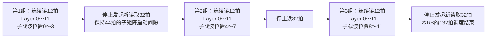
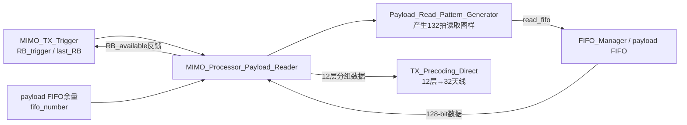
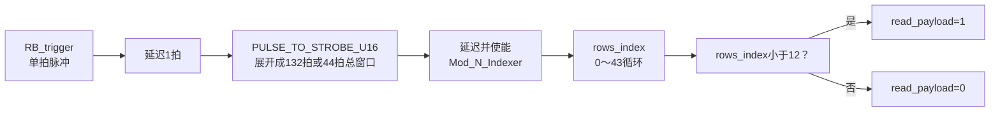
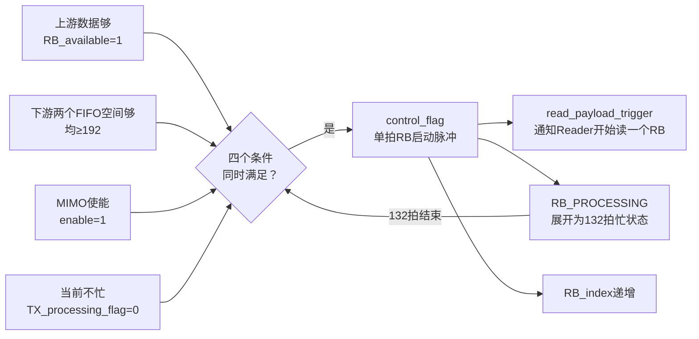
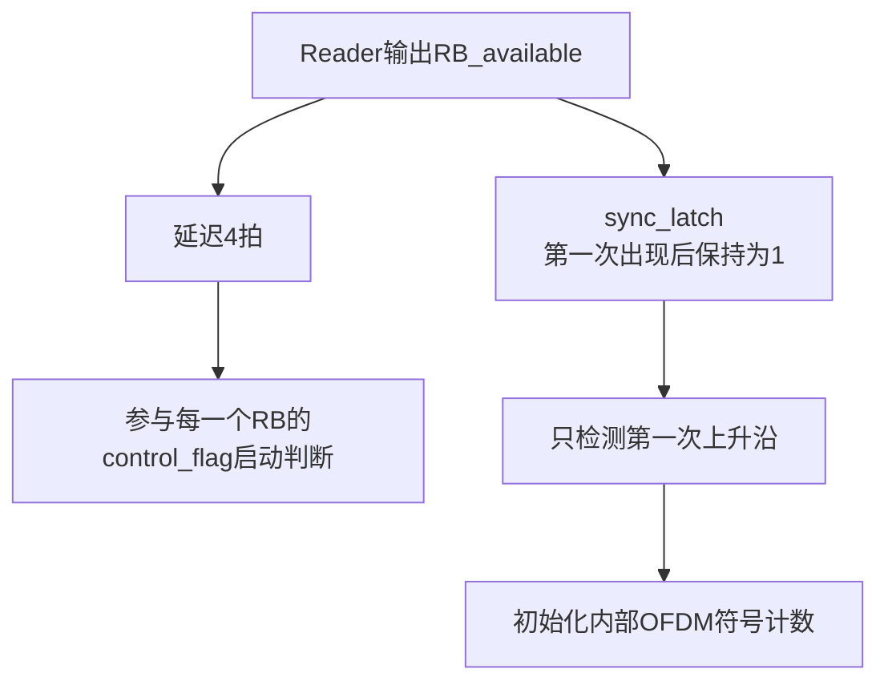

# TX_MIMO_Processor

> 所属层级：`MIMO_TX_Top` 直接子模块。
>
> 总索引：[MIMO_TX_Top子模块学习索引.md](./MIMO_TX_Top子模块学习索引.md)。
>
> 上一模块：[TX_BIT_FIFO_Exchange学习.md](./TX_BIT_FIFO_Exchange学习.md)。下一模块：[TX_RRH_FIFO_Exchange学习.md](./TX_RRH_FIFO_Exchange学习.md)。

## 先说结论：它把12层数据整理成32路天线数据

`TX_MIMO_Processor` 当前真正完成的是：

```text
从上游FIFO取出同一个RB的12层数据
→ 每次处理4个子载波
→ 用固定重复规则把12层扩成32路天线数据
→ 分成前16路和后16路
→ 打包成两路64 bit数据，交给RRH方向FIFO
```

它的名字叫 `MIMO_Processor`，但当前有效的 `TX_Precoding_Direct` **没有执行**常见的预编码矩阵乘法 `x=W·s`，也没有权重输入。工程中另有支持权重和复数点积的 `TX_Precoding.v`，但当前顶层没有例化它。

### 与《MIMO 1.1 Manual》的关系

现在可以确认：本工程明显参考了 NI 的 **LabVIEW Communications MIMO Application Framework 1.1**。不是只有模块名称相似，连数据矩阵尺寸、RB拆分方式、触发条件和双输出结构都一一对应。

```text
手册中的MIMO TX主链：
Trigger Generator
→ Payload Reader / Pilot Generator / Zero Generator
→ Precoding / Scaling
→ Submatrix Splitter
→ 两路Pack Data与输出FIFO

F0当前TX_MIMO_Processor：
MIMO_TX_Trigger
→ MIMO_Processor_Payload_Reader
→ TX_Precoding_Direct
→ Submatrix_Splitter
→ 两个MIMO_TX_Pack_Data与输出FIFO
```

#### 可以直接对应的设计

| 手册设计 | F0工程中的体现 |
|---|---|
| 系统最多支持12条空间Layer | `NUMBER_LAYER=12` |
| 单个MIMO Processor面向32根天线 | `NUMBER_ANTENNA=32` |
| 一次传递一行“4个连续子载波”的数据 | `payload_data_in[127:0]`，4个32-bit复数 |
| 1个RB有12个子载波 | `SUBCARRIER_PER_RB=12` |
| 1个RB拆成3个子矩阵，每个子矩阵4个子载波 | `NUMBER_SUBMATRIX_PER_RB=3`、`COLUMNS_PER_SUBMATRIX=4` |
| 输入子矩阵为12层×4子载波，需要连续12行 | Reader每组连续读12个128-bit字 |
| 有足够输入数据且两路输出FIFO有空间才启动 | `MIMO_TX_Trigger`同时检查`RB_available`和两路容量 |
| Submatrix Splitter把前半、后半天线送到两条并行流 | F0拆成天线0～15和16～31两路 |
| 多个MIMO Processor按完整RB分担频域数据 | F0通过四片FPGA交换，把不同内部RB块分给不同FPGA |

手册第77页给出了最关键的数据形状：`12 Layer × 12 subcarrier`构成一个RB，并拆成3个`12 Layer × 4 subcarrier`子矩阵。它正好解释了F0里三个容易显得突兀的数字：

```text
128 bit = 4个复数 = 一个Layer在4个连续位置上的一行
连续读12拍 = 收齐同一个四位置子矩阵的12条Layer
重复3次 = 覆盖一个12位置RB块
```

手册第89～92页还直接说明了 `Trigger Generator`、`Payload Reader` 和 `Submatrix Splitter` 的职责，所以F0中这些模块名和结构带有明显的 LabVIEW MIMO框架来源。

#### F0不是原手册的原样移植

理解代码时必须区分下面这些改动：

| 原手册 | F0当前工程 |
|---|---|
| 2048点FFT、1200个有效子载波、100个空口RB | 4096位置的数据链、3600个有效子载波，并按12位置形成342个内部调度块 |
| TX使用基于信道互易性的权重矩阵做12维复数点积预编码 | 当前例化`TX_Precoding_Direct`，只是把12条Layer固定重复成32个天线行 |
| 原始框架说明为uncoded transmission | F0发射端增加了CRC、Turbo编码、速率匹配等信道编码过程 |
| MIMO到RRH接口采用12-bit I和12-bit Q，8个IQ装3个U64 | F0这里采用16-bit I和16-bit Q，4个IQ为128 bit，再拆成2个U64 |
| 对标准20 MHz OFDM的100个RB进行调度 | F0代码中的`RB`常表示4096位置链路里的一个12位置内部块，不能总按标准物理RB解释 |

因此，学习这份手册的正确用法是：**用它理解F0的架构、矩阵形状和调度思想，再回到RTL核准位宽、计数范围和被替换掉的算法。** 尤其不能看到手册中的真实`Precoding`，就误认为F0当前的`TX_Precoding_Direct`也在做矩阵预编码。

### 四块FPGA如何从“按Layer分工”变成“按RB分工”

BIT处理阶段，每块FPGA拥有3条本地Layer，但覆盖全部4096个位置：

```text
FPGA0：本地3条Layer × 全部位置
FPGA1：本地3条Layer × 全部位置
FPGA2：本地3条Layer × 全部位置
FPGA3：本地3条Layer × 全部位置
```

经过 `TX_BIT_FIFO_Exchange` 和 `FIFO_Manager` 后，系统进行一次分布式转置：每个数据块的4块FPGA贡献都被送到同一个目标FPGA，使目标FPGA收齐该数据块的12条Layer。

```text
交换前：每块FPGA负责3条Layer的全部RB
交换后：每块FPGA负责部分RB的全部12条Layer
```

代码中的有效全局分配为：

| 全局内部RB编号 | 负责执行TX_MIMO_Processor的FPGA |
|---|---|
| `RB mod 4 = 0` | FPGA1 |
| `RB mod 4 = 1` | FPGA3 |
| `RB mod 4 = 2` | FPGA0 |
| `RB mod 4 = 3` | FPGA2 |

例如：

```text
RB0：四块FPGA各发来3层 → FPGA1收齐12层并处理
RB1：四块FPGA各发来3层 → FPGA3收齐12层并处理
RB2：四块FPGA各发来3层 → FPGA0收齐12层并处理
RB3：四块FPGA各发来3层 → FPGA2收齐12层并处理
RB4：重新由FPGA1处理
```

这里的“RB”是MIMO交换代码把4096个位置按12个一组形成的内部数据块：341个完整块加最后1个只有4个位置的不完整块，共342个。它不应简单等同于3600个有效子载波对应的300个空口RB；保护带、DC和变换后的数据位置也进入了这条4096点数据链。

分配数量因此是：

```text
FPGA0：85个内部RB块
FPGA1：86个内部RB块
FPGA2：85个内部RB块
FPGA3：86个内部RB块；最后一个本地块是全局RB341，只含4个位置
```

### 输入是什么

控制和容量输入：

```text
clk、rst_n                  时钟和低有效复位
mimo_enable                 允许开始处理
payload_fifo_used_number    上游128-bit payload FIFO中已有多少项
number_element_fifo1/2      两路下游FIFO是否各有至少一个RB的空间
```

接口设计上 `number_element_fifo1/2` 用于下游容量保护，但当前 `MIMO_TX_Top` 将二者直接接成常数 `8'd200`；因为一个RB需要192个64-bit位置，触发器会一直认为下游空间充足。这意味着当前工程没有从真实下游FIFO形成完整背压。

数据输入：

```text
payload_data_in[127:0]
```

一个128-bit字包含4个32-bit复数，也就是某一层在连续4个子载波上的数据：

```text
128 bit = 4 × (16 bit I + 16 bit Q)
```

对于一个4子载波小块，上游按12拍送入12层：

```text
第0拍 ：Layer0 的4个子载波
第1拍 ：Layer1 的4个子载波
...
第11拍：Layer11的4个子载波
```

### 这些输入是不是都来自FIFO_Manager

不是。逐项追踪 `MIMO_TX_Top` 的实际连接：

| TX_MIMO_Processor输入 | 当前来源 | 是否来自FIFO_Manager |
|---|---|---|
| `clk` | `clk_baseband` | 否 |
| `rst_n` | 工程复位 | 否 |
| `mimo_enable` | 顶层常数 `1'b1` | 否 |
| `number_element_fifo1` | 顶层常数 `8'd200` | 否 |
| `number_element_fifo2` | 顶层常数 `8'd200` | 否 |
| `payload_fifo_used_number` | `FIFO_Manager.tx_mimo_payload_fifo_used_number` | 是 |
| `payload_data_in[127:0]` | `FIFO_Manager.tx_mimo_payload_data` | 是 |

真正的数据交互不是单向连接，而是读请求握手：

```text
FIFO_Manager
  ├─ payload_fifo_used_number ───────────────→ TX_MIMO_Processor
  └─ payload_data_in[127:0] ─────────────────→ TX_MIMO_Processor

TX_MIMO_Processor
  └─ read_payload_fifo ─→ MIMO_TX_Top延迟1拍
                         ─→ FIFO_Manager.tx_read_mimo_fifo_req
```

`FIFO_Manager` 内部有4个BIT2MIMO接收FIFO：一路本地回环加三路Aurora。它先确认四个FIFO都能提供当前RB的数据，然后把 `tx_mimo_payload_fifo_used_number` 输出为36；否则输出0。这个信号目前更像“一个完整RB是否准备好”的状态编码，并不是四个FIFO真实占用量的求和。

每个接收FIFO都是写入64 bit、读出128 bit，因此一次读出会把两个64-bit字合成一个128-bit字，也就是4个32-bit复数。`MIMO_TX_Top` 使用 `src_mimo_from_bit_fifo_id` 按下面的顺序选择数据来源：

```text
连续读3次源FPGA0：得到该FPGA的3条本地layer
连续读3次源FPGA1：得到另外3条layer
连续读3次源FPGA2：得到另外3条layer
连续读3次源FPGA3：得到另外3条layer

合计12次读取 → 得到同一四子载波小块的12条layer
```

这里最容易因为“都是12个复数”而混淆。以FPGA0的3条本地layer为例，连续3次读取的二维位置是：

```text
读取0：Layer0 × 子载波0、1、2、3 = 4个复数
读取1：Layer1 × 子载波0、1、2、3 = 4个复数
读取2：Layer2 × 子载波0、1、2、3 = 4个复数

合计：3条layer × 4个子载波 = 12个复数
```

它是一个 `3行 × 4列` 的小矩阵，不是某一条layer横跨12个子载波的 `1行 × 12列` RB。因此这3次读取只覆盖一个RB频率范围的三分之一。

该FPGA完成整个RB还要读取另外两组：

```text
子载波0～3：  3条layer × 4 = 12个复数，需要3次128-bit读取
子载波4～7：  3条layer × 4 = 12个复数，需要3次128-bit读取
子载波8～11： 3条layer × 4 = 12个复数，需要3次128-bit读取

一个FPGA对一个完整RB的贡献：
3条layer × 12个子载波 = 36个复数 = 9次128-bit读取
```

四块FPGA合起来才得到MIMO处理使用的完整12层RB矩阵：

```text
12条layer × 12个子载波 = 144个复数
144 ÷ 每次4个复数 = 36次128-bit读取
```

因此，`FIFO_Manager` 的核心作用是先把“本地3层+其他三块FPGA各3层”汇聚成可供本机MIMO处理的12层输入流。

还有一个值得注意的时序设计：`FIFO_Manager` 没有向 `TX_MIMO_Processor` 单独提供数据valid。后者把自己的 `read_payload_fifo` 延迟4拍，当作 `payload_data_in` 有效信号。这要求FIFO读取延迟必须始终符合固定的4拍假设。

### 中间经过什么处理

#### 第一步：确认可以处理一个RB

`MIMO_TX_Trigger` 同时检查上游已有足够数据、两路下游有足够空间以及 `mimo_enable=1`，满足条件才启动一个RB处理。一个普通RB需要从上游读取36个128-bit字：

```text
12层 × 3个四子载波小块 = 36个128-bit字
```

#### 第二步：按12层读出一个四子载波小块

`MIMO_Processor_Payload_Reader` 每次连续读取12拍，得到同一组4个子载波的全部12层数据。一个RB有3组，所以一共执行3次。

#### 第三步：把12层固定扩展成32路

`TX_Precoding_Direct` 的逻辑映射是：

```text
天线 0～11  ← Layer 0～11
天线12～23  ← 再重复Layer 0～11
天线24～31  ← 再重复Layer 0～7
```

因此输入12拍，输出32拍。这里的“天线”是后级数据布局中的32个输出行；它不是根据信道计算出的波束赋形结果。

#### 第四步：拆成两组天线

`Submatrix_Splitter` 使用双页RAM缓存和换序，把32路拆成：

```text
第0路输出有效：天线0～15
第1路输出有效：天线16～31
```

两组共用一条128-bit数据总线，通过两个独立valid信号说明当前数据属于哪一组。

#### 第五步：把128 bit改成64 bit FIFO格式

两套 `MIMO_TX_Pack_Data` 分别处理前16路和后16路。每根天线的128-bit字包含4个复数，因此拆成两个64-bit字：

```text
64-bit字0：该天线的子载波0、1
64-bit字1：该天线的子载波2、3
```

一个完整RB有3个四子载波小块，因此每路输出FIFO得到：

```text
16根天线 × 每根2个64-bit字 × 3组 = 96个64-bit字
```

这里的 `2` 和 `3` 分别来自位宽转换和子载波分组：

```text
一个RB = 12个子载波

本模块每次处理4个子载波：
第1组：子载波0、1、2、3
第2组：子载波4、5、6、7
第3组：子载波8、9、10、11

所以：12 ÷ 4 = 3个四子载波小块
```

对其中一根天线、其中一个四子载波小块：

```text
4个子载波 × 每个复数32 bit = 128 bit

后级FIFO每个字是64 bit：
第1个64-bit字装2个复数
第2个64-bit字再装2个复数

所以：128 ÷ 64 = 每根天线每个小块产生2个64-bit字
```

展开成一个完整例子：

```text
天线0：
  子载波0～3   → 2个64-bit字
  子载波4～7   → 2个64-bit字
  子载波8～11  → 2个64-bit字
  合计6个64-bit字

前16根天线：16 × 6 = 96个64-bit字
后16根天线：16 × 6 = 96个64-bit字
总计：96 + 96 = 192个64-bit字
```

两路合计192个64-bit字，这就是参数 `U64_PER_RB=192` 的来源。

### 输出是什么

```text
read_payload_fifo    请求上游payload FIFO输出一个128-bit字

write_fifo_0         fifo_data_0有效，属于前16路天线
fifo_data_0[63:0]    前16路天线打包后的数据

write_fifo_1         fifo_data_1有效，属于后16路天线
fifo_data_1[63:0]    后16路天线打包后的数据
```

### 整体实现了什么功能

一句话概括：**它把“按12层组织的频域数据”重新组织成“按32路发射天线和两路RRH FIFO组织的数据”。**

### 直接子模块和建议学习顺序

建议先顺着主数据流学习，再回头学习总调度：

```text
1. MIMO_Processor_Payload_Reader：上游数据到底怎么读出来
2. TX_Precoding_Direct：12层到底怎么变成32路
3. Submatrix_Splitter：32路怎么分成前16路和后16路
4. MIMO_TX_Pack_Data：128 bit怎么改成64 bit FIFO格式
5. MIMO_TX_Trigger：最后理解整个RB何时启动、如何计数
```

其中顶层例化了两套 `MIMO_TX_Pack_Data`，但它们是同一种子模块，只是分别服务于前16路和后16路。


## TX_MIMO_Processor 顶层

### 实现功能

从跨板汇聚后的128位 payload FIFO 读取12层数据，按当前“直接预编码”规则扩展成32个发射天线行，再拆分并打包到两路64位 MIMO-to-RRH FIFO。

### 实现原理解读

```text
128-bit layer payload
 → 按RB读取12个连续行
 → TX_Precoding_Direct扩展为32个天线行
 → Submatrix_Splitter分两组
 → 2×MIMO_TX_Pack_Data
 → 两路64-bit FIFO
```

这里的 `TX_Precoding_Direct` 没有执行信道相关矩阵乘法。它在检测到输入valid上升沿后产生长度为 `NUMBER_ANTENNA=32` 的输出窗口：

```text
index 0..11  ：输出当前12行
index 12..23 ：输出延迟12拍的同一组12行
index 24..31 ：输出延迟24拍后的前8行
```

等价于把12层行序列重复成32个天线行，是固定直接映射，不是常见的 `x=W·s` 自适应/码本预编码。

### 子模块关系图

```text
TX_MIMO_Processor
├─ MIMO_TX_Trigger：按RB和FIFO余量产生读取节拍
├─ MIMO_Processor_Payload_Reader：读出12行子矩阵
├─ TX_Precoding_Direct：12层直接重复到32天线行
├─ Submatrix_Splitter：拆成前/后天线组
└─ 2×MIMO_TX_Pack_Data：打包64位FIFO字
```

### 关键代码解读

Payload Reader 输出模式的源码注释为：

```text
连续12拍输出一个子矩阵，随后空32拍
```

直接预编码选择：

```verilog
if(index < 12)       data_out <= data_delay1;
else if(index > 23)  data_out <= data_delay25;
else                 data_out <= data_delay13;
```

两路打包分别对应前16根和后16根天线的数据组织。

### 讨论问题

1. **当前是否真正做了MIMO预编码？** 只做固定直接映射/重复，没有看到信道矩阵或码本权重乘法。
2. **为什么输入12行、输出32行？** 系统定义12层、32发射天线；当前模块用重复映射补足32个天线行。
3. **128位一拍代表什么？** 它包含4个32-bit复数，即某一层/输出行在连续4个子载波上的数据；每个复数由16-bit实部和16-bit虚部组成。
4. **下游FIFO容量检查真的有效吗？** 顶层当前把两个容量输入固定为200，而不是连接真实FIFO计数；阈值192始终满足，因此这部分只能算预留接口，不能防止真实下游拥塞。

## 1. MIMO_Processor_Payload_Reader

### 一句话功能

它不做预编码，也不改变复数数据内容；它只负责按固定节拍从上游 payload FIFO 取出“一个RB的12层数据”，并给后面的 `TX_Precoding_Direct` 留出把12层展开成32天线的处理窗口。

### 输入是什么

| 输入 | 来源 | 含义 |
|---|---|---|
| `RB_trigger` | `MIMO_TX_Trigger` | 开始处理本FPGA负责的下一个RB |
| `last_RB` | `MIMO_TX_Trigger` | 当前是不是整个4096点流最后那个不完整的内部RB块 |
| `RB_index[7:0]` | `MIMO_TX_Trigger` | 本FPGA内部的RB编号 |
| `fifo_number[5:0]` | `FIFO_Manager`一侧payload FIFO | 上游还剩多少个128-bit字 |
| `fifo_data[127:0]` | payload FIFO | 一拍包含同一Layer的4个复数子载波数据 |
| `fifo_data_in_valid` | 顶层将 `read_payload_fifo` 延迟4拍 | 表示当前FIFO输出数据已经到达 |

一个128-bit字的结构是：

```text
128 bit
= 4 × 32-bit复数
= 4 × {16-bit imag, 16-bit real}
```

因此它每读一次，不是读一个RB，也不是读12个复数，而是读出：

```text
某一个Layer × 连续4个子载波
```

### 经过什么处理

普通完整RB需要从FIFO读取36个128-bit字，但不是连续读36拍，而是分成三组：



精确到 `read_fifo` 的132拍模式是：

```text
周期   0～11   ：read_fifo=1，读取第1个四子载波小块的12层
周期  12～43   ：read_fifo=0，空32拍

周期  44～55   ：read_fifo=1，读取第2个四子载波小块的12层
周期  56～87   ：read_fifo=0，空32拍

周期  88～99   ：read_fifo=1，读取第3个四子载波小块的12层
周期 100～131  ：read_fifo=0，空32拍
```

这个模式来自两个参数：

```text
ROW_PER_QR       = 44  = 12拍读取 + 32拍不读
CLOCK_CYCLE_PER_RB = 132 = 3 × 44
```

内部 `rows_index` 按44循环；只有 `rows_index < NUMBER_LAYER(12)` 时，`read_payload=1`。所以132拍中自然出现三段“12高、32低”。

### 36个128-bit字到底代表多少数据

```text
每组：12个128-bit字
    = 12个Layer × 每Layer 4个复数

三组：3 × 12个128-bit字
    = 12个Layer × 每Layer 12个复数
    = 12层在一个完整12子载波RB上的数据
```

所以结论是：

```text
连续读12次 = 一个“四子载波小块”的12层数据，不是完整RB
三次连续读12次 = 一个完整RB的12层数据
```

对于当前FPGA3负责的最后一个不完整内部RB块，只剩4个位置，因此 `last_RB=1` 时只运行一个44拍小周期，只读取12个128-bit字。

### 输出是什么

| 输出 | 去向 | 作用 |
|---|---|---|
| `RB_available` | 反馈给 `MIMO_TX_Trigger` | 普通RB要求FIFO至少有36个字；FPGA3最后一个不完整块只要求12个字 |
| `read_fifo` | 上游payload FIFO | 真正的读请求，按“12高、32低”重复三次 |
| `data_out[127:0]` | `TX_Precoding_Direct` | FIFO数据打一拍后原样输出，没有进行重排或数学运算 |
| `data_out_valid` | `TX_Precoding_Direct` | 与 `data_out` 对齐的有效信号 |

### 子模块关系



`MIMO_Processor_Payload_Reader` 只有一个真正的功能子模块：`Payload_Read_Pattern_Generator`。父模块本身另外完成FIFO余量判断、数据打一拍和valid对齐。

### Payload_Read_Pattern_Generator精读

#### 一句话功能

它把 `RB_trigger` 这个单拍启动脉冲，转换成上游FIFO真正需要的读取图样：普通块输出三段“读12拍、停32拍”，最后一个不完整块只输出一段。

#### 输入和输出

```text
输入：
RB_trigger    启动一次本地RB块读取
last_RB       本次是不是全局最后一个只有4个位置的内部块

输出：
read_payload  FIFO读使能；高电平的每一拍读取一个128-bit字
```

它并不接收FIFO数据，也不知道128位中具体是什么；它只生成读使能。

#### 内部处理链



处理过程可以直接写成下面的伪代码：

```text
收到RB_trigger：
    如果last_RB=0：总调度窗口运行132拍
    如果last_RB=1：总调度窗口只运行44拍

窗口运行期间：
    rows_index按0～43循环
    rows_index为0～11  → 读FIFO
    rows_index为12～43 → 不读FIFO
```

普通块的 `rows_index` 实际走三轮：

```text
第1轮：0～43  → 12拍读 + 32拍停
第2轮：0～43  → 12拍读 + 32拍停
第3轮：0～43  → 12拍读 + 32拍停

总长度：3 × 44 = 132拍
实际读取：3 × 12 = 36个128-bit字
```

最后一个不完整块只剩一组4个位置，因此总窗口改为44拍：

```text
第1轮：0～43 → 只读取前12拍

实际读取：12个128-bit字
          = 12条Layer × 每条Layer的4个剩余位置
```

#### 为什么有这些延迟寄存器

从 `RB_trigger` 到 `read_payload` 之间依次经过启动脉冲寄存、总窗口、行计数条件和输出寄存。代码注释把这条控制路径概括为4拍延迟：

```text
RB_trigger
  → RB_trigger_delay1
  → clock_strobe / clock_strobe_delay1
  → rows_index / rows_flag
  → read_payload
```

这些延迟主要用于让计数器和比较结果逐级对齐，不是在延迟FIFO数据。

父模块后面还有另一条数据返回路径：

```text
read_fifo
  → 上游FIFO固定读取延迟4拍
  → fifo_data、fifo_data_in_valid到达
  → 父模块再寄存1拍
  → data_out、data_out_valid
```

所以源代码开头所说的总延迟9拍，指的是：

```text
产生读请求4拍 + FIFO返回4拍 + 输出寄存1拍 = 9拍
```

这里的“FIFO返回4拍”不在本模块内部实现。`TX_MIMO_Processor` 顶层把 `read_payload_fifo` 延迟4拍后接到 `fifo_data_in_valid`，因此这是一项必须由外部FIFO接口满足的固定时序约定。

#### 32拍低电平到底表示什么

不能把它机械理解成“先把12拍全部读完，再从头开始串行输出32根天线”。当前流水线中，`TX_Precoding_Direct`在第一组输入开始到达后便会启动32拍输出，输入和输出会重叠。

准确说法是：`Payload_Read_Pattern_Generator`把相邻两个四位置子矩阵的**输入起点固定间隔为44拍**。其中前12拍允许输入12条Layer，后32拍不再发起下一组读取，使后级32天线展开、拆分和打包流水线有足够处理时间。

#### 这个模块依赖的前提

1. FIFO里的顺序必须事先就是“子矩阵0的Layer0～11、子矩阵1的Layer0～11、子矩阵2的Layer0～11”；Reader不会检查或重排。
2. `RB_trigger`发出后，读取图样会运行完整的132拍或44拍，中途不会重新检查 `fifo_number`。
3. 因此触发前必须保证普通块已有36个字、最后特殊块已有12个字，而且运行期间不能被其他逻辑抢走这些数据。
4. `data_out`每拍都会寄存 `fifo_data`，即使数据无效；后级必须以 `data_out_valid`为准。

### 关键代码解读

普通RB至少需要36个128-bit FIFO字；FPGA3的最后一个不完整块只需要12个：

```verilog
RB_available <= (fifo_number >= 6'd36) ||
                ((RB_index == 8'd85) &&
                 (`FPGA_ID == 2'd3) &&
                 (fifo_number >= 6'd12));
```

读窗口长度由是否为最后一个不完整块决定：

```verilog
counter_number <= last_RB ? `ROW_PER_QR : `CLOCK_CYCLE_PER_RB;
```

每44拍只读取前12拍：

```verilog
rows_flag   <= (rows_index < `NUMBER_LAYER);
read_payload <= rows_flag && clock_strobe_delay2;
```

数据本身没有被修改：

```verilog
data_out_valid <= fifo_data_in_valid;
data_out       <= fifo_data;
```

### 当前应记住的结论

1. Reader的核心不是“算”，而是“按节拍取数据”。
2. 一次128-bit读取包含某Layer的4个复数子载波。
3. 连续12次读取汇集同一四子载波小块的12个Layer。
4. 三个四子载波小块组成一个完整12子载波RB，因此普通RB共读取36个128-bit字。
5. 每44拍的读请求图样是前12拍读、后32拍不读；32天线输出窗口会与前12拍输入发生流水重叠，后32拍的低电平负责把相邻两组12层输入起点隔开。

## 2. MIMO_TX_Trigger

### 一句话功能

`MIMO_TX_Trigger` 是 `TX_MIMO_Processor` 的RB调度器：它检查上游数据、下游空间和总使能，条件全部满足时启动一个RB，并在132拍处理窗口结束后再决定是否启动下一个RB。

它不读取复数数据，也不做预编码，只产生触发和索引。

### 输入是什么

| 输入 | 来源 | 含义 |
|---|---|---|
| `enable` | 顶层 `mimo_enable` | MIMO处理总开关；当前顶层接常数1 |
| `RB_available` | `MIMO_Processor_Payload_Reader`反馈 | 上游payload FIFO是否至少有处理下一个RB所需的数据 |
| `number_element_fifo1` | 下游FIFO0容量信息 | 前16天线输出FIFO是否至少还能接收一个RB |
| `number_element_fifo2` | 下游FIFO1容量信息 | 后16天线输出FIFO是否至少还能接收一个RB |
| `FPGA_ID` | 参数宏 `FPGA_ID` | 当前是哪片FPGA；本模块中主要用于判断FPGA3的最后一个不完整RB |

当前顶层把两个下游FIFO容量输入固定为 `8'd200`，而启动阈值是 `U64_PER_RB=192`，所以现有工程中“下游空间足够”实际上始终成立，真正会变化的主要是 `RB_available`。

### 什么时候启动一个RB

源码的核心条件只有这一句：

```verilog
control_flag <= (!TX_processing_flag) &
                FIFO_available &
                enable &
                RB_available_delay4;
```

把它翻译成直话：

```text
当前没有正在处理RB
并且前16天线FIFO空间足够
并且后16天线FIFO空间足够
并且MIMO总开关打开
并且上游已经准备好一个RB的数据
──────────────────────────────
= 产生一次control_flag，启动一个RB
```



### 为什么要产生132拍忙状态

`control_flag` 进入 `PULSE_TO_STROBE_U16`：

```verilog
.N(`CLOCK_CYCLE_PER_RB)  // 当前为132
```

得到 `TX_processing_flag`。这132拍对应Reader的三段固定读请求周期：

```text
一个完整RB
= 3个四子载波小块

每个小块的输入调度周期占44拍
= 前12拍read_fifo=1 + 后32拍read_fifo=0

总时间
= 3 × 44
= 132拍
```

这里不能理解成“先用12拍完整读完，然后再独占32拍输出”。`TX_Precoding_Direct` 在12层输入valid的上升沿就启动32拍输出窗口，输入和输出会流水重叠；44拍只是相邻两个四子载波小块的输入起点间隔。

在这132拍内，`TX_processing_flag=1`，核心启动条件中的 `!TX_processing_flag` 为0，因此不可能重复启动下一个RB。

### 启动以后产生哪些输出

#### 1. read_payload_trigger

```verilog
read_payload_trigger <= control_flag;
```

它送给 `MIMO_Processor_Payload_Reader`，让Reader开始产生“12拍读、32拍停，重复三次”的FIFO读取图样。

#### 2. RB_index

`Mod_N_Indexer` 在每次 `control_flag=1` 时加1：

```text
0 → 1 → 2 → ... → 85 → 0
```

当前工程：

```text
FPGA_ID      = 3
NUMBER_RB    = 86
RB_index范围 = 0～85
```

注意：这是“本FPGA内部负责的RB序号”，不是直接输出无线接口的全局RB编号。本FPGA应该处理哪些全局内部RB块，已经由前面的 `FIFO_Manager/TX_BIT_FIFO_Exchange` 分配和排好；这个模块只按顺序读取本地FIFO。

#### 3. last_RB

```verilog
last_RB <= control_flag &&
           (RB_index_temp == NUMBER_RB-1) &&
           (FPGA_ID == 3);
```

因此只有：

```text
当前是FPGA3
并且本地RB_index=85
并且这一拍正在启动RB
```

才会产生 `last_RB=1`。它告诉Reader：最后这个内部RB块只有一个四子载波小块，只需要读12个128-bit字，不需要读普通RB的36个字。

#### 4. OFDM_symbol_start和OFDM_symbol_index

当 `RB_index=0` 的RB被启动时，`Mod_N_Indexer.index_zero` 产生 `OFDM_symbol_start_ahead`，延迟一拍后得到 `OFDM_symbol_start`。

当本地RB计数在最后一个编号回卷时，`wrap_back` 产生 `OFDM_symbol_done_ahead`，再用它推动内部 `Index_Generator` 的OFDM符号计数。因此：

```text
本地第0个RB启动      → OFDM_symbol_start
本地最后一个RB启动   → 准备把OFDM_symbol_index推进到下一符号
```

这里的“done_ahead”是在最后一个RB启动时产生，不是等待最后一个RB所有数据完全输出以后才产生；命名中的 `ahead` 正是在说明它是提前触发。

#### 5. pilot_trigger

模块根据内部 `symbol_index/subframe_index` 判断当前是不是需要RS的符号：

```verilog
rs_need_code_flag <= (symbol_index == 0) ||
                     ((symbol_index == 7) && (subframe_index == 0));
```

当RB启动且当前符号需要RS时，产生 `pilot_trigger`。但在当前 `TX_MIMO_Processor.v` 中该端口悬空，没有连接到后续数据通路，所以当前主要数据处理中它没有实际作用。

### RB_available为什么有两条路径



两条路径用途不同：

1. `RB_available_delay4` 每次都参与“能不能启动下一个RB”的判断；
2. `RB_available_latch` 一旦第一次置1就保持到复位，只用它的第一次上升沿启动内部时序计数，不负责后续RB流控。

### 子模块关系

```text
MIMO_TX_Trigger
├─ PULSE_TO_STROBE_U16：把一次RB启动展开成132拍忙状态
├─ Mod_N_Indexer：本FPGA的RB编号0～85循环
├─ Index_Generator：根据一轮RB处理完成推进OFDM符号/子帧编号
├─ sync_latch：锁存第一次RB可用事件
├─ delay_1 × 3：RB可用、符号起点和锁存信号对齐
└─ delay_n：RB_index与OFDM_symbol_index输出对齐
```

### 输出是什么

| 输出 | 当前去向 | 功能 |
|---|---|---|
| `read_payload_trigger` | `MIMO_Processor_Payload_Reader` | 启动一个RB的数据读取 |
| `last_RB` | `MIMO_Processor_Payload_Reader` | 指示FPGA3最后一个不完整内部RB块 |
| `RB_index` | `MIMO_Processor_Payload_Reader` | 本FPGA本地RB编号 |
| `OFDM_symbol_start` | 顶层未连接 | 标记本地第0个RB启动 |
| `OFDM_symbol_index` | 顶层内部信号/调试 | 当前OFDM符号编号 |
| `pilot_trigger` | 顶层未连接 | 预留的RS处理触发 |

### 整个模块最终做了什么

```text
等待资源
  ↓
四项条件全部满足
  ↓
启动一个RB
  ├─ 通知Reader读取数据
  ├─ 给出当前RB编号
  ├─ 判断是不是最后一个不完整RB
  └─ 锁住132拍，防止重复启动
  ↓
132拍结束
  ↓
如果资源仍足够，启动下一个RB
```

最应该记住的一句是：`MIMO_TX_Trigger` 只负责“何时处理下一个RB”，真正的12层数据读取由Reader完成，12层到32天线的转换由 `TX_Precoding_Direct` 完成。

### 本轮问题统一澄清

#### 1. 两个FIFO究竟是什么

`MIMO_TX_Trigger` 内部没有例化两个FIFO。`number_element_fifo1/2` 只是两个“下游空间余量”输入，设计意图对应 `TX_MIMO_Processor` 的两条64-bit输出流：

```text
输出流0：MIMO_TX_Pack_Data0 → 前16根天线
输出流1：MIMO_TX_Pack_Data1 → 后16根天线
```

到了 `MIMO_TX_Top`，两条输出流还会继续分流：

```text
输出流0 → 物理MIMO-to-RRH FIFO0、FIFO1
输出流1 → 物理MIMO-to-RRH FIFO2、FIFO3
```

因此需要区分：

```text
MIMO_TX_Trigger接口上：2个逻辑输出方向的容量检查
MIMO_TX_Top外部实际：4个MIMO-to-RRH FIFO
```

当前RTL没有把真实FIFO余量接进来，而是把两个输入都固定为200；所以这两个容量检查现在只是预留接口。

从实际数据量看，一个完整RB总共产生192个64-bit字，但两条逻辑输出流各自只有96个，继续拆到4个物理FIFO后每个是48个。因此源码让 `number_element_fifo1` 和 `number_element_fifo2` 分别都与192比较是过度保守的；如果以后接入真实FIFO余量，这个阈值及“计数表示已用量还是剩余空间”的语义必须重新核实。

#### 2. control_flag会不会形成锁存或危险闭环

存在一条有意的同步反馈：

```text
control_flag
  → PULSE_TO_STROBE产生132拍TX_processing_flag
  → !TX_processing_flag阻止新的control_flag
  → 132拍结束后才允许再次启动
```

但它不是组合逻辑死循环，也不会推断锁存器，因为：

1. `control_flag` 在时钟触发的 `always @(posedge clk)` 中每拍都有明确赋值；
2. `PULSE_TO_STROBE_U16` 内部有寄存器状态机；
3. `TX_processing_flag` 在 `control_flag` 拉高后立即阻止下一拍继续拉高。

正常波形是：

```text
control_flag        0 1 0 0 0 ........ 0 1
TX_processing_flag  0 1 1 1 1 ...132拍...0 1
```

所以它是“带忙信号的启动握手闭环”，不是错误锁存。

#### 3. RB_available_latch为什么一直是1

是的，当前代码中它第一次被 `RB_available` 置1后，会一直保持到全局复位：

```verilog
.set(RB_available),
.clear(!rst_n)
```

这是有意行为，因为它只用于检测“系统第一次有RB数据”的上升沿，给内部OFDM符号计数器一个初始启动事件。锁存后：

```text
RB_available_latch         一直为1
延迟后的latch              也变为1
RB_available_latch_rising  只在第一次跳变时为1拍，之后回到0
```

后续每个RB是否能启动，并不看这个锁存信号，而是看另一条 `RB_available_delay4` 路径。因此它一直为1不会导致RB一直触发。

限制是：如果希望不复位就重新开始一套完全独立的帧时序，这个锁存器不会再次产生上升沿；当前设计默认全局复位负责重新初始化。

#### 4. OFDM符号、RB、12位置和4096点是什么关系

首先要把“子载波”和“时域采样点”分开：

```text
IFFT输入：4096个频域位置/频率bin
IFFT输出：4096个时域复数采样点
```

子载波属于频域，不能直接等同于时域采样点。当前工程的MIMO处理接口面对一块4096个复数位置的数据，并按每12个位置分块处理；代码把这种“单个OFDM符号内的12位置切片”简称为RB。

```text
一个OFDM符号块：4096个复数位置
一个代码内部RB块：通常12个连续位置
4096 = 341×12 + 4
```

所以一整个4096点块被切成341个完整12位置块，再加最后一个4位置不完整块，共342个内部块。它们通过四片FPGA分担。

标准无线概念中的物理RB是“频域12个子载波 × 时域一个slot中的若干OFDM符号”；本代码的 `MIMO_TX_Trigger` 每次调度的是其中某一个OFDM符号上的12位置切片，不能把它理解成完整时频二维物理RB。

计数层级应理解成：

```text
OFDM_symbol_index
  └─ 当前OFDM符号内依次处理多个本地RB块
       └─ 一个完整RB块再分成3个四位置小块
```

因此在这个模块里，RB计数完成一轮以后，才把 `OFDM_symbol_index` 推进到下一个符号。

#### 5. 12拍和32天线为什么会同时出现

这里的12和32不是同一个维度：

```text
12拍输入：12个Layer
32拍输出：32根发射天线
```

对同一个四位置小块：

```text
输入第0拍  ：Layer0的4个复数
输入第1拍  ：Layer1的4个复数
...
输入第11拍 ：Layer11的4个复数
```

`TX_Precoding_Direct` 检测到这段输入valid的上升沿后，启动一个32拍输出窗口，并通过12拍、24拍延迟线重复这些输入：

```text
输出天线 0～11  ：Layer 0～11
输出天线12～23  ：再次输出Layer 0～11
输出天线24～31  ：再次输出Layer 0～7
```

时序上是流水重叠，不是严格串行：

```text
拍号             0........11 12................43
Reader读请求      ████████████____________________
12层输入          ████████████
32天线输出窗口      ████████████████████████████████
下一组12层输入                                      从第44拍开始
```

因此44拍的真正含义是：

```text
相邻两组“四位置×12层”输入之间相隔44拍
```

并不是数学上必须把“12拍输入”和“32拍输出”完全不重叠地相加。
