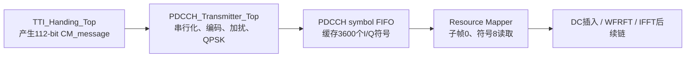
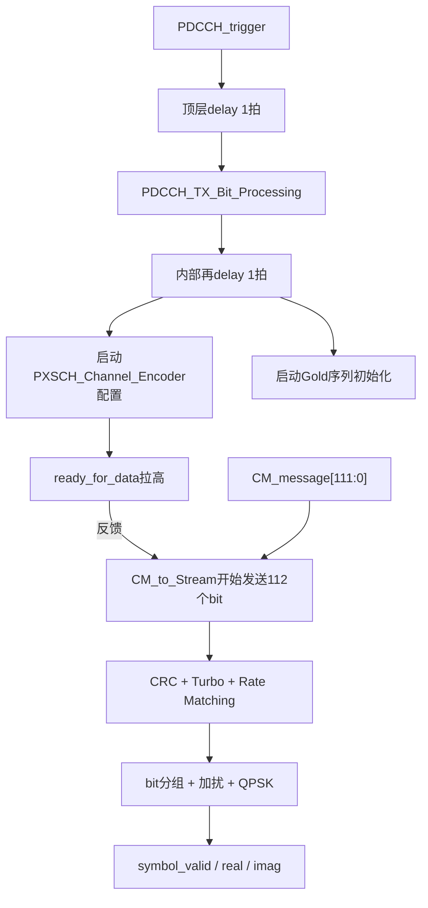
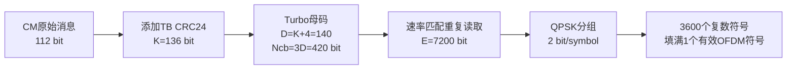
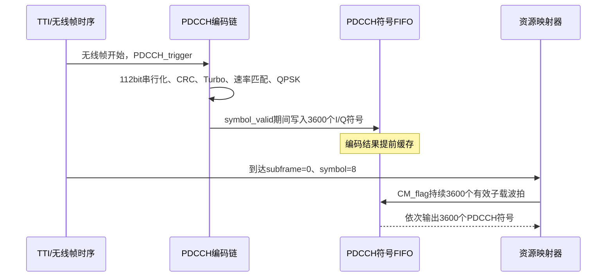
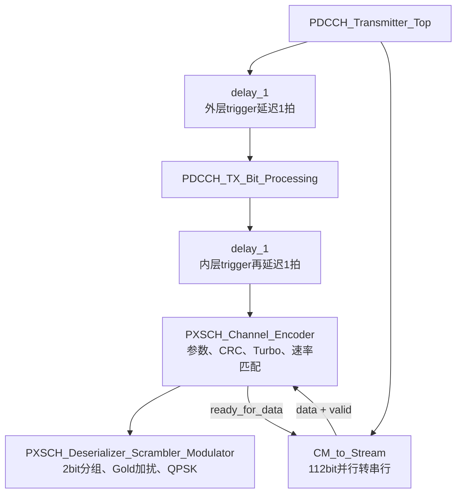
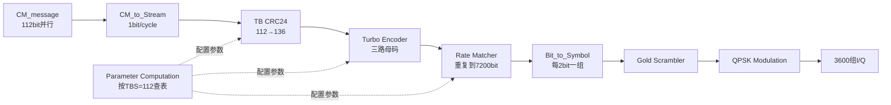
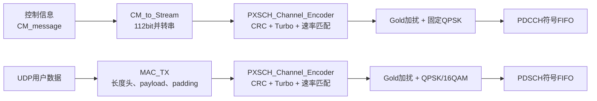
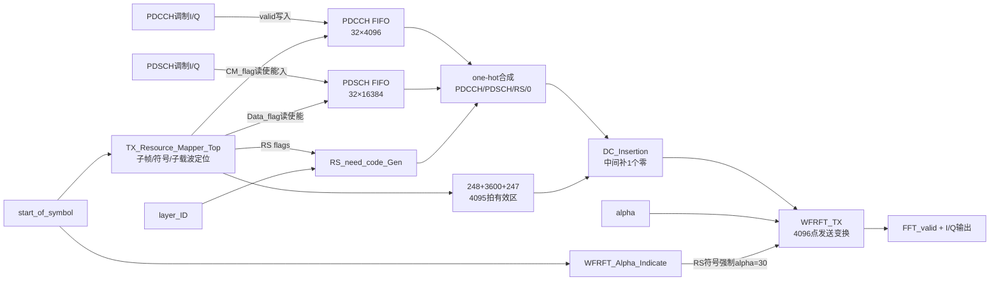
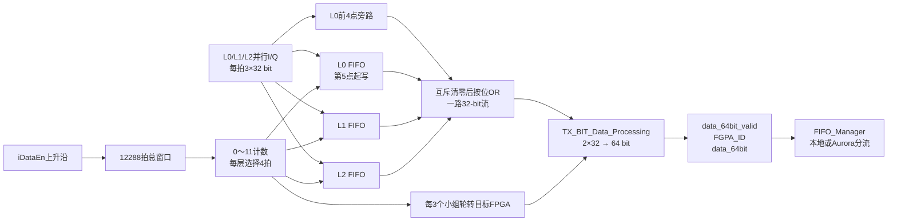

> 范围：以 `MIMO_TX_Top` 为发射端总入口，只记录已经从当前 RTL 核实的结论。
>
> 标题规则：一级标题对应 `MIMO_TX_Top` 的直接子模块；二级标题对应各模块内部的直接子模块；每个模块统一按“实现功能、实现原理解读、子模块关系图、关键代码解读、讨论问题”组织。
>
> 证据优先级：当前有效 RTL 连接 > 参数宏和 IP 配置 > 源码注释 > 历史讨论。源码注释与连接冲突时，以有效代码为准。
>
> 内容保留规则：重新整理只改变章节归属和表达顺序，不为了缩短篇幅删除有效技术细节、推导过程、RTL片段、状态机过程、算例或讨论问答；已经证实的错误则直接改成正确结论。

发射端总链路：

```text
3路UDP用户数据
 → 3×TX_BIT_Processor
 → TX_BIT_FIFO_Exchange
 → FIFO_Manager/Aurora跨板交换
 → TX_MIMO_Processor
 → TX_RRH_FIFO_Exchange
 → TX_RRH_Processor
 → Over_Sample_Group
 → DAC/RF
```

当前 `MIMO_Parameter.vh` 的关键规模：

```text
FPGA_ID                  = 3
NUMBER_LAYER             = 12
NUMBER_LAYER_PER_FPGA    = 3
NUMBER_ANTENNA           = 32
SUBCARRIER_PER_RB        = 12
SUBCARRIER_PER_OFDM      = 3600
OFDM_SYMBOL_PER_SLOT     = 7
OFDM_SYMBOL_PER_RADIO10  = 140
```

# 1. TX_BIT_Processor

## 1.0 TX_BIT_Processor 顶层

### 实现功能

`TX_BIT_Processor` 完成单个本地 layer 的发送侧 bit 处理：接收一路 UDP 字节流和系统控制参数，最终输出一条按 OFDM 网格组织的复数基带流。

`MIMO_TX_Top` 一共例化三个该模块：

```text
Layer_ID = FPGA_ID×3 + 0
Layer_ID = FPGA_ID×3 + 1
Layer_ID = FPGA_ID×3 + 2
```

当前 `FPGA_ID=3`，因此本 FPGA 对应 layer 9、10、11；四块 FPGA 合计12层。

### 实现原理解读

它同时维护三类路径：

```text
时间路径：无线帧触发 → 符号/子帧/子载波计数
数据路径：UDP字节 → 自定义MAC成帧 → 信道编码 → 加扰调制
网格路径：PDCCH/PDSCH/RS → 资源映射 → 变换输出
```

三条路径不能只比较模块级延时，必须通过 `valid`、trigger 和固定安全窗口在后续重新对齐。

### 子模块关系图

```text
TX_BIT_Processor
├─ TX_Trigger
├─ TTI_Handing_Top
├─ TX_PDSCH_Configuration
├─ Buffer_UDP_Data
├─ MAC_TX
├─ PXSCH_TX_Bit_Processing_Top
├─ PDCCH_Transmitter_Top
├─ Combine_Control_and_Data
└─ Invalidate_Layer_Streams
```

### 关键代码解读

直接实例位置：

| 子模块 | `TX_BIT_Processor.v` 行号 | 主要输出 |
|---|---:|---|
| `TX_Trigger` | 36 | 原始 OFDM symbol trigger |
| `TTI_Handing_Top` | 59 | 四级索引、CM message |
| `TX_PDSCH_Configuration` | 84 | PDSCH trigger、MCS/TBS |
| `Buffer_UDP_Data` | 112 | 基带时钟域字节流 |
| `MAC_TX` | 127 | 串行 TB bit |
| `PXSCH_TX_Bit_Processing_Top` | 150 | PDSCH I/Q 符号 |
| `PDCCH_Transmitter_Top` | 176 | PDCCH I/Q 符号 |
| `Combine_Control_and_Data` | 192 | 资源映射后的复数流 |
| `Invalidate_Layer_Streams` | 222 | 使能门控后的 layer 流 |

### 讨论问题

1. 当前 `TX_BIT_Processor.v`、`MAC_FIFO.v` 等文件存在中文乱码后换行丢失，部分端口连接或状态标签被 `//` 注释吞掉。本文描述模块设计意图和可见有效逻辑；正式仿真前必须恢复损坏行。
2. 端口名中的 `clk_192M` 是历史命名，实际频率应沿顶层时钟连接确认，不能仅凭端口名断言。
3. `FFT_*` 等信号名不等于已经证明执行标准 FFT/IFFT；应继续追踪 `Combine_Control_and_Data` 内的实际变换模块。

## 1.1 TX_Trigger

### 实现功能

收到一次无线帧触发后，在 `TX_active=1` 时启动一个完整无线帧的 OFDM 符号触发序列，共输出140个 `symbol_start_trigger`。

### 实现原理解读

```text
radio_frame_trigger
 → 上升沿检测
 → enable脉冲
 → TX_Symbol_Start_Generator锁存“正在发一帧”
 → 符号周期计数器按sym_dur循环
 → 每次回卷输出一个symbol_start
 → 符号数计到140后finish清除锁存
```

`feedback_en_7_U16_bmp` 每完成一个符号切换到下一个槽，形成7符号循环。当前七个槽最终只使用两个输入值，而 `FEEDBACK_1`、`FEEDBACK_2` 都配置为17443，因此当前没有区分一个 slot 内不同 CP 长度的符号节拍。

### 子模块关系图

```text
TX_Trigger
├─ delay_1(N=1)：上升沿检测
└─ TX_Symbol_Start_Generator
   ├─ sync_latch_another：一帧期间保持enable
   ├─ feedback_en_7_U16_bmp：7槽符号时长选择
   ├─ Mod_N_Indexer：符号内周期计数
   ├─ Mod_N_Indexer：无线帧内符号计数
   └─ delay_1×2：缓存finish和symbol_start
```

### 关键代码解读

#### 完整调用链与节拍记录

#### 模块调用链
```
TX_Trigger.v
├── delay_1 (N=1) — 上升沿检测
└── TX_Symbol_Start_Generator.v
    ├── sync_latch_another — SR锁存器 (set优先)
    ├── Mod_N_Indexer (×2) — 符号周期计数器 + 帧符号数计数器
    ├── feedback_en_7_U16_bmp — 7槽循环选择器
    └── delay_1 (×2) — 输出打拍
```

#### 关键信号流
```
radio_frame_trigger → 上升沿检测 → enable → sync_latch锁存
  → Mod_N_Indexer(symbol_durations, N=sym_dur=17443)
    → index_zero → symbol_start (每17443周期一个脉冲)
    → wrap_back → new_sym_dur (驱动7槽选择器 + 符号数计数器)
  → Mod_N_Indexer(symbols_per_radio_frame, N=140)
    → wrap_back → finish → 清零sync_latch (一帧结束)
```

#### 核心参数

**140 = 1个无线帧的符号数**
```
1无线帧 = 10子帧 × 2时隙 × 7符号 = 140符号
```

#### 时隙(Slot)在代码中的体现
- `OFDM_SYMBOL_PER_SLOT = 7` 已定义但Index_Generator状态机未使用
- `feedback_en_7_U16_bmp` 的7槽循环隐含了slot边界
- 当前FEEDBACK_1=FEEDBACK_2=17443，不区分长短CP

```verilog
trigger_in_rising = trigger_in & (~trigger_in_delay1);
enable <= trigger_in_rising & TX_active;
```

符号总数来自：

```verilog
.N(`OFDM_SYMBOL_PER_RADIO10)   // 140
```

无线帧、子帧、slot、符号关系：

```text
1 radio frame = 10 subframe
1 subframe    = 2 slot
1 slot        = 7 OFDM symbol
总计          = 10×2×7 = 140 symbol
```

`Program_Const.vh` 当前写的是：

```verilog
FEEDBACK_1 = 17443
FEEDBACK_2 = 17443
```

宏后旧注释给出的两条算式分别会得到17464和17336，都不等于17443。因此只能确认17443是当前实际符号触发间隔，不能再把旧注释当作严格推导。若基带时钟为245.76 MHz：

```text
17443 cycle ≈ 70.976 μs
17443×140 = 2,442,020 cycle ≈ 9.9369 ms
```

剩余约63.1 μs是否对应保护间隔、流水余量或其他系统安排，仍需结合 RRH/CP 插入波形验证。

### 讨论问题

1. **17443是子载波数量吗？** 不是。它的单位是时钟周期，控制时域中的符号触发间隔。
2. **子载波和符号分别属于什么维度？** 子载波索引是频域坐标；OFDM符号索引是时域坐标。
3. **为什么代码注释说“每子帧140个符号”不对？** 140是一个10 ms无线帧的符号数，一个子帧只有14个符号。
4. **CP在哪里？** 当前模块只产生符号边界，CP样点的实际插入应在后续 RRH 链继续核实。

## 1.2 TTI_Handing_Top

### 实现功能

将 `TX_Trigger` 的符号脉冲变成无线帧、子帧、OFDM符号、子载波四级坐标，并在帧/子帧/符号边界输出控制脉冲。

### 实现原理解读

```text
无线帧计数 counter：每完成一帧加1
子帧索引 Sub：0..9
符号索引 Sym：0..13（子帧内）
子载波索引 Carrier：0..3599（符号内）
```

每来一个 `iSymbolp`，`Index_Generator` 更新 `Sym/Sub`。同时 `PULSE_TO_STROBE_U16(N=3600)` 把符号脉冲展宽为3600拍，在展宽期间给出 `oCarindex=0..3599`。

### 子模块关系图

```text
TTI_Handing_Top
├─ Index_Generator
│  ├─ sync_latch
│  ├─ PULSE_TO_STROBE_U16(N=3600)
│  └─ delay_n×6
├─ delay_en：帧起始锁存MCS_array
├─ delay_1(N=2)：PDCCH trigger
└─ delay_n(N=2)：输出统一对齐
```

### 关键代码解读

#### Index_Generator逐信号记录

#### 模块调用链
```
TTI_Handing_Top.v
├── Index_Generator.v (核心, 延迟4周期)
│   ├── sync_latch (clear优先SR锁存器)
│   ├── PULSE_TO_STROBE_U16 (脉冲→3600周期strobe + 0→3599子载波索引)
│   └── delay_n × 6
├── delay_en (N=1,W=64) — 帧起始锁存MCS_array
├── delay_1 (N=2) — PDCCH_trigger
└── delay_n (N=2,W=24) — 所有输出统一对齐
```

#### Index_Generator核心逻辑
5个flag组成case选择码：`{flag_input, flag_Symbolindex1, flag_Symbolindex2, flag_Subindex1, flag_Subindex2}`

| Flag | 条件 | =1的含义 |
|------|------|----------|
| flag_input | iSymbolp==1 | 本周期有符号脉冲 |
| flag_Symbolindex1 | Sym<13 | 非子帧末符号 |
| flag_Symbolindex2 | Sym==0 | 子帧首符号 |
| flag_Subindex1 | Sub<9 | 非末子帧 |
| flag_Subindex2 | Sub==0 | 首子帧(子帧0) |

关键状态转移：
- `5'b11000~11110`: 子帧中间符号 → Symbindex++
- `5'b10010~10011`: 子帧最后符号(Sym=13) → Subp4=1, Sub++, Sym=0
- `5'b10000`: 无线帧最后符号(Sym=13,Sub=9) → 全部复位, Framep4=1
- `5'b11111`: 无线帧首符号(Sym=0,Sub=0) → 初始化处理(out1门控)

#### out1的初始化作用
```
sync_latch(oSymbolp4) → out0 → delay_n(3) → out1
上电后前3周期out1=0，屏蔽索引递增
之后out1永久为1，正常计数
```

#### CM_message结构
```
[111:88]  counter[23:0]      无线帧计数器
[87:84]   4'd10              子帧总数(固定)
[83:24]   MCS_array[59:0]    每子帧MCS配置
[23:0]    24'd0              保留
```

#### 子载波strobe
```
每个oSymbolp4 → PULSE_TO_STROBE_U16(N=3600) → oCarrier=1持续3600周期
                                             → oCarindex 0→3599
```

#### 延迟分析
```
总延迟 = 4(Index_Generator) + 2(delay_n) = 6周期
控制路径(6~13周期) vs 数据路径(20000周期)通过Trigger_Delay_10x对齐
```

#### LabVIEW FPGA背景
Index_Generator的可读性问题源于它是LabVIEW FPGA图形化编程→Verilog自动翻译的产物：
- 5-bit case码是LabVIEW "多条件Case Structure"的直接翻译
- `sync_latch`是LabVIEW "Synchronous Latch"功能块的封装
- `PULSE_TO_STROBE_U16`注释明确写了"Labview的比较需要一个周期"
- 整个工作流: LabVIEW画图 → NI编译器 → Verilog → Vivado综合

`Index_Generator` 使用五个条件拼成 case 选择码：

```text
{有无符号脉冲,
 是否非子帧末符号,
 是否子帧首符号,
 是否非末子帧,
 是否首子帧}
```

主要状态转移：

```text
Sym<13              → Sym++
Sym=13且Sub<9       → Sym=0，Sub++，start_of_subframe=1
Sym=13且Sub=9       → Sym=0，Sub=0，start_of_radio_frame=1
```

CM message布局：

```text
[111:88]  无线帧计数器
[87:84]   固定子帧数10
[83:24]   MCS_array
[23:0]    保留
```

### 讨论问题

1. **为什么 `Index_Generator` 可读性差？** 代码保留明显的 LabVIEW FPGA 自动翻译风格：多条件 case、功能块封装和大量中间延迟，没有按人工 RTL 常见的“显式四级计数器”书写。
2. **四级计数是否都是同一时钟每拍加1？** 不是。子载波在 `oCarrier` 有效期间逐拍加；符号只在符号脉冲到来时加；子帧只在符号13结束时加；无线帧只在子帧9结束时加。
3. **3600和4096是什么关系？** 当前工程定义3600个有效子载波；4096通常是后续变换长度。有效频域资源不等于变换总点数，中间还要留DC和保护带。

## 1.3 TX_PDSCH_Configuration

### 实现功能

在每个子帧开始时，根据 `MCS_control` 和子帧号选择调制方式、传输块大小，并生成启动 MAC 与 PXSCH 编码的触发。

### 实现原理解读

每个子帧产生三次独立的 PDSCH transaction：

```text
第1次：基础配置脉冲
第2次：基础脉冲再延迟 ENCODE_SEG=80130 cycle
第3次：基础脉冲再延迟 ENCODE_SEG2=160260 cycle
最终：三路脉冲 OR 后寄存输出
```

三次触发都会送到 `MAC_TX.MAC_trigger` 和 `PXSCH_TX_Bit_Processing_Top.PXSCH_transmitter_trigger`，因此不是 Turbo 码块分段触发，而是三个独立 TB/MAC 帧的启动。

这与资源规模闭合：每次 transaction 生成一组10800或15600调制符号；三次分别得到32400或46800符号，对应3600个子载波上的9或13个 PDSCH OFDM符号。

### 子模块关系图

```text
TX_PDSCH_Configuration
├─ CM_to_PDSCH_Encoder
│  └─ MCS_to_TBS
├─ Trigger_delay(80130)
├─ Trigger_delay(160260)
└─ delay_n：调制/TBS/符号与帧触发对齐
```

### 关键代码解读

#### 配置接口、查表和双路径启动记录

#### 模块调用链
```
TX_PDSCH_Configuration.v
├── CM_to_PDSCH_Encoder.v (6周期) — MCS→modulation+TB_size
│   └── MCS_to_TBS.v (6周期) — 查表
├── Trigger_delay.v (×2) — ENCODE_SEG/ENCODE_SEG2延迟
│   └── PULSE_TO_STROBE_U32 — 脉冲→N周期strobe→下降沿检测
└── delay_n × 3 — 信号对齐
```

#### 输入输出全景

**输入：**

| 信号 | 来源 | 含义 | 频率 |
|------|------|------|------|
| start_of_subframe | TTI_Handing_Top | 子帧边界脉冲 | 每1ms |
| start_of_symbol | TTI_Handing_Top | 符号起始脉冲 | 每~71μs |
| start_of_radio_frame | TTI_Handing_Top | 无线帧起始脉冲 | 每10ms |
| layer_ID | 顶层端口 | 层号(0-11) | 静态 |
| subframe_index | TTI_Handing_Top | 子帧号(0-9) | 每1ms变化 |
| MCS_array | CM_message[83:24] | MCS配置(实际未使用) | — |
| MCS_control | VIO手动开关 | 编码档位0/1/2/3 | 手动 |

**输出：**

| 信号 | 去向 | 含义 | 延迟 |
|------|------|------|:--:|
| PDSCH_transmitter_trigger | MAC_TX + PXSCH | 启动一次PDSCH编码 | +6 |
| OFDM_symbol_trigger | PXSCH_TX_Bit_Processing_Top | 符号节拍(数据路径对齐) | +7 |
| start_of_radio_frame_out | PXSCH_TX_Bit_Processing_Top | 帧边界参考 | +7 |
| modulation | PXSCH_TX_Bit_Processing_Top | QPSK=1/16QAM=2 | +5 |
| subframe_index_out | PXSCH_TX_Bit_Processing_Top | 子帧号(决定RE数) | +7 |
| transport_block_size | MAC_TX + PXSCH | TB大小(bit) | +5 |

#### MCS_to_TBS查表

| MCS_control | 子帧0 | 其他子帧 |
|:--:|:---:|:---:|
| 0 | 7224 | 10296 |
| 1 | 8760 | 15840 |
| 2 | 15840 | 29296 |
| 3 | 8760 | 30576 |

- 子帧0 TB更小 → 因为PSS/SSS/PBCH占用了PDSCH的RE(10800 vs 15600)
- MCS_control=3时子帧0回退到8760 → 可能因为16QAM在子帧0干扰大
- 只有4档因为MCS_control是2-bit VIO开关
- MCS_array[59:0]虽然传入但未被使用

#### PDSCH_transmitter_trigger的作用

**驱动两条路径：**
1. **MAC_TX.MAC_trigger** → 启动MAC_FIFO六状态机(IDLE→组帧→回IDLE)
2. **PXSCH_TX_Bit_Processing_Top.PXSCH_transmitter_trigger** → 锁存modulation/TB_size/RE_number/subframe参数

三路触发：

```verilog
PDSCH_transmitter_trigger <=
    temp | temp_delay_80130 | temp_delay_160260;
```

TBS查表，每次触发对应一个TB：

| `MCS_control` | 子帧0 TBS(bit) | 其他子帧 TBS(bit) | 调制方式 |
|---:|---:|---:|---|
| 0 | 7224 | 10296 | QPSK |
| 1 | 8760 | 15840 | QPSK |
| 2 | 15840 | 29296 | QPSK |
| 3 | 8760 | 30576 | 子帧0 QPSK；其他16QAM |

实际调制选择：

```verilog
modulation <= ((subframe_index == 0) || (MCS_control != 3))
            ? QPSK : QAM16;
```

### 讨论问题

1. **为什么有三个MAC帧？** 因为当前资源网格每个子帧需要处理三段PDSCH数据；三次触发分别启动三次完整成帧和编码，而不是一个TB的三个码块。
2. **MCS如何选择？** 当前实际只由2位 `MCS_control` 和 `subframe_index` 决定。`MCS_array`、`layer_ID` 虽然进入端口，但 `CM_to_PDSCH_Encoder` 当前没有用它们参与计算。
3. **TBS=15840的非0子帧存在什么问题？** 参数表只按TBS查速率匹配参数。当前该TBS每次只产生10800个QPSK符号，三次共32400，少于非0子帧计划的46800，属于待修配置组合。
4. **三次触发能否重叠？** 间隔80130拍。是否对所有TBS都留有足够流水空间，应通过三次 transaction 的 ready/valid 波形确认。

## 1.4 Buffer_UDP_Data

### 实现功能

用异步 FIFO 将 UDP 时钟域的8位字节流搬运到基带时钟域，并向 `MAC_FIFO` 提供可读字节数。

### 实现原理解读

```text
UDP写侧：clk_udp，data_udp_valid，data_udp[7:0]
FIFO跨域
基带读侧：clk_baseband，ask_for_data，data_out[7:0]
```

读侧由下游拉取：

```verilog
data_valid = fifo_valid & ask_for_data;
rd_en      = ask_for_data;
```

### 子模块关系图

```text
Buffer_UDP_Data
└─ FIFO_Buffer_UDP（Xilinx异步FIFO）
   ├─ 写端：UDP时钟域
   ├─ 读端：基带时钟域
   └─ rd_data_count：FIFO可读字节数
```

### 关键代码解读

#### 异步FIFO与读侧握手详细记录

#### 模块定位

UDP侧时钟(`clk_udp`)与基带时钟(`clk_baseband=245.76MHz`)之间的异步FIFO缓冲。薄封装层，核心是Xilinx FIFO Generator IP。

#### 模块调用链
```
Buffer_UDP_Data.v（薄封装层）
└── FIFO_Buffer_UDP (Xilinx FIFO Generator 13.2 IP核)
```

#### 关键信号流

```
UDP侧(clk_udp):    udp_input_valid + udp_input_data[7:0] → FIFO写端口
基带侧(clk_baseband): FIFO读端口 → data_valid + data_out[7:0] → MAC_FIFO
```

#### FIFO IP 关键参数

| 参数 | 值 | 含义 |
|------|-----|------|
| 数据宽度 | 8-bit | 字节流 |
| 深度 | 65536 | 64KB Block RAM |
| 时钟模式 | Independent Clocks | 异步FIFO（读写时钟独立） |
| 存储类型 | Block RAM | 非分布式RAM |
| 输出模式 | FWFT | First Word Fall Through（零延迟读） |
| rd_data_count 宽度 | 17-bit | 供MAC_FIFO判断可用数据量 |
| Safety Circuit | 使能 | 复位安全保护 |
| 同步器级数 | 2 | 跨时钟域同步 |

#### FWFT 模式优势

标准FIFO需要先拉rd_en，下一周期数据才出现在dout。FWFT模式下：
- 数据提前出现在dout
- rd_en与data_valid同一周期
- 无读取延迟，适合高速流水线

#### 深度选择理由

64KB Block RAM缓冲平滑两方面的速率不匹配：
- UDP突发流量（网络抖动） vs 基带匀速处理（每子帧固定bit数）
- 跨时钟域（clk_udp vs 245.76MHz）

#### fifo_read_count 的作用

MAC_FIFO用此计算 `remaining_FIFO_elements = min(TB_size/8 - 4, used_FIFO_depth)`：
- `TB_size/8 - 4`：理论需要字节数（减4是帧头32bit占4字节的裕量）
- `used_FIFO_depth`：FIFO实际可读字节数
- min() 防止读空——如果UDP侧发得慢，FIFO不够TB_size，就只发实际有的数据


> 写侧边界：上述读侧握手只能阻止基带继续读取；`full` 没有输出给UDP写端，因此不能把“FIFO可能满”继续推导成“UDP自动停写”。

关键接口：

```verilog
.wr_en(data_udp_valid)
.rd_en(ask_for_data)
.valid(fifo_valid)
.rd_data_count(fifo_read_count)
```

`MAC_FIFO` 根据：

```text
min(TB_size/8 - 4, FIFO当前可读字节数)
```

决定本次帧装入多少payload，避免读空。

### 讨论问题

1. **是否形成了端到端反压？** 没有。FIFO的 `full` 只连到模块内部 wire，没有输出给 UDP 写端；`wr_en` 仍直接等于 `data_udp_valid`。FIFO满时后续写入可能被IP拒绝，当前接口无法通知上游重发。
2. **FWFT有什么作用？** 数据在FIFO非空时预先出现在 `dout`，读使能用于消费当前字，便于下游按需拉取。
3. **为什么需要大FIFO？** 主要解决异步跨时钟和UDP突发速率与基带消费速率不一致；具体深度以FIFO IP配置为准。

## 1.5 MAC_TX / MAC_FIFO

### 实现功能

`MAC_TX` 是薄封装；核心 `MAC_FIFO` 把 UDP 字节流组成固定 `TB_size` 的串行bit流：

```text
32-bit payload长度头
+ N字节payload
+ 若干0 padding
= TB_size bit
```

它是工程自定义成帧器，不是完整 LTE MAC。

### 实现原理解读

六状态机：

```text
IDLE
 → COMPUTE_REMAINING_CONFIGS
 → SEND_HEADER
 → READ_FIFO ⇄ SEND_PAYLOAD
 → SEND_PADDING
 → IDLE
```

处理过程：

1. trigger 到来后锁存 `TB_size` 和 FIFO 可读字节数；
2. payload字节数取“本帧容量”和“FIFO实际数据量”的较小值；
3. 先按LSB first发送32位payload字节数；
4. 每读一个字节，用8个有效拍按LSB first发送；
5. 用0补齐到固定 `TB_size`。

### 子模块关系图

```text
MAC_TX
└─ MAC_FIFO
   ├─ delay_n：trigger/TB_size对齐
   ├─ 六状态机：组帧和串行化
   └─ FIFO_MAC_handshake：1-bit输出缓冲
```

### 关键代码解读

#### 状态机、帧格式与问答完整记录

#### 模块定位

将8-bit字节流组MAC帧，转换为串行bit流输出给Turbo编码器。时钟245.76MHz（端口名`clk_192M`是历史遗留）。

#### 模块调用链
```
MAC_TX.v（58行，薄封装层）
└── MAC_FIFO.v（244行，核心状态机）
    ├── delay_n #(N=1, Width=33) — output_length延迟1周期
    ├── FIFO_MAC_handshake (Xilinx FIFO IP) — 1-bit宽FWFT FIFO，平滑输出
    └── 六状态机
```

#### MAC_TX 薄封装层

仅实例化 MAC_FIFO，纯连线：
```verilog
MAC_trigger      = PDSCH_transmitter_trigger  // 来自TX_PDSCH_Configuration
ready_for_output = PXSCH_ready                // 来自Turbo编码器反压
TB_size          = {15'd0, transport_block_size}
```

`last` 输出悬空（未实现，MAC_FIFO 中 last_sample_out_reg 赋值全部注释掉）。

#### MAC_FIFO 子模块

| 子模块 | 类型 | 功能 |
|--------|------|------|
| `delay_n #(N=1, Width=33)` | 通用移位寄存器 | `{output_length_valid, output_length[31:0]}` 延迟1周期，补偿FIFO读延迟 |
| `FIFO_MAC_handshake` | Xilinx FIFO IP | 1-bit宽 FWFT FIFO，平滑状态机间隙输出（输出侧有时发有时不发） |

#### 六状态机详解

```
IDLE(0) → COMPUTE(1) → SEND_HEADER(2) ⇄ READ_FIFO(4) ⇄ SEND_PAYLOAD(3) → SEND_PADDING(5) → IDLE
```

**状态 0 — IDLE：**
- 等待 `output_length_valid_delay1`（=PDSCH_transmitter_trigger 延迟1周期）
- 计算初始参数：
  - `padding_bits = TB_size - 32`（先假定全部填充零，后面再修正）
  - `remaining_FIFO_elements = min(TB_size/8 - 4, used_FIFO_depth)`（受限于FIFO实际可用量，防读空）

**状态 1 — COMPUTE_REMAINING_CONFIGS（1周期）：**
- `padding_bits = padding_bits - (remaining_FIFO_elements × 8)` → 真正的填充bit数
- 例：TB=288bit，FIFO有20字节 → padding = (288-32) - 160 = 96bit
- 无条件跳转 SEND_HEADER

**状态 2 — SEND_HEADER（32周期）：**
- `bit_out_reg = remaining_FIFO_elements[bit_counter]` — LSB first 发32-bit帧头
- 帧头 = payload字节数（接收端据此知道要收多少字节）
- 最后一bit时预拉高 `read_FIFO_flag` — 预读第一个payload字节

**状态 4 — READ_FIFO（1周期）：**
- `read_FIFO_flag = 0`（只持续1周期脉冲）
- `remaining_FIFO_elements--`
- `valid_out_reg = 0`（本周期只读不发）
- 与 FWFT FIFO 的时序：T-1周期拉高rd_en → T周期数据出现在dout → T周期锁存FIFO_data

**状态 3 — SEND_PAYLOAD（8周期）：**
- `bit_out_reg = FIFO_data[bit_counter]` — LSB first 逐bit发送
- 最后一bit时预拉高 `read_FIFO_flag` — 预读下一字节
- 退出决策：
  - remaining>0 → READ_FIFO（继续读）
  - remaining=0 & padding>0 → SEND_PADDING
  - 都=0 → IDLE

**状态 5 — SEND_PADDING（可变周期）：**
- `bit_out_reg = 0` — 全部发零
- `bit_counter++`，直到 `bit_counter_add1 >= padding_bits` → IDLE

#### 关键设计要点

**bit_counter / bit_counter_add1 双寄存器：**
`bit_counter_add1` 始终领先 `bit_counter` 1个值，用于 Next_state 逻辑提前一周期预判"下一拍是否完成"。

**FWFT两次握手机制：**
read_FIFO_flag 在发完前一单元的最后一bit时预拉高，利用 FWFT 的零延迟特性，数据同周期就绪。

**帧格式：**
```
|← 32-bit头(LSB first) →|← N字节payload(每字节LSB first) →|← M bit填充零 →|
```

**FIFO欠载保护：**
`remaining_FIFO_elements = min(需要, 实际可用)` 防止读空——UDP发得慢时不会死等。

**edge case：**
TB<8bit 时跳过所有payload，直接发帧头（全0数据长度）然后填充零。

##### Q2: MAC模块具体做什么？是标准的MAC层协议吗？

MAC_FIFO 的核心工作就一件事：**把 FIFO 里的字节数据，加上帧头，转成固定长度的串行 bit 流**。

**帧格式：**

```
┌────────────────────┬──────────────────────────────┬──────────────────┐
│   32-bit 帧头       │    N 字节 payload             │   M bit 零填充    │
│  (payload字节数)    │   (从FIFO读出的原始数据)        │   (凑够TB_size)   │
│   LSB first         │   每字节 LSB first             │                  │
└────────────────────┴──────────────────────────────┴──────────────────┘
                     ←────────── TB_size bit ──────────→
```

帧头只有32-bit，内容是 **payload的字节数**（不是bit数）：

```verilog
// SEND_HEADER 状态:
bit_out_reg <= remaining_FIFO_elements[bit_counter];
// 把 remaining_FIFO_elements（payload字节数）按 LSB first 逐bit发出
```

**六状态机具体流程（以 TB_size=288（36字节）、FIFO 里有 20 字节为例）：**

```
IDLE (等trigger)
  │ output_length_valid=1, output_length=288
  ↓
COMPUTE (1周期)
  │ padding_bits = 288 - 32 = 256     (先假设全是填充)
  │ remaining_FIFO_elements = min(288/8-4, 20) = min(32, 20) = 20
  ↓
SEND_HEADER (32周期)
  │ 逐bit发 20 (payload字节数): 00101000 00000000 ...  (32bit, LSB first)
  │ 最后一bit时预拉 read_FIFO_flag，提前读第一字节
  ↓
READ_FIFO (1周期)  ←──────────┐
  │ 读一个字节，不发送          │
  ↓                            │
SEND_PAYLOAD (8周期)           │ 循环20次
  │ 逐bit发这个字节(LSB first)  │
  │ 最后一bit时预拉 read_FIFO_flag│
  ↓                            │
  remaining>0 → READ_FIFO ─────┘
  remaining=0, padding>0 → SEND_PADDING
  ↓
SEND_PADDING (可变周期)
  │ 发 zero bit，直到 bit_counter >= padding_bits
  ↓
IDLE
```

**这和标准 MAC 层协议一致吗？**

**完全不是标准 LTE MAC 层**。标准 LTE MAC 层非常复杂：

| 功能 | 标准 LTE MAC | 这个 MAC_FIFO |
|------|:--:|:--:|
| 调度/优先级 | ✅ 复杂的逻辑信道优先级 | ❌ 没有 |
| HARQ 重传 | ✅ 8进程HARQ | ❌ 没有 |
| 复用 | ✅ 多个逻辑信道复用到一个传输块 | ❌ 没有 |
| MAC PDU 格式 | R/E/LCID/F/L 子头 + MAC SDU + padding | ❌ 只有长度+数据+零填充 |
| 加密 | MAC不负责；LTE通常由PDCP完成 | ❌ 没有 |

这个"MAC"其实就是一个**自定义的成帧器（Framer）**——它解决的是这个特定 FPGA 系统里一个非常实际的问题：

> UDP 发来的数据是按字节打包的，Turbo 编码器是按 bit 吃的，而且每个子帧要发固定 TB_size 个 bit。如果 UDP 数据不够 TB_size，就得填零；如果 UDP 数据比 TB_size 多，就得等下一个子帧。

**帧头的唯一作用**：告诉接收端"我实际发了多少个字节的有效数据"。因为 TB_size 是双方约定的，但实际有效数据可能小于 TB_size，接收端需要知道 padding 从哪开始，才能正确去掉零填充、恢复原始 UDP 包。

**为什么叫 MAC？** 因为它在系统中的位置"像"LTE 的 MAC 层——UDP（应用层）→ MAC（数据链路层）→ PHY（物理层）。但这个命名容易误导，更准确的名字应该是 `Data_Framer` 或 `Stream_Bridge`。

---

##### Q3: "循环20次"是什么意思？

"20"指的是上面例子中 `remaining_FIFO_elements = 20`（FIFO 里有 20 个字节）。状态机每次循环处理 1 个字节，所以循环 20 次。

**循环的具体内容：**

```
                        ┌──────────────────────────┐
                        │     READ_FIFO (1周期)      │
                        │  读1个字节到 FIFO_data     │
                        │  remaining_FIFO_elements-- │
                        └──────────┬───────────────┘
                                   ↓
                        ┌──────────────────────────┐
                        │   SEND_PAYLOAD (8周期)     │
                        │  把这1个字节逐bit发出去     │
                        │  发完第8bit时判断:          │
                        │    remaining>0? ──→ 继续循环 │
                        │    remaining=0? ──→ 退出    │
                        └──────────┬───────────────┘
                                   │
                    remaining>0    │
                    回到 READ_FIFO ←┘
```

**代码上看就是两个状态的互相跳转：**

```verilog
// SEND_PAYLOAD 的下一状态判断（MAC_FIFO.v 第118行）:
SEND_PAYLOAD : Next_state = (ready_for_output & (bit_counter_add1 >= 32'd8)) ?
    // 一个字节(8bit)发完了，还剩下字节吗？
    ((remaining_FIFO_elements != 32'd0) ? READ_FIFO :     // ← 有剩余，回去再读一个字节
     ((padding_bits > 32'd0) ? SEND_PADDING : IDLE))       // ← 没了，去填充或结束
    : Current_state;  // 还没发完8bit，继续

// READ_FIFO 无条件跳到 SEND_PAYLOAD（MAC_FIFO.v 第120行）:
READ_FIFO : Next_state = SEND_PAYLOAD;
```

所以 `SEND_PAYLOAD ⇄ READ_FIFO` 形成一个两状态的小循环，每 9 个周期处理 1 个字节（1周期读 + 8周期发）。FIFO 里有 20 个字节就循环 20 次，有 100 个就循环 100 次。

**"20"不是固定值**，它等于 `min(TB_size/8 - 4, used_FIFO_depth)`——取"需要的字节数"和"FIFO实际有的字节数"中较小的那个，防止 FIFO 数据不够时读空。

---

##### Q4: SEND_PAYLOAD 逐bit发的数据到底从哪来？

从 SEND_PAYLOAD 这个代码行追溯：

```verilog
// MAC_FIFO.v 第177行
bit_out_reg <= FIFO_data[bit_counter];
//             ↑          ↑
//        8-bit寄存器   0→7 (发完一个字节归零)
```

`FIFO_data` 是一个 8-bit 寄存器，存的是**当前正在发送的那个字节**。那这个字节从哪来？

**数据来源的完整链条：**

```
UDP网络包
  ↓ (clk_udp时钟域)
FIFO_Buffer_UDP (64KB 异步FIFO)
  ↓ (clk_baseband时钟域, 245.76MHz)
Buffer_UDP_Data 模块
  │ 输出: data[7:0] + data_valid
  ↓
MAC_FIFO
  │ data[7:0] 端口 ← 就是 Buffer_UDP_Data 的输出
  │
  ├─ READ_FIFO 状态: read_FIFO_flag=1 → 通知上游"给我一个字节"
  │     ↓
  │  上游 data_valid=1 时, FIFO_data <= data[7:0]  ← 锁存这个字节
  │
  └─ SEND_PAYLOAD 状态: FIFO_data[bit_counter] → 逐bit输出
        bit_counter=0 → 发 bit0 (LSB first)
        bit_counter=1 → 发 bit1
        ...
        bit_counter=7 → 发 bit7, 然后归零, 进入 READ_FIFO 再读下一字节
```

**关键：read_FIFO_flag 怎么把数据"拉"过来的：**

```verilog
// MAC_FIFO.v 第222-234行
always @(posedge clk) begin
    if(FIFO_out_valid)        // ← Buffer_UDP_Data 说"数据有效"
        FIFO_data <= data;    // ← 锁存新的8-bit字节
    else
        FIFO_data <= FIFO_data;  // 保持不变，继续发当前字节
end
```

`read_FIFO_flag` 拉高 → Buffer_UDP_Data 收到后读 FIFO → 下一个周期 `FIFO_out_valid=1` → `FIFO_data` 锁存新字节。

**注意时序**：`read_FIFO_flag` 是在 SEND_PAYLOAD 发最后一个 bit（第7bit）时拉高的，利用 FWFT FIFO 的零延迟特性，下一周期（READ_FIFO）新字节就已经出现在 `data[7:0]` 上了。

所以 SEND_PAYLOAD 里 `FIFO_data[bit_counter]` 读的其实是**上一轮 READ_FIFO 状态锁存的那个字节**。进 READ_FIFO 只做一件事——把下一个字节准备好，然后立刻回 SEND_PAYLOAD 开始逐bit发送。

---
##### Q5: output_length_div8、output_length_div8_minus4、output_length_minus32 这三个变量的单位，为什么可以放在同一个等式里？

这个问题来自 MAC_FIFO 里的这行代码：

```verilog
remaining_FIFO_elements_temp = (output_length_div8 != 32'd0) ? output_length_div8_minus4 : output_length_div8;
```

这个等式里的三个变量其实**单位完全一致，都是字节**。来看源码中这三个变量是怎么算的：

```verilog
// MAC_FIFO.v 第239-241行
output_length_div8        <= (output_length >> 2'd3);               // ①
output_length_div8_minus4 <= (output_length >> 2'd3) - 3'd4;       // ②
output_length_minus32     <= output_length - 6'd32;                 // ③
```

逐行解释：

**① output_length_div8 —— 整帧有多少字节**

`output_length` 就是 TB_size，单位是 **bit**。右移 3 位等于除以 8，把 bit 转成 byte。

```
例：TB_size = 288 bit → output_length_div8 = 288/8 = 36 字节
```

**② output_length_div8_minus4 —— payload 有多少字节（减去帧头）**

同样是 TB_size/8（字节），然后减 4。这个 **4 是 4 个字节**，对应 32-bit 的帧头。

```
例：TB_size = 288 bit → output_length_div8_minus4 = 288/8 - 4 = 36 - 4 = 32 字节
```

帧头占 32 bit = 4 字节，正负载荷 = 36 - 4 = 32 字节。

**③ output_length_minus32 —— 整帧去掉帧头后还剩多少 bit**

这是同一个概念，但用**bit**做单位。32 = 32 bit，即帧头大小。

```
例：TB_size = 288 bit → output_length_minus32 = 288 - 32 = 256 bit
```

**三个变量的对照：**

| 变量 | 单位 | TB=288时的值 | 含义 |
|------|:--:|:--:|------|
| `output_length` (TB_size) | bit | 288 | 整帧总大小 |
| `output_length_div8` | **字节** | 36 | 整帧 = 36 字节 |
| `output_length_div8_minus4` | **字节** | 32 | payload = 36-4 = 32 字节 |
| `output_length_minus32` | **bit** | 256 | payload = 288-32 = 256 bit |

32 字节 × 8 = 256 bit，对得上。

**回到那句代码：**

```verilog
remaining_FIFO_elements_temp = (output_length_div8 != 32'd0) ? output_length_div8_minus4 : output_length_div8;
//                                       ↑ 36≠0 为真          ↑ 取 32 字节
```

翻译成人话：
- 如果整帧有数据（TB_size/8 ≠ 0），我需要从 FIFO 读的字节数 = payload 的字节数 = TB_size/8 - 4
- 如果整帧没数据（TB_size=0 的极端情况），那就读 0 字节

`output_length_div8`（36 字节）和 `output_length_div8_minus4`（32 字节）单位完全相同，都是字节，放在同一个等式里没有任何问题。

**容易混淆的地方：**

`minus4` 和 `minus32` 看起来像是"减 4 bit"和"减 32 bit"，但实际上：
- `minus4` → 减 4 **字节** = 32 bit（帧头大小）
- `minus32` → 减 32 **bit** = 4 字节（帧头大小）

它们是同一个东西——帧头的长度——只是用不同单位表达。两个变量不会同时出现在一个等式里：`output_length_div8_minus4`（字节）用在字节计数场景，`output_length_minus32`（bit）用在 bit 计数场景（比如算 padding_bits）。

**这两个变量在哪里使用，验证了单位的一致性：**

```verilog
// 字节场景：和 used_FIFO_depth（也是字节）比较
remaining_FIFO_elements <= (remaining_FIFO_elements_temp < used_FIFO_depth)
                           ? remaining_FIFO_elements_temp : used_FIFO_depth;

// bit场景：算需要填充多少bit
padding_bits <= (output_length_div8 != 32'd0) ? output_length_minus32 : output_length_delay1;
```

`output_length_div8_minus4`（字节）≈ `output_length_minus32 / 8`（bit ÷ 8 = 字节），一个给字节计数器用，一个给 bit 计数器用，分工明确。

##### 关于逐bit架构的准确结论

当前实现选择1 bit/cycle，是因为CRC、RSC、交织、速率匹配和加扰接口都按串行bit组织，能够降低硬件复杂度并满足本工程吞吐率。它不是Turbo算法在理论上“只能串行”：可以用展开状态转移、并行CRC和多lane结构提高并行度，只是资源、时序和验证成本会显著增加。

单位换算：

```verilog
output_length_div8        = TB_size >> 3;       // byte
output_length_div8_minus4 = (TB_size >> 3) - 4; // byte
output_length_minus32     = TB_size - 32;       // bit
```

帧头和payload：

```verilog
SEND_HEADER : bit_out_reg <= remaining_FIFO_elements[bit_counter];
SEND_PAYLOAD: bit_out_reg <= FIFO_data[bit_counter];
SEND_PADDING: bit_out_reg <= 1'b0;
```

例：`TB_size=288 bit`、FIFO有20 byte：

```text
header  = 32 bit
payload = 20×8 = 160 bit
padding = 288-32-160 = 96 bit
```

### 讨论问题

1. **为什么逐bit输出？** 当前 CRC/Turbo/速率匹配接口按1 bit/cycle设计，所以这里提前完成字节到bit串行化。这是当前RTL架构选择，不是Turbo算法理论上绝对不能并行。
2. **是不是标准LTE MAC？** 不是。它没有逻辑信道复用、标准MAC PDU子头、调度和HARQ，只实现长度头、payload和padding。
3. **“循环20次”是什么意思？** 示例中有20个payload字节；每轮 `READ_FIFO` 读1 byte，再用8个 `SEND_PAYLOAD` 有效拍发完。
4. **`minus4`和`minus32`为什么都存在？** 前者以byte表示32-bit帧头，后者以bit表示同一帧头，分别服务字节计数和bit计数。
5. **反压到哪里为止？** `ready_for_output` 能暂停本模块向编码器输出，也能停止继续读UDP FIFO；但不能让已满的UDP FIFO通知网络写端停止。
6. **当前源码风险？** `MAC_FIFO.v` 多处换行被乱码注释吞掉，`last_sample_out` 的有效赋值也被注释。仿真前必须先恢复源文件。

## 1.6 PXSCH_TX_Bit_Processing_Top

### 实现功能

把 `MAC_TX` 输出的一个TB串行bit流转换为PDSCH复数调制符号，同时把原始OFDM符号触发延迟一个固定安全窗口后交给资源映射模块。

### 实现原理解读

数据路径：

```text
TB payload bit
 → 参数查表
 → TB/CB CRC与码块分段
 → Turbo编码
 → 速率匹配
 → Qm个bit组成调制字
 → Gold序列加扰
 → QPSK/16QAM映射
 → Q2.14 I/Q
```

控制路径：

```text
PDSCH trigger
 → 锁存modulation/subframe/TBS/RE数量
 → 延迟1拍启动编码器和扰码初值生成

OFDM symbol trigger
 → Trigger_Delay_10x(delay=20000)
 → 后续资源映射时间线
```

#### PXSCH_Parameter_Computation

当前不是按协议公式实时推导，而是仅根据 `transport_block_size` 查表，输出码块数C、K、D、E、k0、交织行数等参数，再统一延迟约97/98拍送出。

`number_of_REs`、`modulation`、`redundancy_version_index` 虽然进入 `PXSCH_Channel_Encoder` 端口，但没有参与当前参数表选择。RV宏固定为0。

#### CRC_Add_and_CB_Segmentation

执行TB CRC、码块分段和必要的CB CRC。一次外部PDSCH trigger会在内部状态机中处理本TB的全部码块，不需要“每个码块再触发一次”。

#### Turbo_Encoder_Top

```text
原始序列 → RSC编码器1 → systematic + parity1
原始序列 → QPP交织器 → RSC编码器2 → parity2
```

当前RTL使用两个 `Turbo_Encoder` 实例，一个处理原始顺序，一个处理交织顺序。QPP交织地址形式为：

```text
π(i) = (f1·i + f2·i²) mod K
```

每个RSC在码块结束时还要输出栅格终止信息，使编码器状态回到已知状态。LTE Turbo母码率约为1/3，后续通过速率匹配适配实际资源。

#### TX_Rate_Matcher

三个Turbo子流先进行32列子块交织，再写入逻辑循环缓冲区。发送端从 `k0` 开始按地址：

```text
addr(j) = (k0+j) mod Ncb，j=0..E-1
```

连续读取E个bit：

```text
E<Ncb：部分地址未读，形成打孔
E=Ncb：每个地址读取一次
E>Ncb：地址回卷，形成重复
```

被打孔的bit没有单独删除信号，只是写入RAM后没有被读出；该页后续会被新码块覆盖。接收端在对应位置填LLR=0，表示“未知”而不是硬bit 0。

TB=30576的当前参数：

```text
C=5
K=6144
D=K+4=6148
Ncb=3D=18444
E=12480 bit/code-block
k0=384
G=C×E=62400 coded bit
16QAM符号数=62400/4=15600
每码块打孔数=18444-12480=5964
```

#### PXSCH_Deserializer_Scrambler_Modulator

输入是串行coded bit，输出是复数调制符号：

```text
bit/valid延迟33拍等待扰码初值
 → 每Qm个bit组成一个调制字
 → Gold加扰
 → 星座映射
```

QPSK每2个有效bit输出一个符号，16QAM每4个有效bit输出一个符号。当前底层 `Modulation.v` 只例化QPSK和16QAM；上层虽然定义64QAM枚举和6-bit聚合，但选择64QAM时没有有效调制输出。

Gold序列：

```text
x1(n+31)=x1(n+3)⊕x1(n)
x2(n+31)=x2(n+3)⊕x2(n+2)⊕x2(n+1)⊕x2(n)
c(n)=x1(n+1600)⊕x2(n+1600)
```

当前PDSCH初始化相当于码字索引 `q=0`：

```text
c_init = cell_ID | (RNTI<<14) | (subframe_index<<9)
```

`x1_initial_value=0x5E485840` 是预先跳过1600步后的状态；`x2` 用ROM中的线性变换掩码从 `c_init` 计算。发送端核心：

```verilog
xor_result = data_in ^ x1_state[7:0] ^ x2_state[7:0];
```

每个有效符号使用状态低Qm位，然后把x1/x2状态推进Qm步。接收端对硬bit可再次异或同一Gold序列；对LLR则在Gold bit为1时取相反数。

### 子模块关系图

```text
PXSCH_TX_Bit_Processing_Top
├─ PXSCH_Channel_Encoder
│  ├─ PXSCH_Parameter_Computation
│  ├─ CRC_Add_and_CB_Segmentation
│  ├─ Turbo_Encoder_Top
│  │  ├─ QPP Interleaver
│  │  └─ 2×Turbo_Encoder(RSC)
│  └─ TX_Rate_Matcher
│     ├─ TX_Rate_Matcher_FSM
│     ├─ 子块交织地址生成
│     ├─ 双页循环缓冲区
│     └─ 线性读地址生成
├─ PXSCH_Deserializer_Scrambler_Modulator
│  ├─ Scrambler_Cinit_to_X1_X2
│  ├─ PXSCH_Deserializer_Bit_to_Symbol
│  ├─ PXSCH_Scrambler
│  └─ LTE_Modulation
├─ Trigger_Delay_10x
└─ 输出I/Q与valid统一打拍
```

### 关键代码解读

#### PXSCH全链路详细精读（保留推导、状态机与问答）

> 以下内容按参数计算、CRC与码块分段、Turbo编码、速率匹配、加扰调制的真实数据流展开。旧记录中已经被源码推翻的长度、延迟、64QAM和反压结论已直接改写，不再保留冲突版本。

##### 6a-1. PXSCH_Parameter_Computation — 查表得到所有编码参数

**解决的问题：** 给定 TB_size，需要知道分几个码块(C)、每个码块多大(K)、速率匹配输出多少bit(E)、循环缓冲区从哪开始读(k0)……这些参数在 LTE 协议（TS36.212）里有复杂的计算公式。但实际系统中只用了8种TB_size，所以——**直接用 case 查表**，不用实现那些公式。

**实现方式：**
```verilog
always @(posedge clk_192M) begin
    case(transport_block_size)
        17'd30576 : begin
            number_of_code_blocks_out_temp <= 5'd5;   // C = 5个码块
            code_block_size_out_temp <= 13'd6144;      // K = 6144 bit/码块
            circular_buffer_size_temp <= 15'd18444;    // Kw = 3×(6144+4)
            E_plus_temp <= 16'd12480;                  // 每码块输出12480 bit
            k0_temp <= 16'd384;                        // 从buffer的第384位开始读
            // ...
        end
        // ... 其他7个TB_size ...
        default : begin  /* 默认用7224的参数 */  end
    endcase
end
```

**全部输出打97拍延迟：**
```verilog
delay_n #(97, 5)  d1(clk_192M, number_of_code_blocks_out_temp, number_of_code_blocks_out);
delay_n #(97, 7)  d2(clk_192M, E_index_temp, E_index);
// ... 共12个参数全部延迟97拍
```

为什么延迟97拍而不是98拍？因为 valid_out 还需要多1拍来生成：
```verilog
delay_n #(98, 1) d13(clk_192M, valid_in, valid_in_delay98);
assign valid_out = ready_for_output && valid_in_delay98;
```

`sync_latch` 控制反压：valid_in 时拉低 ready_for_configuration（告诉上游"我正在算，别给我新参数"），valid_out 时恢复。

**一个值得注意的细节：** 注释掉的旧参数说明这个表经历过调整。比如 `17'd15840` 的 E_plus 从 `16'd10400` 改成了 `16'd7200`，`17'd30576` 的 E_plus 从 `16'd6240` 改成了 `16'd12480`。这些改动直接影响速率匹配的输出bit数，进而影响码率。

**参数含义速查：**

| 参数 | 位宽 | TB=30576时的值 | 含义 |
|------|:--:|:--:|------|
| C | 5 | 5 | 码块数 |
| K | 13 | 6144 | 每码块bit数 |
| K+4 | 13 | 6148 | 加4个tail bits |
| Kw | 15 | 18444 | 循环缓冲区大小 = 3×(K+4) |
| E+ | 16 | 12480 | 前 C-γ-1 个码块的输出bit数 |
| E- | 16 | 12480 | 剩余码块的输出bit数；`E+=E-` 只表示各码块输出长度相同，不能据此判断是否打孔 |
| k0 | 16 | 384 | 循环缓冲区读取起始位置（RV=0时 = R×32÷?） |
| R | 16 | 193 | 子块交织器行数 = ceil((K+4)/32) |

---

#### 💬 讨论：参数查表的两个核心问题

##### Q1: 查表是组合逻辑瞬间出结果，为什么还要延迟 97/98 周期？

这是整个模块最容易让人困惑的地方。case 语句是组合逻辑，参数在同一个时钟周期就算出来了，为什么还要等 98 个周期才给下游？

**原因1：sync_latch 需要一个"忙窗口"来防止参数被覆盖**

这是最主要的功能原因。看这段代码：

```verilog
sync_latch ready_for_PXSCH_Parameter(
    .set(valid_in),      // trigger来了 → 拉高 not_ready
    .clear(valid_out),   // 98周期后 → 拉低 not_ready
    .out(not_ready_for_configuration)
);
assign ready_for_configuration = ~not_ready_for_configuration;
```

sync_latch 是一个 SR 锁存器：
- `valid_in` 上升沿 → `not_ready_for_configuration` 锁存为 1 → `ready_for_configuration` = 0
- 98 周期后 `valid_out` 上升沿 → `not_ready_for_configuration` 清零 → `ready_for_configuration` = 1

在这 98 个周期里，`ready_for_configuration` 一直是 0，这告诉上游："我正在忙，别给我新的 trigger"。

**为什么需要这个忙窗口？** 因为参数从查表到送达下游之间，166-bit 的参数总线正排着队经过 97 级移位寄存器。如果这时候来了第二个 trigger，新的 case 值会立刻覆盖 `_temp` 寄存器，但旧的参数还在移位寄存器里没出来，导致下游收到的参数是"新老混搭"的错乱状态。

用一个比喻：你在餐厅点了菜，厨师立刻知道要做什么（查表），但食材要经过 97 道工序（移位寄存器）才能送到餐桌。如果 97 道工序走完之前你又改了菜单，送出去的菜就对不上了。sync_latch 就是在这 97 道工序期间挂上"暂停接单"的牌子。

**原因2：166-bit 参数总线需要寄存器化来满足时序**

这句话需要展开解释，因为它涉及 FPGA 时序收敛的核心概念。

**先理解基本问题：245.76MHz 意味着什么**

时钟周期 = 1 / 245.76MHz ≈ **4.07ns**。在这个时间窗口内，信号必须完成：
1. 从源寄存器（Launch Register）弹出
2. 穿过所有组合逻辑（LUT、查找表级联）
3. 走过芯片上的物理连线（Routing Delay）
4. 在目的寄存器（Capture Register）的建立时间（Setup Time，约 0.1~0.2ns）之前稳定下来

```
  源寄存器       组合逻辑 + 走线延迟        目的寄存器
  ┌──────┐    ┌─────────────────────┐    ┌──────┐
  │  Q   │───→│  case语句 + 166根线   │───→│  D   │
  └──────┘    │  跨芯片物理走线       │    └──────┘
              └─────────────────────┘
              ↑_____ 必须 < 4.07ns ____↑
```

如果组合逻辑层数太深，或者 166 根线要走很远的物理距离，总延迟超过 4.07ns，目的寄存器采样到的就是稳定之前的不确定值——这就是**时序违例**。

**没有 delay_n 时的信号路径：**

```
Parameter_Computation 模块内:
  _temp 寄存器 → case 语句(组合逻辑) → 模块端口
                                         ↓
                                    166根独立的物理走线
                                    跨过芯片到下游模块
                                         ↓
CRC_Add_and_CB_Segmentation:
  模块端口 → 内部组合逻辑使用 → 目的寄存器
```

整个路径中只有**头尾各一个寄存器**，中间全是组合逻辑和物理走线。166 bit 宽的总线意味着 166 根物理走线要同时到达，最慢的那一根决定了整体速度。如果下游模块距离比较远（比如被工具布局到了芯片另一侧），走线延迟轻松超过 2-3ns，留给组合逻辑的时间就不够了。

**有了 delay_n #(97, W) 之后：**

```
_temp 寄存器 → [case] → delay_n[0] → delay_n[1] → delay_n[2] → ... → delay_n[96] → 下游
              ↑____↑   ↑_________↑   ↑_________↑               ↑__________↑
              第1段     第2段         第3段                      第97段
              每段: 寄存器 → 极短走线 → 寄存器
```

关键变化：**97 级移位寄存器把一条 166-bit 宽的长路径切成了 97 段短路径**。

每一段的结构是：
```
  delay_n[i]  →  走线(同级寄存器之间)  →  delay_n[i+1]
  寄存器Q端       距离非常短              寄存器D端
```

每个 delay_n 的实例就是 166 个并行的 D 触发器。从一个 delay_n 的 Q 端到下一个 delay_n 的 D 端，中间**没有任何组合逻辑**，只有纯走线延迟。Vivado 会把相邻的 delay_n 寄存器布局得非常近，走线延迟极短（可能不到 0.5ns）。每段只需满足：走线延迟 < 4.07ns——这几乎是自动满足的。

**工具可以"自由流水线化"是什么意思？**

如果 case 语句本身的组合逻辑也很深（虽然这里是查表不太深），工具可以把 case 的 LUT 层级拆分到 delay_n 的前几级：

```
_temp → [case第1层LUT] → delay_n[0] → [case第2层LUT] → delay_n[1] → ... → 下游
```

这就是"寄存器重定时（Retiming）"——Vivado 自动把组合逻辑往前或往后推，分配到各段寄存器之间，让每段的组合逻辑+走线都小于 4.07ns。

**为什么恰恰是 97 级？**

97 级并不是精确计算出来的。只要"足够多"，保证：
1. 98 周期的 sync_latch 忙窗口足够长，挡住后续 trigger
2. 下游各模块有时间完成初始化
3. 97 级移位寄存器让工具在芯片上有足够的物理空间来"铺开"这 166 根走线

**一个类比：**

没有 delay_n 就像你要把 166 箱货从城东仓库直接搬到城西商店，一趟必须搬完，中途不能放下——最重的那箱决定了你能不能按时到。

有了 delay_n 就像在城东和城西之间设了 97 个中转站，每个中转站你都可以放下货休息（寄存器锁存），下一段只需要搬到相邻的中转站。每段路程都很短，轻松按时到达。货物经过 97 次接力，虽然总时间更长，但每一段都稳稳当当不会超时。

**原因3：参数延迟要和下游模块的就绪时间对齐**

参数最终要被 CRC_Add_and_CB_Segmentation 使用。在那个模块里，参数到达（`configuration_valid_in`）后，状态机从 IDLE → Wait_for_Ready_Flag → Write_Input_Data。但 Write_Input_Data 需要等 Turbo_Encoder_Top 的 `ready_for_output`。98 周期的延迟给了 Turbo 编码器足够的初始化时间。

**为什么恰恰是 97/98？** 源文件注释里写了一句 `时延为98，34（第1个模块）+63（第2个模块）+1（最后一个脉冲）`，但这个注释看起来是从别的模块复制来的，不太可信。更可能的情况是：这是实际调试中确定的值——够用、整数、好记。不是某个公式算出来的精确值。

**一个常见的误解：delay_n 不是"原地等 97 拍"**

很多人第一次看到 `delay_n #(97, W)` 会以为："哦，就是让值保持不变，等 97 个周期再输出"。**不是这样的。**

`delay_n #(97, W)` 的内部是 97 级移位寄存器链：

```
  输入 ──→ [Reg_0] ──→ [Reg_1] ──→ [Reg_2] ──→ ... ──→ [Reg_96] ──→ 输出
            D  Q        D  Q        D  Q                  D  Q
            ↑            ↑            ↑                     ↑
          clk          clk          clk                   clk
```

每个时钟上升沿，值向前移动一级：
- Reg_0 锁存当前输入
- Reg_1 锁存上一拍 Reg_0 的值
- Reg_2 锁存上一拍 Reg_1 的值
- ...
- 97 个周期后，值从 Reg_96 送出

这是个**流水线传送带**，不是"保持 97 个周期"。打个比方：97 个人排成一队传递包裹，每个人接过来、转身、递给下一个人——包裹每周期前进一个人，97 个周期后到达队尾送出。

**以 TB=30576 为例的时间线：**

```
周期 0:  trigger 到达, valid_in=1
         case语句瞬间算出 _temp = {C=5, K=6144, E=12480, ...}
         _temp 被锁存进 Reg_0
         输出仍是旧值/0（Reg_96 还没收到）

周期 1:  Reg_0(30576的参数) → Reg_1
         Reg_0 锁存新的输入（sync_latch关门前，还是同一个值）

周期 2:  Reg_1 → Reg_2
...

周期 96: 30576的参数到达 Reg_96

周期 97: Reg_96 → 输出端口
         参数终于出现在输出端！

周期 98: valid_in 也经过 delay_n #(98,1) 完成
         valid_in_delay98=1 → valid_out=1
         下游同时收到: "参数有效 + TB=30576 + C=5 + K=6144 + ..."
```

**这个延迟的本质：参数和 MAC_FIFO 数据各走各的路，但要在 CRC 模块门口同时到达**

这就是所谓的"延迟匹配"。从 trigger 发出的那一刻起：

```
   trigger ──→ Parameter_Computation (98周期固定延迟, 查表+排队)
            │                           ↓
            │                   参数到达 CRC 模块门口
            │
            └──→ MAC_FIFO (可变延迟, 发帧头+发数据)
                                         ↓
                                 数据 bit 到达 CRC 模块门口
```

参数走的是"快速通道"——瞬间查表，然后排队 97 周期。数据走的是"慢速通道"——MAC_FIFO 要先发 32 周期帧头，才开始一个字节一个字节地发 payload。97 周期后，数据差不多该到了，参数正好送到，不早不晚。

如果用真值表来理解：97 不是计算出来的精确匹配值，而是"总够用"的安全裕量。只要参数在数据之前到达 CRC 就行——参数先到了可以等（ready_for_output 握手机制），但数据到了参数还没到就出错了。所以宁可让参数早点出门排队，也不能让它迟到。

---


---

##### Q2: 这些参数到底是怎么来的？——以 TB=30576 为例完整推导

查表里的 12 个参数不是随便填的，每一个都对应 LTE 协议 TS36.212 里的公式。下面以最大的 TB=30576 为例，从源头一步步推导。

**第零步：TB_size 是怎么确定的？**

在 Parameter_Computation 之前，TB_size 已经由 MCS_to_TBS 模块确定了：

```
MCS_control (VIO手动开关, 0~3)
    │
    ↓
MCS_to_TBS 查表:
    MCS=0: subframe0→7224,   其他→10296
    MCS=1: subframe0→8760,   其他→15840
    MCS=2: subframe0→15840,  其他→29296
    MCS=3: subframe0→8760,   其他→30576   ← 最大配置
    │
    ↓
TB_size = 30576 → 送入 Parameter_Computation
```

同时，调制方式也由 MCS_control 决定：
- MCS=0/1/2 → QPSK（每个符号 2 bit）
- MCS=3 → 16QAM（每个符号 4 bit）

**第一步：码块分割 (TS36.212 5.1.2)**

```
TB = 30576 bit
B = TB + CRC24A = 30576 + 24 = 30600 bit     (加上传输块CRC)

最大码块大小 Kmax = 6144

是否需要分割？B = 30600 > 6144 → 需要分割

码块数 C = ceil(B / (6144-24))               (减24是因为每个码块也要加CRC)
         = ceil(30600 / 6120)
         = ceil(5.0)
         = 5

总bit数(含所有CRC) B' = B + C×24 = 30600 + 120 = 30720

每码块bit数 K = 能使 C×K ≥ B' 的最小允许值
  C×K ≥ 30720 → K ≥ 6144
  查 TS36.212 Table 5.1.3-3，K=6144 恰好满足: 5×6144 = 30720 ≥ 30720 ✓

填充bit数 F = C×K - B' = 30720 - 30720 = 0   (刚好不需要填充)
```

**第二步：Turbo 编码后的大小 (TS36.212 5.1.3)**

```
每个码块 K=6144 bit 送入 Turbo 编码器
Turbo 编码后加 4 个栅格终止bit (tail bits)
每码块系统位: K+4 = 6148 (number_of_systematic_bits)

Turbo 码率 = 1/3: 1路系统位(d0) + 2路校验位(d1+d2)
循环缓冲区大小 Kw = 3 × (K+4) = 3 × 6148 = 18444 (circular_buffer_size)
```

**第三步：子块交织器参数 (TS36.212 5.1.4.1.1)**

```
子块交织器: 32列固定

行数 R = ceil((K+4) / 32) = ceil(6148/32) = ceil(192.125) = 193
       (number_of_interleaver_rows)

满交织器大小 = R × 32 = 193 × 32 = 6176 (full_interleaver_size)

填充bit数 = 6176 - 6148 = 28 (number_of_interleaver_filler_bits)
  → 每路(d0/d1/d2)填入28个<NULL>，凑满193×32矩阵
```

**第四步：速率匹配输出大小 (TS36.212 5.1.4.1.2)**

```
可用RE数: RE_NUMBER1 = 15600 (非子帧0)
调制阶数: 16QAM → 每符号4bit → mod_order = 4
总编码bit数: G = 15600 × 4 = 62400

每码块输出bit: E = G / C = 62400 / 5 = 12480 (E_plus = E_minus)

**校正：** `E_plus = E_minus` 只意味着所有码块使用相同的输出长度 E，不意味着没有打孔。
本例每码块 `Ncb=18444`、`E=12480`，所以每码块只有12480个循环缓冲区位置被选中，仍有 `18444-12480=5964` 个位置本次没有发送，属于打孔。
```

**第五步：速率匹配起始位置 k0 (TS36.212 5.1.4.1.2)**

```
冗余版本 RV = 0 (固定)
k0 = R × (2 × ceil(N_cb/(8×R)) × RV + 2)

N_cb = Kw = 18444 (对于下行，N_cb = Kw)

如果按公式严格计算: k0 = 193 × 2 = 386

但表中写的是 k0 = 384 = 192 × 2

这个微小差异说明实际计算中可能用了 R = floor(Kπ/32) = 192,
而非 ceil(Kπ/32) = 193。

或者 R_subblock 的计算有调整。
```

**第六步：E_index（用于区分E+和E-的码块数）**

```
E_index 表示有多少个码块使用 E-（较小的输出大小）
当 E_plus = E_minus 时，E_index = C-1 = 4

对于 TB=30576: E_index = 4
```

---

**验证：用同样的方法验证 TB=10296**

```
TB = 10296, subframe≠0 → RE=15600, QPSK → mod_order=2

B = 10296 + 24 = 10320
C = ceil(10320/6120) = ceil(1.687) = 2
B' = 10320 + 2×24 = 10368
K: 2×K ≥ 10368 → K ≥ 5184 → 查表得 K=5184 ✓
F = 2×5184 - 10368 = 0

K+4 = 5188 ✓
Kw = 3 × 5188 = 15564 ✓
R = ceil(5188/32) = ceil(162.125) = 163 ✓
full_size = 163 × 32 = 5216 ✓
filler = 5216 - 5188 = 28 ✓

G = 15600 × 2 = 31200
E = 31200 / 2 = 15600 ✓
```

**验证 TB=15840（子帧0）：**

```
TB = 15840, subframe=0 → RE=10800, QPSK → mod_order=2

B = 15840 + 24 = 15864
C = ceil(15864/6120) = ceil(2.592) = 3
B' = 15864 + 3×24 = 15936
K: 3×K ≥ 15936 → K ≥ 5312 → 查表得 K=5312 ✓
F = 3×5312 - 15936 = 0

K+4 = 5316 ✓
Kw = 3 × 5316 = 15948 ✓
R = ceil(5316/32) = ceil(166.125) = 167 ✓
full_size = 167 × 32 = 5344 ✓
filler = 5344 - 5316 = 28 ✓

G = 10800 × 2 = 21600
E = 21600 / 3 = 7200 ✓
```

---

**汇总：12个参数的来源公式**

| 参数 | 来源 | 公式 |
|------|------|------|
| **C** | TS36.212 5.1.2 | ceil((TB+24) / (6144-24)) |
| **K** | TS36.212 Table 5.1.3-3 | 使 C×K ≥ TB+24+C×24 的最小K |
| **K+4** | TS36.212 5.1.3 | K + 4 (tail bits) |
| **Kw** | TS36.212 5.1.4 | 3 × (K+4) |
| **R** | TS36.212 5.1.4.1.1 | ceil((K+4) / 32) |
| **full_interleaver_size** | TS36.212 5.1.4.1.1 | R × 32 |
| **filler_bits** | TS36.212 5.1.4.1.1 | R×32 - (K+4) |
| **E_plus** | TS36.212 5.1.4.1.2 | floor(G / C), 其中 G = RE_number × mod_order |
| **E_minus** | TS36.212 5.1.4.1.2 | ceil(G / C) |
| **E_index** | TS36.212 5.1.4.1.2 | C - γ - 1 (使用E-的码块数) |
| **k0** | TS36.212 5.1.4.1.2 | R × (2 × ceil(N_cb/(8×R)) × RV + 2) |
| **TB_size** | MCS_to_TBS | 由MCS档位+子帧号查表 |

**为什么用查表而不是实现这些公式？**

因为这些公式里有 `ceil`、查 Table 5.1.3-3（188个离散K值）、条件分支，用硬件实现需要好几个周期且非常占资源。而系统只有 8 种 TB_size，直接写死 8×12=96 个常数，一个 case 语句瞬间完成，省时省力省面积。

---

##### Q3: 166-bit 参数总线到底是什么？

这个"166-bit 参数总线"在讨论中反复提到，但一直没展开讲。它就是把 12 个参数拼成一根 166 位宽的总线，让它们在编码链的四个子模块之间同步传递。

**为什么是 166？**

在 Turbo_Encoder_Top.v 的第299行有明确注释：

```verilog
delay_n #(
    .N(8),    // 延迟8个周期
    .Width(166) // 信号位宽 = 5+7+13+13+15+16+16+16+16+16+16+17
)
```

把 12 个参数的位宽加起来：

```
number_of_code_blocks      5 bit    (C: 码块数, 最大31够用)
E_index                    7 bit    (r值: 区分E+/E-的码块数)
code_block_size           13 bit    (K: 每码块bit数, 最大6144=13bit)
number_of_systematic_bits 13 bit    (K+4: 最大6148=13bit)
circular_buffer_size      15 bit    (Kw: 最大18444=15bit)
E_plus                    16 bit    (速率匹配输出bit数, 最大12480)
E_minus                   16 bit    (同上)
k0                        16 bit    (循环缓冲区起始位置)
number_of_interleaver_rows 16 bit   (R: 子块交织器行数, 最大193)
full_interleaver_size     16 bit    (R×32: 最大6176)
number_of_interleaver_filler_bits 16 bit (填充bit数, 最大28)
transport_block_size      17 bit    (TB_size: 最大30576=15bit, 留17bit裕量)
────────────────────────────────
总和                      166 bit
```

**这根总线的流动路径：**

```
PXSCH_Parameter_Computation (查表产生)
  │  12个参数拼成166-bit, delay 97周期
  ↓
CRC_Add_and_CB_Segmentation (透传, 加CRC期间参数不变)
  │  Wait_for_Ready_Flag时绑到输出端口
  │  {C,E_idx,K,K+4,Kw,E+,E-,k0,R,full,filler,TB}
  ↓
Turbo_Encoder_Top (透传, delay 8周期)
  │  delay_n #(8,166): 等Turbo内部状态机完成
  │  172行注释: "时延8个周期的原因是参数应当只要比ready for code block晚就行"
  ↓
TX_Rate_Matcher (最终消费)
  │  根据这些参数执行子块交织+bit收集+bit选择
  │  FSM用C判断有几个码块要处理
  │  Linear_Address_Generator用k0和Kw生成读地址
  │  Interleaved_Address_Generator用R和filler生成写地址
```

**为什么要把它们打包成一根总线？**

FPGA 里没有"函数调用"和"参数传递"。如果每个参数单独用一根 wire 连接四个子模块，需要写 12 根独立的 delay 延迟线，代码冗长且容易漏连。打包成一根总线后，只需要一个 `delay_n #(N, 166)` 实例，12 个参数就全部同步延迟了。

```verilog
// 没有总线时的写法（需要12个delay_n，共12×N个寄存器）
delay_n #(N,5)  d1 (clk, C_in, C_out);
delay_n #(N,7)  d2 (clk, E_idx_in, E_idx_out);
delay_n #(N,13) d3 (clk, K_in, K_out);
// ... 写12遍，每个参数都要声明wire

// 有总线后的写法（1个delay_n，内部12×N个寄存器自动管好）
delay_n #(N, 166) d_all (clk, {C,E_idx,K,K4,Kw,E+,E-,k0,R,full,filler,TB},
                               {C,E_idx,K,K4,Kw,E+,E-,k0,R,full,filler,TB});
```

**总线在代码中的物理形态：**

在 PXSCH_Channel_Encoder.v 中，四个子模块之间是分开引出的 wire（为了可读性），但每个子模块接收到的参数完全一样——都是从 Parameter_Computation 广播出来的同一组值，然后打包延迟：

```verilog
// PXSCH_Channel_Encoder.v 的实例化:
// Parameter_Computation → CRC (12根独立wire, 内容完全等同于166-bit总线)
CRC_Add_and_CB_Segmentation (
    .number_of_code_blocks_in(number_of_code_blocks_para),  // 5
    .E_index_in(E_index_para),                              // 7
    .code_block_size_in(code_block_size_para),              // 13
    // ... 其余9个参数 ...
);

// CRC → Turbo (又是12根独立wire)
Turbo_Encoder_Top (
    .number_of_code_blocks_in(number_of_code_blocks_crc),   // 5
    .E_index_in(E_index_crc),                               // 7
    // ...
);

// Turbo → Rate_Matcher (打包成166-bit总线, delay 8)
delay_n #(8, 166) delay_Turbo_Encoder_Top_configuration_parameter(
    .In({number_of_code_blocks_in, E_index_in, ...}),        // 拼接
    .Out({number_of_code_blocks_out, E_index_out, ...})      // 拆分
);
```

**每个参数在 TB=30576 时的值：**

| 参数 | 位宽 | TB=30576时的值 | 二进制 | 用途 |
|------|:--:|:--:|------|------|
| C | 5 | 5 | `00101` | Turbo和RM知道要处理几个码块 |
| E_index | 7 | 4 | `0000100` | E+/E-的个数分界 |
| K | 13 | 6144 | `1100000000000` | CRC分段基准、Turbo编码长度 |
| K+4 | 13 | 6148 | `1100000000100` | RM子块交织输入大小 |
| Kw | 15 | 18444 | `100100000001100` | 循环缓冲区总大小 |
| E+ | 16 | 12480 | `0011000011000000` | 每码块RM输出bit数 |
| E- | 16 | 12480 | `0011000011000000` | （此处E+=E-相同） |
| k0 | 16 | 384 | `0000000110000000` | 循环缓冲区读起始位置 |
| R | 16 | 193 | `0000000011000001` | 子块交织器行数 |
| full_size | 16 | 6176 | `0001100000100000` | 满交织器大小(R×32) |
| filler | 16 | 28 | `0000000000011100` | 填充<NULL>的个数 |
| TB_size | 17 | 30576 | `0111011101110000` | 传给RM用于末尾对齐 |

166 bit 就是这 12 个参数的二进制值按顺序拼在一起。当 Parameter_Computation 的 98 周期延迟结束后，这 166 个 bit 就像一列火车一样，从 CRC 模块开到 Turbo 模块，再开到 Rate_Matcher 模块，每个模块取自己需要的字段就行了。

---


---

##### 6a-2. CRC_Add_and_CB_Segmentation — CRC添加 + 码块分段

**解决的问题：**
1. 给整个传输块加 CRC-24A 校验（接收端用来判断整个TB对不对）
2. 如果TB太大（C>1），切成多个码块，每个码块再加 CRC-24B
3. CRC校验bit要插在数据末尾（不是开头也不是独立发送）

**五状态机流转：**

```
  trigger到达
      ↓
  ┌─────────┐   configuration_valid_in   ┌──────────────────┐
  │  IDLE   │ ─────────────────────────→ │ Wait_for_Ready_  │
  │  (空闲)  │ ←───────────────────────── │ Flag (等待下游)   │
  └─────────┘   所有码块处理完毕           └────────┬─────────┘
      ↑                                            │ ready_for_output=1
      │                                     ┌──────↓──────────┐
      │                                     │ Write_Input_Data │
      │                                     │ (逐bit接收TB数据) │
      │                                     └──┬──────┬───────┘
      │                          TB数据全部收完  │      │ C>1且码块只剩24bit
      │                              ┌──────────↓──┐ ┌─↓───────────┐
      │                              │ Write_TB_CRC│ │ Write_CB_CRC │
      │                              │ (输出24bit  │←│ (输出24bit   │
      │                              │  TB CRC)    │ │  码块CRC)    │
      │                              └────┬───────┘ └──┬───────────┘
      │                   不需要分段→IDLE │   还有码块→Wait │
      └─────────────────────────────────┘                │
```

**状态机代码实现（三段式中的第1段——状态转移）：**

```verilog
always @(posedge clk_192M) begin
    case(Current_state)
        IDLE : Current_state <= configuration_valid_in ? Wait_for_Ready_Flag : Current_state;
        Wait_for_Ready_Flag : Current_state <= ready_for_output ? Write_Input_Data : Current_state;
        Write_Input_Data : begin
            if(remaining_bits_in_transport_block_minus1 == 17'd0)
                Current_state <= Write_TB_CRC;              // TB收完→发TB CRC
            else if(code_block_segmentation & (remaining_bits_in_code_block_minus1 == 5'd24))
                Current_state <= Write_CB_CRC;              // 码块收完→发CB CRC
        end
        Write_CB_CRC : Current_state <= (remaining_CRC_bits_minus1 == 5'd0) ?
            ((remaining_code_blocks_state_machine_minus1 > 5'd0) ? Wait_for_Ready_Flag : IDLE) : Current_state;
        Write_TB_CRC : Current_state <= (remaining_CRC_bits_minus1 == 5'd0) ?
            (code_block_segmentation_state_machine ? Write_CB_CRC : IDLE) : Current_state;
    endcase
end
```

**关键设计：`_minus1` 寄存器**

状态机里大量使用 `xxx_minus1` 寄存器——这是当前值减1。为什么？

```verilog
// 在状态2(Write_Input_Data)的判断：
if(remaining_bits_in_transport_block_minus1 == 17'd0)  // 意味着remaining_bits_in_transport_block == 1
```

因为状态转移是组合逻辑（或本周期判断），需要提前1周期知道"下一拍是不是最后一拍"——这一拍数据来了之后计数器才减1，但状态跳转必须同一拍发生。`_minus1` 寄存器解决了这个"提前量"问题。

**两级CRC串联的流水线：**

```
  bit_in ──→ [TB_CRC_Calculation] ──→ [CB_CRC_Calculation] ──→ bit_out
              │ 多项式: gCRC24A      │ 多项式: gCRC24B
              │ 实时计算，输出=输入   │ 实时计算，输出=输入
              │ (数据直通，同时算CRC) │ (数据直通，同时算CRC)
```

两个 `CRC24_Adder` 模块串在一起。数据直通（bit_in 延迟1拍后直接到 bit_out），CRC 值在后台实时更新。当 trigger_CRC_output 脉冲到来时，用一个24周期的 strobe 把预计算好的 CRC 值逐bit插入数据流。

**CRC24_Adder 内部实现（关键！）：**

```verilog
// CRC计算模块（组合逻辑+寄存器）
CRC_Calculation calculate_tb_crc(
    .bit_in(bit_in),           // 逐bit输入
    .bit_in_valid(bit_in_valid),
    .polynomial(polynomial),   // 生成多项式
    .CRC(continuous_CRC)       // 实时更新的24-bit CRC值
);

// CRC输出控制：生成24周期strobe
PULSE_TO_STROBE_U16 #(5) permit_crc_out(
    .start_pulse(trigger_CRC_output),  // 启动脉冲
    .N(24),                            // 持续24周期
    .strobe(strobe),                   // 24周期高电平
    .index(index)                      // 0→23计数器
);

// 输出选择：strobe期间输出CRC bit，否则数据直通
assign bit_out = strobe_delay1 ? continuous_CRC_reg[index_delay1] : bit_in_delay1;
```

这实现了一个巧妙的功能：正常时数据直通，需要发CRC时"截断"数据流，插入24个CRC bit，发完继续正常数据。

---

##### 6a-3. Turbo_Encoder_Top — 1/3码率Turbo编码（最复杂的子模块）

**解决的问题：** 把每个码块的 K 个 bit，通过 Turbo 编码变成约 3K 个 bit（系统位+两个校验位），大幅增强纠错能力。

**Turbo编码的基本原理（人话版）：**

Turbo编码 = 两个相同的RSC编码器 + 一个交织器。

```
  bit_in ──────┬──────────────→ d0 (系统位原样输出)
               │
               ├──→ [RSC编码器1] ──→ d1 (第一个校验位)
               │
               └──→ [交织器打乱] → [RSC编码器2] ──→ d2 (第二个校验位)
```

核心思想：
- 系统位 d0 = 原始数据（不编码，直接传）
- 校验位 d1 = 原始顺序编码的结果
- 校验位 d2 = 打乱顺序后由第二个独立 `Turbo_Encoder` 实例编码的结果

为什么要打乱？因为如果信道在某处深衰落，打乱后错误被分散，接收端迭代译码更容易纠错。

**六状态机设计：**

```
         new_code_block
  IDLE ─────────────────→ Encode_Linear_Codeblock (线性编码 K bit)
                              │ bit数够了
                              ↓
                           Wait_for_d0_d1_Termination_Bits (等3个栅格终止bit)
                              │ counter>=3
                              ↓
                           Encode_Interleaved_Codeblock (交织后编码 K bit)
                              │ bit数够了
                              ↓
                           Wait_for_d2_Termination_Bits (等3个栅格终止bit)
                              │ counter>=3
                              ↓
                           Wait_for_Termination_Bit_Output (等8拍输出完)
                              │ counter>=8
                              ↓
                           IDLE
```

**为什么一个码块存在两条编码支路？** 当前 `Turbo_Encoder_Top` 实际例化两个独立的 `Turbo_Encoder`：第一路按原始顺序产生 d0+d1，第二路读取交织后的数据产生 d2。两套实例可以在时间上重叠工作，并不是同一硬件分时复用。

**7个子模块的协作流程：**

```
状态1 (线性编码期间):
  bit_in ──→ [Interleaver_Write_Stream_Generator] ──→ Interleaver_Buffer (写入)
  bit_in ──→ (延迟7周期) ──→ [Turbo_Encoder实例1] ──→ d0(系统位), z(线性校验)
                               ↑ num_encoded_bits 计数
                               │ 当 count≥K 时触发状态切换

状态2 (等栅格终止):
  Turbo_Encoder 继续跑3个周期 → 产生 d0+d1 的栅格终止bit
  [Store_Termination_Bits] 开始存储这3+3=6个终止bit
  同时 Interleaver 的 read_enable 拉高，准备读

状态3 (交织编码期间):
  [Interleaver_Read_Stream_Generator] 生成 0→K-1 顺序读地址
  Interleaver_Buffer 读出打乱的数据
  读出的bit → [Turbo_Encoder实例2] → x'(交织系统位), z'(交织校验位)

状态4 (等栅格终止):
  再跑3个周期 → 产生 d2 的栅格终止bit
  Store_Termination_Bits 存完剩余6个终止bit（共12个）

状态5 (输出栅格终止):
  [Map_Termination_Bits_To_Streams] 把12个终止bit插入 d0/d1_d2 输出流
  持续8周期
```

**延迟匹配设计（这很关键！）：**

数据到达 Turbo_Encoder 需要等交织器写完才能读。延迟匹配：
```
bit_in → (delay 7周期) → Turbo_Encoder.bit_in
         = 交织器写入3周期 + 等交织器地址流水线 + 读出4周期
```

配置参数 delay 8周期给下游 Rate_Matcher：
```
new_code_block → (delay 8周期) → configuration_out_valid
               = 状态机1周期 + 交织器7周期
```

**Turbo_Encoder 核心实现（最底层编码器）：**

```verilog
module Turbo_Encoder(
    input bit_in,              // 输入bit
    input bit_in_valid,        // 输入有效
    input [12:0] code_block_size,       // K
    input [12:0] code_block_size_add3,  // K+3（多3个栅格终止bit）
    output x_out,              // 系统位输出
    output z_out,              // 校验位输出
    output output_valid
);

// 核心：Turbo_Encoder_Filter（RSC递归系统卷积编码器，组合逻辑+寄存器）
Turbo_Encoder_Filter exe_turbo_encoding(
    .bit_in((num_encoded_bits < code_block_size) ? bit_in : termination_bit_x_delay1),
    //       ↑ 编码K个数据bit时用输入bit，超过K后用反馈的栅格终止bit
    .input_valid(((num_encoded_bits >= code_block_size) | bit_in_valid) & (code_block_size != 13'd0)),
    //            ↑ 数据有效 || 栅格终止期间（再跑3周期）
    .bit_out(z_out_ahead),               // 校验位（组合逻辑计算）
    .termination_bit_x(termination_bit_x) // 反馈bit（用于栅格终止）
);
```

**num_encoded_bits 计数器：**
```verilog
// 编码了K+3个bit后归零（K个数据 + 3个栅格终止）
num_encoded_bits <= (num_encoded_bits >= code_block_size_add3) ? 13'd0 : (num_encoded_bits + 1'b1);
```

`code_block_size_add3 = K+3`，多出的3个周期用于栅格终止：编码器不再接收外部数据，而是把自己的输出反馈回输入（`termination_bit_x_delay1`），跑3个周期让内部状态归零。

**Store_Termination_Bits — 如何收集12个栅格终止bit：**

Turbo编码结束后，需要输出12个栅格终止bit（d0的3个 + d1的3个 + d2的6个）。但它们是交错着来的，没法直接串行发送。于是用一个 6-cycle 的 Mod_N_Indexer 来"分拣"：

```
bit_in_valid 每来1拍，index 从0→5循环：

index=0: x[k]→d0[0],  z[k]→d1[0]
index=1: x[k+1]→d0[1],  z[k+1]→d2[0]   ← d1和d2开始交替
index=2: x[k+2]→d1[1],  z[k+2]→d2[1]   ← d0没有数据
index=3: x'[k]→d0[2],  z'[k]→d1[2]
index=4: x'[k+1]→d0[3],  z'[k+1]→d2[2]
index=5: x'[k+2]→d1[3],  z'[k+2]→d2[3]
```

三个4-bit数组（array_1=d0的终止bit, array_2=d1, array_3=d2），每个周期根据 index 和 control 信号，用异或翻转对应位置：
```verilog
array_1 <= (bit_1 == array_1[index_1]) ? array_1 : (array_1 ^ (4'd1 << index_1));
// 如果新bit和当前bit不同，翻转该位（等于写入新值）
```

最终 `termination_bits = {array_3, array_2, array_1}` = 12-bit栅格终止序列。

**Map_Termination_Bits_To_Streams — 如何把终止bit插入输出流：**

用一个 8-cycle 的计数器，前4周期替换d0和d1_d2，后4周期只替换d1_d2：

```
cycle 0-3: d0 = termination[0:3],  d1_d2 = termination[4:7]
cycle 4-7: d0 = d0_in(直通),       d1_d2 = termination[8:11]
```

`sync_latch` 确保栅格终止期间 `termination_bits_valid_latch` 保持高电平8个周期。

---


---

#### 💬 讨论：交织器、栅格终止比特、RSC编码器的实现细节

这几个问题深入到 Turbo 编码器的最底层实现，需要对照 TS36.212 的图 5.1.3-2 和硬件源码来理解。

##### Q1: RSC 递归系统卷积编码器是什么？怎么实现的？

**先说什么是卷积编码器**

普通的"无记忆"编码：输入 3 个 bit，按某种规则输出 6 个 bit。每个输出只取决于当前的输入。

卷积编码器不一样：**输出不仅取决于当前输入，还取决于之前若干拍的输入**。它有"记忆"——内部有移位寄存器保存历史状态，像一个持续运转的状态机。

**再说 RSC（递归系统卷积）**

LTE Turbo 码的 RSC 编码器，源码在 `Turbo_Encoder_Filter.v`，只有 **3 个寄存器 + 3 个异或门**：

```verilog
reg bit_delay1;  // D1: 第1级移位寄存器
reg bit_delay2;  // D2: 第2级移位寄存器
reg bit_delay3;  // D3: 第3级移位寄存器
```

对应 TS36.212 图 5.1.3-2 的硬件结构：

```
                        ┌──────────┐
  bit_in ──→ [⊕] ──→ [D1] ──→ [D2] ──→ [D3]
              ↑        │        │        │
              │        │        │        │
              └──[⊕]───┘        │        │
                        ┌───────┘        │
                        │  ┌─────────────┘
                        ↓  ↓
              [⊕] ← ← ← ← ←←
                │
                ↓
         termination_bit_x (= D1 ⊕ D2, 用于栅格终止)
```

**三条输出路径：**

| 输出 | 表达式 | 含义 |
|------|--------|------|
| 系统位 (x) | bit_in 直通 | 原样输出，不经过任何编码 |
| 校验位 (z) | bit_in ⊕ D2 ⊕ D1 | 当前输入 ⊕ 前两个状态 |
| 栅格终止反馈 | D1 ⊕ D2 | 编码结束后用于清空状态 |

**源码和公式的对照：**

```verilog
// 校验位输出（组合逻辑，0延迟）
assign bit_out = bit_in ^ bit_delay2 ^ bit_delay1;
// 即 z(n) = x(n) ⊕ D2(n-1) ⊕ D1(n-1)

// 栅格终止反馈
assign termination_bit_x = bit_delay1 ^ bit_delay2;
// 即 feedback = D1 ⊕ D2

// 状态更新（每个时钟沿）
bit_delay1 <= bit_in ^ bit_delay2 ^ bit_delay3;  // D1 = 输入 ⊕ D2 ⊕ D3 (递归反馈!)
bit_delay2 <= bit_delay1;                         // D2 = D1(上一拍)
bit_delay3 <= bit_delay2;                         // D3 = D2(上一拍)
```

**"递归"体现在哪里？**

普通的卷积编码器：D1 的输入就是 bit_in，没有反馈。
RSC 的"递归"：**D1 的输入 = bit_in ⊕ D2 ⊕ D3**，即输出又喂回输入。

```verilog
bit_delay1 <= bit_in ^ bit_delay2 ^ bit_delay3;
//            ↑       ↑反馈路径：D2和D3又参与下一次计算
```

这个反馈回路是 Turbo 码纠错能力的关键——它让编码器像一个 IIR 滤波器，有无限冲激响应，使得每个输入 bit 的影响延续到后续所有的输出中。

**"系统"体现在哪里？**

"系统码"意味着**原始数据 bit 作为输出的一部分原样发送**（不编码）。在 Turbo_Encoder 模块中：

```verilog
// Turbo_Encoder.v 第92行
x_out_reg <= (num_encoded_bits < code_block_size) ? bit_in : termination_bit_x_delay1;
```

正常编码期间，系统位输出 x = bit_in（直通）。栅格终止期间，x = 反馈bit。

**完整的数据流：**

```
bit_in ──→ x_out (系统位, 直通, 1周期延迟)
        └─→ Turbo_Encoder_Filter ──→ z_out (校验位, 1周期延迟)
                │
                └─→ termination_bit_x (栅格终止反馈)
```

编码器输出两路：系统位 d0 = x_out，校验位 d1_d2 = z_out。Turbo 码率 1/3 就是这样来的——1 个输入 bit 产生 3 个输出 bit（d0 + d1 + d2，其中 d1 和 d2 是同一个物理编码器跑两次产生的）。

---

##### Q2: 栅格终止比特是什么？

**问题：编码器有状态（D1/D2/D3），编码完一个码块后怎么清空？**

RSC 编码器有 3 个寄存器，编码完 K 个 bit 后，这 3 个寄存器里还残留着历史的"记忆"。如果不处理：
- 接收端用同样的编码器开始解码时，初始状态对不上
- 最后一个码块的尾部 bit 会更容易出错

**解决方案：栅格终止（Trellis Termination）**

编码完 K 个数据 bit 后，不再输入新数据，而是把**编码器自己的反馈作为输入**，再跑 3 个周期。这样 3 个寄存器会自然归零。

```verilog
// Turbo_Encoder.v 第77行：编码bit的选择
.bit_in((num_encoded_bits < code_block_size) ? bit_in : termination_bit_x_delay1)
//      ↑ 正常编码期间: 用外部输入bit        ↑ 栅格终止期间: 用反馈bit

// 第79行：input_valid在栅格终止期间继续为高
.input_valid(((num_encoded_bits >= code_block_size) | bit_in_valid) & (code_block_size != 13'd0))
//           ↑ 栅格终止期间继续编码3个周期
```

**栅格终止期间发生了什么？**

```
正常编码最后1bit (周期K-1):
  bit_in = 数据bit, D1/D2/D3 = 某个状态值

栅格终止周期1 (周期K):
  bit_in = termination_bit_x = D1 ⊕ D2  ← 反馈代替输入
  编码器继续运转, 输出1个终止bit (属于d0和d1)

栅格终止周期2 (周期K+1):
  bit_in = 新的 termination_bit_x
  编码器继续, 输出第2个终止bit

栅格终止周期3 (周期K+2):
  bit_in = 新的 termination_bit_x
  编码器继续, 输出第3个终止bit
  此时 D1/D2/D3 全部归零 ✓
```

**为什么需要收集 12 个终止bit？**

Store_Termination_Bits 用 6-cycle Mod_N_Indexer 收集 12 个终止bit：

```
6个index周期，Turbo编码器输出一对 (x, z):

index=0: x[K],   z[K]    → d0[0], d1[0]
index=1: x[K+1], z[K+1]  → d0[1], d2[0]  (注意!d1这拍没数据,d2有)
index=2: x[K+2], z[K+2]  → d1[1], d2[1]  (d0这拍没数据)
index=3: x'[K],  z'[K]   → d0[2], d1[2]  (交织编码的终止bit)
index=4: x'[K+1],z'[K+1] → d0[3], d2[2]
index=5: x'[K+2],z'[K+2] → d1[3], d2[3]
```

最终：d0(4bit) + d1(4bit) + d2(4bit) = 12bit 栅格终止序列。注意不是简单的"每路分3个终止bit"——x和z的输出交错分配给d0/d1/d2，需要 Store_Termination_Bits 这个硬件来做"分拣"。

**一个的例子：**

```
 │ 周期 │ feedback (=上一拍D1⊕D2) │ D2 (当前) │ D3 (当前) │ D1_new = feedback⊕D2⊕D3 │
  ├──────┼─────────────────────────┼───────────┼───────────┼─────────────────────────┤
  │ 1    │ s2⊕s3                   │ s2        │ s3        │ (s2⊕s3)⊕s2⊕s3 = 0       │
  ├──────┼─────────────────────────┼───────────┼───────────┼─────────────────────────┤
  │ 2    │ s1⊕s2                   │ 0        │ s2        │ (s1⊕s2)⊕s1⊕s2 = 0       │
  ├──────┼─────────────────────────┼───────────┼───────────┼─────────────────────────┤
  │ 3    │ 0⊕s1                    │ 0         │ 0        │ s1⊕0⊕s1 = 0             │
```

---

##### Q3: 交织器是怎么实现的？

Turbo 编码的精髓在于交织器——把数据打乱顺序再编码一遍。LTE 用的是 QPP（二次置换多项式）交织器。

**数学定义（TS36.212 5.1.3.2.3）：**

```
Π(i) = (f1 × i + f2 × i²) mod K

其中: i = 0, 1, 2, ..., K-1 (原始顺序)
      Π(i) = 写地址 (打乱后的位置)
      f1, f2 = 取决于K的常量（查表5.1.3-3）
```

比如 K=6144，f1=263, f2=480：
```
i=0:   Π(0) = (263×0 + 480×0) mod 6144 = 0
i=1:   Π(1) = (263×1 + 480×1) mod 6144 = 743
i=2:   Π(2) = (263×2 + 480×4) mod 6144 = 2446
```

原始第 0 个bit写到地址 0，第 1 个bit写到地址 743，第 2 个bit写到地址 2446……数据被彻底打乱。

**硬件怎么算？——迭代法避免乘法器**

如果每周期算 i² × f2，需要一个硬件乘法器（在 245.76MHz 下延迟大且面积大）。硬件用的是**迭代递推+纯加法**：

定义辅助序列 f, g, h, i，每周期递推一次：
- f(i) 是写地址
- g(i) = f(i+1) - f(i)（一阶差分）
- h(i) = g(i+1) - g(i)（二阶差分）
- i(i) 是索引增量

每次递推只需要**加法**，不需要乘法。核心子模块 `QPP_Interleaver_Calculation_Core` 被例化了 4 个实例，分别计算 (f,g)、(g,h)、(h,i)、(i,delta_ib) 的递推：

```verilog
QPP_Interleaver_Calculation_Core iteration_calculation_fg(
    .fb_add_gb(fb_add_gb),          // 上一周期的 fb+gb
    .S(K_div_P),                     // K/4 = 1536 (归一化因子)
    .f_add_g_minus_S(f_add_g_minus_S), // f+g 减去 S
    .f_add_g(f_add_g),              // f+g
    .fb(fb_feedback),               // 更新后的 fb (用于下一周期)
    .f(f_feedback)                  // 更新后的 f (= 写地址)
);
```

**初始化参数从哪来？**

`Get_Code_Block_Size_Table_Index` 把 K（如 6144）映射为 index（0~187），然后 case 语句查出 33-bit 的递推初始参数：

```
calculation_parameter:
  [32:31] = delta_ib
  [30:29] = ib
  [28:27] = hb
  [26:25] = gb
  [24:22] = i_index (对应 i 的初始值: 0/624/432/656/688/752)
  [21:11] = h (初始值)
  [10:0]  = g (初始值)
```

reset 时加载这些初始值，之后每个 enable 周期纯加法递推。最终 `write_address = f[10:0]`。

**地址分配：4 个存储体**

写地址的低 2 位（通过 fb 计算）被用作 `memory_select`（0~3），分配到 4 个存储体：
- Bank 0: offset = 0
- Bank 1: offset = K/4
- Bank 2: offset = 2K/4
- Bank 3: offset = 3K/4

4 个体可以并行操作，提高吞吐。

**写入端 vs 读取端：**

```
写入端 (Interleaver_Write_Stream_Generator):
  用 QPP 公式计算 Π(i) → 按打乱地址写入 Interleaver_Buffer
  数据bit按原始顺序进来，存到打乱的位置

读取端 (Interleaver_Read_Stream_Generator):
  按 0, 1, 2, ..., K-1 顺序读取
  读出的是按照 QPP 打乱后的数据
```

**完整时序：**

```
周期 0:  new_code_block=1 → reset → 加载初始参数
周期 1:  bit_in_valid=1 → 第1次递推，算出 Π(0)
周期 2:  写地址延迟1拍 → Interleaver_Buffer 写端口锁存
...
周期 K:  iteration_start=1 → 读地址生成器复位
周期 K+1: read_enable=1 → 从地址0开始顺序读出
```

---

##### Q4: 线性编码和交织编码用同一个还是两个 Turbo_Encoder？

在 `Turbo_Encoder_Top` 中，例化了**两个独立的 `Turbo_Encoder` 硬件实例**：

```verilog
// 第1个: 编码原始顺序的数据 → d0 + d1
Turbo_Encoder encode_input_bit(
    .bit_in(bit_in_delay7),      // 原始bit (延迟7周期等交织器)
    .x_out(x_out),                // → d0
    .z_out(z_out),                // → d1
);

// 第2个: 编码交织后的数据 → d2
Turbo_Encoder encode_interleaver_bit(
    .bit_in(interleaver_bit),    // 从 Interleaver_Buffer 读出的bit
    .x_out(interleaver_x_out),   // → 交织系统位 (不输出)
    .z_out(interleaver_z_out),   // → d2
);
```

它们**不是分时复用的，是两套独立硬件**，各有各的 `Turbo_Encoder_Filter` 和 `num_encoded_bits` 计数器。

原因是两轮编码在时间上有重叠——第一轮跑完 K+3 个周期出 d0+d1 的同时，第二轮已经开始从交织器读数据编码了。两个独立实例可以完全流水线化。Turbo_Encoder 很小（3 个寄存器 + 少量组合逻辑），多花一份面积换吞吐量，完全值得。

##### 6a-4. TX_Rate_Matcher — 速率匹配：删减/重复bit使之恰好填满分配的RE

**解决的问题：** Turbo编码输出了 3×(K+4) 个bit，但无线资源只分配了 E 个bit。速率匹配器负责把 3Kπ 个bit变成恰好 E 个bit。

**三步标准化流程（TS36.212 5.1.4）：**

```
d0(K+4 bit) → [子块交织(32列矩阵)] → d0'  ┐
d1(K+4 bit) → [子块交织(32列矩阵)] → d1'  ├→ [bit收集] → 循环缓冲区(Kw=3Kπ)
d2(K+4 bit) → [子块交织(32列矩阵)] → d2'  ┘       ↓
                                            从k0位置开始，顺序读E个bit → bit_out
```

**硬件实现（4个子模块协作）：**

```
                    ┌─ [Rate_Matcher_Interleaved_Address_Generator #1] ─┐
  data_0 ──────────→│  mode=01 (S/P1), 生成子块交织写地址(S和P1)        │
  data_0_valid ────→│                                                    │
                    └────────────────────────────────────────────────────┤
                    ┌─ [Rate_Matcher_Interleaved_Address_Generator #2] ─┐│
  data_1_2 ────────→│  mode=10 (P2), 生成子块交织写地址(P2)             ││
  data_1_2_valid ──→│                                                    ││
                    └────────────────────────────────────────────────────┤│
                                                                         ↓↓
                    ┌──────────────────────────────────────────────────────┐
                    │  TX_Rate_Matcher_Circular_Buffer (双页Ping-Pong)     │
                    │  写端口: d0→S区, d1→P1区, d2→P2区                   │
                    │  读端口: 从k0开始顺序读E个bit (跨S/P1/P2区读取)      │
                    └──────────────────────────────────────────────────────┘
                                              ↑ 读地址来自
                    ┌──────────────────────────────────────┐
                    │ Rate_Matcher_Linear_Address_Generator │
                    │ 从k0开始，到(k0+E-1) mod Kw          │
                    └──────────────────────────────────────┘

  总控: TX_Rate_Matcher_FSM — 管理page切换、读写时序
```

**双页（Ping-Pong）设计：**

这是为了吞吐量优化的关键设计。循环缓冲区有两个 Page（Page 0 和 Page 1），写和读在不同的 Page 上并行进行：
- 当 Turbo 编码器在往 Page 0 写码块 N 的数据时
- 速率匹配器同时在从 Page 1 读码块 N-1 的数据

`page_select` 信号由 FSM 控制，每处理完一个码块就翻转。这避免了"写完再读"的串行等待。

---


---

##### 6b-1. Scrambler_Cinit_to_X1_X2 — 计算Gold序列的初始种子

**解决的问题：** LTE 加扰用的 Gold 序列 = x1序列 ⊕ x2序列。每来一次新的PDSCH事务，x1和x2都按当前事务参数重新初始化。x1的初始值是固定的（0x5E485840），但x2的初始值取决于 c_init。

**c_init 的计算（在顶层 Deserializer_Scrambler_Modulator 中）：**
```verilog
c_init_value <= {16'd0, cell_ID}           // bit[15:0] = cell_ID
              | ({16'd0, RNTI} << 4'd14)   // bit[29:14] = RNTI
              | ({24'd0, subframe_index} << 4'd9);  // bit[12:9] = subframe_index
```

**x2初始值的逐bit迭代计算（核心算法）：**
```verilog
// 初始 x2_init = 0
// 对 i = 0 到 30:
//   x2_init_new = x2_init_previous | ( xor(c_init & ROM[i]) << i )

x2_init_value_temp <= (x2_init_previous) | (x2_init_xor_c_init << index_out_delay1);
```

`ROM_for_scrambler_X2` 里存了31个32-bit值，每个值和 c_init 按位与，然后逐位异或得到一个bit，这个bit放在 x2_init 的第 i 位。

PULSE_TO_STROBE_U16 生成 index 从 0 到 30，每个index读一次ROM，做一个异或，移位，或到结果里。31个周期完成。

**x1初始值：** 固定 `32'd1581799488`（= 0x5E485840），这是当前实现预先推进 `Nc=1600` 后采用的固定x1状态。

---

##### 6b-2. PXSCH_Deserializer_Bit_to_Symbol — 串行bit拼成并行符号

**先把“符号”说准确：** 这里输出的 `symbol_out[5:0]` 还不是OFDM符号，也不是I/Q复数调制符号。它只是把连续的Qm个coded bit打包成一个“星座点标签”。真正的Gold加扰和QPSK/16QAM星座映射在后面完成。

```text
速率匹配后的串行coded bit
    → 本模块：每Qm个bit打成一个并行标签
    → PXSCH_Scrambler：与Qm个Gold bit异或
    → LTE_Modulation：标签映射成I/Q
```

`bits_per_symbol` 由上层根据调制方式设置：

| 调制方式 | `bits_per_symbol=Qm` | 本模块每收到多少个有效bit输出一次 |
|---|---:|---:|
| QPSK | 2 | 2个 |
| 16QAM | 4 | 4个 |
| 64QAM枚举 | 6 | 6个；但当前后级没有真正的64QAM调制器 |

**一、真正负责组装的变量**

| 信号/寄存器 | 实际含义 |
|---|---|
| `symbol_out_next[5:0]` | 组装桶：保存已经收到、但尚未凑满Qm个的bit |
| `bit_index[2:0]` | 当前输入bit应该写入组装桶的哪一位；从0开始 |
| `bit_index_add1` | `bit_index+1`的提前量，也等于加入当前bit后的累计bit数 |
| `symbol_out_current` | 把当前 `bit_in` 写入组装桶之后得到的组合逻辑新值 |
| `stop` | 当前bit加入后已经凑满Qm个，或者当前bit被标记为最后一个 |
| `symbol_out_reg` | 输出寄存器；在当前上升沿保存 `symbol_out_current` |
| `valid_out_reg` | 只有当前组已经结束时才拉高，说明 `symbol_out_reg` 可以使用 |

`symbol_out_next` 名字容易误导。它不是“下一个要输出的完整符号”，而是**当前正在拼装的半成品寄存器**。

**二、一个输入bit怎样写入指定位置**

当前RTL没有写成 `symbol_out_next[bit_index] <= bit_in`，而是先比较，再用异或翻转指定位置：

```verilog
change_flag = (symbol_out_next[bit_index] != bit_in);

symbol_out_current = change_flag
                   ? symbol_out_next ^ (6'd1 << bit_index)
                   : symbol_out_next;
```

`6'd1 << bit_index` 是一个只有目标位为1的one-hot掩码：

```text
bit_index=0 → 000001
bit_index=1 → 000010
bit_index=2 → 000100
bit_index=3 → 001000
```

如果旧值和 `bit_in` 不同，就与掩码异或，目标位被翻转；如果相同，就保持不变。最终效果等价于：

```text
symbol_out_current[bit_index] = bit_in
其他位置保持原值
```

也可以把它理解成下面更直观的公式：

```verilog
mask = 6'd1 << bit_index;
new_symbol = (old_symbol & ~mask) | (({5'd0,bit_in}) << bit_index);
```

**三、为什么用 `bit_index_add1 == bits_per_symbol` 判断结束**

复位后：

```text
bit_index      = 0
bit_index_add1 = 1
```

当前bit写入的位置是 `bit_index`，加入当前bit后的数量是 `bit_index_add1`。因此：

```verilog
stop = last_sample_out_temp
     | (bit_index_add1 == bits_per_symbol);
```

以16QAM为例：

| 当前写入位置 | 加入后已有bit数 `bit_index_add1` | 是否等于Qm=4 |
|---:|---:|---|
| 0 | 1 | 否 |
| 1 | 2 | 否 |
| 2 | 3 | 否 |
| 3 | 4 | 是，当前组结束 |

所以不会出现“写到第4位以后还要再等一拍”的问题：写入 `bit_index=3` 的同一个上升沿，完整4-bit标签就进入输出寄存器，`valid_out` 同时变成1。

**四、三个时序always块怎样协作**

当 `valid_in=1` 时，同一个时钟上升沿完成三件事：

```text
1. 输出寄存器保存：symbol_out_reg ← symbol_out_current

2. 如果stop=0：
      symbol_out_next ← symbol_out_current
      bit_index       ← bit_index+1
   如果stop=1：
      symbol_out_next ← 0
      bit_index       ← 0

3. valid_out_reg ← stop
```

这里有一个很容易误解的点：`symbol_out_reg` 每拍都可能保存半成品，但下游只有在 `valid_out=1` 时才允许读取它。因此前几拍输出总线上的数值即使发生变化，也不代表已经产生了一个有效调制标签。

当 `valid_in=0` 时：

```text
symbol_out_next、bit_index保持不变
valid_out=0
```

所以输入bit之间可以有空拍。本模块统计的是“有效bit数量”，不是连续时钟数量。

**五、QPSK逐周期例子**

假设 `bits_per_symbol=2`，输入的有效bit依次是：

```text
b0=1，b1=0，b2=1，b3=1
```

| 有效输入拍 | `bit_in` | 写入位置 | 写入后的 `symbol_out_current` | `stop` | 上升沿后的有效输出 |
|---:|---:|---:|---:|---:|---|
| 1 | 1 | bit0 | `000001` | 0 | 无，`valid_out=0` |
| 2 | 0 | bit1 | `000001` | 1 | `symbol_out[1:0]=01` |
| 3 | 1 | bit0 | `000001` | 0 | 无，`valid_out=0` |
| 4 | 1 | bit1 | `000011` | 1 | `symbol_out[1:0]=11` |

第一个串行bit写入bit0，第二个串行bit写入bit1。因此串行顺序：

```text
先收到 b0，再收到 b1
```

形成的Verilog向量是：

```text
symbol_out[1:0] = {b1,b0}
```

这不是把时间顺序反转了，而是Verilog显示总线时总把高位写在左边；最先收到的bit确实保存在最低位bit0。

**六、16QAM逐周期例子**

假设4个有效输入bit依次是 `1、0、1、1`：

| 有效输入拍 | 写入位置 | 组装桶的新值 | 是否输出 |
|---:|---:|---:|---|
| 1 | bit0=1 | `000001` | 否 |
| 2 | bit1=0 | `000001` | 否 |
| 3 | bit2=1 | `000101` | 否 |
| 4 | bit3=1 | `001101` | 是，`symbol_out[3:0]=1101` |

随后模块立即把 `symbol_out_next` 和索引清零，从下一个有效bit开始组装下一组16QAM标签。

**七、它与后级bit重排的关系**

本模块只按到达顺序完成：

```text
第1个bit→symbol[0]
第2个bit→symbol[1]
第3个bit→symbol[2]
第4个bit→symbol[3]
```

它不决定哪个bit控制I、哪个bit控制Q，也不在这里完成Gray映射。后面的 `Map_LTE_to_Common_Modulation_Symbol` 才会取反并重排。例如16QAM当前代码执行：

```verilog
out[3:0] = {~in[3], ~in[1], ~in[2], ~in[0]};
```

因此学习时要把两件事分开：

```text
Bit_to_Symbol：只负责按时间顺序凑齐Qm个bit
LTE Mapping：负责按照LTE星座定义调整这些bit的意义和位置
```

**八、当前工程中的 `last_sample_in`**

模块本身允许：

```verilog
last_sample_out_temp = last_sample_in & valid_in;
```

即使没有凑满Qm个bit，`last_sample_in=1` 也能强制结束当前组。但当前 `PXSCH_TX_Bit_Processing_Top` 中把该端口直接连接为：

```verilog
.last_sample_in(1'b0)
```

所以当前工程实际不会使用“末bit强制结束”功能，只能依靠 `bit_index_add1 == bits_per_symbol` 结束。也就是说速率匹配输出总长度G必须能够被Qm整除；当前有效配置按设计应满足：

```text
QPSK：G mod 2 = 0
16QAM：G mod 4 = 0
```

本模块没有输出ready，也没有内部输出FIFO。它假设后级可以接收每次产生的标签；连续输入时，QPSK每2个时钟产生一个有效标签，16QAM每4个时钟产生一个有效标签。

---

##### 6b-3. PXSCH_Scrambler — Gold序列加扰

**先给结论：每一个有效coded bit都要加扰。** 数学上第n个bit执行：

```text
发送端：b_tilde(n) = b(n) XOR c(n)
```

其中 `b(n)` 是速率匹配后的coded bit，`c(n)` 是Gold加扰序列的第n个bit。只是当前RTL已经先用 `Bit_to_Symbol` 把Qm个bit并在一起，所以硬件不是一拍只异或一个bit，而是一拍并行处理当前标签中的Qm个bit：

```text
QPSK ：一次并行加扰2个bit，使用c(n)、c(n+1)
16QAM：一次并行加扰4个bit，使用c(n)到c(n+3)
64QAM枚举：一次并行处理6个bit，但当前后级没有真正实现64QAM调制
```

因此“每个bit都加扰”和“RTL一次处理Qm个bit”并不矛盾：前者是算法粒度，后者是硬件并行度。

**一、`c(n)`究竟是什么**

Gold序列由两个31阶伪随机序列逐bit异或得到：

```text
c(n) = x1(n+Nc) XOR x2(n+Nc)
```

当前RTL已经把跳过 `Nc=1600` 后的状态预先计算成初始状态，所以工作时可以直接使用：

```verilog
c_vector = x1_state ^ x2_state;
```

这里要严格区分两个容易混淆的名字：

| 名称 | 含义 |
|---|---|
| `c_init` / `c_initial_value` | 生成x2初始状态所使用的32-bit种子 |
| `c(n)` | 最终Gold序列中的第n个1-bit加扰值 |

可以把它们类比成：

```text
c_init = 生成序列的配方/种子
c(n)   = 按配方生成出来的第n个0或1
```

当前发送端的种子计算为：

```verilog
c_init = cell_ID
       | (RNTI << 14)
       | (subframe_index << 9);
```

`x1`初始状态固定，`x2`初始状态由 `c_init` 计算。因此不同用户RNTI、不同小区ID或不同子帧号通常会生成不同的 `c(n)` 序列。

**二、发送端RTL怎样对Qm个bit并行加扰**

`Scrambler.v` 的核心只有一条异或：

```verilog
xor_result = data_in ^ x1_state[7:0] ^ x2_state[7:0];
```

逐位展开就是：

```text
data_out[0] = data_in[0] XOR x1_state[0] XOR x2_state[0]
            = b(n) XOR c(n)

data_out[1] = data_in[1] XOR x1_state[1] XOR x2_state[1]
            = b(n+1) XOR c(n+1)

data_out[2] = b(n+2) XOR c(n+2)
...
```

然后根据调制方式只保留低Qm位：

```verilog
QPSK : data_out = {6'd0, xor_result[1:0]};
16QAM: data_out = {4'd0, xor_result[3:0]};
QAM64: data_out = {2'd0, xor_result[5:0]};
```

例如QPSK当前标签为：

```text
b = [b1,b0] = 2'b10
c = [c1,c0] = 2'b11
```

发送端输出：

```text
b_tilde = b XOR c
        = 10 XOR 11
        = 01
```

原始标签 `10` 因此变成加扰标签 `01`，后者才进入星座映射。

**三、Gold状态什么时候向前推进**

每成功处理一个有效并行标签，x1和x2要向前推进Qm步：

```text
QPSK有效一次  → 消耗2个c(n)，状态推进2步
16QAM有效一次 → 消耗4个c(n)，状态推进4步
```

状态更新逻辑为：

```verilog
if(scrambler_initialization_valid)
    x1_state_reg <= x1_initial_value;
else if(valid_in)
    x1_state_reg <= x1_state_out;
else
    x1_state_reg <= x1_state_reg;
```

所以空拍不会消耗Gold bit。只有 `valid_in=1`、真正处理了一个调制标签时，序列位置才前进Qm位。这保证有空拍时，发送数据与 `c(n)` 的编号仍然连续对应。

**四、接收端为什么也需要 `c(n)`**

因为异或同一个bit两次会恢复原值：

```text
0 XOR 0 = 0
1 XOR 0 = 1
0 XOR 1 = 1
1 XOR 1 = 0

c(n) XOR c(n) = 0
```

若暂时按硬判决bit理解：

```text
发送：b_tilde(n) = b(n) XOR c(n)

接收：b_hat(n) = b_tilde(n) XOR c(n)
                 = b(n) XOR c(n) XOR c(n)
                 = b(n)
```

举例：

```text
原始b：  1 0 1 1
Gold c： 0 1 1 0
发送值： 1 1 0 1
接收再异或同一个c：
          1 0 1 1
```

接收端不是从空口额外接收 `c(n)`。它使用和发送端相同的：

```text
cell_ID
RNTI
subframe_index
调制方式Qm
事务起点
```

重新计算相同的 `c_init`，生成相同的x1/x2状态，并按同样节奏产生同一条 `c(n)`。

**五、当前接收端处理的是LLR，不是硬bit**

解调器输出的是软信息LLR。对于发送端的：

```text
b_tilde = b XOR c
```

接收端的等价软解扰操作为：

```text
c=0：LLR保持不变
c=1：LLR取相反数
```

当前 `Scrambler_Softbit.v` 直接生成：

```verilog
scrambler_control = x1_state_in ^ x2_state_in;
```

再让6个 `Negate_Saturate` 分别处理每一个可能的softbit：

```verilog
softbit_out = scramble ? -softbit_in : softbit_in;
```

其中输入为8-bit有符号数。对最小值 `-128` 不能普通取负，因为8-bit中没有 `+128`，模块将它饱和到 `+127`。

**六、发送端和接收端的c不同步会怎样**

如果双方任一项不一致：

```text
RNTI不同
cell_ID不同
subframe_index不同
Qm不同
起始时刻错一组
中途多消耗或少消耗一个Gold bit
```

接收端生成的就不是发送端使用的同一条 `c(n)`。此时LLR会被错误地翻转，后续逆速率匹配和Turbo译码看到的是大量错误软信息，最终通常表现为CRC失败。

因此接收端“也有c”的准确说法是：**接收端具有一个与发送端同步、参数相同的Gold序列发生器，用它撤销发送端的确定性异或。c不是秘密，也不需要随数据发送。**

---

#### 1. 先给结论

速率匹配不是把原始 TB 数据随意删除，而是对 Turbo 编码产生的冗余 coded bit 做确定性的选择：

```text
Turbo三路输出
→ 子块交织
→ 收集到循环缓冲区
→ 从k0开始读取E个bit
```

- `E < Ncb`：只读一部分位置，未读位置称为打孔（puncturing）；
- `E = Ncb`：每个位置读取一次；
- `E > Ncb`：读地址绕回，部分位置被重复发送（repetition）。

被打孔的 coded bit 本次不经过调制和无线发送。接收端用同样的 `Ncb、k0、E` 重新生成地址，把收到的软比特写回对应位置；从未收到的位置填中性软信息 `LLR=0`，表示“这个bit取0或1的可能性一样，接收机没有证据”。Turbo 译码器再利用收到的系统位、校验位和码约束迭代推断这些缺失位置。缺失太多或信道太差时，CRC会失败。

#### 2. Turbo编码器原始输出

每个码块经过 Turbo 编码后产生三路长度为 `D=K+4` 的序列：

```text
d0：systematic，系统位
d1：第一个RSC编码器的校验位
d2：第二个RSC编码器的校验位
```

母码字长度约为：

```text
Ncb = 3D = 3×(K+4)
```

系统位不是重复的原始数据副本那么简单，它还包含尾比特；d1、d2提供两套不同的卷积码约束。

#### 3. 子块交织在RTL中如何实现

当前 `TX_Rate_Matcher.v` 没有先构造三份完整数组再进行软件式重排，而是通过写地址完成交织：

```text
data_0/d0有效时：
  同一拍把 d0 写入 systematic RAM 的交织地址，
  把此时的 data_1_2（d1）写入 parity RAM 的P1交织地址。

data_0无效、data_1_2仍有效时：
  data_1_2已经切换为d2，写入 parity RAM 的P2交织地址。
```

对应实例：

- `Rate_Matcher_Interleaved_Address_Generator_1` 使用 `mode=01`，生成S/P1地址；
- `Rate_Matcher_Interleaved_Address_Generator_2` 使用 `mode=10`，生成P2地址；
- 地址发生器内部使用32列置换向量；
- `number_of_interleaver_filler_bits` 用于跳过矩阵补齐产生的NULL位置。

因此矩阵补齐的NULL并不会作为普通数据bit存进有效循环缓冲区；地址计算使用“前面已有多少填充位”的查表结果将有效地址压紧。

#### 4. F0的逻辑循环缓冲区

`TX_Rate_Matcher_Circular_Buffer` 使用两个 Page 构成乒乓RAM：一个Page写当前码块，另一个Page读上一个码块。

逻辑上缓冲区为：

```text
w[0 ... Ncb-1]
```

物理实现分成两块RAM：

```text
read_addr < number_of_systematic_bits
    → systematic RAM

read_addr >= number_of_systematic_bits
    → parity RAM
```

这样能够一边接收下一个 Turbo 码块，一边输出当前码块的速率匹配结果。

#### 5. 真正完成打孔/重复的是顺序读地址

`Rate_Matcher_Linear_Address_Generator.v:37-47` 使用模N计数器：

```text
address(j) = (k0 + j) mod Ncb
j = 0, 1, ..., E-1
```

`TX_Rate_Matcher_FSM.v:168-176` 在读码块状态中连续拉高 `read_enable`，计满E拍后停止。因此发送端没有一个显式的“delete_bit”信号：

- 写入缓冲区但没有被读出的地址，就是被打孔的位置；
- 地址绕回后再次读出的地址，就是重复发送的位置。

码块读完后，原RAM页后续会被下一码块覆盖；发送端不需要长期保留那些未发送bit。

#### 6. 一个小例子

假设交织后的逻辑循环缓冲区长度为12：

```text
w0 w1 w2 w3 w4 w5 w6 w7 w8 w9 w10 w11
```

若 `k0=3、E=8`，发送地址为：

```text
3,4,5,6,7,8,9,10
```

于是 `w0、w1、w2、w11` 没有发送。接收端收到8个LLR后写回地址3到10，其他地址保持0：

```text
0 0 0 L3 L4 L5 L6 L7 L8 L9 L10 0
```

这里的0是LLR零，不是判定bit等于0，而是“完全不知道”。

若同样 `Ncb=12、k0=3`，但 `E=16`，地址为：

```text
3,4,5,6,7,8,9,10,11,0,1,2,3,4,5,6
```

地址3到6被发送两次。正确的软合并应为：

```text
LLR_combined[3] = LLR_first[3] + LLR_second[3]
```

两次观测意见一致时，绝对值变大，译码置信度提高；意见相反时会相互抵消。

#### 7. 接收端如何做逆速率匹配

当前 `RX_Rate_Matcher` 的目标流程为：

```text
解调得到E个softbit
→ 使用和发端相同的(k0+j) mod Ncb地址写回循环缓冲区
→ 未写位置保持LLR=0
→ 按逆交织地址完整读出systematic和parity软信息
→ 将合并的parity流拆回P1/P2
→ 送Turbo Decoder
```

发端和收端无需额外传输“删掉了哪些位置”的位图，因为MCS/TBS、资源数量、RV、E和k0决定了唯一的选择序列。双方只要配置一致，就能生成相同地址。

`RX_Rate_Matcher_Circular_Buffer_Page.v:45-50` 把接收softbit按线性地址重新写入systematic/parity RAM；读出一个地址后，代码还会向该地址写0，为下一次码块处理清空旧软信息。

#### 8. F0当前接收端的一个重要限制

`RX_Rate_Matcher_Circular_Buffer_Page.v:5-11` 的注释明确写了原本计划让同一地址的多次写入进行等增益合并，但“暂时没有等增益合并”。当前RTL直接把新的 `softbit_in` 写入RAM，没有执行旧值加新值。

所以当 `E>Ncb` 发生重复时：

```text
协议期望：同一地址的多次LLR相加或饱和相加
F0当前RTL：后一次写入覆盖前一次，基本只保留最后一份观测
```

这不会让地址恢复失败，但会损失重复发送本应带来的软合并增益。第一次使用RAM时未写地址是否可靠为0，还应核对RAM IP初始化；后续正常码块流程会在读出后主动清零。

#### 9. HARQ与“下次再补”的关系

标准系统中，重传可以更换冗余版本RV，使 `k0` 改变，从循环缓冲区的不同位置开始选择。上一次被打孔的部分coded bit可能在下一冗余版本中被发送，接收机把不同传输的LLR合并，这就是增量冗余HARQ的重要思想。

但F0当前发送工程中：

- `REDUNDANCY_VERSION` 固定为0；
- `PXSCH_Channel_Encoder` 的 `redundancy_version_index` 端口没有进入实际计算；
- `k0` 来自按TBS硬编码的参数表；
- RX循环缓冲区当前也没有实现同地址LLR累加。

因此当前工程只能按固定RV=0做单次选择，不能宣称已经实现完整的HARQ增量冗余合并。

#### 10. 用TB=30576验证是否打孔

当前参数为：

```text
K = 6144
D = K+4 = 6148
Ncb = 3D = 18444
E = 12480 bit/code-block
k0 = 384
```

因为：

```text
E < Ncb
12480 < 18444
```

所以每个码块确定发生打孔：

```text
每码块未发送位置数 = Ncb-E = 5964
```

`E_plus=E_minus=12480` 只表示5个码块都各输出12480 bit。整个TB的速率匹配输出仍为：

```text
G = 5×12480 = 62400 coded bit
```

它与16QAM资源闭合：

```text
62400 bit ÷ 4 bit/symbol = 15600 modulation symbol
```

---

#### 1. Gold 序列是什么

LTE 使用两条31级 m 序列异或得到伪随机 Gold 序列：

```text
x1(n+31)=x1(n+3)⊕x1(n)
x2(n+31)=x2(n+3)⊕x2(n+2)⊕x2(n+1)⊕x2(n)
c(n)=x1(n+1600)⊕x2(n+1600)
```

`x1(0)=1、x1(1..30)=0`；`x2(0..30)` 由 `c_init` 给定。它外观近似随机，但只要初值相同就完全可重复，不是密码学随机数。

#### 2. Gold 序列在当前 RTL 中的体现

```text
new_control_pulse
 → c_init = cell_ID | (RNTI<<14) | (subframe_index<<9)
 → Scrambler_Cinit_to_X1_X2
 → x1_initial_value / x2_initial_value
 → PXSCH_Scrambler中的两个32位状态寄存器
```

当前工程相当于取PDSCH公式中的码字索引 `q=0`。`x1_initial_value=0x5E485840` 正是将 `x1(1600..1631)` 按低位优先打包的结果；`x2` 则利用 `ROM_for_scrambler_X2` 把 `c_init` 直接变换成跳过1600步后的32位状态，不必运行时逐拍空转1600次。

#### 3. 发送端怎样加扰

`Scrambler.v` 的核心为：

```verilog
xor_result = data_in ^ x1_state[7:0] ^ x2_state[7:0];
```

令 `c_vec=x1_state⊕x2_state`，则每个有效 coded bit 执行 `b_tilde=b⊕c`。QPSK每次使用状态低2位，16QAM使用低4位；随后 `Scrambler_Process_X1/X2` 一次把状态推进2或4步。只有 `valid_in=1` 才真正更新状态，所以数据空洞不会误消耗扰码bit。

例如 `b=1101、c=1011`，发送为 `b_tilde=0110`；接收端再异或同一 `c`，因 `c⊕c=0`，恢复为 `1101`。

#### 4. 接收端如何解扰

解调器输出的是LLR软信息，不能简单当硬bit异或。`Scrambler_Softbit.v` 对每个Gold bit执行：

```text
c=0：LLR保持
c=1：LLR取相反数
```

`Negate_Saturate` 还把8位有符号数 `-128` 的相反数饱和为 `+127`，防止溢出。发收两端必须使用相同的RNTI、cell ID、子帧号、码字索引和bit顺序，否则解扰后近似随机，Turbo译码通常失败。

#### 5. 加扰不等于主动干扰

```text
加扰：发送机内部在调制前做 b_tilde=b⊕c；接收机知道c，可逆；不增加射频能量。
主动干扰：另一个信号源向信道注入额外波形，接收为 y=h·s+j+n；通常未知且不可直接异或消除。
```

加扰用于数据白化、区分用户/小区/码字并降低序列相关性；它不是加密，也不是攻击手段。主动干扰的目的或效果是降低SINR、破坏同步或增加误码，两者只是在波形上都可能“看起来像噪声”，数学位置和工程目的完全不同。

---


配置先锁存、trigger后到：

```text
T0：锁存modulation、subframe、TBS、RE number
T1：延迟后的trigger启动Channel Encoder和扰码初值计算
```

总速率匹配输出必须按：

```text
G = ΣE_r
调制符号数 = G/Qm
```

不能把“每码块E”和“全部码块总输出G”再次相乘。

`ENCODE_SAFE_VALUE=20000` 只连接 `Trigger_Delay_10x.delay`，表示把OFDM时间线推迟20000个基带时钟周期，不等于整个信道编码固定延时。

`Trigger_Delay_10x` 名字写10路，实际包含14个并行槽。实现还存在：

```text
变量名delay_minus_2，实际计算delay-3
delay<3时无符号下溢
下降沿检测else缺少begin/end，复位只完整控制falling[0]
```

### 讨论问题

1. **整个模块是不是固定37拍？** 不是。bit先固定延迟33拍，但bit-to-symbol需要等Qm个有效bit，LTE调制当前为4拍，顶层还会再打拍。输入和输出粒度不同，精确首/末符号延时必须用波形测量。
2. **速率匹配“删掉”的bit怎么办？** 发端只是不读；收端对应位置使用LLR=0。若E>Ncb发生重复，标准接收应合并同地址LLR；当前F0接收循环缓冲区没有实现累加，只会覆盖，损失重复增益。
3. **是否实现HARQ增量冗余？** 当前RV固定0、k0由TBS表给出，接收端也没有跨传输软合并，不能称为完整HARQ IR。
4. **Gold加扰是不是加密？** 不是。它可重复、初值可由协议参数得到，用于白化和区分数据流，不提供机密性。
5. **加扰和主动干扰有什么区别？** 加扰在调制前做 `b_tilde=b⊕c`，收端可逆且不增加射频能量；主动干扰是在信道叠加额外波形 `y=h·s+j+n`，通常未知且不可直接异或消除。
6. **当前64QAM能用吗？** 不能。只有枚举和6-bit聚合，底层没有64QAM调制实例。
7. **最小仿真观察点是什么？** 记录PDSCH trigger、ready、MAC bit valid、Turbo/Rate Matcher输出valid、调制valid、symbol valid，以及每个OFDM trigger输入输出的周期差。

## 1.7 PDCCH_Transmitter_Top

### 实现功能

把 `TTI_Handing_Top` 生成的112-bit控制消息 `CM_message` 转换成3600个QPSK复数符号，提前写入PDCCH符号FIFO，等待资源映射器在子帧0的 `symbol_index=8` 取出。

第一遍通读只需要先记住这一张图：



这个模块只负责“提前生产PDCCH符号”，不决定它们最终放到资源网格的哪个位置。真正的位置选择发生在后面的 `Combine_Control_and_Data → TX_Resource_Mapper_Top`。

关键顶层端口：

| 端口 | 方向/位宽 | 来源或去向 | 实际含义 |
|---|---:|---|---|
| `clk` | input/1 | 基带时钟 | 整条控制信道处理时钟 |
| `rst_n` | input/1 | 系统复位 | 低有效复位 |
| `PDCCH_trigger` | input/1 | `TTI_Handing_Top` | 每个无线帧开始时启动一次控制消息编码 |
| `CM_message` | input/112 | `TTI_Handing_Top` | 当前无线帧的帧计数、子帧数、MCS数组及保留位 |
| `symbol_valid` | output/1 | `Combine_Control_and_Data` | 当前输出I/Q是一个有效PDCCH调制符号 |
| `symbol_real` | output/16 | PDCCH符号FIFO | Q2.14格式实部 |
| `symbol_imag` | output/16 | PDCCH符号FIFO | Q2.14格式虚部 |

### 实现原理解读

#### 1. 112-bit控制消息从哪里来

`TTI_Handing_Top` 构造：

```verilog
CM_message <= {counter, CM_latch, 24'd0};
```

其字段布局为：

```text
bit 111                       bit 0
┌──────────────┬──────┬──────────────────┬──────────────┐
│ frame counter│  10  │    MCS_array     │   reserved   │
│   24 bit     │ 4 bit│      60 bit      │    24 bit    │
└──────────────┴──────┴──────────────────┴──────────────┘
 [111:88]       [87:84] [83:24]           [23:0]
```

含义：

| 字段 | 位段 | 含义 |
|---|---|---|
| `counter` | `[111:88]` | 无线帧计数器 |
| `4'd10` | `[87:84]` | 一个无线帧包含10个子帧 |
| `MCS_array` | `[83:24]` | 10个子帧使用的MCS控制信息 |
| `24'd0` | `[23:0]` | 当前保留位 |

#### 2. 数据流和控制流不是同一条线



最容易看错的一点是：

```text
PDCCH_trigger并不直接启动CM_to_Stream。
```

真实顺序为：

```text
PDCCH_trigger
→ 启动编码器配置
→ 编码器完成参数准备并进入可收数据状态
→ ready_for_input出现上升沿
→ CM_to_Stream才开始串行发送112个bit
```

这样做的目的，是确保编码器准备好以后，控制消息才开始送入，不会在参数尚未就绪时丢掉前几个bit。

#### 3. 112 bit怎样变成3600个QPSK符号

这是本模块最重要的数量关系：



`PXSCH_Parameter_Computation` 对 `TBS=112` 的固定查表结果：

| 参数 | 值 | 含义 |
|---|---:|---|
| `C` | 1 | 只有一个码块 |
| `K` | 136 | 112个信息bit加24-bit TB CRC |
| `D` | 140 | `K+4`，包含Turbo尾比特 |
| `Ncb` | 420 | `3×D`，Turbo三路母码字大小 |
| `E` | 7200 | 速率匹配最终输出长度 |
| `k0` | 8 | 循环缓冲区读取起点 |
| `Qm` | 2 | 固定QPSK |

因为：

```text
E = 7200 > Ncb = 420
```

所以这里不是打孔，而是大量重复读取循环缓冲区。平均每个母码bit被发送约：

```text
7200 / 420 ≈ 17.14 次
```

最后：

```text
7200 coded bit / 2 bit每QPSK符号 = 3600个QPSK符号
```

而当前工程每个OFDM符号恰好有3600个有效子载波，所以数量完全闭合。

#### 4. 为什么需要PDCCH符号FIFO

PDCCH在无线帧开始时就启动编码，但资源网格不是立刻使用它。当前映射位置是子帧0的第9个OFDM符号，即 `symbol_index=8`。



因此生产和消费是解耦的：

```text
PDCCH编码器决定“符号什么时候算好”；
Resource Mapper决定“符号什么时候放上资源网格”。
```

#### 5. 它不是标准LTE PDCCH实现

当前模块虽然命名为PDCCH，但实际实现是工程自定义控制信道：

| 对比项 | 标准LTE PDCCH | 当前F0工程 |
|---|---|---|
| 输入格式 | DCI格式 | 自定义112-bit `CM_message` |
| 信道编码 | 尾咬合卷积码 | 复用 `PXSCH_Channel_Encoder` 的Turbo编码链 |
| 资源组织 | CCE/REG结构 | 固定生成3600个QPSK符号 |
| 所在位置 | 通常位于子帧前几个符号 | 当前固定为子帧0的 `symbol_index=8` |
| 发送频率 | 按调度需求/子帧 | 当前每个无线帧启动一次 |

因此学习时应把它理解为：

```text
“借用PDCCH名称的自定义系统控制消息通道”
```

而不是严格照搬3GPP LTE PDCCH。

### 子模块关系图



进一步展开真正的数据主链：



关键握手关系：

```text
PXSCH_Channel_Encoder.ready_for_data
        │
        └──→ PDCCH_TX_Bit_Processing.ready_for_input
                 │
                 └──→ CM_to_Stream.ready_for_input
```

这里的 `ready_for_input` 名字是站在编码器角度说的：编码器说“我可以收bit了”，CM串行器才开始发。

### 关键代码解读

#### 1. 顶层实际上只有两块核心逻辑

```verilog
delay_1 #(1) d0(
    clk,
    PDCCH_trigger,
    PDCCH_trigger_delay1
);

CM_to_Stream PDCCH_to_BIT(...);
PDCCH_TX_Bit_Processing generate_PDCCH_symbol(...);
```

所以 `PDCCH_Transmitter_Top` 本体只是编排层，复杂算法都在 `PDCCH_TX_Bit_Processing` 内部复用的两个PXSCH模块中。

#### 2. CM_to_Stream不是由trigger直接启动

```verilog
delay_n #(1,1) d0(clk, ready_for_input, asktemp);
assign askpulse = ready_for_input & (~asktemp);
```

这段代码对 `ready_for_input` 做上升沿检测：

```text
上一拍ready=0，当前ready=1
→ askpulse=1
→ 启动长度112的strobe
```

随后：

```verilog
data <= CM_message[bitindex1];
```

索引从0到111，因此实际发送顺序为LSB first：

```text
先发CM_message[0]
再发CM_message[1]
...
最后发CM_message[111]
```

对应字段顺序为：

```text
24位保留字段
→ 60位MCS_array
→ 4位子帧数量
→ 24位帧计数器
```

#### 3. PDCCH固定复用PXSCH编码参数

`PDCCH_TX_Bit_Processing` 给 `PXSCH_Channel_Encoder` 的配置为：

```verilog
.modulation(`QPSK),
.redundancy_version_index(`REDUNDANCY_VERSION), // 当前为0
.number_of_REs(`SUBCARRIER_PER_OFDM),           // 3600
.transport_block_size(`NUMBER_CM_LENGTH)        // 112
```

当前 `PXSCH_Channel_Encoder` 内部实际只根据 `transport_block_size=112` 查参数；`modulation`、`number_of_REs` 和RV端口没有进入实际参数计算。但查表中的 `E=7200` 恰好与3600个QPSK RE闭合。

#### 4. 加扰调制也固定使用控制信道配置

```verilog
.modulation(`QPSK),
.subframe_index(8'd0),
.RNTI(`RNTI),
.cell_ID(`CELL_ID)
```

所以PDCCH Gold序列固定按子帧0初始化。当前宏值还包括：

```text
RNTI   = 10
CELL_ID = 0
```

#### 5. 后级如何把它放进资源网格

PDCCH输出先进入FIFO：

```verilog
.wr_en(PDCCH_valid)
```

资源映射器到达控制消息位置时读取：

```verilog
.rd_en(CM_flag)
```

而当前 `Special_Subframe_ChanID` 定义：

```verilog
special_flag <= (subframe_index == 0);
CM_flag      <= (symbol_index == 8);
CM           <= special_flag && CM_flag;
```

所以准确位置是：

```text
subframe_index = 0
symbol_index   = 8
subcarrier     = 0...3599
```

这一个OFDM符号的3600个有效子载波全部从PDCCH FIFO读取。

### 讨论问题

#### PDCCH与PXSCH/PDSCH的本质区别

当前F0工程中，两条路径复用了同一个 `PXSCH_Channel_Encoder`，因此CRC、Turbo编码和速率匹配的基本处理框架相同；最核心的区别是“送进去的bit代表什么”。



| 对比项 | PDCCH路径 | PXSCH/PDSCH路径 |
|---|---|---|
| 输入内容 | 系统控制信息 | 用户业务数据 |
| 输入来源 | `TTI_Handing_Top.CM_message` | UDP FIFO经过 `MAC_TX` 成帧 |
| 是否经过MAC | 不经过 | 经过，添加长度头并进行padding |
| TBS | 固定112 bit | 按MCS选择多个TBS |
| 信道编码 | 复用 `PXSCH_Channel_Encoder` | 使用同一个模块 |
| 调制 | 固定QPSK | 当前为QPSK或16QAM |
| 输出位置 | 子帧0、`symbol_index=8` | PDSCH数据资源位置 |
| 当前启动方式 | 每个无线帧一次 | 每个子帧三次PDSCH事务 |

可以概括为：

```text
PDCCH：控制bit → 同一套CRC/Turbo/速率匹配链
PDSCH：MAC成帧后的用户数据bit → 同一套CRC/Turbo/速率匹配链
```

但这只是当前F0工程的实现方式。标准LTE PDCCH通常使用尾咬合卷积码而不是Turbo码，所以当前模块属于复用PXSCH处理链的自定义控制信道，不能直接等同于标准LTE PDCCH。

1. **PDCCH和PDSCH在哪里合并？** 不是在bit级相连。两路分别编码和调制，分别写入PDCCH/PDSCH符号FIFO；资源映射器根据 `CM_flag` 或 `Data_flag` 选择读取哪一个FIFO。
2. **为什么112 bit最后占满3600个子载波？** 因为Turbo母码只有420 bit，但速率匹配把循环缓冲区重复读取到7200 bit；QPSK每2 bit形成1个符号，所以得到3600个符号。
3. **这是标准LTE PDCCH吗？** 不是。标准LTE PDCCH不是Turbo编码，也不是固定放在子帧0的符号8。当前是工程自定义控制信道。
4. **PDCCH_trigger多久一次？** `TTI_Handing_Top` 从无线帧起点产生，当前每10 ms无线帧启动一次；消息中携带10个子帧的MCS数组。
5. **为什么要提前编码再存FIFO？** 编码过程需要时间，而资源映射只在指定时刻读取。FIFO把“生产时间”和“上资源网格时间”解耦。
6. **CM_to_Stream为什么不直接接PDCCH_trigger？** 它等待编码器 `ready_for_data` 上升，确保参数、CRC状态机等已经准备好，再发第一个控制bit。
7. **当前反压完整吗？** 编码器到CM串行器有内部ready反馈；但PDCCH输出FIFO的 `full/empty` 没有参与上游停写或下游保护，系统依赖固定时序保证写入提前完成且FIFO容量足够。
8. **`CM_message`是否在串行器内部锁存？** 没有，串行器直接索引输入总线。因此它依赖 `TTI_Handing_Top` 在112-bit发送期间保持消息稳定；当前MCS数组按无线帧锁存，正常设计意图满足这一条件。
9. **最值得观察的仿真信号是什么？** `PDCCH_trigger`、两级trigger delay、`ready_for_input`、`askpulse`、`bitindex1`、CM串行 `data/valid`、编码输出valid、PDCCH `symbol_valid`、PDCCH FIFO写使能和 `CM_flag` 读使能。

## 1.8 Combine_Control_and_Data

### 实现功能

`Combine_Control_and_Data` 是单个发送层的“频域装帧 + 发送变换”模块。它位于 `TX_BIT_Processor` 内部，接收已经完成编码、加扰和调制的 PDCCH/PDSCH 复数符号，不再处理 bit。

它完成五件事：

1. 用两个 FIFO 分别缓存 PDCCH 和 PDSCH 调制符号；
2. 根据当前子帧号和 OFDM 符号号，判断这 3600 个有效子载波应放 PDCCH、PDSCH、RS 还是零；
3. 在有效子载波两侧补 248 点和 247 点保护带，先组成 4095 点；
4. 在中间插入 1 个直流零点，得到完整的 4096 点频域输入；
5. 将 4096 点数据送入 `WFRFT_TX`，输出后续发送链所需的复数数据流。

最重要的认识是：**本模块不是把 PDCCH bit 和 PDSCH bit 串接，而是在频域资源位置上选择应该输出哪一种复数调制符号。**

主要接口如下：

| 接口 | 含义 |
|---|---|
| `start_of_symbol` | 一个新 OFDM 符号开始，驱动内部子帧/符号/子载波计数 |
| `PDCCH_valid`、`PDCCH_symbol_real/imag` | PDCCH 调制器产生的复数符号及写 FIFO 有效信号 |
| `PDSCH_valid`、`PDSCH_symbol_real/imag` | PDSCH 调制器产生的复数符号及写 FIFO 有效信号 |
| `layer_ID` | 当前发送层编号，用于选择该层的 RS |
| `alpha` | 普通符号送入 `WFRFT_TX` 时使用的变换阶次控制 |
| `FFT_valid`、`FFT_symbol_real/imag` | `WFRFT_TX` 的输出；`FFT_*` 是历史接口命名 |

#### 推荐阅读顺序：不要从第一行顺序读到最后一行

第一次阅读 `Combine_Control_and_Data.v` 时，只花 15～20 分钟建立骨架，不要求理解全部延时和子模块内部实现。按下面顺序阅读：

1. 先到 `TX_BIT_Processor.v` 中找到 `Combine_Control_and_Data` 的例化，确认它上接 PDCCH/PDSCH 调制输出，下接本层发送复数流；
2. 看本模块端口，给输入分成“时序控制、PDCCH数据、PDSCH数据、层/变换参数”四组；
3. 跳过所有 `delay_1`，先找模块例化，列出 `TX_Resource_Mapper_Top`、两个 FIFO、`RS_need_code_Gen`、`DC_Insertion` 和 `WFRFT_TX`；
4. 找 FIFO 的 `wr_en` 和 `rd_en`，回答“谁生产符号、谁决定消费符号”；
5. 找 `current_data` 的赋值，回答“PDCCH、PDSCH、RS最终在哪里汇成一路”；
6. 找 `long_4095` 和 `DC_Insertion`，回答“3600为什么最后变成4096”；
7. 最后再回头检查 `delay_1`，只验证数据与 `valid/start` 是否对齐；
8. `WFRFT_TX` 内部最复杂，第一次只确认输入、输出和 `alpha` 选择，不立刻深入乘法器、FFT IP和定点截位。

第一次看完只需能回答五个问题：

```text
1. 输入数据从哪里来？
2. 输出数据到哪里去？
3. 数据在哪里被缓存或改变？
4. 哪个valid/enable让数据向前走？
5. 这个模块在无线帧资源网格中负责哪一步？
```

第二遍再沿一条真实路径追踪，例如“子帧0、OFDM符号8的第一个PDCCH符号”：

```text
PDCCH_symbol + PDCCH_valid
  -> 写入PDCCH FIFO
  -> 子帧0/符号8到来，CM_flag拉高
  -> FIFO读出第一个PDCCH复数符号
  -> PDCCH_data_fin
  -> current_data
  -> 4095点频域序列
  -> DC_Insertion组成4096点
  -> WFRFT_TX
```

第三遍才处理延时：以 `CM_flag` 为起点，逐拍核对 FIFO `valid`、`PDCCH_data_fin`、`current_data` 和 `remove_DC_valid`。这种“结构 → 一条数据路径 → 时序对齐”的顺序，比从第1行逐行解释更容易形成整体认识。

### 实现原理解读

#### 0. 先分清输入端的两条时间线

理解本模块最关键的不是先数延时，而是先把两类输入信号分开：

```text
符号生产时间线：PDCCH_valid / PDSCH_valid
    表示前级现在生成了一个调制符号，用来写FIFO。

空口发送时间线：start_of_symbol
    表示资源网格进入新的OFDM符号，用来产生CM_flag、Data_flag和RS_flag。
```

两条时间线通常不同步。PDCCH/PDSCH可以提前完成编码调制并写入FIFO；等资源网格走到指定OFDM符号时，`CM_flag` 或 `Data_flag` 再从FIFO读取。因而本模块从输入到输出的主线是：

```text
PDCCH/PDSCH I/Q输入
  -> valid写入各自FIFO
  -> start_of_symbol驱动资源位置判定
  -> CM_flag/Data_flag读取对应FIFO，RS_flag生成RS
  -> 三路无效数据清零并合成current_data
  -> 248+3600+247形成4095点
  -> 中间插入DC零点形成4096点
  -> WFRFT_TX
  -> FFT_valid及输出I/Q
```

#### 1. 两个 FIFO 在哪里

两个 FIFO 都直接例化在 `Combine_Control_and_Data.v` 内部：

- `FIFO_for_PDCCH_symbol PDCCH_symbol`：32 bit × 4096；
- `FIFO_for_PDSCH_symbol PDSCH_symbol`：32 bit × 16384。

每个 FIFO 字保存一个复数调制符号：

```verilog
din = {symbol_imag[15:0], symbol_real[15:0]};
```

因此一个 FIFO 字的低 16 bit 是 I，高 16 bit 是 Q。两者都是同一时钟的 Block RAM 标准 FIFO。PDSCH FIFO 更深，是因为一个子帧内 PDSCH 占用的 OFDM 符号远多于 PDCCH。

写 FIFO 和读 FIFO 使用不同的控制信号：

```text
PDCCH 调制器 --PDCCH_valid--> 写 PDCCH FIFO
PDSCH 调制器 --PDSCH_valid--> 写 PDSCH FIFO

资源映射器 --CM_flag-------> 读 PDCCH FIFO
资源映射器 --Data_flag-----> 读 PDSCH FIFO
```

这说明 FIFO 的作用是把两个时间过程解耦：前面的编码调制模块可以提前生产符号，后面的资源映射器等到指定 OFDM 符号到来时再消费符号。

#### 2. 资源映射器决定“现在读谁”

`TX_Resource_Mapper_Top` 内部重新使用 `Index_Generator`，由 `start_of_symbol` 得到当前 `subframe_index` 和 `symbol_index`，并在 3600 个有效子载波期间产生资源类型标志。

当前工程按“整个 OFDM 符号”分配类型，而不是在同一个 OFDM 符号内对每个资源粒子做细粒度混排。也就是说，`CM_flag` 一旦在符号 8 拉高，会连续保持 3600 个有效子载波周期，从 PDCCH FIFO 连续读出 3600 个复数符号。

子帧 0 的 14 个 OFDM 符号安排为：

| OFDM 符号号 | 映射类型 | 本模块的数据来源 |
|---:|---|---|
| 0 | `RS_need_code` | `RS_need_code_Gen` |
| 1 | `Data` | PDSCH FIFO |
| 2 | `PSS` | 当前 `PSS` 端口未连接，因此实际为零 |
| 3 | `RS_neednot_code` | 仍然送入同一个 `RS_need_code_Gen` |
| 4、5、6 | `Data` | PDSCH FIFO |
| 7 | `RS_need_code` | `RS_need_code_Gen` |
| 8 | `CM_message` | PDCCH FIFO |
| 9、10、11、12、13 | `Data` | PDSCH FIFO |

子帧 1～9 的安排更简单：

| OFDM 符号号 | 映射类型 | 本模块的数据来源 |
|---:|---|---|
| 0 | `RS_need_code` | `RS_need_code_Gen` |
| 1～13 | `Data` | PDSCH FIFO |

所以在一帧中，PDCCH FIFO 只在子帧 0、符号 8 被读取；PDSCH FIFO 在所有标为 `Data` 的 OFDM 符号中被读取。

#### 3. FIFO、RS 和零值如何合成一路

两个 FIFO 都是标准 FIFO，代码注释标明读延迟为 2 拍。FIFO 的 `valid` 到来后，数据先进入 `PDCCH_data_fin` 或 `PDSCH_data_fin`；没有有效输出时，相应寄存器被清零。

RS 走另一条并行通路：

```text
RS_need_code_flag 或 RS_not_code_flag
              |
              v
       RS_need_code_Gen
              |
              v
       {RS_imag, RS_real}
```

`RS_need_code_Gen` 的延迟为 3 拍。它根据 `layer_ID` 选择本层应出现的 RS 位置；不应输出 RS 的时钟，I/Q 主动输出零。

三路最后用按位或合成：

```verilog
current_data <= PDSCH_data_fin |
                PDCCH_data_fin |
                {RS_imag, RS_real};
```

这段写法形式上是 OR，设计含义却是一个 one-hot 多路选择器：正常情况下三路中只能有一路非零，其余两路必须为零。因此：

```text
CM_flag=1             -> PDCCH 非零，PDSCH=0，RS=0
Data_flag=1           -> PDSCH 非零，PDCCH=0，RS=0
RS_flag=1             -> RS 可能非零，PDCCH=0，PDSCH=0
普通CM/Data符号保护带 -> 三路均为0
RS符号保护带          -> 当前补丁仍可能使RS发生器输出非零
PSS符号               -> PSS通路未连接，三路均为0
```

如果资源标志错误重叠，或者某一路在无效期没有及时清零，按位 OR 会破坏符号；所以它能成立的前提是资源类型互斥并且无效通路归零。

#### 4. 为什么先是 4095 点，再补成 4096 点

`TX_Resource_Mapper_Top` 先产生：

```text
左保护带 248 点 + 有效子载波 3600 点 + 右保护带 247 点 = 4095 点
```

`side_495=1` 使左右495个位置的有效节拍继续存在。对普通CM/Data符号，这些位置不读FIFO且RS关闭，所以 `current_data=0`；但对RS符号，`TX_Resource_Mapper_Top` 第132～134行的补丁把 `side_space_delay7` 并入RS使能，RS发生器可能在这些位置按层间隔输出非零RS。因此“保护带恒为零”并不适用于当前RTL的RS符号。

`DC_Insertion` 从一个 OFDM 符号开始计数，在前 2048 个输入点之后插入一个复数零，并把尚未输出的输入数据延迟一拍，避免因为插零丢掉原始数据。对普通CM/Data符号，最终 4096 点地址表为：

```text
输出索引       0..247      248..2047      2048      2049..3848      3849..4095
内容           248个零     1800有效点      DC=0      1800有效点       247个零
点数             248          1800           1          1800             247

总点数 = 248 + 1800 + 1 + 1800 + 247 = 4096
```

因此 3600 是名义有效子载波数量，4096 才是后级变换点数。DC 位于零基输出索引 2048，也就是 4096 点数组的中间。对于RS符号，点数和DC位置不变，但左右495个位置可能被当前补丁写入交织RS，而不一定为零。

#### 5. 最后为什么进入 WFRFT_TX

补成 4096 点后，复数数据送入 `WFRFT_TX`。该模块构造四路基函数并按 `alpha` 选择/加权：原序列、FFT 分量、反序分量和 IFFT 分量。

参考信号所在 OFDM 符号由 `WFRFT_Alpha_Indicate` 标出。控制信号经过 10000 拍对齐后，本模块强制给 `WFRFT_TX` 输入 `alpha=30`，使参考信号走纯 IFFT 分量；其他 OFDM 符号使用外部 `alpha`。

```verilog
.alpha(using_ifft_1W ? 6'd30 : alpha)
```

当前 `WFRFT_TX` 实际启用的 `case(alpha)` 只有三种结果：

- `alpha=10`：只保留 FFT 分量；
- `alpha=30`：只保留 IFFT 分量；
- 其他值：只保留原始分量。

原来更细的 0～39 阶加权系数表已经被整段注释，所以不能仅凭模块名假设当前 RTL 仍支持完整连续阶次 WFRFT。

#### 6. 数据与 valid 如何对齐

资源类型标志产生后，数据通路需要经过 FIFO 读取或 RS ROM 读取。代码给有效信号也补了相应延迟：

```text
资源映射标志
   |-- FIFO读延迟/RS生成延迟 --> 数据归零选择 --> current_data
   |
   `-- middle_3600或side_495 --> long_4095 --> 延迟3拍 --> remove_DC_valid
```

`long_4095` 把 3600 个有效频域点和 495 个保护带点连成完整的 4095 拍有效区；再延迟 3 拍，用来对齐 FIFO/RS 数据进入 `current_data` 的寄存器路径。`fft_start_pulse` 也额外延迟 4 拍后送给 `DC_Insertion`，保证 DC 计数起点与数据流对齐。

### 子模块关系图



从 `TX_BIT_Processor` 的层级看：

```text
PXSCH_TX_Bit_Processing_Top ---- PDSCH I/Q ----\
                                                   Combine_Control_and_Data
PDCCH_Transmitter_Top ---------- PDCCH I/Q ----/              |
                                                                v
                                                       单层发送复数流
```

#### 全部直接子模块逐个解读

##### 1. `delay_1`：三条1-bit控制延时线

本模块三次例化同一个移位寄存器：

| 实例 | 输入→输出 | 延时 | 目的 |
|---|---|---:|---|
| `d0` | `using_ifft` → `using_ifft_1W` | 10000拍 | 把“当前是否为RS符号”的信息对齐到WFRFT后段系数选择 |
| `delay_valid` | `long_4095` → `remove_DC_valid` | 3拍 | 对齐FIFO/RS数据进入 `current_data` 的寄存器路径 |
| `delay_pulse` | `fft_start_pulse` → `fft_start_pulse_delay4` | 4拍 | 对齐DC插入模块的块起点与数据有效流 |

`delay_1` 自身只是一个N位移位寄存器，每拍把输入移入最低位，从最高位取出延时后的控制信号。它不修改I/Q数据，只负责控制对齐。

##### 2. `WFRFT_Alpha_Indicate`：找出必须使用纯IFFT的RS符号

输入只有 `start_of_symbol`。内部再次例化 `Index_Generator` 得到子帧号和OFDM符号号，然后判定：

```text
任意子帧的符号0       -> using_ifft=1
子帧0的符号7          -> using_ifft=1
子帧0的符号3          -> using_ifft=1
其他符号              -> using_ifft=0
```

这些位置正是当前资源表中的RS符号。输出 `using_ifft` 回到父模块后再延迟10000拍；到WFRFT四路分量加权时，父模块用它把 `alpha` 强制为30，只选择IFFT分量。

##### 3. `TX_Resource_Mapper_Top`：产生每个频域位置的类型标签

输入是 `start_of_symbol`；输出并不是实际I/Q，而是一组控制标签：

```text
middle_3600：当前位于名义3600个有效子载波
side_495：当前位于左248或右247个位置
CM_flag：读PDCCH FIFO
Data_flag：读PDSCH FIFO
RS_need_code_flag / RS_not_code_flag：启动RS发生器
fft_start_pulse：通知一个4095点输入块开始
```

内部主要有四层：

1. `Index_Generator`：每次 `start_of_symbol` 更新 `symbol_index`，14个符号后更新 `subframe_index`，并产生3600拍 `oCarrier` 和0～3599子载波索引；
2. 两个 `PULSE_TO_STROBE_U16`：在开头产生248拍左侧区域，在 `248+3600=3848` 拍后产生247拍右侧区域；
3. `TX_ChanID_Map`：根据子帧号和符号号选择RS、PSS、CM或Data；
4. 多组 `delay_1/delay_n`：把索引、类型标志、左右区域和块起点对齐。

`TX_ChanID_Map` 又包含：

- `Data_Subframe_ChanID`：子帧1～9中，符号0为RS，符号1～13为Data；
- `Special_Subframe_ChanID`：子帧0中，符号0/7为RS，符号3为另一类RS，符号2为PSS，符号8为CM，其余指定符号为Data。

当前文件末尾还有“后期补丁”：在RS符号中，把 `side_space_delay7` 也并入RS使能；在PSS输出中也并入左右区域。因此 `side_495` 只是位置名称，并不保证RS符号中的数值一定为零。

##### 4. `RS_need_code_Gen`：从ROM读取公共RS，并按12层做频率交织

输入：

```text
enable = RS_need_code_flag | RS_not_code_flag
layer_ID = 当前层编号
```

内部处理：

1. `counter` 在 `enable=1` 时递增，作为 `ROM_for_RS_Frequency` 的地址；
2. ROM每拍读出一个 `{RS_imag, RS_real}`；
3. `Mod_N_Indexer` 按 `NUMBER_LAYER=12` 循环计数；
4. `reset_value=12-layer_ID`，使不同层的 `index_zero` 出现在不同相位；
5. 只有本层的 `index_zero_delay2=1` 时输出ROM中的RS，其余位置输出零。

因此它不是每个子载波都给当前层输出RS，而是12层在频率位置上交织：

```text
位置： 0 1 2 3 ... 11 12 13 ...
层0：  R 0 0 0 ...  0  R  0 ...
层1：  0 R 0 0 ...  0  0  R ...
...
```

父模块没有使用该发生器的 `output_valid`，而是依赖“非本层位置主动输出零”后与其他通路按位OR。

##### 5. `FIFO_for_PDCCH_symbol`：缓存控制信道调制符号

配置为同一时钟Block RAM标准FIFO，宽度32 bit、深度4096：

```text
写入：PDCCH_valid，每字={imag[15:0],real[15:0]}
读取：CM_flag
输出：PDCCH_data + PDCCH_valid_out
```

FIFO把PDCCH“提前编码调制的时间”与“子帧0符号8真正发送的时间”解耦。读取延迟标注为2拍，之后父模块再用 `PDCCH_data_fin` 打拍并在无效时清零。

##### 6. `FIFO_for_PDSCH_symbol`：缓存数据信道调制符号

接口与PDCCH FIFO相同，但深度为16384：

```text
写入：PDSCH_valid
读取：Data_flag
输出：PDSCH_data + PDSCH_valid_out
```

深度更大是因为PDSCH持续占用多个OFDM符号。两个FIFO的 `full` 都没有接入控制，`empty` 也没有形成读保护，正常工作依赖固定调度保证生产和消费数量匹配。

##### 7. `DC_Insertion`：在4095点中间插入一个零

输入是 `current_data`、`remove_DC_valid` 和对齐后的 `fft_start_pulse_delay4`。内部：

1. `PULSE_TO_STROBE_U16(N=2048)` 标出前2048个输入点；
2. `detect_negedge` 检测这段strobe结束；
3. 下降沿那一拍强制输出 `real=0, imag=0, valid=1`；
4. 同时预先保存输入数据，插零结束后从延迟寄存器恢复，避免丢掉原第2048号输入点。

因此输出序列是：

```text
输入0～2047，DC零，输入2048～4094 = 4096点
```

##### 8. `WFRFT_TX`：构造四个变换分量并按alpha选择/加权

它实现的结构可以写成：

```text
Y = w0·X0 + w1·X1 + w2·X2 + w3·X3
```

四个分量的代码来源：

| 分量 | 代码实现 | 含义 |
|---|---|---|
| `X0` | 原始输入按正序从RAM读出 | 原序列 |
| `X1` | `Normalization_FFT_wo_shift` | 4096点FFT分量 |
| `X2` | 原始输入按地址 `4096-index` 反序读出 | 二阶/反序分量 |
| `X3` | FFT结果在 `WFRFT_Multicarrier` 中反序读出 | IFFT等效分量 |

数据进入后先右移 `factor=3` 做幅度预缩放。原始数据延迟 `SAVE_DELAY=2000` 拍后写入两块RAM，分别用于正序读取X0和反序读取X2；同时原始4096点进入 `Normalization_FFT_wo_shift`，其内部调用 `FFT_4096` IP并用 `over_under` 归一化、截位到16 bit。

FFT输出进入 `WFRFT_Multicarrier`：同一组FFT结果正序读为X1，反序读为X3。FFT有效结束的下降沿产生 `X0_and_X2_start_pulse`，随后四路4096点开始同步输出。

四个 `MUL_C16_C16` 分别计算 `wi·Xi`；八个 `over_under` 对四路实部/虚部乘积截位；随后实部四项相加、虚部四项相加，再用 `saturated_overflow` 饱和到16 bit。最后 `W_FFTshift` 让奇数索引取反、偶数索引不变，相当于乘以 `(-1)^n` 完成频谱中心搬移，并产生最终 `data_out_valid/real/imag`。

当前真正生效的系数选择只有：

```text
alpha=10  -> w1=1，只输出X1（FFT分量）
alpha=30  -> w3=1，只输出X3（IFFT分量）
其他alpha -> w0=1，只输出X0（原序列）
```

完整0～39阶WFRFT系数表仍保留在文件中，但已经被注释；当前活动代码不会混合多个分量，`w2` 也不会被选中。

##### FFT为什么要等4096点，为什么又反序读取FFT结果

从数学上看，一个N点FFT输出为：

```text
X[k] = Σ x[n]·exp(-j2πkn/N)，n=0～N-1
```

任意一个 `X[k]` 都依赖整组N个输入点。某些流水FFT架构可以在内部计算与下一帧输入之间重叠，但仍然以完整N点为一个变换帧。当前工程的 `FFT_4096.xci` 明确配置为：

```text
transform_length       = 4096
implementation_options = radix_4_burst_io
output_ordering        = natural_order
data_format            = fixed_point
scaling_options        = unscaled
```

`radix_4_burst_io` 会先接收一帧4096个有效输入，再进行蝶形计算和自然顺序重排，随后成批输出。`Normalization_FFT_wo_shift` 注释标出的FFT核延时为10401拍，也说明它不是输入一拍、紧跟着下一拍立刻得到结果的简单组合模块。由于变换长度固定，即使代码把 `s_axis_data_tlast` 固定为0，FFT IP仍可按4096个 `valid_in` 样点自行计帧。

FFT IP已经输出 `natural_order`，因此 `WFRFT_Multicarrier` 的反序读取并不是纠正FFT位倒序。代码有意构造四阶WFRFT的四个基分量：

```text
X0 = F^0{x} = x
X1 = F^1{x} = FFT{x}
X2 = F^2{x} = x[(-n) mod N]
X3 = F^3{x} = IFFT{x}的等效形式（差一个归一化尺度）
```

对于N点DFT，FFT结果做循环反序满足：

```text
X1[(-n) mod N] = N·IFFT{x}[n]
```

所以代码把FFT结果先完整写入RAM，再用地址：

```text
n=0    -> 0
n=1    -> 4095
n=2    -> 4094
...
n=4095 -> 1
```

读出，得到 `X3`。这是一种循环反序 `(-n) mod 4096`，不是普通的 `4095-n` 整表倒放，因为0号点必须仍然是0号点。

`WFRFT_Multicarrier` 第33行用FFT输出 `valid` 的下降沿产生 `start_pulse`：先等4096个FFT结果全部写完RAM，再同时正序读X1、反序读X3。当前 `alpha=30` 时只选X3，所以这条反序通路正是RS符号获得IFFT等效结果的关键。

##### 通用基础子模块

这些模块不承担无线帧业务，只服务于上述数据/控制路径：

| 子模块 | 作用 |
|---|---|
| `delay_1` | 延时1-bit信号 |
| `delay_n` | 延时多bit总线 |
| `PULSE_TO_STROBE_U16` | 把单拍脉冲延长为N拍，并给出位置索引 |
| `detect_negedge` | 检测长有效信号的下降沿 |
| `Mod_N_Indexer` | 0～N-1循环计数，用于12层RS交织 |
| `over_under` | 定点舍入、截位和溢出处理 |
| `saturated_overflow` | 加法结果饱和到目标位宽 |
| `W_FFTshift` | 对奇数点取反，实现 `(-1)^n` 搬移 |

### 关键代码解读

#### 1. PDCCH FIFO：写入由调制器决定，读取由资源表决定

```verilog
.din   ({PDCCH_symbol_imag, PDCCH_symbol_real}),
.wr_en (PDCCH_valid),
.rd_en (CM_flag)
```

`PDCCH_valid` 表示“前级现在生产了一个 PDCCH 符号”；`CM_flag` 表示“频域网格现在需要一个 PDCCH 符号”。两者通常不是同时出现，这正是需要 FIFO 的原因。

#### 2. PDSCH FIFO同理

```verilog
.din   ({PDSCH_symbol_imag, PDSCH_symbol_real}),
.wr_en (PDSCH_valid),
.rd_en (Data_flag)
```

`Data_flag` 在一个 PDSCH OFDM 符号的 3600 个有效子载波周期持续为高，因此 FIFO 按先进先出顺序连续吐出 3600 个调制符号。

#### 3. 无效路清零让 OR 等效于选择器

```verilog
if (PDCCH_valid_out)
    PDCCH_data_fin <= PDCCH_data;
else
    PDCCH_data_fin <= 32'd0;
```

PDSCH 通路也做相同处理，RS 发生器在非 RS 位置也输出零。这样三路按位 OR 时，理想状态下只有目标通路贡献非零数据。

#### 4. 保护带也要保持 valid

```verilog
long_4095 <= middle_3600 || side_495;
```

左右495个位置仍然是4096点变换输入的一部分，所以不能简单把 `valid` 拉低。`side_495` 保证这些位置被后级计数；普通CM/Data符号在此输出零，RS符号则可能因资源映射补丁输出交织RS。

#### 5. 当前 PSS 通路没有接入数据

```verilog
.PSS(),
```

`TX_Resource_Mapper_Top` 确实标出了子帧 0、符号 2 的 PSS 位置，但输出端口在本模块中悬空，`current_data` 也没有 PSS 数据源。因此当前代码在这个 OFDM 符号的 3600 个有效位置输出零。这是“资源标签存在，但实际序列源没有接入”，后续若要实现同步信号，需要补上 PSS 序列发生器及选择通路。

#### 6. FIFO保护信号没有参与控制

两个 FIFO 的 `full` 都未连接；PDCCH 的 `empty` 未连接；PDSCH 的 `empty` 只保留为内部观察信号，异常计数逻辑已经注释。当前模块没有完整反压和读空保护，而是依赖固定调度保证：写入足够早、容量足够、读取时 FIFO 中已有足够数据。

这也是仿真时必须重点观察 `full/empty`、写入符号数和读取符号数的原因。

### 讨论问题

1. **两个 FIFO 到底在哪？** 都在 `Combine_Control_and_Data.v` 内部直接例化，不在 `PDCCH_Transmitter_Top` 或 `PXSCH_TX_Bit_Processing_Top` 内。前级只提供 I/Q 和写有效信号。
2. **FIFO里存的是bit吗？** 不是。每个 32-bit FIFO 字是一个已经调制好的复数符号 `{Q[15:0], I[15:0]}`。
3. **为什么需要两个FIFO？** PDCCH/PDSCH生成符号的时刻与它们真正占用资源网格的时刻不同；FIFO负责缓存和解耦生产者、消费者。
4. **为什么 PDSCH FIFO 比 PDCCH FIFO 大？** PDCCH 当前一帧只占一个 3600 子载波 OFDM 符号，而 PDSCH 占多个 OFDM 符号，待缓存数据量更大。
5. **`CM_flag` 和 `Data_flag` 是一个脉冲吗？** 不是单拍触发。它们在对应 OFDM 符号的 3600 个有效子载波期间连续为高，每拍从对应 FIFO 读一个复数符号。
6. **为什么用 OR 而不用 case/mux？** 因为作者让未选中的通路输出零，使按位 OR 在资源类型互斥时等价于多路选择。但显式 `case` 或 mux 可读性和容错性会更好。
7. **3600、4095、4096分别是什么？** 3600 是有效子载波数；加左右 495 个保护带得到 4095；再插入一个 DC 零点得到 4096 点变换输入。
8. **PSS现在真的发了吗？** 按当前 `Combine_Control_and_Data` RTL，没有。PSS 标签产生了，但数据端口未连接，所以相应有效子载波为零。
9. **输出一定是普通 IFFT 吗？** 不一定。最后一级是 `WFRFT_TX`；RS符号强制 `alpha=30` 走 IFFT，其他符号由外部 `alpha` 决定。接口名 `FFT_*` 是历史命名。
10. **当前最明显的工程风险是什么？** FIFO `full/empty` 没有形成保护闭环；如果前级写入数量或时序不符合固定调度，可能发生溢出、读空或符号错位。

## 1.9 Invalidate_Layer_Streams

### 实现功能

当某个layer未激活时，将该layer的复数数据强制为0，但保留原来的 `valid` 节拍，使后续MIMO模块仍能按完整网格计数。

### 实现原理解读

```text
layer_active=1：数据透传，valid透传
layer_active=0：I/Q清零，valid仍透传
```

### 子模块关系图

```text
Combine_Control_and_Data输出
 → Invalidate_Layer_Streams
    ├─ active：保留I/Q
    └─ inactive：I/Q=0
 → TX_BIT_FIFO_Exchange
```

### 关键代码解读

```verilog
valid_out <= valid_in;

if(layer_active) begin
    symbol_out_real <= symbol_in_real;
    symbol_out_imag <= symbol_in_imag;
end else begin
    symbol_out_real <= 0;
    symbol_out_imag <= 0;
end
```

### 讨论问题

1. **为什么不把valid也清零？** 后续MIMO处理按valid统计行、子载波和RB位置；清除valid会缩短网格并让其他layer错位。零数据表示该layer在当前位置不贡献能量。
2. 数据寄存器没有显式复位分支，复位后到首个有效时钟前仿真可能看到X；是否需要补复位取决于下游是否严格受valid门控。

# 2. TX_BIT_FIFO_Exchange

## 2.0 TX_BIT_FIFO_Exchange 顶层

### 实现功能

`TX_BIT_FIFO_Exchange` 位于三个本地 `TX_BIT_Processor` 之后、`FIFO_Manager/Aurora` 之前。它把本FPGA同时产生的3条layer复数流从“每拍3个32-bit并行字”改造成“一路32-bit串行字”，按4个频率位置和12子载波RB重新排序，再把相邻两个32-bit字打包成64 bit，并给出这批数据的目标FPGA编号。

它不是跨时钟FIFO，也不负责MIMO矩阵运算；它负责的是：

```text
三层并行复数流
→ 缓存和并串转换
→ 按4位置×3层重排
→ 按RB轮转目标FPGA
→ 32 bit两两打包成64 bit
→ 交给FIFO_Manager分流到本地回环或Aurora链路
```

在 `MIMO_TX_Top` 中，三个 `TX_BIT_Processor` 分别提供 `symbol_real0/1/2`、`symbol_imag0/1/2`。模块只使用 `symbol_valid0` 作为公共 `iDataEn`，因此默认三条layer严格同步。

### 实现原理解读

#### 1. 输入和输出

每条layer每拍输入一个32-bit复数样点：

```text
L0 = {iL0I[15:0], iL0R[15:0]}
L1 = {iL1I[15:0], iL1R[15:0]}
L2 = {iL2I[15:0], iL2R[15:0]}
```

`iDataEn` 有效时，三条layer同时各产生一个复数样点，相当于每拍进入96 bit。输出接口为：

```text
data_64bit_valid：64-bit输出有效
FGPA_ID：目标FPGA编号；源码端口名把FPGA拼成了FGPA
data_64bit：两个连续32-bit复数样点组成的64-bit字
```

输出进入 `MIMO_Project_Top` 中的 `FIFO_Manager`。`FIFO_Manager` 用目标ID把数据写入四条BIT2MIMO分支：本地loopback或三条Aurora链路。

#### 2. 检测一段4096点输入的开始

```verilog
delay_1 #(1) d0(iCLK,iDataEn,iDataEnd1);
enp <= iDataEn & (~iDataEnd1);
```

`iDataEnd1` 实际是 `iDataEn` 延迟1拍，`enp` 因而是输入有效上升沿脉冲；名字中的 `End` 容易误导，它检测的是开始而不是结束。

`enp` 启动：

```verilog
PULSE_TO_STROBE_U16_delay1 pulse2strobe_4(
    .start_pulse(enp),
    .N(16'd12288),
    .strobe(long_t4)
);
```

一个OFDM变换块每条layer有4096个复数点，三条layer合计：

```text
4096 × 3 = 12288个32-bit复数字
```

所以 `long_t4` 标记整个并串转换输出区。它延迟5拍形成 `oEn`，用于与读取、旁路和 `oData` 寄存器对齐。

#### 3. 为什么Layer0前4个样点走旁路

Layer1、Layer2从第一个有效样点开始全部写FIFO：

```verilog
FIFO1.wr_en = iDataEn;
FIFO2.wr_en = iDataEn;
```

Layer0被拆成两部分：

```verilog
wrL0   = iDataEn & iDataEnd4;     // 第5个有效拍起写FIFO
nrwrL0 = iDataEn & ~iDataEnd4;    // 最前4个有效拍
```

前4个L0样点不写FIFO，而是：

```text
{iL0I,iL0R}
→ oDD3
→ 延迟5拍
→ oD3旁路
```

后续L0样点写入 `FIFO_for_TX_BIT_Buffer0`。第一次 `long_t0` 读取窗口由 `long_t4d6` 屏蔽，不读L0 FIFO，输出来自旁路；后续L0窗口才读FIFO。这样既补偿FIFO读取延迟，也避免最前4个L0样点重复或丢失。

三个 `FIFO_for_TX_BIT_Buffer` 都是32 bit × 4096的同钟Block RAM标准FIFO。它们承担的核心任务是：输入端每拍同时到来3个字，但输出端每拍只能消费1个字，因此必须保存尚未轮到输出的layer数据。

#### 4. 12拍调度：每次输出4个L0、4个L1、4个L2

`cnt0` 在 `long_t4` 期间按0～11循环：

```verilog
flag1 <= (cnt==0) & long_t4;
flag2 <= (cnt==4) & long_t4;
flag3 <= (cnt==8) & long_t4;
```

三个flag进一步变成3个4拍读取窗口：

```text
long_t0：4拍，选择Layer0
long_t1：4拍，选择Layer1
long_t2：4拍，选择Layer2
```

逻辑输出顺序是：

```text
第0～3个位置：  L0[0] L0[1] L0[2] L0[3]
                  L1[0] L1[1] L1[2] L1[3]
                  L2[0] L2[1] L2[2] L2[3]

第4～7个位置：  L0[4]...L0[7]
                  L1[4]...L1[7]
                  L2[4]...L2[7]

第8～11个位置： L0[8]...L0[11]
                  L1[8]...L1[11]
                  L2[8]...L2[11]
```

每4个位置产生12个32-bit字；连续3组覆盖12个子载波，也就是一个RB在本地3条layer上的数据：

```text
12子载波 × 3层 = 36个32-bit字 = 18个64-bit字
```

4096不能被12整除，因此整个块包含341个完整12位置分组，末尾还剩4个位置；代码依靠固定 `long_t4=12288` 精确结束，而不是假设整块一定包含整数个RB。

#### 5. 四路数据为什么能按位OR

```verilog
oD0 = oDD0 & {32{v0}};
oD1 = oDD1 & {32{v1}};
oD2 = oDD2 & {32{v2}};
oData <= oD0 | oD1 | oD2 | oD3;
```

`oD0/oD1/oD2` 只有对应FIFO输出 `valid` 时非零，`oD3` 只在最前4个L0旁路样点时非零。正常调度下四路互斥，所以按位OR等价于四选一MUX。若读取窗口错位导致两路同时非零，OR会破坏数据。

#### 6. 目标FPGA如何轮转

`cntt1` 在稳定运行时按1、2、3循环，用来统计三个“4位置小组”；每完成三组，`cntt2` 加1。也就是目标ID按12个频率位置的数据块轮转。

代码中的ID查找表为：

```text
cntt2=0 → fpga=2
cntt2=1 → fpga=1
cntt2=2 → fpga=3
cntt2=3 → fpga=0
```

随后循环。对当前编译参数 `FPGA_ID=3`，`FIFO_Manager` 将ID解释为：

```text
ID=3：本地loopback
ID=0：Aurora0
ID=1：Aurora1
ID=2：Aurora2
```

静态代码可以确定上述轮转表和RB级切换关系；但复位后的第一个外部有效64-bit字究竟对应表中哪一项，还同时受 `enp`、`oEn`、`fpga`寄存器以及 `TX_BIT_Data_Processing` 的两拍ID延时影响，不能只看case顺序下结论，应该通过仿真波形核实。

#### 7. TX_BIT_Data_Processing如何打包64 bit

该子模块用1-bit计数器把相邻两个有效32-bit字组成一个64-bit字：

```verilog
data_64bit <= counter ? {data_32bit,data_32bit_delay1} : 64'd0;
```

所以：

```text
data_64bit[31:0]  = 前一个32-bit复数样点
data_64bit[63:32] = 当前32-bit复数样点
```

输出有效每两个32-bit有效拍出现一次。由于12288、每个目标块36和末尾12都是偶数，正常情况下不会把一对64-bit数据拆到两个目标FPGA。

总数量闭合：

```text
输入：4096拍 × 3个32-bit字/拍 = 12288个32-bit字
输出：12288 / 2 = 6144个64-bit字
```

### 子模块关系图



### 关键代码解读

最应该先观察的信号分为四组：

```text
输入块开始：iDataEn、iDataEnd1、enp、long_t4、oEn
层调度：cnt、imp0/1/2、long_t0/1/2、rdL0/1/2
数据：oD3、oD0/1/2、oData
路由打包：cntt1、cntt2、fpga、oFpga、data_64bit_valid、FGPA_ID、data_64bit
```

一个最小仿真可以让L0、L1、L2输入明显不同的递增序列，例如：

```text
L0[n] = 0x0...n
L1[n] = 0x1...n
L2[n] = 0x2...n
```

然后验证32-bit `oData` 是否按 `L0[0..3]、L1[0..3]、L2[0..3]、L0[4..7]...` 输出，64-bit是否低半字在前、高半字在后，目标ID是否只在36个32-bit字/18个64-bit字的边界切换。

### 讨论问题

1. **为什么不能直接把三层拼成96 bit？** 下游 `FIFO_Manager/Aurora` 接口按64 bit和目标FPGA分流，MIMO端又按RB汇聚12层，因此这里先完成三层并串重排和路由。
2. **为什么每层一次读4个？** 4个频率位置 × 3条本地layer = 12个32-bit字；连续3组覆盖一个RB的12个子载波，便于后续按RB汇聚和MIMO处理。
3. **为什么L0特殊，L1/L2不旁路？** 输出顺序以L0开始，但FIFO有读取延迟；前4个L0直接延迟输出可以立即启动串行流，其他数据在这段时间已写入FIFO。
4. **这个模块是否跨时钟？** 否。输入、三个内部FIFO、调度器和64-bit打包都使用 `iCLK`；真正跨板/链路处理在后级 `FIFO_Manager/Aurora`。
5. **目标FPGA顺序是否已经完全确认？** case表为2、1、3、0并循环，稳定切换周期为一个12子载波块；第一个外部有效字受多级流水影响，仍应通过仿真确认起始相位。
6. **FIFO安全吗？** 三个FIFO的 `full/empty` 都没有参与控制，输出总valid也不检查三路数据是否确实齐备，依赖固定4096点输入和既定调度；异常断流可能导致零值、层错位或跨RB错位。
7. **代码中是否有无效逻辑？** `long_t3 → sync_latch → out` 的结果未被后续使用，`Fpga1`、`long_t4d4` 等声明也未形成有效数据路径；`flag0` 仅进入case默认分支。这些遗留信号增加了阅读难度。
8. **`FGPA_ID`是什么意思？** 只是源码拼写错误，语义仍是目标 `FPGA_ID`。

# 3. TX_MIMO_Processor

## 3.0 TX_MIMO_Processor 顶层

### 实现功能

从跨板汇聚后的128位 payload FIFO 读取12层数据，按当前“直接预编码”规则扩展成32个发射天线行，再拆分并打包到两路64位 MIMO-to-RRH FIFO。

### 实现原理解读

```text
128-bit layer payload
 → 按RB读取12个连续行
 → TX_Precoding_Direct扩展为32个天线行
 → Submatrix_Splitter分两组
 → 2×MIMO_TX_Pack_Data
 → 两路64-bit FIFO
```

这里的 `TX_Precoding_Direct` 没有执行信道相关矩阵乘法。它在检测到输入valid上升沿后产生长度为 `NUMBER_ANTENNA=32` 的输出窗口：

```text
index 0..11  ：输出当前12行
index 12..23 ：输出延迟12拍的同一组12行
index 24..31 ：输出延迟24拍后的前8行
```

等价于把12层行序列重复成32个天线行，是固定直接映射，不是常见的 `x=W·s` 自适应/码本预编码。

### 子模块关系图

```text
TX_MIMO_Processor
├─ MIMO_TX_Trigger：按RB和FIFO余量产生读取节拍
├─ MIMO_Processor_Payload_Reader：读出12行子矩阵
├─ TX_Precoding_Direct：12层直接重复到32天线行
├─ Submatrix_Splitter：拆成前/后天线组
└─ 2×MIMO_TX_Pack_Data：打包64位FIFO字
```

### 关键代码解读

Payload Reader 输出模式的源码注释为：

```text
连续12拍输出一个子矩阵，随后空32拍
```

直接预编码选择：

```verilog
if(index < 12)       data_out <= data_delay1;
else if(index > 23)  data_out <= data_delay25;
else                 data_out <= data_delay13;
```

两路打包分别对应前16根和后16根天线的数据组织。

### 讨论问题

1. **当前是否真正做了MIMO预编码？** 只做固定直接映射/重复，没有看到信道矩阵或码本权重乘法。
2. **为什么输入12行、输出32行？** 系统定义12层、32发射天线；当前模块用重复映射补足32个天线行。
3. **128位一拍代表什么？** 当前注释表示4列复数数据的组合，精确位域和行列方向应在 `MIMO_Processor_Payload_Reader`、`Submatrix_Splitter` 精读时画图确认。

# 4. TX_RRH_FIFO_Exchange

## 4.0 TX_RRH_FIFO_Exchange 顶层

### 实现功能

把 MIMO 处理输出的“按RB/子矩阵、覆盖多天线”的FIFO顺序，重新排列为 RRH 需要的“按天线组、覆盖全部RB”的四路FIFO顺序。

### 实现原理解读

输入分布按RB归属在四路外部FIFO中；模块根据 `RB_count` 选择当前应读哪一路，每个完整RB读取48个64位元素，最后一个不完整RB读取16个元素。写端再按两根天线一组分配到四个本地 RRH FIFO：

```text
FIFO1 → antenna 0/1
FIFO2 → antenna 2/3
FIFO3 → antenna 4/5
FIFO4 → antenna 6/7
```

### 子模块关系图

```text
4路MIMO FIFO
 → RB_count与FIFO余量判决
 → 48/16拍读取窗口
 → 数据重新排序
 → RRH_SYNC_Control跨板充足握手
 → 4×FIFO_for_TX_RRH_Buffer
 → 四个天线对FIFO
```

### 关键代码解读

RB与输入FIFO的当前对应关系：

```text
RB mod4 = 2 → 读FIFO1
RB mod4 = 0 → 读FIFO2
RB mod4 = 3 → 读FIFO3
RB mod4 = 1 → 读FIFO4
```

```verilog
N_input <= (last_partial_RB ? 16 : 48);
RB_count <= falling_edge ? ((RB_count==341) ? 0 : RB_count+1) : RB_count;
```

只有同步控制确认四路以及上游阶段数据充足时，才向后级报告可读总量16384。

### 讨论问题

1. 这是“存储布局转置”模块，不进行调制、预编码或滤波。
2. 342个RB是整个分布式交换网格的内部组织数量，不应直接当作LTE空口带宽RB数；它与四块FPGA、子矩阵和本工程自定义布局有关。
3. 四个输出FIFO的full端口未使用，安全性依赖固定生产/消费节拍和充足握手，需要波形验证。

# 5. TX_RRH_Processor

## 5.0 TX_RRH_Processor 顶层

### 实现功能

从四个天线对FIFO按无线帧和OFDM符号节拍读取数据，分别送入四条 `TX_RRH_Chain`，输出本 FPGA 对应的8路天线复数基带信号。

### 实现原理解读

`TX_Throttle` 根据源FIFO可读量和目标FIFO剩余空间决定何时启动；`Radio_Frame_Start_Generator` 形成一帧的符号时间线；`TX_FIFO_Read_Pattern_Generator` 给出具体读FIFO窗口。四条RRH链共享相同控制节拍，每条处理两根天线。

### 子模块关系图

```text
TX_RRH_Processor
├─ TX_Throttle：源/目标容量检查
├─ Radio_Frame_Start_Generator：帧和符号节拍
├─ TX_FIFO_Read_Pattern_Generator：FIFO读模式
└─ 4×TX_RRH_Chain
   ├─ Chain0 → antenna 0/1
   ├─ Chain1 → antenna 2/3
   ├─ Chain2 → antenna 4/5
   └─ Chain3 → antenna 6/7
```

### 关键代码解读

```verilog
TX_Throttle #(17543)
```

注意这里的17543与前级 `FEEDBACK_1/2=17443` 不同，二者相差100拍，不能混为同一个常量。

FIFO读请求设计为2拍延时：

```text
read_FIFO_flag
 → 延迟2拍得到data_in_valid
 → 与FIFO_data一起进入TX_RRH_Chain
```

### 讨论问题

1. `TX_RRH_Chain` 才是继续核实IFFT/WFRFT后时域整理、CP插入和天线数据成形的位置；顶层本身主要负责节流和四链并行。
2. 17443与17543的100拍差值应结合链内延时解释，不能先验地称为CP或保护间隔。
3. 只有Chain0的 `data_valid` 被接到顶层输出，设计默认四条链严格同步；需要仿真确认其他三链不会偏拍。

# 6. Over_Sample_Group

## 6.0 Over_Sample_Group 顶层

### 实现功能

对8路天线I/Q基带样点进行缓存、时钟域适配、插零上采样和FIR插值滤波，再截位/饱和成16位DAC数据。

### 实现原理解读

每根天线实部、虚部分开处理，共16条标量通路：

```text
16-bit基带样点
 → FIFO缓存/跨时钟
 → 插零形成更高采样率序列
 → FIR_Filter_for_Upsampling
 → 32-bit滤波结果
 → over_under截位和溢出处理
 → 16-bit DAC样点
```

天线0..3使用同类同步FIFO，天线4..7使用带 `Asyn` 名称的FIFO，在 `clk` 与 `fmc2_dac_clk` 之间完成时钟适配。

### 子模块关系图

```text
Over_Sample_Group
├─ 8×real FIFO + 8×imag FIFO
├─ 有效窗口/插零控制
├─ 8×real FIR + 8×imag FIR
└─ 16×over_under：32位结果缩放为16位
```

### 关键代码解读

模块包含：

```text
16个输入FIFO
16个FIR_Filter_for_Upsampling
16个over_under定点截位模块
```

`write_zero[15:0]` 在有效无线帧窗口之外且FIFO未接近满时持续写0，使滤波器输入在空闲区保持定义良好的零序列。

### 讨论问题

1. 上采样倍率不能只从模块名推断，应结合 `counter/counter_asyn`、FIFO读使能和FIR输入valid波形确认。
2. `over_under` 的 `MSB=30、LSB=15` 表明从32位滤波结果截取定点窗口；是否带饱和、舍入还是直接截断需精读该子模块。
3. 当前大量full/empty异常检查逻辑被注释，正式上板前应确认FIFO不会在跨时钟启动或停帧时溢出/读空。

---

学习顺序建议：

```text
第一遍通读：
TX_BIT_Processor
 → TX_BIT_FIFO_Exchange
 → TX_MIMO_Processor
 → TX_RRH_FIFO_Exchange
 → TX_RRH_Processor
 → Over_Sample_Group

第二遍难点精读：
TTI/资源映射
 → Turbo/速率匹配
 → Gold加扰/调制
 → 12层到32天线的数据布局
 → RRH链/CP/上采样
```

待验证清单：

- [ ] 恢复被乱码注释吞掉的 RTL 连接并通过语法检查；
- [ ] 用波形测量17443、17543和 `Trigger_Delay_10x` 的真实周期差；
- [ ] 核对 `Combine_Control_and_Data` 的3600有效子载波到4096点内部网格映射；
- [ ] 验证每子帧三次PDSCH transaction与9/13个PDSCH符号的完整闭合；
- [ ] 精读 `TX_BIT_FIFO_Exchange` 的12拍调度和64位数据格式；
- [ ] 精读 `TX_RRH_Chain` 内部的变换、CP插入和天线时域输出；
- [ ] 验证 `Over_Sample_Group` 的实际上采样倍率与定点缩放。

---

*最后更新：2026-08-10*
